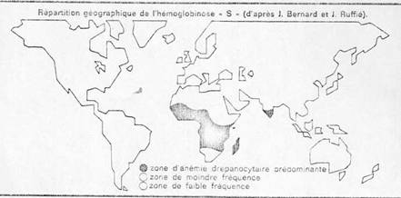
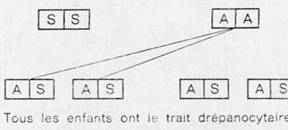
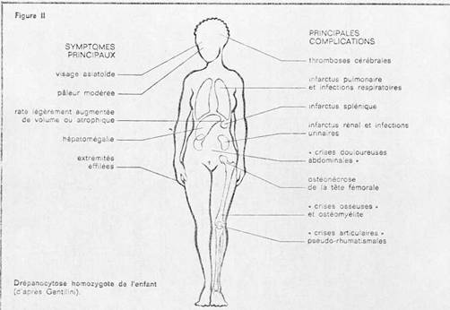
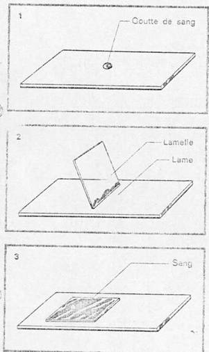
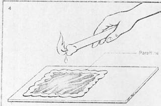

La DREPANCYTOSE, ou anémie à cellules falciformes, est une maladie du globule rouge qui atteint presque exclusivement la race noire. Elle constitue un grand problème de Santé Publique on admet qu'en Afrique 100 000 enfants meurent par an de la forme grave.

## I. Mécanisme de la maladie

Le principal rôle du globule rouge est de transporter l'oxygène des poumons vers les tissus grâce à l'hémoglobine. **Le globule rouge vit ainsi 120 jours**.

Chez le sujet atteint de drépanocytose, cette hémoglobine est remplacée par une hémoglobine S dort les propriétés sont très différentes : quand elle est déchargée de son oxygène, l'hémoglobine S est très peu soluble et se cristallise, ce qui entraîne une déformation des globules rouges en forme ce faucille.

Ces globules rouges déformés (en drépanocytes) sont, très fragiles leur durée de vie est très raccourcie et ils éclatent en une dizaine de jours (au lieu de 120).

Du fait de leur forme, ils s'accrochent entre eux dans les capillaires, ce qui entraîne de fréquentes obstructions.  
On comprend ainsi que le drépanocytaire soit menacé de thromboses osseuses (fausses ostéomyélites, d'accidents vasculaires cérébraux, d'accidents pulmonaires, etc...).

Ces thromboses vont aggraver encore le défaut d'oxygénation des tissus, ce qui favorise l'arrivée des microbes (pneumonies, ostéomyélites).

## II. La drépanocytose existe sous deux formes

### 1. La forme grave SS

Les globules rouges ne contiennent que de l'hémoglobine anormale (Hb S) l'évolution est fatale avant l'âge adulte.

### 2. La forme légère AS (ou trait drépanocytaire)

Ici les globules rouges ne contiennent qu'une petite quantité d'Hb S anormale et peuvent donc assurer à peu près correctement le transport de I'oxygène.

Cette forme n'entraîne le plus souvent aucun trouble : .le sujet est dit porteur SAIN de l'anomalie drépanocytaire.

### 3. Comment expliquer les deux formes de la maladie  
ou un peu de génétique

Tous les caractères de notre corps sont déterminés par des protéines situées sur les chromosomes.

Chaque cellule possède des chromosomes groupés par paire : l'un est d'origine paternelle l'autre maternelle.

La production de l'hémoglobine dépend donc d'un couple de chromosomes qui chez le sujet normal " donne le même ordre " : Synthèse de l'Hb A.

Malheureusement, il peut exister une anomalie chromosomique (Paternelle et maternelle) et l'un des chromosomes donnera l'ordre : Synthèse d'Hb S

Dans ce cas, la cellule produira à la fois de l'Hb S et de l'Hb A (= forme légère)

Si les deux chromosomes, paternels et maternels dont a hérité le sujet sont anormaux, les cellules ne produiront que de l'Hb S (= forme grave).

#### Hérédité :

*   Sujet normal A A
*   Forme légère A S
*   Forme grave S S

Calculons les risques de la maladie en sachant que l'entant hérite au hasard d'un des deux chromosomes de ses parents.

#### a. Parents normaux

#### b. L'un des parents a le trait drépanocytaire

#### c. Le père et la mère ont le trait drépanocytaire

#### d. L'un des parents est porteur de la forme SS grave

(Situation rare puisque la maladie est le plus souvent mortelle avant la puberté)

#### e. L'un des parents est drépanocytaire SS

L'autre n'ayant que le trait drépanocytaire (situation bien sûr très rare)

A A 72%

A S 25,3%

S S 2,7%

Répartition de la maladie à Kinshasa.

## III. Aspects cliniques

### 1. Forme grave SS

_Dès les premiers_ _mois_, l'enfant est en état d'anémie permanente avec pâleur des conjonctives et subictère. La rate augmente de volume. Brusquement surviennent des poussées de déglobulisation entraînant souvent la mort hâtée pa_r_ une infection ou des carences diverses. Parfois survient un gonflement chaud et douloureux des pieds et des mains. L'infection des os est aussi fréquente. Au total 50 à 80 % des formes graves meurent avant l'âge de 2 ans et demi.

Les enfants survivants sont de petite taille contrastant avec une grosse tête. L'anémie persiste mais est mieux tolérée que chez le nourrisson. Les accidents douloureux ou _crises drépanocytaires sont_ _fréquentes._

*   Crise osseuse : avec douleur et fièvre surtout localisées aux os longs (fémur, tibia, radius).  
*   Crises articulaires : gonflement du genou surtout
*   Crises douloureuses abdominales. douleur périe ombilicale avec fièvre souvent prise pour une appendicite.

Toutes ces manifestations témoignent de thromboses liées à l'agglutination des globules rouges dans les vaisseaux.

En fait, on peut les voir partout : rate, reins (hématuries) poumons, cerveau (crise convulsive).

Les infections sont favorisées par le ralentissement du sang : ostéomyélite, pneumonie. Ont admet que 95% des enfants S meurent avant 5 ans.

**Chez l'adule :** 1 à 3 % des enfants S S atteignent l'âge adulte : ils peuvent même avoir des enfants qui seront souvent atteints (si le sujet épouse un individu A S)

### 2. Forme légère : trait drépanocytaire

Le plus souvent les sujets porteurs de cette anomalie sanguine n'ont pas de signes clinique : le seul danger est le risque d'avoir un enfant atteint de forme grave.

*   Un quart des sujets A S souffre de maux de tête, de douleur osseuse, articulaire ou vertébrale.  
*   On note aussi des douleurs du flanc gauche et une fatigabilité à l'effort, mais ces incidents n'empêchent pas de mener une vie normale,

## IV. Examen de laboratoire

**Forme grave** : L'examen du sang montre une anémie intense de 1 à 2 millions de globules rouges avec une Hb entre 3 et 8 g par litres

Le test d'Emmel permet de mettre évidence les drépanocytes.

**Forme légère :** l'anémie est ici absente, le test d'Emmel est moins franc.

L'électrophorèse de l'Hb sur papier isole bien l'hémoglobine S de l'hémoglobine A. Cet examen onéreux n'a pas son application en routine.

## V. Traitement

Comme il s'agit d'une maladie héréditaire, chromosique, on ne peut, bien sûr, parler de guérison.

_On_ peut par contre :

*   Lutter contre l'anémie,
*   Lutter contre la douleur,
*   Lutter contre l'infection.

### 1. Transfusion de sang

En apportant des globules rouges normaux qui vont durer quelques semaines, la transfusion constitue le vrai traitement de la drépanocytose grave

*   L'idéal serait des transfusions régulières _3_ à 4 fois par an mais cela n'est qu'exceptionnellement réalisable.  
*   Les transfusions risquent de provoquer l'hépatite virale.le SIDA, le paludisme et une véritable intoxication le fer (hématochromatose) entraînant une insuffisance cardiaque et hépatique par dépôt de fer dans les tissus.

Devant de tels risques, la TRANSFUSION DOIT ETRE EXCEPTIONELLE

### 2. Traitement de la crise

*   Hydratation par voie orale ou intraveineuse
*   Antalgiques
*   Oxygène (masque ou sonde nasale)

*   Antibiotique si la fièvre persiste 48 heures.

### 3. Entre les crises

*   Alimentation équilibrée
*   Surtout boissons abondantes
*   aucun effort violent ni prolongé,
*   acide folique

### 4. En cas d'infection

La fréquence des infections à salmonelles doit faire utiliser la Tifomycine® ou le Totapen® de préférence.

### 5. Aspect chirurgical

Toute anesthésie générale donnée sans précaution par l'hypoxie qu'elle entraîne, peut provoquer une hémolyse aiguë mortelle.

Le test d'Emmel doit donc faire partie des examens de routine préopératoire.

### 6. Perspectives d'avenir

Informer les parents AS/AS du risque (25%) de mettre au monde un enfant gravement malade, constitue le seul moyen préventif.

## VI. Test d'Emmel

Cet examen a pour but de reconnaître d'une façon très simple les sujets atteints de drépanocytose.

On prend une goutte de sang du malade prélevée au doigt par exemple à l'aide d'un vaccinostyle stérile. Cette goutte est placée sur une lame puis recouverte d'une lamelle. Il faut que la goutte de sang soit suffisamment grosse pour qu'il n'y ait plus d'air sous la lamelle. On dépose alors sur les quatre bords de la lamelle en débordant bien sur la lame, une couche de pommade de vaseline ou de paraffine " lutant " ainsi la préparation ; ces substances empêchent l'air, donc l'oxygène extérieur d'être en contact avec les globules rouges du sang situés sous la lamelle.

Dans la drépanocytose, les globules rouges ou hématies sont très sensibles au manque d'oxygène, ils vont perdre leur belle forme de disques ronds et se déformer en prenant l'aspect de croissants (on dit aussi de quartier de lune, de faux, de faucille).

DREPANOCYTOSE est un mot ancien qui veut dire " cellule en faux " Chez les malades les pus atteints, surtout lors d'une crise hémolytique aiguë, on peut voir de très nombreuses cellules en croissant dès l'examen du frottis sanguin.

Le plus souvent, cependant, le frottis ne montre pas cette anomalie et l'on aura recourt au test d'Emmel. La recherche des hématies en croissant sous le microscope est réalisée à la 2ème heure, et surtout à la 24ème heure.

La falciformation des hématies est subtotale (la presque totalité des hématies ont une forme de faucille) en 2 heures chez les homozygote, elle est plus lente et souvent partielle chez les hétérozygotes.

Des techniques plus rapides, plus pratiques pour les enquêtes ce masse, consistent à ajouter au sang une substance réductrice, tel le métabisulfite de soude; la lecture peut être faite au bout de quelques minutes.