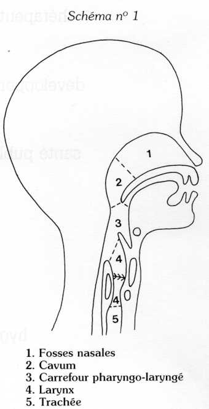
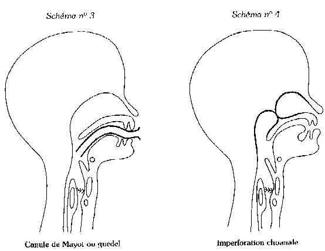
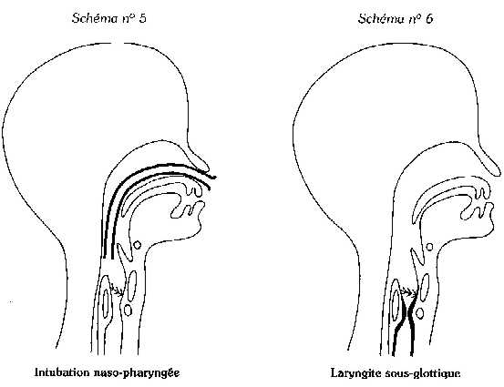
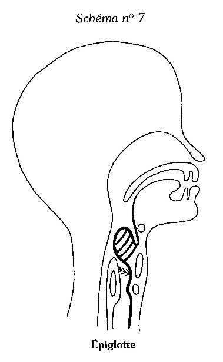

Les dyspnées obstructives représentent toutes les gênes à la respiration dues à un obstacle situé sur les voies aéro-digestives supérieures. 
Ces dyspnées sont relativement fréquentes chez l'enfant, et constituent des urgences pédiatriques, le pronostic vital pouvant être rapidement mis en cause. 
Les étiologies sont variées mais peuvent le plus souvent être retrouvées par un examen clinique simple mais rigoureux. 
Le traitement, qui est fonction de l'étiologie et du siège de l'obstacle, est parfois difficile à mener lorsque les moyens médicaux sont limités. Il repose dans la majorité des cas sur des bases simples qui permettent au moins le transfert dans un centre mieux équipé.

Nous ne parlerons pas des dyspnées survenant dans un contexte d'anesthésie générale.

## I. Anatomie *(schéma n° 1)*

Sur le trajet de l'air jusqu'aux bronches souches, chaque région traversée peut être à l'origine de ces dyspnées:

### 1. Les fosses nasales

Pendant les premières semaines de la vie, le nouveau-né ne sait respirer que par le nez. Une obstruction des fosses nasales, quelle que soit la cause, peut provoquer jusqu'à un mois des dyspnées gravissimes.

### 2. Le cavum

Il peut être en cause également chez le nouveau-né par ce même mécanisme d'obstruction nasale, mais également plus tard par des tumeurs pédiculées ou volumineuses qui vont obstruer le carrefour pharyngo-laryngé.

### 3. Le carrefour pharyngo-laryngé

Tout bombement d'une de ses parois peut être la cause d'une dyspnée obstructive, ainsi que tout corps étranger enclavé.

### 4. Le larynx

Il comprend trois étages :

- l'étage sus-glottique ou vestibule, en forme d'entonnoir limité en avant par l'épiglotte;

- l'étage glottique constitué par le plan des cordes vocales;

- l'étage sous-glottique formé par le cartilage cricoïde. C'est à ce niveau que la filière respiratoire est la plus étroite. Ainsi chez l'enfant, un œdème même modéré de la sous-glotte peut amener une dyspnée obstructive importante.

### 5. La trachée

Elle est rarement en cause isolément en dehors des corps étrangers enclavés ou des tumeurs médiastinales.

L'obstruction d'une bronche-souche ne provoque pas de dyspnée obstructive car un seul poumon est suffisant pour une oxygénation minimale du sang.

## II. Sémiologie

Quels sont les signes à rechercher devant une dyspnée obstructive pour en retrouver le siège et l'étiologie ?

### 1. Il faut savoir d'emblée apprécier la gravité de la dyspnée

Dans certains cas, un geste urgent peut s'imposer avant toute recherche étiologique. Noter en particulier:

- la cyanose (plutôt que sur la peau où elle n'est nette que chez les sujets de race blanche, il faut regarder les muqueuses, les conjonctives, et les ongles qui apparaissent bleu-gris) ;

- la sueur ;

- le battement des ailes du nez ;

- l'angoisse de l'enfant qui est souvent un signe fidèle de gravité ;

- enfin noter l'évolution de la dyspnée qui peut de polypnée passer en bradypnée précédant de peu l'arrêt cardio-respiratoire.

Le plus souvent, cette première approche est rassurante et il faut calmer l'entourage. Mais à l'inverse si ces signes sont notés, il faut alors savoir donner une assistance ventilatoire avant qu'il ne soit trop tard.

Par ailleurs, l'examen trop brutal d'un enfant présentant une dyspnée obstructive peut provoquer un arrêt cardio-respiratoire surtout lorsque l'obstacle est laryngé. Il est donc essentiel avant de toucher le malade de l'observer et de laisser l'enfant dans la position où il se sent le mieux s'il y en a une.

Si l'enfant est vu avec un tableau gravissime et que l'on ne dispose d'aucun matériel d'intubation ni de trachéotomie, il faut mettre en trans-trachéal deux à trois aiguilles intraveineuses ou cathlons n) 14 *(cf. schéma n° 2)* ce qui shunte toutes les causes de dyspnée jusqu'à la sous-glotte comprise, et permet d'avoir un minimum d'oxygénation compatible avec un transfert vers un centre de santé équipé de réanimation.

### 2. Recherche des signes de lutte

#### a. Sémiologie à prédominance inspiratoire : c'est le tirage

L'enfant lutte pour inspirer alors que l'expiration se fait sans problème. Il **s'agit d'un obstacle extra-thoracique.** L'étude de ce tirage donne des renseignements sur la hauteur de l'obstacl e:

- tirage sous-angulo-maxillaire et chute de la langue en arrière: obstacle situé au-dessus du larynx, margelle comprise;

- tirage sus-sternal et sus-claviculaire : obstacle laryngé ;

- tirage intercostal et basithoracique: obstacle laryngo-trachéal.

#### b. Sémiologie à prédominance expiratoire

**Il s'agit d'un obstacle intra-thoracique.** Ceci se manifeste essentiellement par une contracture abdominale à l'expiration. **Mais** ***attention*** : un obstacle situé à la limite intra ou extra-thoracique peut donner une symptomatologie mixte.

### 3. L'obstacle est-il dynamique ou morphologique ?

- **Un obstacle dynamique** ne se manifeste que par intermittence. La filière a un calibre normal mais peut se rétrécir dans certaines circonstances. Ainsi certaines dyspnées peuvent ne se manifester que lors des cris comme la laryngomalacie ou la paralysie laryngée, ou à l'inverse lors du sommeil comme la chute de la langue ou l'hypertrophie amygdalienne.

- **Un obstacle morphologique** est au contraire permanent, même si la symptomatologie augmente lors de l'augmentation du débit ventilatoire. Il s'agit en règle des tumeurs et des sténoses. ***Mais attention :*** certains obstacles morphologiques peuvent se manifester brusquement lors de modifications de position:

  - l'épiglottite lors du décubitus dorsal,
  - la tumeur pédiculée du cavum en position verticale.

### 4. La toux

Une toux rauque, aboyante a deux origines :

- réduction du calibre trachéal,
- obstacle sous-glottique.

### 5. La température

S'agit-il d'un contexte fébrile ou non ?

### 6. Le bruit ventilatoire

Il se caractérise par:

- son âge d'apparition,
- son mode d'évolution (brutal ou progressif),
- son temps de survenue (prédominance inspiratoire ou respiratoire),
- son caractère variable ou permanent.

### 7. La voix

La dysphonie signe une atteinte glottique.

### 8. Les troubles de la déglutition

- Une douleur à la déglutition et une hypersalivation orientent vers une pathologie de l'oropharynx et du carrefour pharyngo-laryngé.

- Une dysphagie vraie vers une atteinte œsophagienne.

- Une lenteur à la déglutition et des fausses routes vers un problème du carrefour pharyngolaryngé et du larynx.

De toutes façons, devant un tableau de dyspnée aiguë obstructive, il faut arrêter toute alimentation par la bouche afin de ne pas gêner le traitement ultérieur éventuel.

Déjà la recherche de ces éléments donne une idée précise de l'origine de la dyspnée. D'autres signes sont à rechercher, mais il faut à ce stade de l'examen tenir compte de l'âge de l'enfant. En effet, les étiologies en dépendent pour la plupart.

## III. Etiologies et traitement

### 1. Nouveau-né pendant la première semaine

La sémiologie est en général à prédominance inspiratoire.

#### a) Normalisation à l'ouverture de la bouche

**Geste d'urgence - canule de Mayo** *(schéma n°* *3)*

- Il s'agit le plus souvent d'une **rhinite obstructive** aggravée par les manœuvres endonasales à limiter au maximum. Elle peut nécessiter une corticothérapie à doses filées pendant plusieurs semaines. Sinon, de simples lavages au sérum physiologique suffisent.

- Il peut aussi s'agir d'une **déviation de cloison.** Mais elle est rarement mal tolérée. Elle nécessite parfois une intubation par sonde naso-pharyngée pendant quelques jours *(schéma n° 6).*

- **L'imperforation choanale** *(schéma n° 4)* passe inaperçue si elle est unilatérale et que le cathétérisme des fosses nasales n'est pas fait systématiquement. Elle est gravissime si elle est bilatérale. Il faut alors mettre à l'enfant une canule de Mayo et le transférer dans un centre équipé où il pourra être opéré.

#### 2. Peu ou pas de modification à l'ouverture de la bouche

et association à des troubles **de la déglutition**

Il s'agit d'une incompétence fonctionnelle du carrefour, parfois associée à des degrés variables à une petite mandibule, une chute de la langue en arrière ou une fente vélopalatine.

**Geste d'urgence : décubitus ventral, canule** **de Mayo, intubation naso-pharyngée,** puis transfert *(schéma n°* 5\_).\_

### 2. Nouveau-né de huit jours à un mois

C'est l'âge du stridor laryngé. Il s'agit d'enfants présentant un bruit ventilatoire inspiratoire. C'est une pathologie fréquente, mais habituellement bénigne.

**Le bruit est variable le plus souvent.** Ils'agit d'un **obstacle dynamique** siégeant au niveau du larynx. La dyspnée est généralement bien tolérée et les examens complémentaires ne s'imposent pas, une simple surveillance suffit.

- **Il** **s'agit d'une laryngomalacie :** il faut toutefois par un toucher endobuccal contrôler qu'il ne s'agit pas d'un kyste de la vallécule. Le plus souvent, cette symptomatologie cède spontanément en quelques semaines. Rarement, elle prend une forme plus grave, dyspnéisante nécessitant une intubation provisoire. Exceptionnellement cela amène à la trachéotomie précédant un traitement chirurgical laryngé. Seuls les cas graves nécessitent un transfert en milieu spécialisé pour bilan endoscopique et éventuel traitement (intubation, trachéotomie, chirurgie). Dans de rares cas, il peut s'agir d'une paralysie néonatale des cordes vocales qui impose une trachéotomie.

### 3. De un à six mois

Les dyspnées obstructives sont rares. Le diagnostic essentiel est:

**L'angiome sous-glottique :** dyspnée inspiratoire et toux rauque mais sans fièvre, et d'évolution plus lente que la laryngite sous-glottique. Il est souvent associé à un angiome cutané. L'angiome sous-glottique est au mieux vu en endoscopie. Il siège le plus souvent à gauche. Il nécessite une corticothérapie (betaméthasone huit gouttes/kg/jour) pendant deux mois, progressivement décroissante ensuite.

Un transfert pour bilan endoscopique est nécessaire sous couvert si besoin d'une intubation. La surveillance et le traitement seront faits au mieux en milieu spécialisé.

### 4. Enfant de six mois à huit ans

Le diagnostic est le plus souvent simple.

#### a) La laryngite sous-glottique *(schéma n° 6)*

C'est la cause la plus fréquente des dyspnées obstructives de l'enfant, la sous-glotte étant la région la plus étroite de la filière respiratoire. Elle se caractérise par l'apparition progressive dans la soirée d'un stridor laryngé inspiratoire avec tirage sus-sternal et sus-claviculaire et d'une toux rauque avec cri clair dans un contexte de rhinopharyngite. Il faut mettre en œuvre d'emblée une corticothérapie (Dexamthazone® IM) et une antibiothérapie permettant le plus souvent d'éviter l'intubation qu'il faut cependant savoir faire avant l'épuisement de l'enfant.

#### b) L'épiglottite (schéma n°7)

Infection de l'épiglotte, avec augmentation de volume, diffusion de l'œdème dans le larynx et dyspnée progressivement croissante; elle est rare mais gravissime. L'enfant est très fébrile, il est assis penché en avant, la langue pendante, ne pouvant avaler sa salive, et ne supportant pas le décubitus dorsal qui peut même provoquer un arrêt cardio-respiratoire.

Il est impératif d'intuber l'enfant sans tarder car l'évolution spontanée est constamment mauvaise. Toutefois, plutôt que de se lancer dans une intubation difficile, il vaut mieux si l'on manque d'expérience, se contenter de quelques aiguilles trans-trachéales avant de transférer l'enfant.

De toutes façons, une antibiothérapie contre l'hémophilus influenzas est mise en route, ce germe étant en règle responsable de l'affection (chloramphénicol ou ampicilline).

#### c) Le phlegmon rétro-pharyngé

Contexte fébrile à 39-40° avec à l'ouverture de la bouche un bombement de la paroi pharyngée postérieure, et au toucher une masse molasse. Il faut:

- mettre en œuvre un traitement antibiotique,
- ponctionner le phlegmon,
- et si du pus vient, inciser sous couvert d'une intubation pour éviter les inhalations.

#### d) L'hypertrophie amygdalienne

Survient le plus souvent au cours d'une poussée d'amygdalite. Il s'agit d'une pathologie du carrefour dont le diagnostic est fait aisément avec un abaisse-langue. Il faut instaurer une antibiothérapie et placer une canule de Mayo pour libérer le carrefour. L'amygdalectomie sera faite au décours du processus infectieux.

#### e) La diphtérie

C'est une cause plus rare, mais à ne pas méconnaître, surtout dans les régions où les enfants ne sont pas vaccinés. Elle se caractérise en dehors d'un syndrome toxique d'intensité variable par trois types de localisations dyspnéisantes :

- **le nez :** surtout chez le nourrisson avec un coryza pseudo-membraneux, parfois sérosanglant avec ulcérations sous-narinaires ;
- **les amygdales :** angines à fausses membranes adhérentes, cohérentes, reproductibles et intensives;
- **le larynx :** avec le croup donnant d'abord une dysphonie et une toux rauque, puis une dyspnée inspiratoire précédant de quelques heures l'asphyxie.

#### f) La papillomatose laryngée

Elle peut survenir quel que soit l'âge. Il s'agit d'une lésion muqueuse du pharynx. Elle ne devient dyspnéisante qu'après plusieurs mois de dysphonie. Son diagnostic est laryngoscopique. Elle est parfois associée à d'autres localisations pharyngées, ou même pulmonaires. On tente d'en contrôler l'évolution par des excisions itératives en milieu spécialisé avant l'arrivée de la dyspnée.

#### g) Le corps étranger

Cette pathologie est fréquente et son histoire, qui suit trois phases d'importance variable, doit être bien connue.

- **Le syndrome de pénétration** lorsque l'enfant inhale le corps étranger avec toux, cyanose.
- **La phase d'enclavemen t:** fonction du siège de l'enclavement et avec une dyspnée variable en intensité :
  - au niveau du carrefour : troubles de la déglutition;
  - au niveau du larynx : dysphonie;
  - au niveau de la trachée : toux avec changements de position si le corps étranger est encore mobile ;
  - au niveau de l'arbre bronchique : cliniquement le plus souvent muet (d'où l'importance de la notion de syndrome de pénétration) mais avec parfois une asymétrie à l'auscultation, et à la radio: un emphysème puis une atélectasie.
- **La phase des complications inflammatoires infectieuses :** Après plusieurs semaines ou mois, des épisodes inflammatoires et infectieux peuvent survenir et le diagnostic étiologique est difficile à faire si manque la notion de syndrome de pénétration et de phase d'enclavement (importance de l'interrogatoire précis :
  - une laryngite traînante,
  - un syndrome asthmatiforme,
  - un syndrome coqueluchoïde,
  - une suppuration broncho-pulmonaire récidivante et localisée.

L'enfant peut donc être vu à l'une de ces trois phases et l'interrogatoire doit rechercher dans les semaines, jours ou heures qui ont précédé la notion de corps étranger mis en bouche avec un syndrome de pénétration. Les C. E. les plus fréquents sont de loin les arachides et l'enclavement se situe en règle au niveau d'une bronche-souche.

Dans certains pays, les sangsues peuvent être à l'origine de dyspnées obstructives chez l'enfant lorsqu'ils les avalent et qu'elles se fixent au niveau du carrefour. Elles grossissent ensuite en obstruant la filière respiratoire.

**Au total:** dans le doute quant à l'existence d'un C.E., l'enfant doit être transféré en milieu spécialisé pour exploration avec surtout un examen endoscopique à la recherche du C.E.

## Conclusion

### Conduite à tenir à mains nues

A mains nues, le praticien est bien démuni. Il faut si possible, calmer l'enfant et son entourage, et observer le degré d'urgence de la dyspnée.

L'examen, même rapide, peut donner une bonne idée de l'origine de la dyspnée et donc guider le traitement. L'interrogatoire doit toujours rechercher la notion de syndrome de pénétration d'un corps étranger. En cas de détresse respiratoire aiguë et que l'on ne dispose d'aucun matériel d'intubation, ni de trachéotomie et que le transfert est impossible, il faut mettre en place deux à trois aiguilles intraveineuses ou cathéter n°14 en trans-trachéal, ce qui shunte toutes les causes de dyspnée jusqu'à la sous-glotte comprise, et permet un minimum d'hématose compatible avec un transfert *(schéma n°2).*

**Au total**

Dans un dispensaire, la présence d'un abaisse-langue, d'un laryngoscope, d'une pince de Magil, d'un jeu de sondes d'intubation, d'un bistouri et de deux cathéters n°14 ou d'aiguilles équivalentes, permet de résoudre de nombreux cas désespérés.
