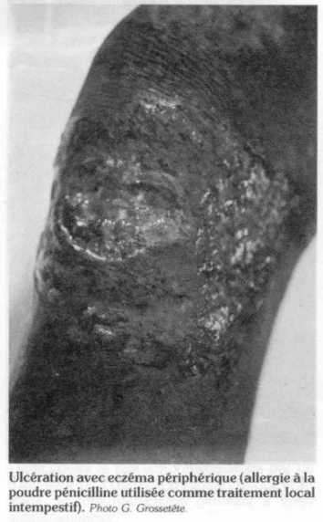
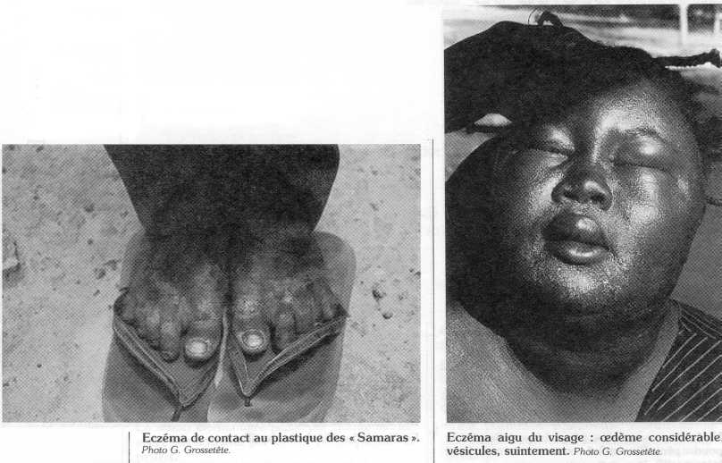

L'eczéma est un des motifs de consultation les plus fréquents en dermatologie (un cas sur cinq en moyenne).

Une fois posé le diagnostic lésionnel, il importe de reconnaître sous des aspects cliniques très variés les causes locales ou générales qui l'ont engendré.

## **I. Aspects fondamentaux**

### **1. Eczéma aigu**

La lésion élémentaire passe par quatre stades successifs dominés par un maître symptôme: le **prurit.**

*   **stade érythémateux et oedémateux** sur peau pigmentée, l'aspect est sombre et chaud.

*   **stade vésiculeux :** petites vésicules tendues, contenant une sérosité claire. L'aspect est parfois papulo-vésiculeux: petites élevures de la taille d'une tête d'épingle.

*   **stade suintant :** la rupture des vésicules, spontanée ou secondaire au grattage, est suivie d'un suintement clair qui se coagule en formant des croûtes. A cette phase, la **surinfection** est très fréquente : l'exsudat devient alors jaunâtre.

*   **stade de desquamation et de guérison :** l'oedème et le suintement disparaissent. La desquamation de l'épiderme se produit. Si la cause s'éteint, la peau reprend son aspect normal en quelques jours.

### **2. Eczéma chronique**

Il peut succéder à un eczéma aigu ou se manifester d'emblée sous cette forme.

Le **prurit** est constant. Les vésicules sont parfois visibles en périphérie du placard : la peau est épaissie, recouverte de squames, de croûtes, de lésions de grattage.

Progressivement apparaît la **lichenification :** épaississement de la peau qui apparaît grisâtre et creusée de petits sillons délimitant des pseudo-papules.

La **surinfection** modifie souvent la lésion qui se présente comme un impétigo : croûtes épaisses, adénopathies inflammatoires.

En fonction du siège et de la variété étiologique, la prédominance d'un des quatre stades rend compte de l'aspect particulier: forme essentiellement oedémateuse (visage, organes génitaux), forme purement squameuse (kératodermie palmo-plantaire), forme lichenifiée pure (névrodermite).

## **II.** **Principales variétés** **cliniques et étiologiques**

### **1. Eczéma de contact**

Il constitue la majorité des causes. Le diagnostic est posé à l'aide d'un faisceau d'arguments.

*   **L'interrogatoire :** circonstances d'apparition, nature des produits utilisés.

*   **La clinique :** point de départ de l'éruption visage (cosmétiques), aisselles, cou, lobule des oreilles (bijoux, parfums), poignets, ombilic (métaux de bracelet, ceinture), pieds (sandales), mains (causes professionnelles).

A partir du point de départ, l'eczéma a une tendance à disséminer, atteignant ainsi les zones non concernées par le contact avec la substance allergique.

*   **Les tests cutanés :** permettent d'identifier la substance allergique.

*   **L'évolution:** la guérison n'est obtenue qu'après éviction de l'allergène. La rechute survient dans les vingt-quatre heures après le renouvellement du contact.

Les principales causes d'eczéma de contact sont les suivantes :

*   **Origine cosmétique :** responsables d'eczémas aigus par sensibilisation à certains parfums ou certaines préparations familiales (beurre de karité, encens, citron ... ).

*   **Origine médicamenteuse :** sensibilisation soit à des principes actifs (pénicilline, sulfamide, anesthésique, antihistaminique, néomycine, essence de thym, du biogaze), soit à des excipients (lanoline, propylène glycol, baume du Pérou, conservateurs mercuriels). Chez un sujet préalablement sensibilisé par Inapplication répétée d'une substance, l'eczéma a tendance à se généraliser brusquement lorsque l'on administre ce même produit par voie générale (érythrodermie provoquée par l'injection d'Extencilline® chez un malade traité par l'application locale de poudre pénicilline sur une lésion cutanée).

*   **Origine vestimentaire :** les tissus ne sont pas allergisants mais les teintures, les apprêts (formol), les blanchisseurs optiques contenus dans certaines lessives peuvent être incriminés. De même les élastiques, les boutons (nickel) ou le cuir (chrome), la laine et le nylon, sont irritants.

*   **Origine domestique :** certains savons artisanaux, alcalins favorisent la sensibilisation en altérant la barrière cutanée.

*   **Origine domestique:** les professions les plus exposées sont celles du bâtiment (chrome du ciment, peinture, vernis, colles), de l'industrie mécanique (nickel, huiles minérales) et chimique (époxy des matières plastiques).

Certains eczémas sont dus à l'action conjointe sur la peau d'une substance dite **photosensibilisante** et des rayons lumineux. L'éruption atteint les parties découvertes.

### **2. La dysidrose et les eczémas** **dysidrosiques**

C'est une variété particulière l'eczéma siégeant aux mains et aux pieds (paumes, plantes, face latérale des doigts et des orteils).

**La dysidrose simple :** c'est une poussée de vésicules tendues, enchâssées dans l'épiderme, en grain de mil, remplies de liquide clair, très prurigineuses, évoluant vers la dessiccation et la desquamation.

*   **Dans la variété inflammatoire :** les vésicules sont situées sur un fond érythémateux. L'évolution est volontiers chronique avec un aspect polymorphe : desquamation, fissures, vésicules.

*   **Etiologie :** c'est une affection multifactorielle dans la genèse de laquelle entrent en jeu différents facteurs, isolés ou associés :

*   terrain prédisposé,
*   facteur climatique et saisonnier,
*   facteur contact (allergique et irritatif),
*   foyers infectieux à distance,
*   prise médicamenteuse.

### **3. Dermite atopique**

Les aspects cliniques varient selon l'âge mais dans tous les cas, la tendance à la chronicité et aux récidives est une caractéristique de ces eczémas.

*   **Chez le nourrisson :** les lésions apparaissent entre trois et huit mois sur les zones convexes du visage (pommettes, front, menton), les membres et le tronc. Leur aspect est :

*   soit oedémateux, craquelé ou suintant,
*   soit à type de dartres sèches, farineuses, finement desquamatives,
*   le prurit et la xérodermie sont caractéristiques,
*   10 % des enfants guérissent vers l'âge de deux-trois ans mais pourront présenter ultérieurement d'autres manifestations d'atopie (asthme),
*   20 % guérissent mais présenteront des récidives épisodiques,
*   70 % évoluent vers la forme de l'enfant et de l'adolescent.

**Après l'âge de deux ans :**

**L'éruption typique** siège sur les plis: coudes et genoux, sillons rétro-auriculaires, cou et pieds. L'aspect est lichénifié sec, sauf dans les régions rétro-auriculaires très souvent surinfectées, suintantes.

**Le prurigo des membres** est une variété fréquente et invalidante par son caractère très prurigineux, provoquant des insomnies, récidivant. Son caractère **saisonnier** (hivernage) est très net, ainsi que sa topographie aux régions exposées aux piqûres d'insectes ou aux moucherons. La polyadénomégalie superficielle est de règle.

**L'évolution de ces deux variétés** est en général favorable mais vers l'âge de dix-douze ans dans 50 % des cas, les autres aboutissent à la phase suivante :

**Eczéma atopique chez l'adulte :** celui-ci peut d'ailleurs apparaître sans passé particulier dans l'enfance. Les lésions sont peu étendues, lichénifiées, épaissies, atteignant les surfaces de flexion (cou, paupières, mains, dos des pieds) avec tendance aux dartres (eczématides achromiantes) à l'ichtyose (xérose diffuse). Les poussées sont favorisées par divers facteurs climatiques (sudation), psychiques, vestimentaires (laine, nylon), cosmétiques. La tendance à la polysensibilisation de ces malades doit être prise en considération pour le choix de certaines thérapeutiques ou de l'activité professionnelle.

## **III. Les principes thérapeutiques des eczémas**

suppression du facteur allergisant ou irritant,

lutte contre la réaction inflammatoire par un traitement local adapté à la variété clinique et au stade, et une médication générale à visée antihistaminique, prévention et traitement de la surinfection, le traitement local suffit dans la majorité des cas à assurer la guérison.

### **1. La phase aiguë suintante**

Les antiseptiques non irritants vont éviter la surinfection et limiter le suintement :

**Les bains permanganatés** (un sachet à 0,50 g/dix litres d'eau) restent le procédé de choix. Certains préfèrent le Septivon® (deux cuillères à soupe pour dix litres d'eau).

**Les applications biquotidiennes de colorants** de préférence en solution aqueuse (pour les enfants et les lésion étendues) ont un effet asséchant efficace : solution de Milian, éosine, fluorescéine... ou encore: solution aqueuse de nitrate d'argent, eau Dalibour ou même sérum physiologique appliqué sur des compresses plusieurs fois par jour.

**Les pâtes à l'eau** (Aloplastine® ) ont un effet antiprurigineux et anti-inflammatoire de même que certaines préparations à l'oxyde de zinc (laits, émulsions huile dans l'eau).

**En l'absence de surinfection,** les lotions ou crèmes corticoïdes amènent la régression rapide des lésions.

### **2. La phase desquamative** **sèche**

Les antiseptiques sont toujours de mise, en solution alcoolique, ils auront un effet antiprurigineux (Héxomédine® ).

Toujours en l'absence de surinfection et d'ulcération, les crèmes corticoïdes sont rapidement efficaces. Mais sur les membres inférieurs et chez les enfants, le risque de surinfection est tel qu'une antibiothérapie générale associée est le plus souvent indispensable.

L'alternative aux dermocorticoïdes est représentée par les crèmes " anti-eczéma " classiques à base d'oxyde de zinc, talc, liniment oléocalcaire (dermo-cuivre, Dalibour, Laccoderme, Déflamol®), puis les préparations hydratantes, kératoplastiques. Plus les lésions sont chroniques, épaisses, kératosiques, plus les onguents doivent être **gras,** émollients (cold cream, cérat de Galien) associés ou non à de l'urée, de l'acide salicylique ou lactique.

**Lexique :**

**Atopie :** prédisposition aux allergies.

**Emollient :** qui ramollit et adoucit.

**Erythrodermie :** rougeur de la peau.

**Excipient :** constituant du médicament auquel on incorpore les agents actifs et qui leur sert de " véhicule " sans action propre.

**Exsudat :** liquide de suintement.

**Ichtyose :** épaississement diffus et généralisé de la peau.

**Kératodermie :** peau indurée par épaississement de la couche cornée.

**Kératoplastique :** qui normalise la couche cornée.

**Kératosique :** dont la couche cornée est épaissie.

**Polyadénomégalie :** augmentation de volume de plusieurs ganglions.

**Prurit :** démangeaison,

**Xérodermie :** peau sèche.

_Développement et Santé, N°83, octobre 1989_