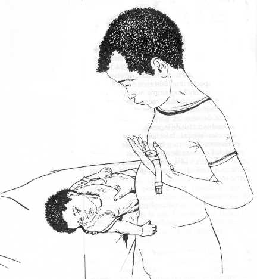

Quatre millions d'enfants meurent de pneumonie chaque année.

L'objectif est clair : il faut réduire les taux élevés de maladie et de décès par infections respiratoires aiguës.

Pour cela, trois stratégies complémentaires :

### 1. La prévention

de la rougeole, la coqueluche et la diphtérie, qui, à elles seules, représentent le quart des décès par pneumonie des jeunes enfants. Il faut continuer les efforts de **vaccination dans le cadre du** **PEV.**

**2. Le traitement précoce** et adapté des pneumonies :

**Un diagnostic correct et** **précoce**

par l'observation minutieuse des mouvements respiratoires du malade : rythme, fréquence, existence ou non d'un tirage. Cette observation donne une **Indication plus sûre** de la gravité de l'infection respiratoire chez un enfant que l'auscultation avec un stéthoscope.

**Un traitement standardisé**

A partir d'un mois de vie :

**a. Respiration rapide** (plus de cinquante respirations par minute) sans tirage

- traiter en consultation externe,

- donner un antibiotique pendant cinq jours amoxicilline gélules : 15 mg/kg toutes les huit heures,

ou

cotrimoxazole comprimés: 4 mg/kg (de triméthoprime) toutes les douze heures,

- conseiller à la mère de continuer à allaiter, de bien faire boire l'enfant.

**b. Respiration rapide** (plus de cinquante respirations par minute) avec **tirage**

- hospitaliser,

- benzylpénicilline : 50 000 / kg en intramusculaire toutes les six heures.

**c. Tirage + cyanose + incapacité de** **boire :**

- hospitalisation,

- oxygène,

- chloramphénicol: 25 mg/kg (maximum 1 g par dose) en intramusculaire toutes les six heures,

- réhydrater.

**3. L'éducation pour la** **santé des familles, des** **agents de santé en général**

Même l'hôpital le mieux équipé ne peut sauver un enfant qui arrive trop tard. Les parents, les familles et les agents de santé doivent pouvoir faire la différence entre un enfant atteint de maladie bénigne qui va guérir sans traitement particulier et l'enfant atteint de pneumonie qu'il faut traiter de façon urgente.

**Les messages à transmettre** **aux familles et aux agents de** **santé**

**1.** Savoir **compter la respiration** d'un enfant malade,

**2.** savoir **reconnaître un tirage respiratoire,**

**3.** savoir que quand un enfant calme respire **plus de cinquante fois par minute,** il faut l'emmener tout de suite consulter au centre de santé.

### Les messages

- **Apprendre à compter la respiration d'un** **enfant malade :**

L'enfant doit être calme et torse nu. Quand on le regarde, on voit sa poitrine se soulever à chaque inspiration. Il est souvent utile de poser la main (réchauffée) sur la poitrine, on la sent se soulever à chaque respiration.

Si on a une montre, il est facile de compter le nombre de respirations par minute.

Si on n'a pas de montre, on peut compter lentement sur ses doigts ou, mieux, comparer avec un enfant ou un adulte bien portant (respiration normale : environ trente par minute).

- **Apprendre à reconnaître un tirage :**

Normalement, la poitrine d'un enfant se gonfle quand il respire. Si on voit que la poitrine de l'enfant s'enfonce au lieu de ressortir quand il respire, c'est le " tirage ". Il peut être gravement malade, il faut l'emmener tout de suite au centre de santé.

- **Apprendre quand il faut aller au centre** **de santé :**

Il faut aller tout de suite au centre de santé quand l'enfant (qui ne pleure pas et ne s'agite pas) respire **plus de cinquante fois par minute.**

***Pour en savoir plus***

\(1\) Les infections respiratoires de l'enfant: *leur traitement dans les petits hôpitaux.* Manuel à l'usage des médecins. Hors-série OMS, Genève, 1988, Suisse.

*(2) ARI News.*

En français. AHRTAG, 1 London Bridge Street, Londres SE 1 9SG, Royaume-Uni.

\(3\) *Les Infections respiratoires aiguës.*

Série "Le guide de la famille". EDICEF n° 148, novembre 1988.

*Développement et Santé, n°86, avril 1990*
