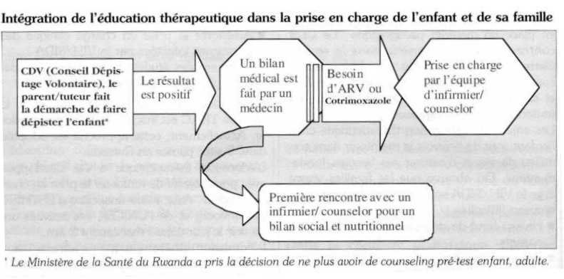
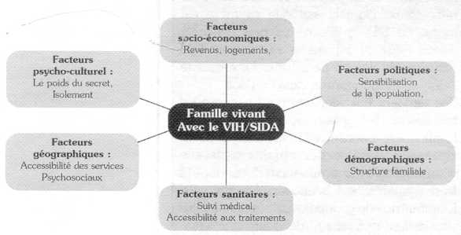
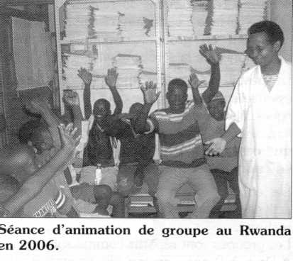

L'éducation thérapeutique a, entre autres, pour objectif d'aider la personne à conserver "la santé" et particulièrement la santé mentale, dans le cas d'une maladie chronique. Si l'on reprend la définition de l'OMS, la santé mentale _est un état de bien-être dans lequel la personne peut se réaliser, surmonter les tensions normales de la vie, accomplir un travail productif et fructueux et contribuer à la vie de sa communauté._

Ma formation en santé mentale a été marquée par Carl Rogers* et a conduit à utiliser les techniques de counseling en éducation thérapeutique. La philosophie du counseling que je soutiens est la croyance en _"la dignité de la personne, la voleur de l'individu, la reconnaissance de la liberté à déterminer ses propres valeurs et ses propres objectifs, le droit à poursuivre son style de vie, le changement dans un délai bref, une relation où l'empathie l'emporte sur l'autorité_(1).

**L'annonce de la séropositivité** dans une famille est toujours une expérience traumatisante massive et inévitable. Elle génère une forte charge d'angoisse, fréquemment associée à des éléments dépressifs et des réactions de révolte, d'autant plus lorsque s'ajoute à la découverte du virus chez l'enfant, la découverte du virus chez d'autres membres de la famille, parents et fratrie. L'annonce d'une séropositivité est donc souvent suivie d'une période de bouleversement du mode de vie familial. Le counselor doit travailler avec les parents/ tuteurs pour faire face à leur réaction émotionnelle. Il devra aussi prévenir la dislocation de la famille qui peut avoir un impact négatif sur la prise en charge de l'enfant infecté, trouver des moyens de préserver la santé de l'enfant et lui assurer un développement physique et moral satisfaisant (2).

Pour les enfants séropositifs au VIH/SIDA, il est important de prendre en considération le milieu de vie. L'enfant n'est jamais seul à devoir faire face à sa maladie. Il faut pouvoir lui parler avec franchise, tout en construisant sa résilience, c'est-à-dire : la capacité universelle que chaque personne, groupe ou communauté, a à prévenir, minimiser ou surpasser les effets dommageables de l'adversité pour qu'il puisse construire son avenir. **Dans le contexte pédiatrique, l'éducation thérapeutique ne s'adresse pas seulement à un individu, l'enfant, mais à tout son entourage affectif. Il est donc indispensable de travailler avec la "famille" car l'enfant est dépendant de l'adulte qui le prend en charge.**

## Les enjeux de l'éducation thérapeutique chez l'enfant

Si l'on se réfère à la définition suivante _:"les activités d'éducation sont destinées à aider le patient et sa famille et/ou son entourage à comprendre la maladie et les traitements, collaborer aux soins, prendre en charge son état de santé et conserver et/ou améliorer sa qualité de vie"(3)_, une des problématiques essentielles chez l'enfant est que l'on cache à beaucoup d'entre eux la véritable raison de leur suivi.

Comment un enfant peut-il être partenaire dans le processus de compréhension de sa maladie, ou encore conserver sa santé, s'il ne connaît pas les raisons qui l'obligent à devoir vivre avec des traitements ?

**L'éducation thérapeutique chez les enfants, passe donc dans un premier temps, par l'accompagnement des parents et des soignants dans l'acceptation de la divulgation du diagnostic à l'enfant.**

Grâce au Dr Alexandra Peltier, nous avons mis en place un matériel pédagogique _"Le CD4 contre-attaque"._

Cette approche permet de dédramatiser l'annonce du diagnostic et permet à l'enfant et sa famille de comprendre sa maladie, les traitements et ses exigences.

Les enjeux de l'éducation thérapeutique chez l'enfant sont de pouvoir le maintenir dans son milieu de vie et d'assurer ses besoins fondamentaux. On observe que les familles vivant avec le VIH/SIDA sont confrontées à de nombreuses difficultés :

*   Niveau élevé de stress et de tension chez les parents.  
*   Détresse économique.  
*   Crainte de contamination.  
*   Non-divulgation entraînant le silence et l'isolement.  
*   Culpabilité parentale et crainte de la honte sociale.  
*   Pertes multiples.  
*   Rejet et perte de soutien de la famille élargie et de la communauté.

**Cette réalité demande à l'équipe de prise en charge, une vision plus psychosociale de son approche d'éducation thérapeutique.**

## Les activités d'éducation thérapeutique de l'enfant développées à la clinique TRAC (Rwanda)

La clinique TRAC a des objectifs définis par le Ministère de la Santé Rwandais, qui sont :

*   Fournir un appui technique et les informations pour la réduction du VIH /SIDA.  
*   Surveiller, coordonner et évaluer l'exécutionnationale des programmes VIH/SIDA.  
*   Augmenter les activités de surveillance et leur utilisation.  
*   Etre identifié en tant que chef régional dans le domaine du VIH/SIDA.  
*   Éditer les rapports techniques et les articles scientifiques.  
*   Développer les ressources pour assurer le succès, la croissance et la durabilité de TRAC et de ses programmes.  
*   Promouvoir l'accessibilité aux services de dépistage et de conseils sur le VIH/SIDA.  
*   Améliorer la prise en charge clinique des personnes infectées par le VIH/SIDA.  
*   Conduire des études de surveillance épidémiologiques et de recherche.

L'éducation thérapeutique développée à la clinique TRAC est inscrite dans un projet-pilote. Actuellement, cette approche est adoptée dans 5 sites pilotes au Rwanda.

L'éducation thérapeutique a été développée avec pour objectif de renforcer la prise en charge familiale. Avec l'aide financière d'ESTHERLuxembourg et de l'UNICEF, ces activités ont pu voir le jour depuis maintenant 2 ans. L'éducation thérapeutique s'adresse aux enfants, mais aussi à leur entourage familial et affectif.

<table>

<tbody>

<tr>

<td valign="top">Activités d'éducation thérapeutique,clinique TRAC,service Counseling Pédiatrie<ul><li>File active : 713 enfants.</li><li>Nombre d'enfants sous ARV :+/- 370.</li><li>Nombre de prescripteurs d'ARV au sein du service : 4.</li><li>Date d'implantation des activités d'éducation thérapeutique : juin 2005.  
L'éducation thérapeutique s'adresse à 425 enfants, +/- 400 familles.</li><li>Counselors : 6 infirmières.</li></ul></td>

</tr>

</tbody>

</table>

Nous utilisons le terme de "**counselor**", qui n'est ni un éducateur, ni un conseiller. Ce concept est difficile à traduire, c'est pourquoi nous avons choisi de garder le terme counselor avec la signification de celui qui : _oriente, aide, informe, soutien et traite._

Le counselor est celui qui maîtrise les techniques de relation d'aide du counseling et c'est à travers ces techniques que nous faisons de "l'éducation thérapeutique". Les techniques et attitudes utilisées sont les mêmes que celles utilisées par Catherine Tourette-Turgis et Marilyne Rebillion pour la prise en charge des adultes,"' c'est-à-dire :

*   L'écoute.  
*   L'acceptation.  
*   L'absence de jugement.  
*   L'empathie.  
*   La congruence.

## La démarche éducative

### Les causeries éducatives pour les parents/tuteurs.

Pour les enfants sous traitement, tous les parents participent à 3 séances d'éducation thérapeutique sous forme de "causeries éducatives", qui ont pour but de leur donner toutes les informations sur le suivi, les traitements et les besoins nutritionnels. Les outils utilisés pour ces causeries sont ceux qui ont été élaborés par FHI (Family Health International).

### Suivi individuel des parents/tuteurs et des enfants.

Tous les parents/tuteurs sont vus tous les mois en individuel par une infirmière/counselor. Cette rencontre permet d'évaluer les difficultés psychosociales de la famille.

Pour les enfants en âge scolaire, c'est-à-dire à partir de 6 ans, l'équipe d'infirmier/counselor accompagne les parents afin qu'ils acceptent d'annoncer le diagnostic à l'enfant.

Les parents et les enfants sont alors conviés à une éducation thérapeutique de groupe le jeudi à 14h.

À la fin de la séance, les enfants sont évalués sur leurs réactions et compréhension du message de l'outil. Ceux qui ont rencontré des difficultés lors de cette séance sont rencontrés le lendemain ou à domicile la semaine suivante. Sinon, ils sont invités à participer à un groupe de soutien le premier samedi du mois pour retravailler sur le vécu de l'annonce de leur diagnostic.

<table>

<tbody>

<tr>

<td valign="top">La stratégie de mise en place pour l'annonce du diagnostic de séropositivité du VIH/SIDA chez l'enfant se base sur le concept d'éducation thérapeutique du patient qui consiste à aider le patient à acquérir et maintenir des compétences lui permettant une gestion optimale de sa vie avec la maladie. Ces activités d'éducation sont destinées à aider le patient et sa famille et/ou son entourage à comprendre la maladie et les traitements, collaborer aux soins, prendre en charge son état de santé et conserver et/ou améliorer sa qualité de vie"'.</td>

</tr>

</tbody>

</table>

### Les séances d'éducation thérapeutique de groupe

Tous les jeudis à 14 heures, est organisée une séance d'éducation thérapeutique de groupe avec l'outil "Le CD4 contre-attaque". Les enfants viennent accompagnés de leurs parents ou tuteurs. Ils sont rencontrés en individuel, avant la séance, afin d'évaluer s'ils sont prêts à recevoir l'information sur leur maladie. On cherche aussi à savoir ce qu'ils savent déjà de leur diagnostic et des raisons de leur suivi médical. Les séances ont plusieurs objectifs :

*   Donner l'occasion à l'enfant de mieux comprendre son corps.  
*   Permettre à l'enfant de vivre un moment privilégié avec son parent, pour qu'ils comprennent ensemble l'importance du suivi médical et de l'observance au traitement.  
*   Annoncer le diagnostic de séropositivité au VIH à l'enfant (à partir de l'âge de 6 ans).  
*   Permettre à l'enfant de réaliser qu'il n'est pas seul face à cette dure réalité (les séances se font en groupe, ce qui dédramatise l'annonce de la séropositivité).

Le travail d'éducation thérapeutique se fait essentiellement en groupe pour des raisons pratiques, étant donné le très grand nombre d'enfants à suivre. **Mais nous avons pu observer que cette approche en groupe dédramatise énormément la prise en charge.**

Les enfants sont répartis dans les différentes activités thérapeutiques selon leur âge et leur maturité.

Les groupes sont répartis comme suit :

*   De 6 à 9 ans : on travaille beaucoup avec des activités ludiques, des chansons, des dessins ou encore des histoires.  
*   De 10 à 12 ans : on mélange les activités ludiques avec des activités sur le corps, la santé.  
*   De 13 à 15 ans : les groupes travaillent plus autour de la parole. Ils ont écrit des chansons, des pièces de théâtre sur leur vécu de la maladie.  
*   De 15à 18 ans et de 16 à 20 ans : les jeunes de plus de 15 ans ne sont plus considérés comme faisant partie des groupes des enfants. Pourtant c'est dans ces tranches d'âge que l'on rencontre le plus de difficultés. Un mal de vivre qui entraîne très souvent une mauvaise observance aux traitements. L'équipe doit faire face à de nombreux challenges pour reconstruire l'espoir en l'avenir avec ces jeunes.

### Les groupes de soutien

À travers les groupes de soutien, tous les premiers samedi du mois, les enfants font l'expérience de vivre positivement leur séropositivité. Ils partagent ensemble un moment dans le secret de leur maladie, leurs expériences de vie avec le VIH/SIDA et découvrent qu'ils ne sont pas seuls au monde à vivre l'ensemble des deuils qui ont déjà traversé leur jeune vie. À travers ces échanges, l'enfant trouve un espace de vie qui lui apprend à affronter l'avenir avec l'espoir de contrôler sa maladie.

Les activités qui sont proposées lors de ces groupes de soutien visent à renforcer la résilience des enfants et leur donner des outils pour vivre avec leur virus. Ils peuvent mettre des mots sur ce qu'ils vivent et se sentir compris par leurs pairs.

Les groupes sont préparés en concertation avec l'ensemble des animateurs. Différents thèmes sont abordés selon les interactions et intérêts observés lors des précédents groupes. La gestion des groupes se fait selon le concept de dynamique de groupe ; il y a une trame qui guide le groupe et les animateurs ont un rôle "d'accompagnateur" à l'expression des enfants.

<table>

<tbody>

<tr>

<td valign="top">L'histoire de Daniela, jeune fille de 13 ans

Daniela a la charge de son petit frère de 3 ans et tous deux doivent prendre des antirétroviraux. Daniela sait que sa mère est morte du SIDA ; elle ne va plus à l'école depuis l'âge de 10 ans et elle se sent très responsable de son petit frère. Une voisine l'aide en lui donnant le repas du soir. Elle ne vient pas régulièrement prendre les traitements à la pharmacie de la clinique. L'infirmière/counselor l'invite donc à participer aux activités des enfants mais elle vient toujours accompagnée de son petit frère qui dérange beaucoup les séances. L'animatrice du groupe décide alors de faire une visite à domicile et découvre une situation de vie. C'est un enfant chef de ménage. On découvre qu'elle a un frère, de 2 ans son cadet qui est placé dans un orphelinat et un autre de 6 ans qui vit chez une grandmère. Après de nombreuses démarches, l'équipe psychosociale a pu regrouper l'ensemble de la fratrie et placer tous les enfants dans le même orphelinat. Il s'est avéré que 3 des 4 enfants étaient porteur du VIH. Ils reçoivent tous des ARV et l'on a constaté une très bonne amélioration de leur état de santé. Daniela a repris l'école et a réussi son année scolaire avec succès.

</td>

</tr>

</tbody>

</table>

## Le bilan des activités d'éducation thérapeutique développées à la clinique TRAC

Lors des visites à domicile et des échanges au sein des groupes de paroles et de soutien des familles infectés/affectés par le VIH/SIDA, nous avons pu mettre en évidence de nombreux autres problèmes psychosociaux.

L'observance au traitement et le suivi des enfants ne doit pas se limiter à des séances d'éducation thérapeutique.

Pour qu'un enfant prenne ses traitements, il faut qu'il comprenne pourquoi il doit vivre avec cette contrainte. Mais il doit aussi être accompagné pour qu'il puisse donner un sens à cette prise de traitement et cela passe par l'espoir qu'il aura un "futur", que tous ses efforts ne sont pas inscrits dans la fatalité de sa mort. Il faut donc lui garantir un avenir, c'est-à-dire, qu'il puisse manger correctement, qu'il puisse suivre une scolarité normale, et qu'il puisse vivre dans un milieu affectif où il est respecté.

<table>

<tbody>

<tr>

<td valign="top">L'histoire de Victor, petit garçon de 7 ans

Victor vit avec sa mère et sa soeur âgée de 5 ans. Sa maman est sous traitement antirétroviral depuis 2 ans. En janvier, les résultats de CD4 incitent à demander au comité de sélection de prescrire les ARV. Sa mère lui explique qu'il prend des ARV parce qu'il tousse tout le temps. Après 2 mois de traitement, Victor refuse de continuer à prendre ses ARV; la maman vient alors en consultation de counseling pour exposer son problème. L'infirmière/counselor suggère à la mère de venir à la séance d'annonce. Victor accompagné de sa mère vient le jeudi après-midi. En sortant de la séance, il est furieux. Il ne veut plus adresser la parole à sa mère. Il est revu une semaine plus tard par une infirmière/counselor qui travaille avec lui les raisons de sa colère. Victor participe au groupe de soutien.

Actuellement, la mère nous a confié que c'est Victor lui-même qui rappelle les heures de prise de traitement, car il ne veut pas que "ses petits soldats soient détruits par son méchant virus".

</td>

</tr>

</tbody>

</table>

*Note de l'éditeur : Carl Rogers a approfondi l'approche entre soignant et soigné centrée sur la personne et fondée sur le développement personnel. Un ouvrage de référence est disponible en français : Le développement personnel, 2006, Hachette.

**_Bibliographie :_**

_1- Rebillion M., Tourette Turgis C., www.counsellinquih.orq_

_2- Un guide complet des soins aux personnes atteintes d'une affection à VIH, module 2, nourrisson, enfant et pré-adolescent. Collège des médecins de famille du Canada, 1995._

_3- Gagnayre R., Traynard RY, Définir l'éducation thérapeutique d'un patient, Impact médecin hebdo, n°404,Paris, 1998._

_Développement et Sante, n°187, 2007_