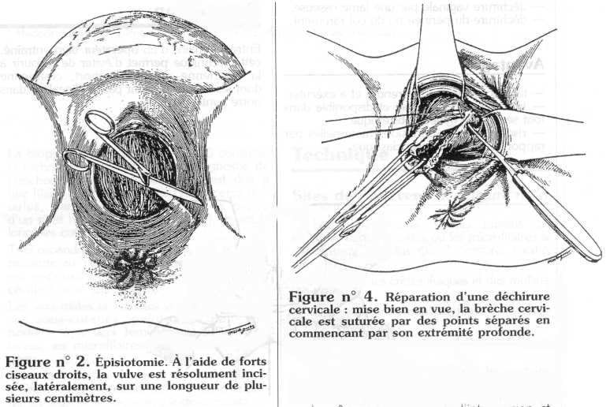
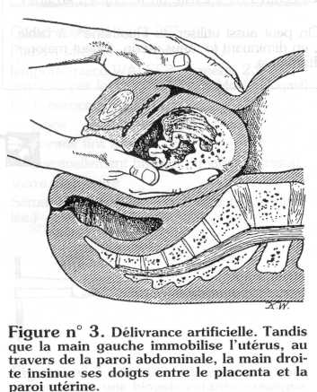

L'embryotomie est une technique d'extraction foetale par voie basse. On y a souvent recours pour éviter une césarienne sur enfant mort pendant le travail, après l'ouverture de l'oeuf mort, qui est de la plus haute gravité. C'est une technique qui a disparu dans les pays développés où les instruments d'embryotomie sont devenus des pièces de musée. Mais elle reste d'actualité dans les pays à faible couverture sanitaire. Devant la rareté des instruments d'embryotomie, nous avons été amenés à mettre au point une technique simplifiée ne nécessitant pas un matériel particulier.

## I. Conditions de réalisation de l'embryotomie

Certaines conditions sont liées au foetus, d'autres à la mère.

### 1. Conditions liées au foetus

- le foetus doit être mort,

- la présentation doit être céphalique,

- la présentation doit être engagée ou au minimum fixée.

### 2. Conditions tenant de la mère

- la dilatation du col doit être complète ou presque complète (> 8 cm),

- la poche des eaux doit être rompue,

- l'utérus doit être souple.

L'état du bassin maternel importe peu. En effet, la mort foetale intrapartum dans nos régions se rencontre le plus souvent chez des femmes évacuées porteuses d'angusties pelviennes passées inaperçues.

## II. Notre technique

### Préparation de la patiente

- mise en place d'une bonne voie veineuse,

- groupe sanguin et rhésus déterminés, - sonde urinaire à demeure,

- aseptie vulvo-vaginale,

- mise en place de champs stériles,

- habillage chirurgical de l'opérateur et de son aide.

### Le matériel

- 2 pinces de Museux (figure *n° 1*),

- 2 valves vaginales,

- 1 lame de bistouri montée sur un manche,

- 1 paire de ciseaux,

- 1 porte-aiguille et une pince à disséquer.

### L'anesthésie

On y a rarement recours. Si on l'utilise, il faut préférer le Fluothane® qui permet de mieux relâcher l'utérus.

### La technique proprement dite

- patiente en position gynécologique,

- l'aide expose la tête foetale à l'aide de deux valves vaginales,

- l'opérateur réalise une incision transversale du cuir chevelu foetal sur 3 à 4 cm,

- à travers cette incision, il perfore la boîte crânienne avec la pointe du bistouri ; l'ouverture du crâne est agrandi par l'introduction et l'écartement des branches de la paire de ciseaux. Ce geste laisse sourdre du liquide céphalo-rachidien et de la matière cérébrale reconnaissable par son aspect blanchâtre,

- l'opérateur saisit les deux pinces de Museux et fait une traction vers le bas pour amener la tête sur le plancher périnéal ou parfois pour terminer l'engagement,

- ensuite, il fait une extraction vers le haut pour dégager la tête.

On est parfois amené à ce stade à faire une épisiotomie si la vulve est rétrécie (séquelle d'excision), ou si le périnée n'est pas souple *(figure n °2).*

Après l'extraction du foetus, on complète la manoeuvre par une délivrance artificielle et une révision utérine (*figure n° 3*). On termine toujours par un examen sous valves à la recherche d'une déchirure du col ou du vagin *(figure n° 4).* On peut alors injecter une ampoule de méthylergotamine (Méthergin®) en intramusculaire ou 5 UI d'oxitocine (Syntocinon®) en perfusion pour assurer la rétraction de l'utérus.

### Incidents et accidents de la technique

- dérapage des pinces de Museux qu'il faut replacer,

- déchirure vaginale par une lame osseuse,

- déchirure du périnée ou du col rarement.

### Avantages

- technique facile à apprendre et à exécuter,

- instrumentation simple et disponible dans tout service de gynéco-obstétrique,

- risque moindre de lésions maternelles par rapport à la cranioclasie classique.

### Conclusion

Entre les mains d'un opérateur bien entraîné, cette technique permet d'éviter de recourir à la césarienne sur enfant mort, césarienne dont les risques ne sont pas négligeables dans notre contexte.

### Note de la Rédaction

Il parait souhaitable de réaliser tout accouchement par voie basse d'un enfant mort-né par crâniotomie sous anesthésie générale dans les centres où il existe un technicien en anesthésie et des drogues anesthésiques.

La Kétamine® est l'anesthésique conseillé. On peut aussi utiliser du Fluothane®, à faible concentration (0,5 %), car, à plus forte dose, en diminuant le tonus utérin, il peut majorer le saignement. La rachianesthésie est une alternative.

*Développement et Santé, n° 129, juin 1997*
