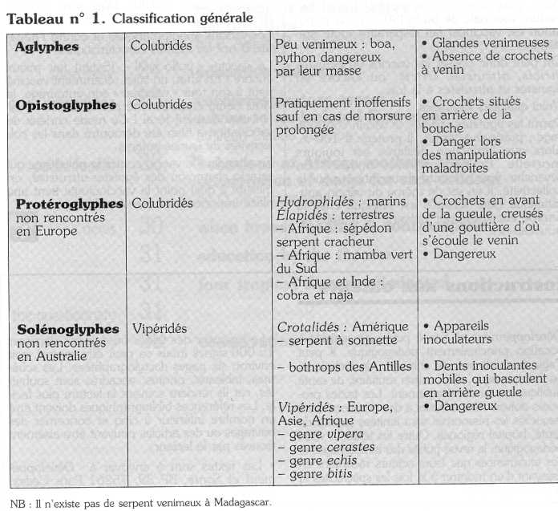
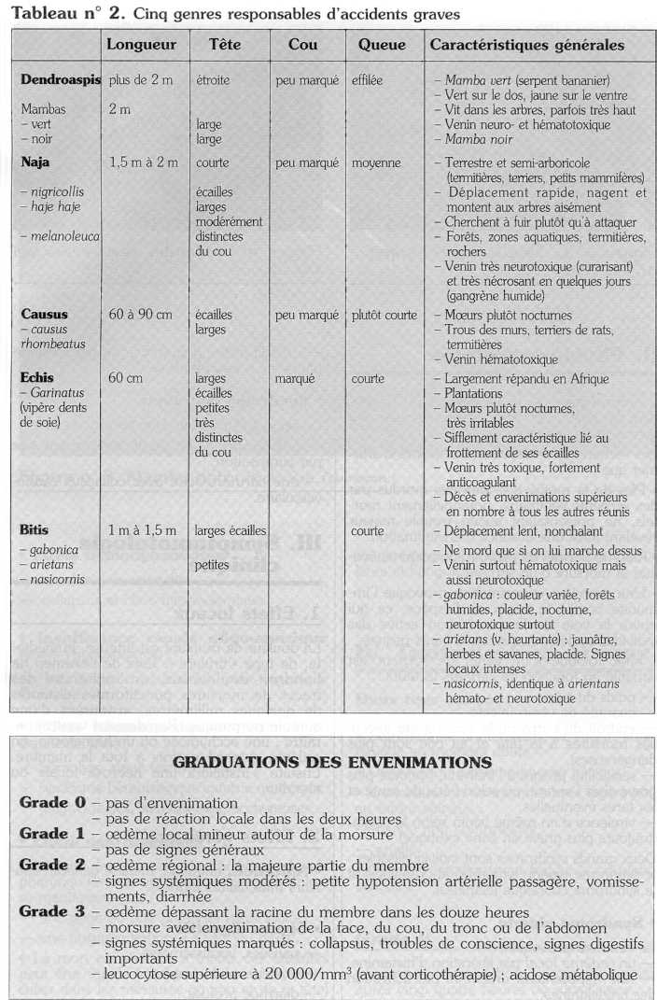
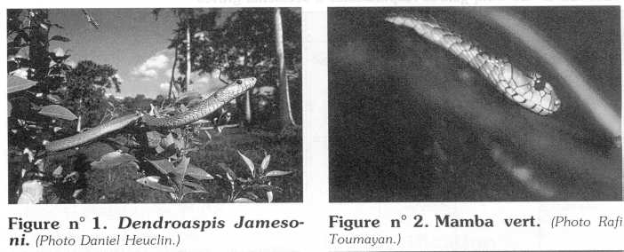
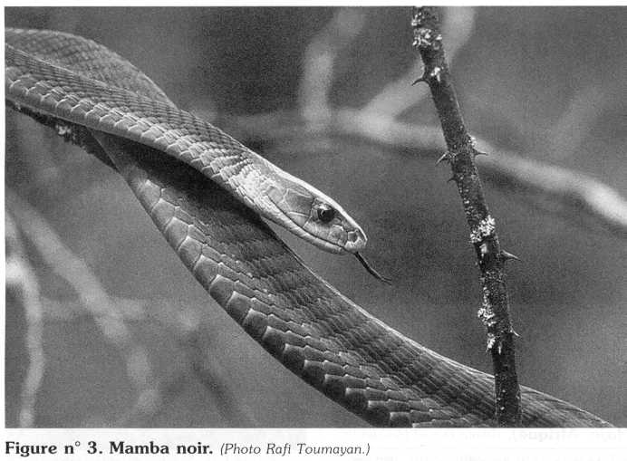
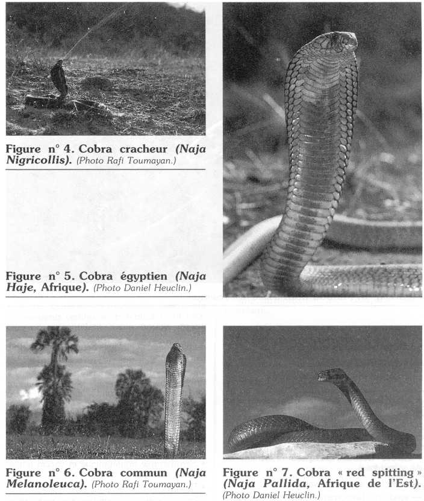
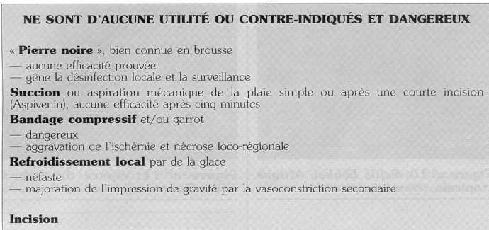
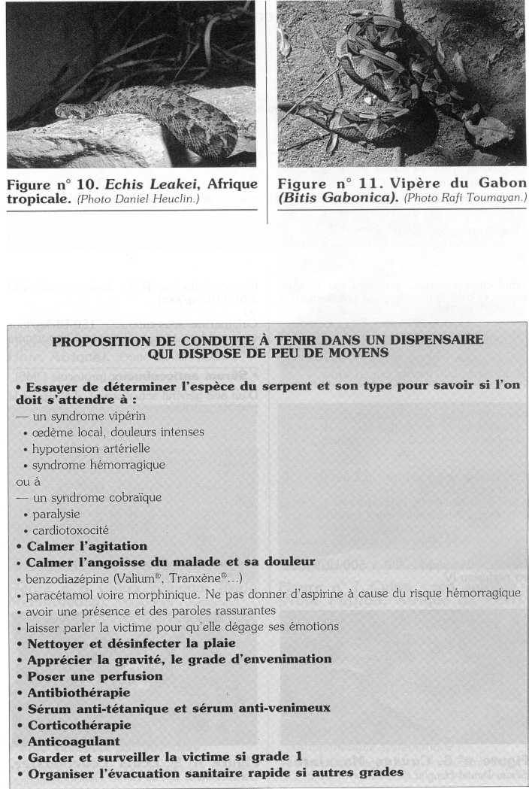
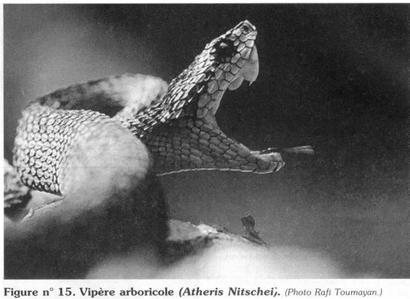

**Envenimations par serpents**

**par Marie-Claude Bottineau**

Pédiatre, SMUR, hôpital Robert-Debré, Paris.

On parle d'envenimation devant l'ensemble des symptômes survenant après l'inoculation à l'homme de venins animaux. Le venin est constitué d'un mélange complexe d'enzymes protéolytiques, de peptides et de protéines de faible poids moléculaire.

Les manifestations dues à l'ingestion d'animaux vénéneux, riches de substances toxiques, n'entrent pas dans ce cadre.

L'envenimation est un accident rare, plus fréquent toutefois dans les pays chauds (Afrique Noire), mais dont l'issue parfois fatale continue à entretenir une telle frayeur qu'elle entraîne souvent une conduite pratique inadaptée.

Quatre cents espèces (protéroglyphes et solénoglyphes) seraient susceptibles d'être dangereuses pour l'homme. En cas d'envenimation la mortalité est assez lourde mais loin d'être inéluctable. Cinq cent mille envenimations seraient répertoriées chaque année, entraînant 40 000 décès, soit 8 % des patients touchés.

**I. Classification** **des serpents**

Voir _tableau n°1_ _:_ **Classification générale** et _tableau n°2 :_ **Cinq genres res_ponsables d'accidents graves._**

**Il.** **Physiopathologie**

Les conséquences de l'envenimation dépendent des qualités du venin différentes selon les genres et les espèces.

Les recherches entreprises ont permis d'affirmer que :

*   Plus de la moitié des individus mordus par des serpents venimeux, potentiellement mortels, ne présentaient aucun trouble majeur révélant ainsi une absence d'envenimation.

*   Rien ne permet de prévoir comment va évoluer la morsure d'un serpent.

*   Une première envenimation provoque l'immunité contre le venin de l'espèce, ce qui ouvre la voie de l'immunisation active des individus et des populations à hauts risques,

L'effet toxique d'un venin de serpent est variable en fonction de certains facteurs :

*   poids du sujet,
*   quantité de venin injecté, - endroit du corps où le venin a été injecté (les morsures à la tête et au cou sont plus dangereuses),
*   sensibilité propre à l'individu, toujours plus grave chez l'enfant, ou selon l'état de santé et les tares éventuelles,
*   virulence d'un même venin selon la région (toujours plus grave en zone exotique).

Deux grands syndromes sont individualisables le syndrome vipérin (vipéridés et crotalidés) et le syndrome cobraïque (élapidés).

*   **Syndrome vipérin**

Le venin va provoquer

- un _oedème local_ par libération d'histamine,

_- une hypotension artérielle_ par activation des bradykinines,

_-_ un syndrome hémorragique par coagulopathie de consommation.

*   **Syndrome cobraïque**

Le venin très neurotoxique va provoquer :

_- des paralysies_ en particulier respiratoires par curarisation,

- _une cordiotoxicité_ avec collapsus cardio-vasculaire.

**III.** **Symptomatologie** **clinique**

**1. Effets locaux**

La douleur de morsure est intense, immédiate, de type " brûlure ". Lors de l'examen de l'endroit douloureux, on recherche des traces de morsures punctiformes distantes de quelques millimètres, entourées d'une auréole purpurique. Rapidement vont apparaître : une ecchymose ou un hématome, un oedème extensif parfois à tout le membre. Ensuite s'installera une nécrose locale ou étendue.

**2. Effets généraux**

*   **Agitation,** angoisse, malaise général, douleurs musculaires diffuses.

*   **Signes digestifs**

- nausées, vomissements,

- douleurs abdominales,

- diarrhée profuse.

*   **Effets hémodynamiques**

*   hypotension artérielle,
*   collapsus et choc hypovolémique.

*   **Insuffisance rénale oligo-anurique**

(liée à l'hypovolémie)

- fonctionnelle (réversible), puis organique (irréversible).

*   **Effets hématotoxiques** (maximum au deuxième jour)

*   hémolyse aiguë intravasculaire,

*   syndrome hémorragique externe ou interne,
*   gingivorragies, hémoptysies, ecchymoses...

*   **Effets neurotoxiques**

L'atteinte des muscles du carrefour glosso-pharyngo-laryngé et des muscles respiratoires se manifestera par :

- une gêne ou une paralysie respiratoire,

- une dyspnée laryngée haute ou basse.

*   La mort consécutive à toutes ces atteintes peut être rapide (quelques minutes, en particulier dans les morsures du cou et de la tête) ou plus longue (quelques heures) dans les douleurs et l'angoisse.

**IV. Traitement en Afrique**

**Dans tous les cas**

*   Victime au repos complet, allongée.  
*   Sérothérapie antitétanique et vaccin antitétanique au moindre doute.  
*   Désinfection locale soigneuse (Dakin).  
*   Immobilisation du membre avec légère gêne au retour veineux :

- bande non compressive,

- attelle.

*   Calmer l'agitation pour freiner la circulation sanguine.

**Grade 0**

Absence d'envenimation : retour au domicile après vingt-quatre heures de surveillance.

**Pour tous les autres grades : hospitalisation**

*   Voie veineuse périphérique

*   Calmer l'agitation pour freiner la circulation sanguine.

*   Calmer l'angoisse : Tranxène® intramusculaire : 1 mg/kg/ en 1 fois.

*   Calmer les douleurs : paracétamol : 60 mg/kg/24 heures en 4 fois.

*   _Antibiothérapie systématique :_

- Pénicilline-Flagyl® IV ou Ampicilline-Flagyl® IV comme prévention de la gangrène ou d'une surinfection constante (attention au pyocyanique car c'est là un terrain de prédilection).

Pénicilline : 100 000 UI/kg/jour en 4 fois

Métronidazole : 40 mg/kg/jour en 4 perfusions

Ampicilline : 200 mg/kg/jour en 4 fois

_Corticothérapie systématique_ à visée anti-inflammatoire et prévention des effets secondaires de la sérothérapie : Dexaméthasone® IV 0,6 mg/kg/jour en 4 fois.

_Calciparine sous-cutanée :_ 0,1 ml/10 kg de poids en 1 fois.

*   1/2 dose au lieu de la morsure et 1/2 dose à la racine du membre dans les 30 minutes qui suivent la morsure mais, passé ce délai, injecter la dose totale à la racine du membre.

_Héparine standard :_ 300 à 500 Ul/kg/jour en perfusion IV.

(Isocoagulation au TCA: dose normale (400 à 600 Ul/kg/jour)

ou

Calciparine sous-cutanée : 150 Ul/kg/jour en 2 à 3 fois, _tant qu'il existe d'importants_ _signes locaux._

*   **Sérum antivenimeux** (protocole OMS)

D'un avis général actuellement, il s'impose le plus tôt possible.

Prévoir l'éventualité rare de choc anaphylactique :

*   1 seringue avec 7 mg/kg HHC ( hémisuccinate hydro-cortisone (IV)
*   1 seringue avec 1 mg/kg Phénergan® (IVL)
*   1 seringue avec 0,25 mg adrénaline dans 10 ml de sérum physiologique (1ml lV à renouveler)
*   1 flacon d'albumine 4 % ou Haemaccel® (20 mg/kg en 30 minutes)

**Administrer :**

- chaque fois que possible du sérum monovalent correspondant à l'espèce du serpent;

- dans les autres cas, du sérum polyvalent.

_Posologie,_ selon le grade :

Grade 1 : 1 à 2 ampoules (10 à 20 ml) quel que soit le poids, en sous-cutané :

1/2 dose autour de la morsure et 1/2 dose à la racine du membre atteint,

dose pouvant être répétée 1 fois dans les formes vues tardivement (parfois au-delà de la 24è heure).

Grade 2 : 2 ampoules (20 ml) dans 100 ml de sérum physiologique, en IV, d'abord très lentement, puis en 30 minutes ;

une deuxième voie veineuse doit être prête en parallèle pour : adrénaline, macromolécules...

Grade 3 : Identique au grade 2 mais la dose de sérum antivenimeux administrée peut être augmentée et passée à 3, voire 5 ampoules (30-50 ml) dans 150 à 250 ml de sérum physiologique (5 fois le volume du sérum antivenimeux) en IV ; d'abord très lentement, puis en continu.

Une deuxième voie veineuse est indispensable pour la prévention d'un choc anaphylactique, la correction d'un choc hypovolémique ou celle d'une acidose métabolique, etc.

*   **Réanimation (grade 3) :**

- réanimation adaptée des désordres vitaux,

- perfusion systématique sur une base de 50 à 100 ml/kg/jour adaptable aux besoins de sérum glucosé à 5 % + ions,

- ventilation assistée parfois nécessaire (syndrome cobraïque, myotoxique).

*   **Cas particulier des nécroses**

Parage précoce:

*   Mise à plat des phlyctènes.

*   Le débridement vise à libérer les muscles sous-jacents pour lever un garrot interne dans l'axe du membre. On procède ensuite à l'irrigation au Dakin ou à l'eau oxygénée.

*   Excision du tissu cellulaire sous-cutané contus et souillé : elle doit être complète avant six heures.

*   Excision secondaire des plaques de nécrose en restant le plus conservateur possible : mise à nu de larges surfaces (la mise à nu risque d'être étendue).

*   Secondairement, on pratiquera, si nécessaire, des réparation-sutures, des greffes dermo-épidermiques, et une rééducation fonctionnelle.

**V. Surveillance**

Celle-ci est avant tout clinique.

**Surveillance locale**

- de la vitesse de propagation de l'oedème en vérifiant que ne se produise pas une compression vasculaire : prise des pouls distaux et coloration des pieds;

- des nécroses et des risques de surinfections.

**Surveillance générale**

*   hémodynamique (pouls, tension)
*   rénale (diurèse),
*   pulmonaire avec risque d'oedème pulmonaire (lésionnel ou de surcharge) et risque de paralysie respiratoire.

**Bilan sanguin**

- numération formule sanguine,

- coagulation,

- ionogramme.

**Conclusion**

Il ressort de cet exposé l'importance de l'éducation. La plupart des espèces venimeuses n'attaquent l'homme que pour se défendre et se protéger. Il est indispensable de respecter des normes élémentaires de sécurité en zone tropicale telles que porter des chaussures par exemple. Il faut être encore plus vigilant la nuit, ou en terrain inconnu.

_Développement et Santé, n° 135, juin 1998_