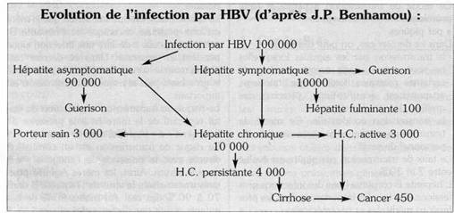
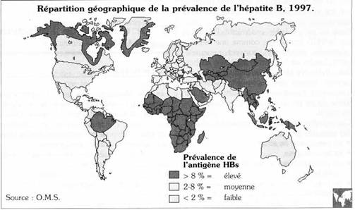

## I. Généralités

D'après les estimations de l'Organisation mondiale de la santé, 2 milliards de personnes sont infectées par le virus de l'hépatite B, dont 350 millions sont porteurs chroniques du virus. Ces derniers présentent un risque important de déclarer un jour une cirrhose ou un cancer du foie. Au moins 1 million en meurent chaque année.  Bien qu'ubiquitaire, la répartition géographique du virus de l'hépatite B n'est pas homogène. On peut (en tenant compte de la présence des marqueurs du virus de l'hépatite B) définir trois zones d'infections persistantes :

- les zones de haute endémicité, telles que l'Afrique et l'Asie du Sud-Est, 70 à 90 % de la population qui présentent des marqueurs du virus de l'hépatite B et plus de 8 % de la population sont constitués de porteurs chroniques (présence de l'antigène de surface HBS de l'hépatite B).
- les zones d'endémicité moyenne qui sont le Moyen-Orient, l'Amérique Centrale et l'Amérique du Sud. On y observe entre 2 et 7 % de porteurs chroniques et 20 à 55 % de personnes présentant des marqueurs du virus.
- les zones d'endémicité faible, telles que l'Amérique du Nord, l'Europe occidentale et du Nord, où le taux de porteurs chroniques est inférieur à 2 % et la présence des marqueurs du virus se retrouve chez moins de 20 % de la population.

Au plan mondial, le taux d'infection est plus important chez les hommes que chez les femmes, chez les enfants que chez les adultes, dans les populations urbaines que dans les populations rurales.

La transmission horizontale, très fréquente chez les enfants et les adolescents, serait responsable de la majorité des infections en Afrique et au Moyen-Orient.  En revanche, la transmission périnatale est beaucoup plus répandue en Asie.

## II. Modes de transmission du virus de l'hépatite B

La transmission du VHB s'explique par :

1.  la longueur de la phase d'incubation (2 à 6 mois), le sang étant infectant dans la seconde partie de cette phase ;
2.  le très haut titre infectieux du sang (0,0001ml de plasma peut transmettre le VHB) ;
3.  le grand nombre de porteurs asymptomatiques ;
4.  la présence du virus dans tous les liquides biologiques : liquide séminal (sperme), secrétions vaginales, sueur, larmes, salive, urine (alors que l'infectiosité des selles est négligeable) ;
5.  la fréquence de l'inoculation inapparente. Le virus de l'hépatite B est 50 à 100 fois plus infectieux que le VIH.

Il existe 4 principaux modes de transmission :

- parentéral
- sexuel
- périnatal
- horizontal

### 1. La transmission parentérale

La transmission du virus de l'hépatite B par voie parentérale existe dans toutes les zones d'endémie.  
Les sources d'infection sont le sang, les produits sanguins et dérivés, ainsi que le matériel souillé (aiguilles, bistouris, tout matériel médical et dentaire piquant ou tranchant utilisé par les soignants).

Elle se fait :

- Par la transfusion du sang et de ses dérivés. Pour chaque donneur il faudrait pouvoir rechercher l'antigène HBS, l'anticorps antiHBC et doser les ALAT. Ce mode de transmission explique la forte prévalence chez les hémophiles.
- Par piqûres. Dans ce dernier cas, on peut distinguer :
  - la transmission par les aiguilles lorsqu'elles ne sont pas à usage unique ou lors de certaines pratiques (toxicomanie, tatouage, acupuncture, scarifications, piercing des oreilles... )
  - la transmission accidentelle. Ce mode de transmission explique la contamination du personnel de santé.

Le taux de transmission par piqûre est évalué entre 7 et 30 %.

L'hépatite B constitue l'une des infections professionnelles les plus importantes dans les professions médicales et paramédicales.

### 2.  La transmission sexuelle

La présence du VHB dans le liquide séminal et les sécrétions vaginales explique que l'hépatite B soit une maladie sexuellement transmissible. Elle survient lors du contact avec des muqueuses fragiles, du sperme, des sécrétions vaginales ou des menstruations des porteurs du virus de l'hépatite B.

Le risque d'infection augmente avec le nombre de partenaires sexuels, le nombre d'années d'activité sexuelle et la présence ou non d'autres maladies sexuellement transmissibles.

La transmission se fait soit par des sujets atteints d'infections aiguës, soit par des porteurs chroniques, mais la plupart du temps, ces infections sont transmises par des personnes hétérosexuelles ou homosexuelles qui ignorent leur état d'infection.

Bien que la transmission sexuelle existe dans toutes les zones d'endémie, elle représente l'une des voies d'entrée les plus importantes de l'hépatite B dans les zones à faible endémie.

### 3. La transmission périnatale

La transmission périnatale ou verticale, qui se fait d'une mère infectée vers son enfant, est la voie la plus redoutable car, parmi les personnes en contact avec le virus, ce sont les nouveau-nés qui présentent le risque le plus important de devenir des porteurs chroniques. Près de 95 % des transmissions périnatales se font lors de l'accouchement et du post partum.

La transmission est due soit au fait que la mère est une porteuse chronique de l'hépatite B, soit parce qu'elle a déclaré une infection aiguë pendant sa grossesse.  Dans ce dernier cas, plus la maladie survient tard dans la période de la grossesse, plus le risque de transmission est important.

Le risque de transmission est fonction du statut réplicatif de la mère lié à la présence de l'antigène « e » (AgHBe) dans le sérum.

Le risque de transmission est en corrélation directe avec la présence de l'antigène « e » dans le sérum. Ainsi, les mères AgHBe positives transmettent le virus de l'hépatite B dans 70 à 90 % des cas. Au moins 90 % de ces enfants seront des porteurs chroniques.

### 4. La transmission horizontale

La transmission de l'hépatite B est possible par la salive, la sueur, les larmes, l'urine.  
Elle peut se faire à partir d'objets usuels (rasoir, brosse à dent, couteau, etc.) au sein d'une même famille ou dans le cadre d'un habitat collectif.  D'où la nécessité de vacciner l'entourage d'une personne infectée.

Bien que le mécanisme ne soit pas bien connu, on pense que la transmission du virus de l'hépatite B se fait par le sang ou les liquides biologiques qui entrent en contact avec la peau lésée par des blessures, des piqûres d'insectes, l'impétigo, la gale, etc. La blessure par morsure peut être également en cause.

## III.  Les groupes à risque

La connaissance des modes de transmission du virus de l'hépatite B permet d'identifier les personnes ayant un risque élevé d'être infectées par ce virus. Ceci permet de prendre des mesures préventives à leur endroit.  
Dans les pays de haute endémicité, la majorité de la population est infectée soit à la naissance, soit pendant l'enfance; plus de 60 à 70 % des infections se font chez les nouveau-nés ou les enfants en bas âge. Une minorité est susceptible de s'infecter plus tard dans leur vie.  
Dans les pays à faible endémicité, l'infection par le VHB (considérée comme une maladie infectieuse importante), survient principalement chez les adolescents et les jeunes adultes. Des études ont identifié certaines populations comme courant un risque plus élevé que d'autres, en raison de leur profession, de leur mode de vie ou de leur état général (maladie en cours).  
Ces populations à risque sont, dans la plupart des pays, les suivantes :

- les personnels de santé,
- les toxicomanes,
- les personnes ayant des partenaires sexuels multiples,
- les personnes regroupées dans des centres de soins (handicapées, internées ..), les malades transfusés (hémophiles...)
- les nouveau-nés des femmes enceintes infectées par le VHB.

## IV. La surveillance

La surveillance de l'infection par le virus de l'hépatite B est nécessaire pour déterminer la prévalence, l'incidence (les nouveaux cas), afin de définir des priorités et d'élaborer des stratégies de lutte appropriées.

La surveillance doit permettre aux responsables de la santé d'évaluer les éventuelles épidémies. Compte tenu des difficultés de notification dans beaucoup de pays en développement et de l'insuffisance du nombre de laboratoires effectuant la sérologie de l'hépatite B, les chiffres obtenus peuvent être en deçà de la vérité. Même dans les pays où le système de surveillance est bien organisé, on notera une sous-estimation provenant de l'absence de notification des cas asymptomatiques. Les cas symptomatiques ne sont pas toujours référés à l'hôpital, et la coopération des médecins est parfois insuffisante quand ils ne notifient pas systématiquement tous les cas.  
Des études doivent être initiées dans tous les pays pour permettre l'obtention de données fiables sur l'hépatite B. Ces données induiront le choix des stratégies de lutte contre l'hépatite B.

V. Le contrôle de l'infection par le VHB

1.  Généralités

Les pays développés dépensent d'importantes sommes d'argent dans le contrôle et la prévention de l'hépatite B par le dépistage dans les centres de transfusions, les cliniques prénatales et pour le traitement des enfants nés de mères infectées par le virus. Les moyens utilisés dans les programmes de lutte contre l'hépatite B sont :  
 les actions préventives générales,  
 les précautions universelles,  
 la vaccination,  
 l'immunothérapie.

Nous n'aborderons ici que les aspects généraux et les précautions universelles, les autres sujets étant traités par d'autres auteurs dans cette édition.

2.  Les activités préventives

Elles consistent en l'information du personnel de santé, des décideurs et du public sur les dangers de l'infection par le VHB. Certains comportements favorisent la transmission du VHB et d'autres maladies sexuellement transmissibles.  Il s'agit en particulier de l'utilisation des drogues par injection IV, des rapports sexuels non protégés, de la pratique de tatouages et de l'acupuncture avec des instruments non stériles ou mal stérilisés.  
Une prévention efficace est fonction du niveau d'information sur le VHB, ses modes de transmission et ses conséquences.  
Parallèlement à ces mesures, la vaccination doit être encouragée.

3.  Les précautions universelles  
    La plupart des porteurs chroniques du VHB ignorent leur statut et présentent donc un  
    risque important pour le personnel de santé et les autres personnes susceptibles d'être exposées à leurs liquides biologiques.

Le concept de précaution universelle suppose que le personnel de santé considère tout liquide biologique comme potentiellement infecté par un ou plusieurs agents pathogènes sanguins. Ainsi, il prendra soin de se protéger devant tout malade, sans tenir compte du diagnostic affiché.

Le personnel de santé doit connaître son statut sérologique. Tout soignant ayant une sérologie d'hépatite B négative doit être vacciné. Le soignant doit utiliser le matériel protecteur (gants, lunettes, blouses, etc.) chaque fois qu'il est exposé aux liquides biologiques.

Idéalement, le matériel d'injection (et autres objets tranchants) devrait être à usage unique. Dans les cas où cela est impossible, les aiguilles et autres doivent être rigoureusement stérilisés après chaque usage par la chaleur humide (autoclave 121°C pendant 20mn). Les vêtements contaminés doivent être trempés dans un bain d'eau de Javel avant d'être lavés dans une machine à laver aux températures les plus élevées possibles.

Le matériel souillé à jeter doit être recueilli dans des conteneurs spéciaux munis d'un couvercle, puis incinéré.  Si l'incinération n'est pas possible, il faut stériliser avant de jeter pour éviter une

*Développement et Santé, N° 151, février 2001*
