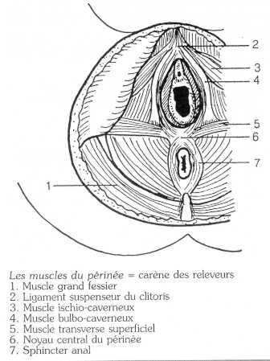
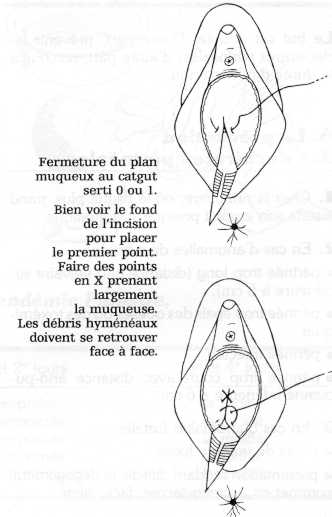
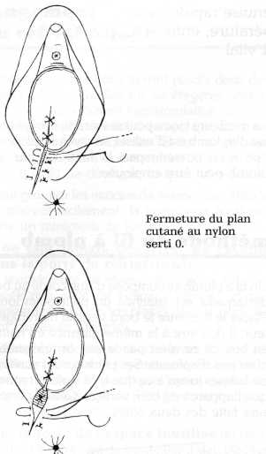

**Episiotomie**

**par Philippe Engelmann* Stéphane Saint Léger****

*Gynécologue-obstétricien, hôpital Louis Mourier, Colombes, France  
**Gynécologue-obstétricien, CHI Saint Grégoire, Montreuil, France

L'épisiotomie sectionne le périnée à partir de l'anneau vulvaire et facilite le dégagement. C'est l'intervention chirurgicale la plus communément pratiquée en France .

Mal faite, elle est source de complications immédiates ( abcès) et ultérieures ( rapports sexuels douloureux)

**I L'épisiotomie : pourquoi faire ?**

Le but est double. D'une part, prévenir les déchirures périnéales ; d'autre part, raccourcir la durée de l'expulsion.

**1. Rappel anatomique**

Le périnée est un ensemble de formations cutanéo-musculo-aponévrotiques comportant principalement la carène des releveurs, elle-même formée de 2 couches :

*une couche externe ou sphinctérienne comprenant 3 faisceaux :Pubo-coccygien, cliococcygien, ischio-coccygien ;

*une couche interne ou élévatrice ou faisceau puborectal.

Le rôle **des releveurs** et donc du périnée est multiple. Il intervient dans :

*   **La** statique pelvienne : équilibre vésico-sphinctérien, soutènement des viscères
*   **Le** soutènement de la jonction urétro-vésicale : transmission des pressions
*   **La** continence urinaire : cloture urétrale
*   **La** continence anale : à l'effort par accentuation du coude du canal anal
*   **L**'accouchement : progression et orientation du mobile foetale
*   **La** sexualité : tonicité, sensation et qualité

**2. La prévention des déchirures périnéales**

*   Chez la primipare, où le risque plus grand justifie son emploi presque systématique.

*   En cas d'anomalies du périnée :

périnée trop long (distance ano-vulvaire supérieure à 5 cm), périnée trop épais des obèses ou des toxémiques, périnée infecté, périnée trop court avec distance ano-pubienne inférieure à 6 cm.

*   En cas d'anomalies fœtales :

excès de volume fœtal, présentation rendant difficile dégagement : sommet en occipito-sacrée, face, siège.

*   En cas d'interventions obstétricales : forceps, spatules, ventouses, petite ou grande extraction du siège.

**3. Le raccourcissement de la durée de l'expulsion**

- pour sauvegarder un enfant fragile (prématurité, souffrance fœtale)

- pour abréger les efforts maternels en cas de cardiopathie, de pneumopathie ou surtout de fatigue maternelle au terme d'un long travail.

**II- technique de l'épisiotomie : l'épisiotomie, comment ?**

L'épisiotomie médio-latérale est la technique de choix

**_Comment et quand la faire :_**

Elle doit partir du milieu de la fourchette*, se diriger en bas et en dehors faisant un angle de 45° avec l'horizontale et intéresse le vagin, les muscles périnéaux superficiels et la peau périnéale. (_figures n° 1et 2_)

Elle est faite aux ciseaux droits, bien affûtés, entamant d'un seul coup vagin, muscle et peau.

Elle est faite sur le périnée bien tendu au moment d'un effort expulsif, éventuellement sous anesthésie locale:

- sur présentation céphalique, elle se pratique au petit couronnement, sur périnée tendu et lors de l'apparition de la première goutte de sang ( rupture des premières fibres musculaires );

- sur présentation podalique, elle est plus précoce dès que le siège prend contact avec le périnée

Cette incision protège le sphincter anal et le rectum :

- augmente le diamètre vulvaire,

- respecte le canal de la glande de Bartholin,

- se répare facilement.

**_Quand et comment la refaire :_**

La réparation de l'épisiotomie doit être précoce, généralement immédiatement après la délivrance complète.

**Les conditions matérielles** de cette petite intervention chirurgicale doivent être parfaites.

- femme informée, rassurée et détendue, installée en position gynécologique, cuisses retombant en dehors,

- champ opératoire propre et net avec champs stériles disposés sous le siège de la patiente, sur l'abdomen et les cuisses et bon éclairage,

- opérateur habillé chirurgicalement,

- bonne anesthésie générale, loco-régionale ou locale en infiltrant les deux berges de la plaie

**L'exploration ou bilan lésionnel recherche**

- le niveau supérieur de l'incision muqueuse ( col, culs de sac , …)

- une atteinte de l'appareil sphinctérien

- une lésion contro-latérale

- une lésion des petites lèvres ou de la région clitoridienne

**La technique de réparation la plus couramment employée est la réparation en 3 plans,**

- Elle doit être rigoureuse, anatomique ( bord à bord ) et soignée avec des antiseptiques à tous les temps

- Mise en place d'un tampon vaginal pour retenir l'écoulement sanguin issu du col,

- Suture vaginale (plan muqueux) en écartant les parois vaginales avec 2 doigts en V. Commencer par un point à l'angle supérieur de la plaie vaginale puis la suture est conduite de haut en bas par un surjet avec du Vicryl 2/0 ou 3/0 rapide pour se terminer à la jonction cutanéo-muqueuse ( plus exactement aux débris hyménéaux ),

- Suture du plan musculaire avec plusieurs points simples de vicryl 0 ou 1 suffisamment serrés pour bien affronter mais pas trop pour ne pas couper, et avec une grande aiguille (>36 mm) afin de prendre largement les faisceaux musculaires

*suture du plan cutané en insistant sur la congruence*. Commencer par l'angle inférieur para-anal ; puis faire un surjet ou des points séparés ( Vicryl rapide 3/0 ou Ethilon 2/0 non résorbable). Toujours terminer par le dernier point au niveau de la fourchette ( Vicryl 2/0 rapide ) sous les reliefs hyménéaux ; si ce point est mal fait, c'est la porte aux abcès et / ou à une dyspareunie ( cri de la femme au premier rapport après l'accouchement )

**En fin d'intervention :**

*Vérifier l'hémostase

*Enlever le tampon repère

*Vérifier le globe utérin et les saignements

*Au moindre doute faire un toucher rectal de contrôle pour s'assurer qu'aucun point n'a transfixié la muqueuse rectale. La découverte d'un fil dans la lumière rectale doit entraîner son ablation immédiate.

*Faire un compte-rendu opératoire écrit et signé

*Faire un contrôle en post partum

**III- Après l'épisiotomie**

Les soins post-opératoires sont essentiels ; ils visent à maintenir le périnée propre et sec:

-Pansements aseptiques évitant l'écoulement des lochies sur la plaie,

-Toilettes périnéales fréquentes suivies d'un séchage soigneux (air chaud par séchoir par exemple ou périnée à l'air libre ),

- Ablation des fils résorbables le cinquième jour,

- Pas d'antibiothérapie systématique dans les suites d'une épisiotomie.

- Lever précoce tout à fait indiqué.

_Il y a d'autres variétés d'épisiotomies mais elles ne sont pas ou peu employées en raison de leurs inconvénients :_

_- épisiotomie médiane en raison du risque de plaie rectale,_

_- épisiotomie latérale transverse qui coupe le canal de la glande de Bartholin,_

_- incisions multiples en baïonnette qui donnent de mauvaises cicatrices._

**IV- Evolution**

Elle dépend directement de la bonne qualité de l'incision, du soin apporté à la suture et des soins post-opératoires : elle est habituellement favorable et donne une cicatrice souple, indolore, à peu près invisible.

Mais il y a parfois des complications :

*   Complications immédiates :

- douleur liée à l'œdème et à la tension périnéale : elle cède bien aux antalgiques ;

- désunion des sutures précédée par une phase d'inflammation qui commande l'ablation des fils non résorbables. Elle est suivie de suppuration puis de bourgeonnement et finit toujours par se refermer en laissant une cicatrice de mauvaise qualité.

*   Complications à distance :

cicatrice épaisse, irrégulière, inesthétique qui déforme l'orifice vulvaire qui devient agrandi et déhiscent ou au contraire rétréci, source de dyspareunie (rapport sexuel douloureux). La reprise opératoire est possible mais difficile. Enfin, des complications tardives peuvent se voir : bartholinite kystique, conséquences d'une épisiotomie transverse, elle oblige à l'intervention et enfin greffe d'une endométriose.

_Développement et Santé, n°144, décembre 1999_