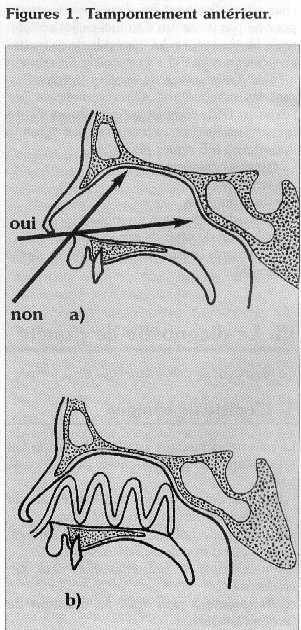
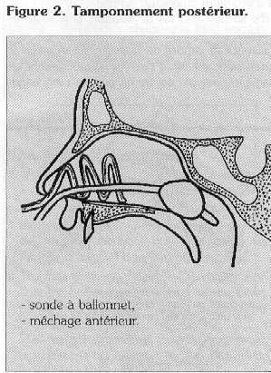
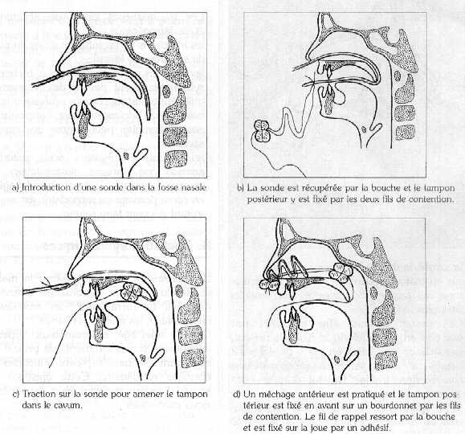

## I. Introduction

L'épistaxis se définit comme étant un saignement d'origine nasale, et, suivant le terrain, la quantité de sang perdu, le nombre de récidives, l'épistaxis présentera deux tableaux :

*   épistaxis bénigne, très fréquente,
*   épistaxis grave.

Ces deux manifestations sont certes différentes dans leur prise en charge, mais actuellement, l'épistaxis ne doit plus être une source de mortalité, d'autant plus qu'il suffit de respecter une démarche clinique soigneuse pour apaiser toute l'anxiété que vivent le patient et sa famille au cours d'un tel état clinique.

La non-disponibilité et/ou l'inexistence de certains médicaments ne peuvent être un argument pour ne pas mettre en route une cascade de démarches thérapeutiques raisonnées.

Que faut-il faire pour une meilleure prise en charge de cette spoliation sanguine que constitue l'épistaxis ?

1. Il faut **établir le diagnostic** positif, reconnaître l'épistaxis.

2. Il faut **reconnaître les signes de gravité** et prendre les mesures thérapeutiques pouvant sauvegarder la vie du patient. Cet aspect amène donc à se poser les questions suivantes :

*   Quand garder le patient, et avec quoi ?
*   Quand le transférer au niveau supérieur de la pyramide sanitaire ?
*   Comment le transférer et où le transférer ?

3. Il faut **connaître les étiologies** possibles, d'une part, pour pouvoir répondre aux questions du patient et de sa famille, d'autre part, pour motiver votre démarche de soins et les mesures thérapeutiques appropriées.

## Il. Le diagnostic positif

Il est facile : le patient saigne et le sang provient bien des fosses nasales. Il faut cependant toujours avoir à l'esprit deux causes d'erreur :

- une hématémèse : il s'agit de sang vomi, donc provenant de l'appareil digestif, (mais l'épistaxis peut être déglutie).

- une hémoptysie : il s'agit du sang retrouvé lors des épisodes de toux, dans un contexte de pneumopathie.

Le diagnostic positif repose sur :

### 1. L'interrogatoire

Celui-ci précisera :

*   le contexte de survenue : épistaxis brutale ou récidivante (contexte de grattage de la tache vasculaire à chercher), les prises médicamenteuses (sachant que certains médicaments peuvent agir sur l'hémostase, par exemple l'Aspirine®, la notion de traumatisme (immédiatement suite au traumatisme ou retardé par rapport au traumatisme) ;
*   les caractères du saignement, notamment la quantité de sang perdu ;
*   les antécédents personnels et familiaux, le terrain du patient : dans sa famille retrouve t-on quelqu'un qui saigne souvent de la narine ? Le patient lui-même a-t-il l'habitude de saigner de la narine ? Quand il se blesse, le sang s'arrête-t-il en général rapidement où est-ce toujours délicat ? etc.
*   l'état de lucidité : le patient est-il confus ou non ?

### 2. L'examen clinique

Il se fait après avoir rassuré le patient dont l'anxiété pour son état aggrave le saignement. Il est nécessaire de rechercher un éventuel syndrome hémorragique diffus : purpura, hématurie, rectorragie.

Les matériels à réunir pour un examen confortable comprennent :

*   une source de lumière, frontale de préférence,
*   un spéculum nasal,
*   une pince de Lubet-Barbon,
*   une pince de Politzer,
*   un récipient type haricot propre,
*   des gants d'examen,
*   des abaisse-langue,
*   des mèches grasses (compresses 40/40 cm totalement dépliées et coupées en deux triangles que l'on imbibe de pommade hémostatique) ou, si disponible, du tulle gras grande feuille,
*   un champ de toile protecteur pour le patient. Après avoir demandé au patient de se moucher alternativement les deux fosses nasales pour ne pas laisser un éventuel caillot entretenir la fibrinolyse, on lui demande de se mettre en position assise et l'on procède à l'examen à l'aide d'une source de lumière frontale laissant les mains libres. On commencera par l'examen ORL complet qui objectivera l'épistaxis. Ensuite, on accordera une grande importance à 5 signes physiques
*   l'état des conjonctives,
*   la température,
*   la prise du pouls,
*   la prise de la pression artérielle,
*   l'évaluation de l'état de conscience.

Ces éléments permettent d'établir le degré de gravité.

## III. Le diagnostic de gravité

Ce diagnostic se présentera sous deux formes :

### 1. L'épistaxis bénigne

La plus fréquente, elle est ainsi classée du fait :

*   du volume : ici minime, moins de 100 cc de sang,
*   du mode de survenue : non inquiétant, car épisode isolé sans notion de récidive,
*   du terrain du patient : absence de tare clinique et/ou trouble de l'hémostase. Cette épistaxis se présente selon deux circonstances :

#### a) Saignement non actif au moment de **la consultation**

A l'aide d'une source de lumière, on recherche une lésion au niveau de la fosse nasale, surtout au niveau de la tache vasculaire. S'il n'y a pas de lésion visible, on expliquera aux parents des principes simples de surveillance (recherche de signe de pâleur conjonctivale, surveillance de la coloration des phanères, recherche de signes d'essoufflement anormal et d'hyperthermie) et on convoquera à nouveau le patient avec les résultats d'une numération formule sanguine, un bilan minimal d'hémostase et un cliché des sinus en incidence de Blondeau, une semaine après. Si lésion de la tache, prescription de pommade hémostatique et au besoin antihistaminique oral, pour lutter contre le prurit nasal, tout en n'oubliant pas de prévoir un bilan d'atopie.

#### b) Saignement actif au moment de la **consultation**

On calme l'anxiété du malade en lui expliquant sa maladie, on le fait moucher et on procède à un lavage doux des fosses nasales à l'aide d'une seringue de 20 ml remplie de sérum physiologique. Ensuite, après avoir placé une alèse protégeant le patient, on procède à l'examen de la fosse nasale pour rechercher la zone de saignement, à l'aide d'une source de lumière (tache vasculaire surtout). S'il y a une lésion à ce niveau, on procède d'abord à une compression bidigitale des deux ailes narinaires pendant 10 min pour arrêter l'épistaxis, ensuite suivra une cautérisation de la tache : galvanocautère (geste médical), acide chromique dilué au tiers, acide trichloracétique dilué au tiers, crayon de nitrate d'argent. A cette cautérisation sera associée une prescription de pommade grasse ou d'huile goménolée pour éliminer les croûtes, sans traumatisme.

### 2. L'épistaxis grave

Elle est ainsi définie du fait de multiples facteurs pouvant être isolés et/ou associés. Ce peut être :

*   l'épistaxis abondante d'emblée faisant redouter l'installation d'un choc hypovolémique dont il faut rechercher les prodromes : pouls petit et filant, tension artérielle labile, sueur et froideur des extrémités ;
*   l'épistaxis dans un contexte de récidive fréquente amenant à rechercher des signes d'anémie et/ou d'hémolyse :
*   l'épistaxis retardée dans un tableau de traumatisme crânien ;
*   l'épistaxis sur terrain fragilisé (grossesse, diabète, anémie, trouble de l'hémostase);
*   l'épistaxis sur poussée hypertensive : devant ce tableau, il faut associer, en urgence, aux manoeuvres d'hémostase, l'administration d'antihypertenseur, surtout si la diastolique est élevée.

N.B. : ne pas oublier que le méchage, surtout postérieur, peut être cause d'hypoxie et/ou d'hypercapnie nécessitant l'administration d'oxygène.

*   l'épistaxis sur insuffisance rénale aiguë (surveillance accrue des signes d'hypo ou d'hypervolémie, ECBU, urée et créatinémie, ionogramme sanguin, créatinine et sodium urinaire).

#### Cinq mesures d'urgence sont à prendre :

*   s'assurer d'une voie veineuse périphérique et du groupe rhésus du patient,
*   s'assurer de la disponibilité rapide de succédanés sanguins et/ou de grosses molécules et /ou de sang isogroupe et isorhésus (ne pas hésiter à utiliser les succédanés sanguins en attendant les résultats biologiques),
*   tranquilliser le patient à l'aide d'anxiolytique léger, le faire moucher et éliminer les caillots pour prévenir la fibrinolyse et entreprendre les manoeuvres de tamponnement pour arrêter le saignement (N.B. : être réservé si l'on soupçonne un syndrome hémorragique),
*   apprécier le retentissement clinique et biologique de la spoliation sanguine et évaluer l'hémostase en urgence (TS, TC et si possible TP et TCK),
*   préparer en urgence un transport médicalisé vers un centre ORL spécialisé.

Ces mesures d'urgence sont à entreprendre de façon concomitante avec les moyens d'hémostase locaux qui, dans un poste isolé, par souci de sécurité pour le patient, peuvent être sériés en : **compression bidigitale :** on demande au patient de se moucher, ensuite on le fait asseoir la tête penchée en avant. On lui demande, avec le pouce et l'index d'une main, de se pincer les narines, au niveau du creux de la narine, pendant dix minutes. Ensuite on évalue, après ce laps de temps, l'effet de la compression sur le saignement. Si cette manoeuvre n'est pas concluante, on procède au :

#### Tamponnement antérieur

Il consiste à combler les fosses nasales en avant des choanes.

Plusieurs tampons existent. Le plus simple consiste à utiliser des mèches grasses, tel le tulle gras, ou à imprégner de pommade hémostatique des compresses chirurgicales coupées en oblique donnant deux épaisseurs en triangle. Et, à l'aide d'une source de lumière et d'une pince de Lubet-Barbon, tasser alternativement, de haut en bas et d'arrière en avant, les mèches (_figures 1_).

#### Tamponnement postérieur

Si, malgré cette tentative, le patient saigne, on peut appliquer le tamponnement postérieur :après une prémédication légère (anxiolytique), on fera passer par la narine une petite sonde urinaire à ballonnet jusqu'aux choanes _(figure 2)._ Ensuite, on gonfle cette sonde de 3 à 5 cm3 d'air et on tire le ballonnet doucement vers l'avant, il viendra ainsi buter sur les choanes. On refait le même geste en controlatéral et on le complète par un tamponnement antérieur bilatéral. En l'absence de sonde à ballonnet, il faut pratiquer un tamponnement postérieur à l'aide de biogaze _(figures 3)._

#### La cautérisation chimique

Elle est indiquée quand on voit précisément la zone qui saigne (se reporter aux produits cités plus haut).

Ces gestes doivent être encadrés par une couverture antibiotique. Théoriquement, le méchage sera laissé en place de 48 à 72 heures. Le patient est mis au repos avec une alimentation froide. On lui donnera des glaçons à sucer, s'il y en a.

Les épistaxis avec profil de gravité sont à évacuer au niveau supérieur après avoir réalisé et/ou raté l'hémostase par les moyens locaux et en s'assurant des cinq mesures précitées (figure 3).

## **IV. Les étiologies**

Elles sont diverses. On peut les regrouper en :

### **1.** Facteurs environnementaux

Le froid, l'air sec sont des causes d'épistaxis. L'activité des cils narinaires est fonction du climat et est optimale entre 32-40°C avec une fréquence de 15 Hz. Elle diminue de 5 Hz à 20° C et est fortement altérée, avec des dommages ciliaires, à 52°C.

### 2. Facteurs locaux

*   Les traumatismes de cause accidentelle et/ou iatrogénique ;
*   Les infections et/ou inflammations du nez et de ses annexes (sinus) ;
*   Les tumeurs naso-sinusiennes à rechercher systématiquement devant des saignements unilatéraux surtout chez les professionnels du bois. Chez l'adolescent mâle, l'angiofibrome naso-pharyngien peut donner des épistaxis sévères ;
*   Les irritants chimiques : acide sulfurique, ammoniaque, chrome, glutaraldéhyde sont sources d'épistaxis. L'intoxication tabagique, en cause primaire ou secondaire, est aussi un irritant pouvant faire saigner.

### 3. Facteurs systémiques

L'hypertension artérielle sévère, la maladie de Rendu Osler ou angiomatose diffuse, les maladies hémorragiques, les troubles de l'hémostase, les maladies rénales.

Chez le sujet âgé, athéromateux, hypertendu, souvent secondairement à la prise d'antiaggrégant plaquettaire, peut s'installer une épistaxis 'récidivante. Cette épistaxis sera source d'anémie pouvant avoir des répercussions cardiaques.

**En l'absence de sonde à ballonnet, il faut pratiquer un tamponnement postérieur à l'aide de biogaze** (figure ci-dessous)

Un tampon est préparé, formé de trois à quatre feuilles de grande taille (ou équivalent) . Ce tampon est noué avec un fil solide dont on garde deux longues extrémités. Par ailleurs, un fil de rappel de vingt centimètres est fixé au tampon. Une sonde souple (cf. schémas a et b) est alors passée par le nez et récupérée par la bouche. Les deux fils du tampon y sont fixés. La mise en place du tampon dans le cavum se fait par un double mouvement : traction sur la sonde d'une main, et guidage du tampon en bouche pour l'aider à passer le voile de l'autre main (cf. schéma c).

La contention est ensuite assurée sur un méchage antérieur par un bourdonner (compresse pliée) fixé sur le seuil narinaire à l'aide des deux fils du tampon. Le fil de rappel qui sort de la bouche est fixé par un adhésif sur la joue (cf. schéma d).  
Là aussi, le contrôle de l'arrêt du saignement se fait avec un abaisse langue pour dépister un écoulement postérieur.  
Le méchage, qu'il soit antérieur ou postérieur, est gardé trois jours. Son ablation se fait en douceur pour les mèches antérieures qui risquent d'éroder la muqueuse septale.  
Quant au méchage postérieur, il est enlevé après section des fils de fixation antérieure et ablation du bourdonner par traction sur le fil de rappel.  
Après le déméchage, il est impératif de vérifier l'absence de reprise du saignement en avant et en arrière. Un suintement sanglant est fréquent mais sans gravité. Il s'arrête spontanément en quelques minutes. La reprise franche de l'hémorragie impose par contre un nouveau méchage.

  

_Développement et Santé, n°153, juin, 2001_