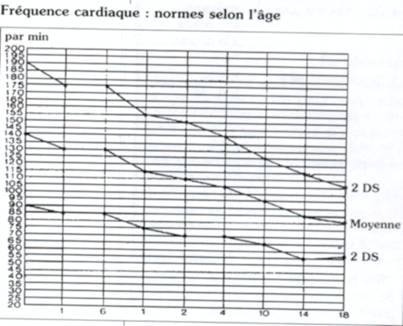

## I. La conscience

Toute baisse de la perfusion des organes (état de choc) va se traduire précocement par des troubles de l'état de vigilance du patient. Chez l'adulte cela va se traduire par une baisse de la conscience puis un coma plus ou moins profond. On va l'évaluer d'abord en appelant le patient (stimulation verbale) puis par des stimulations au niveau de la peau (stimulation nociceptive) comme par exemple un pince­ment de la peau au niveau du thorax. On peut chiffrer la profondeur de son coma par le score de Glasgow ci-dessous :

<table>

<tbody>

<tr>

<td style="width: 273px;" valign="top">

Ouverture des yeux :

Spontanée

A la parole

A la douleur

Nulle

</td>

<td style="width: 29px;" valign="top">

4

3

2

1

</td>

</tr>

</tbody>

</table>
<table>

<tbody>

<tr>

<td style="width: 271px;" valign="top">

Réponse verbale :

Orientée

Confuse

Inappropriée

Incompréhensible

Nulle

</td>

<td style="width: 28px;" valign="top">

5

4

3

2

1

</td>

</tr>

</tbody>

</table>
<table>

<tbody>

<tr>

<td style="width: 268px;" valign="top">

Réponse motrice :

Obéit à l'ordre

Localise la douleur

Retrait

Flexion

Extension

Nulle

</td>

<td style="width: 36px;" valign="top">

6

5

4

3

2

1

</td>

</tr>

</tbody>

</table>

_**Total sur 15**_

En dessous de 8/15, le coma est profond et on doit prendre des mesures de réanimation si c'est possible.

Chez l'enfant, les premiers troubles de la per­fusion cérébrale se traduisent le plus souvent par des alternances d'agitation (pleurs, cris) et de somnolence plus ou moins profonde. Un score de Glasgow a été adapté au nourrisson :

<table>

<tbody>

<tr>

<td style="width: 274px;" valign="top">

Ouverture des yeux :

Spontanée

A la parole

A la douleur

Nulle

</td>

<td style="width: 47px;" valign="top">

4

3

2

1

</td>

</tr>

</tbody>

</table>
<table>

<tbody>

<tr>

<td style="width: 277px;" valign="top">

Réponse verbale :

Babille

Iirritable

Pleurs/douleur

Gémit/douleur

Nulle

</td>

<td style="width: 40px;" valign="top">

5

4

3

2

1

</td>

</tr>

</tbody>

</table>
<table>

<tbody>

<tr>

<td style="width: 277px;" valign="top">

Réponse motrice :

Normale/spontanée

Retrait/toucher

Retrait/douleur

Flexion anormale

Extension anormale

Nulle

</td>

<td style="width: 40px;" valign="top">

6

5

4

3

2

</td>

</tr>

</tbody>

</table>

**_                                    Total sur 15_**

Outre la conscience, la baisse de la perfusion des organes (ou insuffisance circulatoire aigüe) peut également être évaluée par :

**La diurèse** qui doit être au minimum de :

*   1 ml/kg/heure chez le petit enfant de moins de 30 kg,
*   0.5 ml/kg/heure chez l'adulte et l'enfant de plus de 30 kg.

**Le temps de recoloration cutanée**

*   mesuré sous la plante du pied ou au niveau de la paume des mains.
*   on appuie sur la peau avec un doigt et on regarde le temps que met la peau à se recolorer.

Normal < 3 secondes, limite = 3 secondes, allongé et donc pathologique > 3 secondes.

## II. La fréquence cardiaque

Elle est le reflet du travail du cœur pour assurer la perfusion des organes vitaux. Elle est comp­tée au mieux avec un stéthoscope par ausculta­tion cardiaque sur une minute. La prise des pouls périphériques peut être beaucoup plus difficile surtout en situation instable où le pouls peut être difficile à capter (pouls dit "filant"). Une fréquence cardiaque rapide peut être le seul signe d'une difficulté circulatoire avant les signes d'hypo-perfusion des organes puis la chute de la tension artérielle. A l'inverse le coeur lent ou bradycardie accom­pagné d'autre signe de gravité peut être le signe d'un arrêt cardiaque imminent. Chez l'enfant et le nourrisson la fréquence cardiaque est fonction de l'age :

La mesure de la fréquence cardiaque est com­plétée par celle de la tension artérielle (cf cha­pitre spécifique). La tension artérielle chez l'enfant est également fonction de l'age.

## III. La fréquence respiratoire

Elle est le reflet du travail de ventilation et donc de la possibilité d'oxygénation des organes vitaux. Devant un patient inconscient il faut immédiatement s'assurer de l'existence de mouvements respiratoires : au mieux en auscultant le patient avec un stéthoscope. Si on ne dispose pas de stéthoscope, on se penche vers le patient pour voir si sa cage tho­racique se soulève puis on compte le nombre de mouvements respiratoires sur une minute. L'absence de mouvement respiratoire impose le démarrage immédiat des gestes de réanima­tion cardio-respiratoire de base.

La fréquence respiratoire est également fonction de l'âge : un nouveau né respire en moyenne à 40 par minute et un adulte à 15 par minute.

En cas de pathologie respiratoire (asthme, pneumopathie...) une fréquence respiratoire élevée signe la gravité de l'atteinte respiratoi­re. A l'inverse le ralentissement de la fréquen­ce alors que le patient semble ne pas aller mieux illustre que le patient est probablement en train de s'épuiser et qu'il risque de s'arrêter de respirer.

Conscience, travail cardiaque et travail respi­ratoire sont ainsi explorés en quelques gestes chez les patients, quel que soit leur âge. L'éva­luation initiale permet rapidement de savoir si le malade est à risque de décompensation vitale immédiate. Ces constantes vont ensuite permettre, lors de la surveillance, de détecter l'aggravation de la pathologie : ainsi un nour­risson atteint d'une infection pulmonaire qui passe de 40 à 70 par minute de fréquence res­piratoire est en train de s'aggraver de façon certaine (même si l'auscultation pulmonaire semble stable voire rassurante). Ces constantes sont donc indispensables à tout examen clinique et à toute surveillance des patients atteints de pathologies sévères.

_Développement et Santé, n°183, 2006_