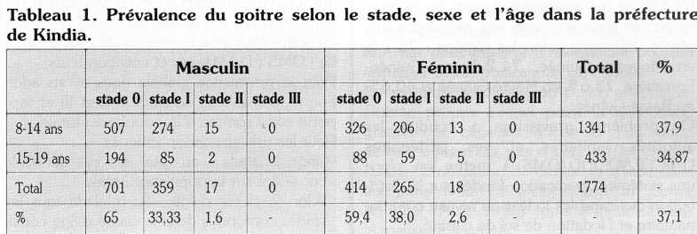
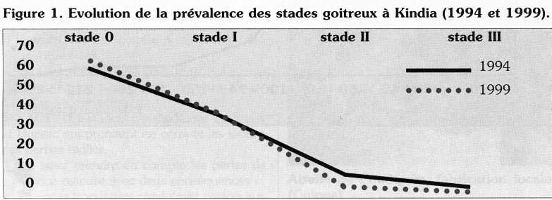
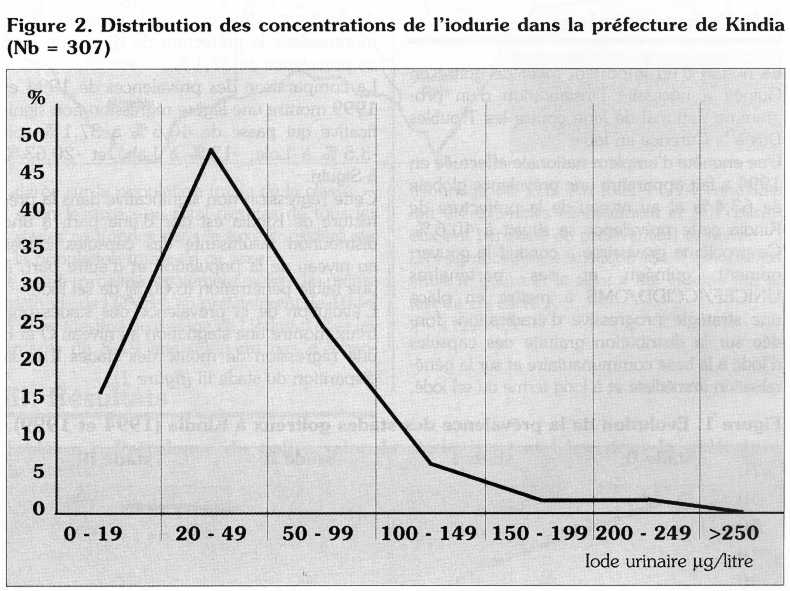

Les auteurs rapportent les résultats d'une étude transversale réalisée sous forme d'enquête par sondage en grappes de l'OMS. Au total 1 774 enfants de 8-1 9 ans ont bénéficié de l'examen clinique et 307 candidats de cet ensemble ont subi l'examen biologique. Tous sexes confondus, 1115 sujets (62,8 %) ont été trouvés non goitreux tandis que 37,1 % de sujets sont porteurs de goitre.

Il apparaît dans l'étude que le sexe féminin est plus touché (40,6 %) que le sexe masculin (34,9 %).

Les dosages de l'iodurie permettent de définir une médiane de 41microgrammes/l avec intervalle de confiance de 95 % compris entre 36 et 47microgrammes/l.

La comparaison des prévalences de 1994 et 1999 montre une légère régression de la prévalence totale qui passe de 40,6 % à 37,1 %.

## I. Introduction

Les Troubles Dus à la Carence en Iode (TDCI) constituent un problème de santé très important pour le cas de la République de Guinée, avec un taux de prévalence nationale de 63,4%, ce qui représente d'après les normes reconnues mondialement, une prévalence très sévère. Elle varie selon les régions : 76,1 % en Moyenne-Guinée, 74,2 % en Guinée Forestière, 7 3,6 % en Haute-Guinée et 40,6 % en Basse-Guinée.

Ce problème gravissime a conduit les autorités sanitaires et ses partenaires UNICEF/ICCIDD/OMS à mettre en place une stratégie d'éradication fondée sur la distribution des capsules iodées au niveau communautaire et l'iodation de sel de cuisine.

Dans le contexte qui vient d'être décrit, le but principal était d'évaluer la situation actuelle des TDCI dans la préfecture de Kindia après 3 années d'intervention.

## Il. Cadre et méthode de travail

### 1. Cadre de l'étude

L'étude a été réalisée dans la préfecture de Kindia située à 130 km de la capitale Conakry. On y dénombre 311 465 habitants qui appartiennent aux ethnies peul, malinké et soussou. L'alimentation de base fait appel au maïs, riz, fonio et au manioc. La préfecture fait partie de la Basse-Guinée (également appelée Guinée-littorale) et s'étend sur une superficie de 9 648 km2.

### 2. Méthode d'étude

Il s'agit d'une étude transversale réalisée sous forme d'enquête par sondage en grappes de l'OMS durant la période du 25/05/1999 au 6/06/1999. Le tirage au sort a désigné 30 grappes réparties sur l'ensemble de la préfecture. Les 9 sous-préfectures ont été représentées dans l'échantillonnage. Dans chaque grappe, 62 candidats de 8 -19 ans tous sexes confondus ont été choisis au hasard. Le stade du goitre était déterminé selon la classification de l'OMS ( De Maeyer et collaborateurs). Pour la prévalence globale nous avons additionné tous les cas de stade I, Il et III et rapporté cette somme à la population totale. Pour les prévalences spécifiques :

*   selon le stade : au total des cas du stade considéré sur la population totale
*   selon la classe d'âge : au total de tous les stades confondus dans la classe d'âge considérée sur la population totale de la classe.  
*   selon le sexe : au total des cas de tous les stades confondus dans le sexe considéré sur la population totale de ce sexe.

Il a été procédé également selon la même méthode de l'OMS à un prélèvement de 10 ml d'urine (destiné au dosage de l'iodurie) chez les enfants de 8-19 ans selon un pas d'échantillonnage de 1/6. Au total 1774 candidats ont été examinés cliniquement et 307 parmi eux ont bénéficié de prélèvement urinaire.

La signification statistique de l'association entre le goitre et le sexe a été étudiée par le test de chi-carré X2.

X2= 4,72 p < 0,05  

## III. Résultats

Une exploration plus détaillée de ce tableau permet de mettre en évidence les faits suivants :

*   La population indemne de goitre est de 1115 personnes soit 62,85 % de la population examinée.  
*   La population présentant le stade I (624/ 1774) tous sexes confondus constitue la fraction numérique la plus importante (35,2 %).  
*   Le stade Il occupe la seconde place avec un taux de 1,97 %. A ce stade, les filles sont 1,6 fois plus touchées que les garçons. Aucun cas de stade III n'a été notifié dans cette étude. Dans l'ensemble, les filles souffrent beaucoup plus de goitre (40,6 %) que les garçons (34,9 %).

La fraction sévèrement/modérément touchée inférieure à 49 _microgrammes_ /l représente 63,5 %, la fraction légèrement affectée se situe entre 50 - 99 microgrammes /l soit 26 %, le segment supérieur à 100 microgrammes /l est représenté par 33 personnes soit 10,7 %  

## IV. Commentaires

La notion d'un important foyer de goitre en Guinée a nécessité l'instauration d'un programme national de lutte contre les Troubles Dus à la Carence en Iode.

Une enquête d'ampleur nationale effectuée en 1994 a fait apparaître une prévalence globale de 63,4 % et au niveau de la préfecture de Kindia cette prévalence se situait à 40,6 %. Ce problème gravissime a conduit le gouvernement guinéen et ses partenaires UNICEF/ICCIDD/OMS à mettre en place une stratégie progressive d'éradication, fondée sur la distribution gratuite des capsules d'iode à la base communautaire et sur la généralisation immédiate et à long terme du sel iodé.

Après 3 ans d'intervention, la présente étude montre dans la préfecture de Kindia un taux de prévalence de 3 7, 1 %.

La comparaison des prévalences de 1994 et 1999 montre une légère régression non significative qui passe de 40,6 % à 37,1 % soit -3,5 % à Lola, -13 % à Labé et -20,63 % à Siguiri.

Cette régression non significative dans la préfecture de Kindia est due d'une part, à une distribution insuffisante des capsules iodées au niveau de la population et d'autre part, à une faible pénétration (6,60%) de sel iodé. L'évolution de la prévalence des stades goitreux montre une stagnation au niveau 0 et I, une régression de moitié des stades Il et la disparition du stade III _(figure 1)._

Il ressort également de l'étude que le sexe féminin est plus touché (40,6 % contre 34,9 % pour le sexe masculin). Cette prédominance féminine est due au fait que les besoins en iode sont accrus au cours des épisodes de la vie génitale : puberté, règles et grossesse.

Les dosages de l'iodurie permettent de définir une médiane située à 41 ?g /l avec intervalle de confiance à 95 % compris entre 36 et 47 microgrammes /l. Selon la classification de UNICEF/ICCIDD/OMS, la préfecture de Kindia se trouve dans la catégorie de déficience modérée.

## V. Conclusion

L'examen clinique de 1774 personnes dans la préfecture de Kindia a permis d'établir une prévalence de 37,1 %. Il existe une prédominance féminine à développer l'anomalie (40,6 % contre 34,9 % pour le sexe masculin).  
Par comparaison avec les données de 1994, on note une légère régression non significative de -3,5 %.  
Les dosages de l'iodurie permettent de définir une médiane située à 41 microgrammes /l avec intervalle de confiance de 95 % compris entre 36 et 47 microgrammes /l . Selon la classification de UNICEF/ICCIDD/OMS, la préfecture de Kindia se trouve encore dans la catégorie de déficience modérée. Si les mesures urgentes et efficaces ne sont pas prises à cet effet, cette catégorie risque d'évoluer vers la carence sévère.

_Développement et Santé, n°, 152, avril 2001_