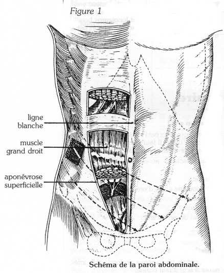
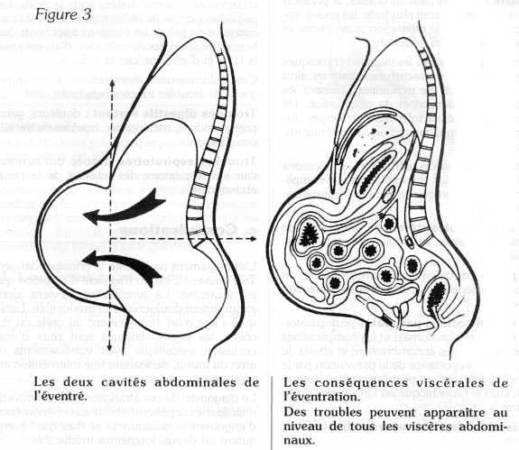
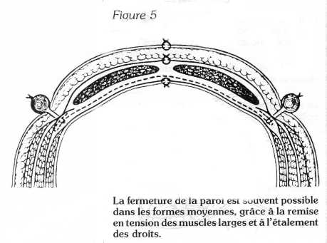

Il y a éventration lorsque les viscères de l'abdomen (grêle, côlon, épiploon), recouverts par le péritoine, font saillie à travers une déhiscence du plan musculo-aponévrotique de la paroi abdominale et sont palpés directement sous le revêtement cutané.

Ceci élimine du sujet les hernies, qui apparaissent au niveau des points de faiblesse de la paroi abdominale (hernie de l'aine) et les éviscérations postopératoires ou post-traumatiques, ou les viscères s'extériorisent à travers une brèche de toute la paroi, de façon généralement brutale.

Le terme d'éventration recouvre en fait deux affections différentes :

*   Les éventrations **spontanées,** qui sont en réalité un diastasis (écartement) anormal des muscles grands droits de l'abdomen, et que l'on rencontre surtout chez les femmes multipares.
*   Les éventrations **postopératoires** "incisionnal hemia " des anglophones ou **cicatricielles,** consécutives soit à une plaie de l'abdomen, plus souvent, à une laparotomie.

## **Anatomie pathologique**

### **Rappel anatomique**

Le _schéma n°_ 1 rappelle les différents plans qui constituent la paroi abdominale. Le plan musculaire, formé par les muscles grands droits, grands obliques, petits obliques et transverses, et leurs aponévroses, en sont les éléments les plus solides. La ligne blanche est un raphé tendineux très résistant situé sur la ligne médiane xypho-pubienne, entre les muscles grands droits. Elle est aussi le siège de la plupart des éventrations postopératoires.

Anatomiquement une éventration est formée par (_schémas n° 2 et 3) :_

- un revêtement cutané avec une cicatrice souvent élargie et amincie, une peau en mauvais état, fragile, parfois ulcérée ou surinfectée ;

- un plan musculo-aponévrotique soit très aminci, soit plus souvent, inexistant, formant le ou les orifices herniaires;

- un feuillet péritonéal, le sac hemiaire, souvent complexe avec plusieurs poches;

- les viscères faisant hernie, épiploon et intestin.

Selon leur siège, on distingue les éventrations latérales, moins fréquentes et moins graves que les éventrations médianes.

### **Evolution**

Une éventration peut survenir des mois ou des années après une intervention. Au début elle est souvent petite, discrète, et l'on serait tenté de la négliger et de rassurer le patient; mais dès ce stade, elle est susceptible de se compliquer d'étranglement.

Par ailleurs, une fois installée, elle a tendance à s'aggraver sous l'effet de la pression abdominale, et aussi de la traction des muscles latéraux. Elle augmente lentement de volume et devient irréductible car il se crée des adhérences (sac-paroi, sac-viscères, viscères entre-eux,) et les complications par étranglement sont fréquentes.

De plus, lorsque son volume devient très important, les viscères herniés perdent leur place dans l'enceinte abdominale et le traitement s'en trouvera compliqué.

Enfin, dans ces éventrations volumineuses et anciennes, les plans musculo-aponévrotiques sont distendus, affaiblis, rétractés dans les flancs, et la réparation pariétale devra se faire à l'aide de matériel prothétique (mersilène).

### **Causes des éventrations**

De nombreux facteurs peuvent, seuls ou en association, favoriser l'apparition d'une éventration après une laparatomie.

**Age :** la guérison des plaies est plus lente et les tissus cicatrisés moins solides chez les personnes âgées.

**Obésité :** chez les patients obèses, la pression intra-abdominale serait plus forte, les aponévroses moins solides, la réparation plus délicate et les hématomes plus fréquents.

**Les tares associées:** les maladies chroniques et débilitantes telles que cirrhose et cancers, ainsi que tous les états de dénutrition, freinent les processus de guérison et de cicatrisation. De même que les états infectieux prolongés (fistules qui s'accompagnent d'un catabolisme important.

**Le type d'incision utilisé :** les incisions médianes sont plus susceptibles de se compliquer d'éventration que les incisions transversales ou obliques.

**Les laparotomies itératives,** les orifices de drainages multiples, les emplacements de colostomies.

**Les plaies** par balles et par armes blanches en raison des dégats musculaires et de l'infection associée.

**Les complications pariétales** postopératoires (abcès ou hématomes) et les complications pulmonaires, avec encombrement et efforts de toux. D'où l'importance de la prévention par la kinésithérapie pré et postopératoire, notamment chez le bronchitique ou l'insuffisant respiratoire.

**Utilisation de fils non résorbables** mal tolérés.

### **Clinique**

**a. La petite éventration**

La douleur au niveau de la cicatrice est le principal symptôme. La palpation permet de repérer une petite tuméfaction sous-cutanée sensible, qui augmente à l'effort et à la toux. Par une pression douce on peut refouler cette petite masse dans l'abdomen et palper les berges de l'orifice d'éventration.

**b. L'éventration volumineuse**

Elle ne pose pas de problème diagnostique.

Il existe une importante voussure déformant la paroi abdominale, au niveau de la cicatrice de la laparotomie. Cette tuméfaction est irrégulière, arrondie, polylobée, donnant parfois l'impression de plusieurs hernies de taille variable juxtaposées, comme étalées sous la peau. La palpation permet de réduire partiellement cette hernie et de palper les contours tranchants des berges musculo-aponévrotiques, d'en mesurer la taille et d'en apprécier la solidité.

Ces volumineuses éventrations s'accompagnent de troubles fonctionnels multiples :

**Troubles digestifs surtout:** douleurs, gène post-prandiale, météorisme, troubles du transit, constipation.

**Troubles respiratoires,** dypnée, dus au mauvais jeu respiratoire des muscles de la paroi abdominale.

**c. Complications**

L'étranglement représente le principal danger. Très souvent c'est un fragment d'épiploon qui est incarcéré. La tuméfaction devient alors exquisément douloureuse et irréductible. Lorsqu'il s'agit d'un étranglement du grêle ou du côlon, les signes cliniques sont ceux d'une occlusion mécanique avec vomissements et arrêt du transit, nécessitant une intervention en urgence.

Le diagnostic de ces étranglements est souvent difficile chez ce patient habitué aux phénomènes d'engouement douloureux et chez qui l'éventration est depuis longtemps irréductible.

Les complications cutanées, ulcérations et surinfections, sont provoquées par la compression et la macération au niveau des plis.

## **Traitement**

**a. Bilan préopératoire**

**Antécédents chirurgicaux :** nature, date, protocoles des opérations chirurgicales subies. Éventuelles complications postopératoires.

**Terrain :**

*   Age, poids, tares associées, en particulier insuffisance respiratoire, qui va nécessiter une kinésithérapie pré-opératoire (apprendre à respirer, à tousser et cracher, arrêt du tabac) ou un amaigrissement chez l'obèse.
*   État de la peau qui peut aussi nécessiter un traitement: assèchement des lésions suintantes et surinfectées (éosine aqueuse, bétadine diluée, mitosyl), traitement d'une mycose des plis.
*   Bilan des troubles du transit (parasitoses, radiographies par lavement baryté pour dépister une tumeur).

**b. Méthodes**

Le traitement sera presque toujours chirurgical et doit être aussi précoce que possible dès que le diagnostic a été fait.

Les méthodes non chirurgicales, comme la contention par bandage élastique ne sont que palliatives, temporaires et réservées aux patients présentant une contre-indication chirurgicale absolue. En effet elles ne préviennent pas vraiment du risque d'étranglement.

### **1.** **Les petites éventrations**

Elles peuvent être traitées par une intervention chirurgicale simple qui comprend les temps suivants _(figure 4) :_

- reprise de l'ancienne incision,

- dissection du sac herniaire,

- réduction du contenu du sac et libération d'éventuelles adhérences,

- réparation pariétale minutieuse plan par plan au fil à résorption lente (vicryl), ou non résorbable.

### **2. Les volumineuses éventrations**

**La préparation préopératoire :** Lorsque le volume de la hernie est tel que l'on craint des difficultés de réintégration (impossibilité mécanique, gêne respiratoire), il faut réaliser une série de pneumopéritoines préopératoires de façon à augmenter l'espace intrapéritonéal et à élever le diaphragme (un à deux litres d'air stérilisé à la flamme, tous les deux jours, introduits par une aiguille de Palmer au niveau de la fosse iliaque gauche). La préparation par kinésithérapie respiratoire est ici particulièrement nécessaire.

**L'anesthésie:** Si possible, en fonction du siège de l'éventration, on fera une anesthésie locorégionale (rachianesthésie ou péridurale) qui donne un bon relâchement musculaire, et est très sûre. Si l'on a recours à l'anesthésie générale, il faut prévoir une intubation trachéale avec un bon relâchement musculaire.

**Technique chirurgicale :** L'ancienne cicatrice et les tissus sous-jacents sont réséqués. Le sac péritonéal est disséqué minutieusement des plans aponévrotiques et musculaires. Ce temps peut être très long si l'éventration est complexe et faite de multiples sacs herniaires qui doivent tous être enlevés. Le sac est ensuite ouvert et les adhérences intrapéritonéales sont libérées minutieusement et complètement et les viscères sont replacés dans la cavité abdominale.

Les berges musculo-aponévrotiques sont parfaitement repérées et disséquées de façon à présenter de chaque côté des tissus sains et solides. L'hémostase doit être méticuleuse pour éviter les hématomes postopératoires. Le sac péritonéal est réséqué en gardant suffisamment de tissu pour la fermeture. Lorsque l'éventration n'est pas trop importante, il est possible de suturer les berges aponévrotiques soit bord à bord, soit en "paletot" pour renforcer le plan aponévrotique superficiel.

Si les plans musculo-aponévrotiques paraissent trop faibles ou s'ils ne peuvent être rapprochés sans tension, il faut utiliser une prothèse de tissu synthétique (mersilène). Ce mince filet de dacron, très résistant et très bien toléré, est placé entre le plan péritonéal et le plan aponévrotique. Ces "plaques" de mersilène (ou autre) ne doivent être utilisées que lorsque toutes les conditions d'asepsie sont réunies (pas d'abcès de paroi). Leur utilisation nécessite une bonne expérience de cette chirurgie (_figure_ _5)._

L'intervention se termine le plus souvent par un drainage aspiratif (drain de Redon).

### **3. Les suites opératoires**

Dans les suites, il faut encourager le lever précoce le lendemain de l'opération, la kinésithérapie respiratoire. De strictes précautions d'asepsie sont nécessaires au niveau des drains et des pansements, surtout si une prothèse a été posée. Les drains sont retirés dès qu'ils ne donnent plus. Un traitement antibiotique bref est entrepris au début de l'intervention et pour 24 ou 48 heures.

**Conclusions**

L'éventration représente une complication fréquente de la chirurgie abdominale et de la traumatologie abdominale. C'est une affection invalidante et dangereuse dont le traitement est chirurgical. La réussite de celui-ci repose sur :

- une intervention précoce,

- une préparation méticuleuse,

- un geste chirurgical complet utilisant si nécessaire une prothèse synthétique.

_Développement et Santé, n°88, août 1990_