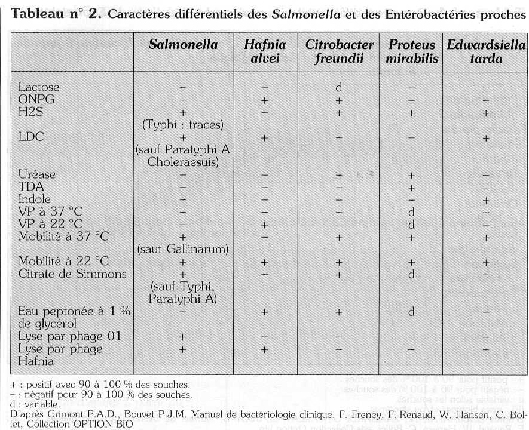
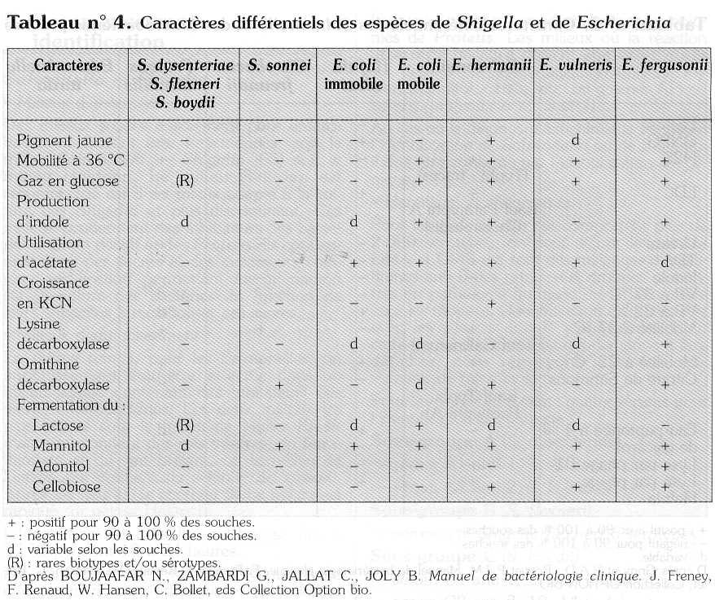
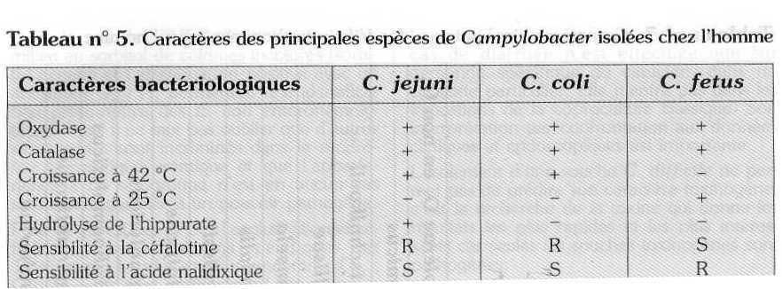
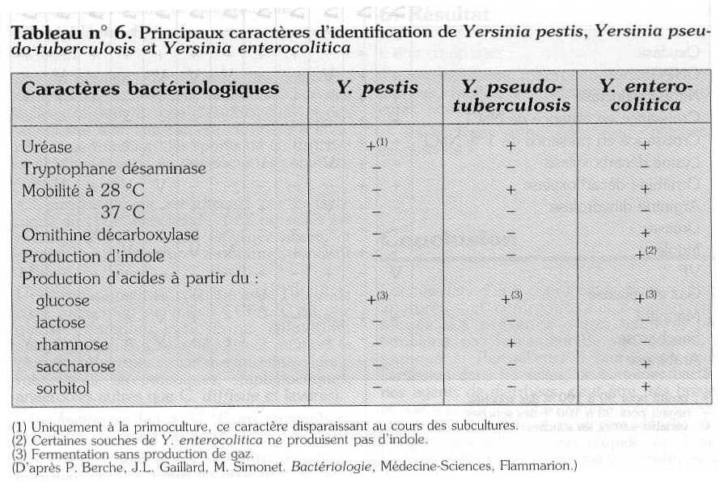
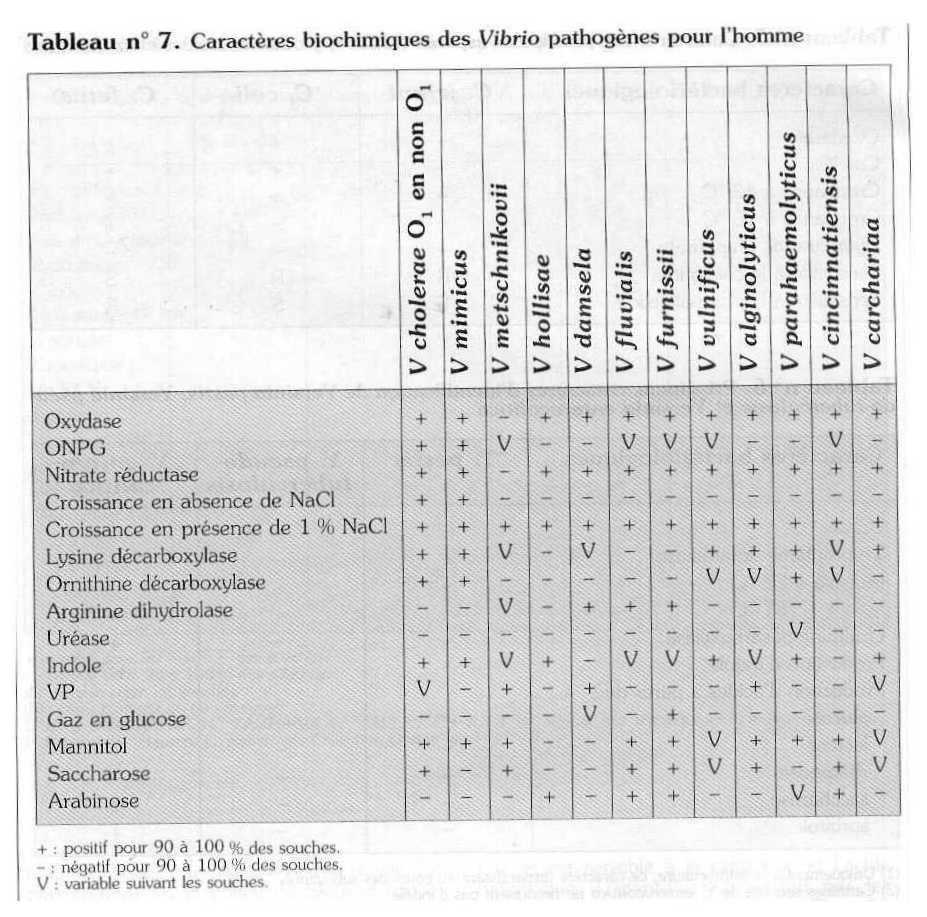
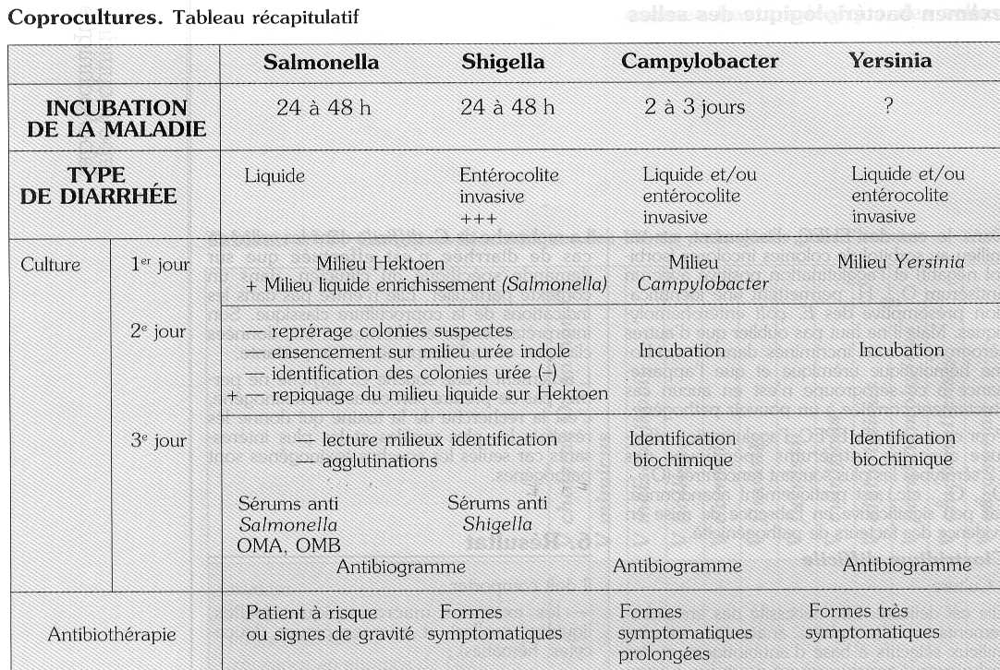

L'examen bactériologique des selles se fait par coproculture, c'est-à-dire par ensemencement des selles sur des milieux de culture appropriés. Le but est de rechercher parmi une flore commensale très abondante soit des bactéries habituellement absentes et réputées pour leur pouvoir pathogène, soit une espèce bactérienne anormalement prédominante.

Les indications de la coproculture sont triples :

- la recherche de la cause infectieuse d'une diarrhée, qui est la plus fréquente,
- le dépistage des porteurs sains pour les métiers de l'alimentation,
- les enquêtes épidémiologiques.

Dans le cas des diarrhées infectieuses, les bactéries à rechercher systématiquement sont *Salmonella, Shigella, Campylobacter* (et Yersinia dans les pays industrialisés).

*Vibrio cholerae* est le plus souvent recherché dans un contexte clinique particulier ou sur une demande spécifique. Les *Escherichia* coli pathogènes ne peuvent actuellement être totalement identifiés que dans des centres spécialisés (Instituts Pasteur). *Clostridium difficile* est recherché dans les diarrhées aiguës consécutives à une antibiothérapie importante.

### 1. Prélèvement

- Une noix de selles, dans un récipient stérile.
- Examen dans les 4 heures (conservation maximale 8 heures à 4°C).

### 2. Fiche de renseignements cliniques

Elle est demandée dans les pays industrialisés de façon à orienter judicieusement les recherches en fonction des renseignements suivants

- Âge.
- Signes cliniques : fièvre, douleurs, vomissements.
- Origine géographique ou voyage récent.
- Antibiothérapie.
- Cas de diarrhée dans l'entourage.

Elle est plus difficile à obtenir dans les pays en développement, mais une fiche même succincte est utile.

### 3. Examen macroscopique

- Noter l'aspect de la selle : purulent, présence de mucus, présence de sang.
- Sa consistance : liquide, molle, moulée.

### 4. Examen microscopique

Pour les selles liquides, on travaillera directement sur la selle.  
Pour les selles moulées, il faudra faire une suspension à 10 % dans du soluté de NaCI à 9 p. 1000.

Observer les selles à l'état frais (entre lame et lamelle) et noter la présence de :

- leucocytes ;
- hématies ;
- bactéries très mobiles (Vibrio).

Observation des selles après coloration de Gram :

- évaluer le pourcentage de bactéries Gram + et Gram -;
- rechercher les aspects caractéristiques *(Campylobacter, Vibrio).*

Cet examen est très important et ne doit jamais être omis. Il permet de rechercher les leucocytes qui, en quantité supérieure à 5 par champ, sont le signe d'une diarrhée à germe invasif, de même que la présence d'hématies. Il permet de voir aussi si la flore est équilibrée entre bactéries à Gram positif et à Gram négatif (environ 60 % de bactéries Gram -, et 40 % de bactéries Gram +, dans une selle normale).

### 5. Ensemencement, identification

***Salmonella - Shigella***

- Milieux d'isolement

Des milieux solides d'isolement pour entérobactéries doivent être ensemencés, soit le milieu Salmonella - Shigella (SS), soit le milieu Hektoen. Le milieu Hektoen est recommandé car il est mieux adapté à la culture des *Shigella* et plus discriminant. Ces milieux contiennent des inhibiteurs des bactéries à Gram positif et des Proteus. Ils contiennent aussi des sucres et des indicateurs colorés d'acidification, permettant une orientation sur la nature des bactéries en fonction de leurs capacités à métaboliser ces sucres.

- Milieux d'enrichissement

En même temps, pour les Salmonelles, un enrichissement doit être effectué dans un milieu liquide contenant des inhibiteurs des autres entérobactéries. Les deux milieux les plus utilisés sont le milieu de Muller Kauffmann qui contient des sels biliaires, du tétrathionate et du vert brillant, ou le milieu de Leifson qui contient du sélénite de sodium. Après 24 heures, le contenu de ce milieu est repiqué sur gélose Hektoen.

L'incubation de tous les milieux se fait à 37° C pendant 18 à 24 heures.

Les milieux Hektoen ou SS doivent ensuite être observés avec attention et les colonies suspectes (*tableau n° 1*), 5 au moins, doivent être repiquées sur des milieux urée indole.

Une urée positive permet d'éliminer les colonies de Proteus. Les milieux où la réaction urée reste négative doivent être ensemencés sur des galeries d'identification (milieux Kligler, mannitol, citrate, etc. ou galeries API ou autres) (*tableaux* *n° 2, 3* et *4*).

Au cas où le diagnostic biochimique conduit à l'identification de Salmonella ou de *Shigella,* il doit être confirmé par l'identification antigénique.

- Identification antigénique

Pour les Salmonella qui comportent plus de 2000 sérotypes, on peut utiliser les sérums OMA et OMB qui sont des mélanges d'agglutinines anti 0 des principaux groupes rencontrés en pathologie humaine. Si le laboratoire en a les moyens, l'identification est poursuivie avec les sérums anti 0 monovalents. Pour cette partie du diagnostic qui demande à être détaillée, nous renvoyons le lecteur aux manuels de microbiologie.

Pour les Shigella, il existe quatre sérums pour l'identification antigénique :

**Sous-groupe A** *(S. dysenteriae)*

- sérum A1 anti 1, 3, 4, 5, 6 (indole -)

- sérum A2 anti 2, 7, 8 (indole +)

**Sous-groupe B** *(S. flexneri)*

- sérum anti *Shigella flexneri* 6 sérotypes

**Sous-groupe C** *(S. boydii)*

- sérum C1 anti 1, 2, 3, 4 (indole -)

- sérum C2 anti 8, 10, 14 (indole -)

- sérum C3 anti 5, 7, 9, 11, 15 (indole +)

**Sous-groupe D** *(S. sonnei)*

- sérum D

Dans de nombreux pays, les souches de *Salmonella* et *Shigella* isolées doivent être adressées à un Centre de Référence, qui collecte les données épidémiologiques (Institut Pasteur).

***Campylobacter jejuni***

L'ensemencement se fait sur des milieux contenant des antibiotiques pour inhiber la plupart des bactéries de la flore intestinale. Le plus courant est le milieu de Skirrow contenant Vancomycine, Polymyxine et Triméthoprime.

L'incubation a lieu à 42° C en atmosphère microaérophile (correspondant au mélange oxygène 5 %, gaz carbonique 10 %, azote 85 %). Cette atmosphère peut être obtenue de façon simple avec des sachets à réhydrater extemporanément : Anaerocult C mini, (Merck) ou en jarre anaérobie (Campypack biomérieux, ou Gaspak anaérobie biomérieux sans catalyseur) ou autres réactifs du même type.

L'incubation doit durer 48 heures pour obtenir des colonies visibles. Les colonies sont petites, brunâtres, elles peuvent être muqueuses ou en voile.

*C. jejuni* est un petit bacille Gram négatif fin, spiralé, très mobile avec des formes en S, en longues spires ou en vol de mouettes. Il est catalase + et oxydase +. Il hydrolyse l'hippurate et est sensible à la céfalotine et l'acide nalidixique. L'identification se fait par les caractères biochimiques (*tableau n° 5*).

***Yersinia enterocolitica***

Ces bactéries peuvent être isolées sur milieu Hektoen si on les observe après 48 heures. Les colonies sont petites, de diamètre < 1 mm. Il est mieux d'utiliser un milieu sélectif, le milieu de Schieman, contenant de la Cefsulodine, de la Novobiocine et de l'Irgasan. Après 24 heures d'incubation à 30° C, les colonies sont rouge sombre, d'un diamètre < 2 mm. L'identification biochimique est nécessaire car d'autres bactéries peuvent se développer avec des colonies un peu plus grosses mais d'aspect voisin. Elle peut se faire en galerie Api 20 E *(tableau n° 6).*

***Vibrio cholerae***

Dans les cas de choléra, l'examen direct montre une flore constituée uniquement de vibrions. Pour la recherche de porteurs sains, l'examen direct n'est pas nécessaire.

- Enrichissement : L'ensemencement se fait à partir des selles : un tube d'eau peptonée alcaline et un tube d'eau peptonée alcaline salée sont utilisés comme milieux d'enrichissement. Il faut ensuite incuber pendant 3 à 6 heures à 37° C, puis prélever une dose de la culture en surface et ensemencer un second tube d'eau peptonée alcaline, salée ou non, ainsi qu'un milieu sélectif gélosé TCBS (thiosulfatecitrate-bile-sucrose-agar) et les incuber une nuit à 35° C.

On doit ensemencer également avec les selles un milieu gélosé TCBS et l'incuber une nuit à 35° C.

Sur gélose TCBS, les colonies de *Vibrio cholerae* sont jaunes, plates, de 2 à 3 mm de diamètre, oxydase positive.

L'identification est faite par les caractères biochimiques (galerie API 20 E ou autre) *Tableau n°* 7, et par agglutination avec les sérums anti-*Vibrio cholerae* anti 01 et anti 0139, à partir de colonies repiquées sur gélose nutritive.

Pour la détermination de la sensibilité au composé vibriostatique 0/129, ensemencer un milieu gélosé Mueller-Hinton sur toute la surface de la boîte et déposer un disque de composé. Après 24 heures à 37° C la crois sance de *Vibrio cholerae* est inhibée (diamètre > 15 mm).

***Escherichia coli***

*Escherichia coli* comme toutes les entérobactéries ne présente pas d'exigences particulières de culture. Il se développe sur les milieux SS et Hektoen. Pour l'isolement à partir d'une selle, des milieux peu inhibiteurs comme la gélose Mac Conkey (biomérieux) ou la gélose Drigalski (Pasteur diagnostics) sont recommandés. L'identification repose sur les tests biochimiques classiques *(tableau n° 4).*

Une diarrhée à *E. coli* pathogène sera soupçonnée devant une selle monomorphe ne présentant que des bacilles à Gram négatif à l'examen direct et donnant une culture pure *d'E. coli.*

Au niveau des selles la différenciation entre *E. coli* commensaux et pathogènes se fait par la mise en évidence des facteurs de pathogénicité : toxines, facteurs d'adhésion ou même gènes codant pour ces différents éléments. Dans quelque temps, grâce au développement de techniques de biologie moléculaire, ces diagnostics pourront être effectués dans les laboratoires cliniques. Actuellement, ils ne peuvent être effectués que dans des centres très spécialisés.

Dans le cas des EHEC (Entérohémolytic E. coli ), l'isolement sur un milieu au sorbitol de colonies incolores (sorbitol négatif) et l'agglutination positive avec un antisérum O157 H7 permettent une identification présomptive. Mais il ne faut pas oublier que d'autres sérogroupes sont incriminés dans le syndrome hémolytique urémique et que l'appartenance à ce sérogroupe n'est en aucun cas strictement corrélée à un pouvoir pathogène.

Pour ce qui est des EPEC (Enteropathogenic E. coli), l'agglutination effectuée avec les antisérums spécifiques des 12 sérotypes les plus souvent rencontrés (O1,11, O55, O26 etc.) est pratiquement abandonnee, car peu significative en l'absence de mise en évidence des facteurs de pathogénicité.

***Clostridium difficile***

- Culture

Elle est délicate. Elle nécessite des ensemencements en atmosphère anaérobie, sur des milieux sélectifs à base d'antibiotiques et des techniques d'enrichissement destinées à favoriser la germination des spores de *C. difficile* et éliminer une partie des bactéries commensales.

- L'enrichissement est effectué par la technique du choc alcoolique : 1 ml de selles est mélangé à 1 ml d'alcool éthylique absolu et incubé à température ambiante pendant 1 heure.

L'ensemencement est effectué avec 100 ml de cette suspension sur milieu CCFA. C'est une gélose contenant cyclosérine, cefoxitine, amphotéricine B. Ces antibiotiques inhibent la plupart des germes de la flore intestinale (entérobactéries, streptocoques, staphylocoques, anaérobies autres que *C. difficile* et levures).

L'incubation se fait à 37° C en atmosphère anaérobie, pendant 36 heures.

Les colonies sont grises, à bords irréguliers, mesurent de 1 à 3 mm de diamètre et dégagent une forte odeur fétide caractéristique, évoquant le crottin de cheval. Ce sont des bacilles à Gram (+). Sous U.V. à 360 nm, les colonies présentent une fluorescence verte. L'identification complète est réalisée par des tests biochimiques (Galeries API anaérobies ou autres).

- Mise en évidence des toxines

La méthode de référence est la mise en évidence de l'action de la cytotoxine B sur des cultures cellulaires. Elle nécessite 48 heures et ne peut être effectuée que dans les centres spécialisés. Ces dernières années des réactifs ont été commercialisés pour une détection directe des toxines A ou B sur les selles par des méthodes ELISA. Ces méthodes sont simples, rapides et fiables mais restent assez onéreuses.

La recherche de *C. difficile* dans les selles en cas de diarrhée n'est effectuée que sur demande spécifique du clinicien, dans un contexte particulier. Elle n'entre pas dans les indications de la coproculture classique. Son interprétation par confrontation aux données cliniques et endoscopiques est importante.

L'isolement d'une souche *C. difficile* ne permet pas de prédire son caractère toxinogène, c'est la recherche de la toxine qui donne les résultats les plus rapides et les plus intéressants car seules les souches toxinogènes sont pathogènes.

### 6. Résultat

Il doit comporter

- les examens macroscopiques (selles, liquides, molles) et microscopiques (leucocytes, hématies) ;

- les bactéries recherchées avec "présence ou absence".

### Conclusion

Les résultats d'une coproculture doivent être interprétés et confrontés aux données cliniques. La présence d'une bactérie ne témoigne pas forcément de son caractère pathogène. Par ailleurs il faut savoir que l'émission dans les selles, de certaines bactéries agents de diarrhées, peut être très brève et que souvent les coprocultures sont réalisées trop tard. En effet, il peut être difficile de recueillir des selles en cas d'épidémie. Il ne faut pas oublier également que de nombreuses diarrhées ont une origine virale, expliquant alors la négativité des cultures bactériennes.

Le résultat complet d'une coproculture ne peut être donné, dans les meilleures conditions que le troisième jour suivant le prélèvement. La mise en route du traitement se fait avant, et peut être orientée par les premières indications données par l'examen direct.

L'étude bactériologique des selles est un examen techniquement délicat. Le prélèvement doit être fait et conservé dans de bonnes conditions. Les milieux de cultures doivent être de bonne qualité, et de préparation récente. Le non-respect des conditions opératoires peut conduire à des résultats faussement négatifs. Elle nécessite un laboratoire de bactériologie bien équipé, disposant de tout le matériel pour réaliser des cultures et d'un personnel entraîné.

Pour toutes ces raisons l'étude bactériologique des selles ne peut être effectuée dans tous les cas de diarrhée, mais elle a un intérêt épidémiologique important, indispensable en santé publique. C'est le seul moyen d'isoler et d'identifier de façon fiable les bactéries responsables des grands syndromes diarrhéiques. C'est aussi le seul moyen de connaître et de surveiller leur sensibilité aux antibiotiques au niveau de chaque région, à notre époque où l'on assiste malheureusement, à l'émergence d'une grande résistance aux antibiotiques parmi ces agents infectieux.

*Développement et Santé, n° 128, avril 1997*
