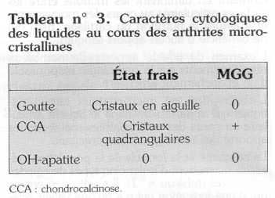
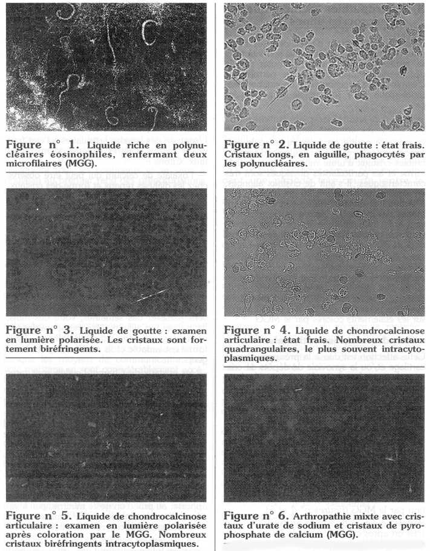

**Examen cytologique du liquide articulaire**

**par Jacques Amouroux**

Service central d'anatomie et de cytologie pathologiques, hôpital Avicenne, Bobigny, France.

L'examen cytologique du liquide articulaire est un geste simple qui peut, devant toute arthropathie avec épanchement, renseigner sur sa nature et préciser, en particulier, si la lésion est " inflammatoire " ou "mécanique", ce qui constitue déjà pour le médecin une étape intéressante. C'est dans le groupe des arthropathies métaboliques, représenté surtout par la goutte et la chondrocalcinose, que cet examen aura une valeur diagnostique déterminante en montrant directement les microcristaux intra-articulaires responsables de l'inflammation. Dans ces pathologies qui sont fréquentes l'examen du liquide permet, en règle, un diagnostic rapide, précis et fiable.

**I. Introduction**

Le liquide articulaire est normalement présent en très petite quantité dans chaque cavité articulaire. Son rôle est double : il agit comme lubrifiant en diminuant les frictions entre les surfaces articulaires au cours des mouvements et il assure la nutrition du cartilage, tissu qui ne bénéficie d'aucun apport sanguin.

L'examen du liquide apporte de nombreux renseignements sur la pathologie responsable d'un épanchement articulaire.

L'observation de microcristaux caractéristiques qui apparaissent dans le liquide articulaire au cours des arthropathies métaboliques apporte des renseignements précieux.

La cellularité et la formule de la population cellulaire permettent d'isoler cinq types de liquides articulaires (_tableau n° 1_). Il s'agit, bien entendu, d'une indication qui n'a qu'une valeur relative mais qui est précieuse pour le clinicien.

Le liquide articulaire normal est transparent, clair ou jaunâtre. Il devient plus opaque quand augmente la cellularité.

Sa viscosité est en rapport avec la teneur du liquide en acide hyaluronique. Elle est élevée dans un liquide normal ou non inflammatoire. Elle s'apprécie aisément en étirant une goutte de liquide entre deux doigts protégés par un gant ou des doigtiers et en mesurant la longueur du filament ainsi formé. Dans tous les liquides inflammatoires la viscosité diminue.

La formation d'un caillot est le propre des liquides pathologiques. En effet, le liquide synovial normal est dépourvu de fibrinogène et ne coagule donc pas. En revanche, tout liquide pathologique, surtout s'il est inflammatoire, contient de la fibrine et forme un caillot dont les mailles enserrent les éléments cellulaires. Il est donc essentiel d'éviter la coagulation du liquide par l'emploi d'anticoagulants.

**Il. Technique**

**1. Recueil du liquide**

Toute articulation peut être ponctionnée car l'examen n'exige qu'une quantité infime de liquide. A la limite, une goutte suffit pour un examen à l'état frais. Le liquide est recueilli dans un tube de plastique stérile. L'emploi d'un anticoagulant est indispensable. Le meilleur choix est l'héparinate de sodium ; l'oxalate de calcium et l'héparinate de lithium doivent être proscrits car ils renferment des microcristaux qui sont d'autant plus trompeurs qu'ils peuvent être phagocytés par les polynucléaires.

Pour la même raison, il est souhaitable d'utiliser des lames soigneusement dépoussiéré et d'éviter le dépôt sur les lames ou dans le liquide de particules diverses comme, par exemple, le talc ou l'amidon qui lubrifient les gants.

**2. Examen à l'état frais**

Cette étape, la plus importante, consiste à déposer, le plus rapidement possible après le prélèvement, une goutte (0,05 ml) de liquide articulaire sur une lame, à la couvrir d'une lamelle et à l'examiner sans délai. La centrifugation est inutile car un liquide peu cellulaire est rarement pathologique. L'identification des cristaux est parfois difficile et exige un matériel optique de qualité. Un dispositif de polarisation avec, éventuellement, un compensateur et une platine tournante permet de voir plus aisément les microcristaux, en particulier s'ils sont peu nombreux.

À défaut de dispositif de polarisation, l'examen peut être réalisé en fermant fortement le diaphragme de luminosité, ce qui met en évidence les éléments qui ont un indice de réfraction différent de celui des constituants cellulaires.

On peut compléter cet examen par une numération cellulaire à la cellule de Malassez qui constitue un élément important pour déterminer la nature et l'arthropathie _(tableau n° 2)._

Si l'examen immédiat est impossible il peut être différé - jusqu'à 24 heures, à condition de conserver le liquide à 4 °C ou, mieux encore, au congélateur à - 20 °C. Il est également possible de faire des étalements séchés à l'air ou des cytocentrifugations. Les cristaux persistent sur les lames qui peuvent être examinées secondairement soit directement, à l'état sec, en lumière polarisée, soit après coloration par le May Grünwald Giemsa (MGG).

**3. Coloration par le MGG**

L'examen à l'état frais est utilement complété par la coloration par le MGG après cytocentrifugation qui permet de préciser, dans les meilleures conditions, la nature des cellules présentes dans le liquide articulaire.

**III. Résultats**

L'examen cytologique du liquide articulaire est un élément utile aux cliniciens pour orienter le diagnostic vers l'une ou l'autre des nombreuses affections articulaires dont le patient peut souffrir. Pour les arthropathies métaboliques ou microcristallines, cet examen constitue l'élément-clé du diagnostic (_tableau n° 3)._

**1. Arthrites infectieuses**

L'examen cytologique montre une très grande richesse cellulaire avec une forte proportion de polynucléaires, souvent altérés. Si l'infection est torpide ou décapitée par les antibiotiques, les polynucléaires sont moins nombreux et la preuve de l'infection repose sur l'examen bactériologique du liquide ou l'examen histologique d'une biopsie de synoviale. Si la cytologie est riche en polynucléaire éosinophiles, il est indispensable de rechercher la présence de microfilaires _(figure n° 1)._

**2. Rhumatismes inflammatoires**

Là encore, la cellularité est importante et les polynucléaires sont les plus nombreux. Ce groupe d'affections n'a pas de profil cytologique particulier et aucun fait précis n'oriente vers un rhumatisme particulier. On peut seulement dire que statistiquement le liquide est plus inflammatoire dans la polyarthrite rhumatoïde et les arthrites réactionnelles (syndrome de Fiessinger-Leroy-Reiter) que dans la polyarthrite lupique, la pelvispondylite rhumatismale ou le rhumatisme psoriasique.

**3. Arthropathies métaboliques** **ou microcristallines**

C'est dans ce groupe d'affections que l'examen du liquide articulaire trouve son intérêt et sa justification. Il convient de noter que la découverte de microcristaux ne permet pas d'éliminer une infection et qu'un examen bactériologique reste souhaitable dans tous les cas.

*   **Goutte**

La crise de goutte est toujours liée à la présence dans la cavité articulaire d'innombrables cristaux d'urate monosodique dont la forme et les particularités physiques sont très caractéristiques. Il s'agit de cristaux allongés, en aiguille, mesurant 5 à 20 µm de longueur, à extrémités effilées, transperçant les membranes cellulaires. Le liquide est le plus souvent très inflammatoire et particulièrement riche en polynucléaires neutrophiles (_figures n° 2 et 3)._

Des cristaux très petits (1 à 2 µm) peuvent se voir dans les épanchements asymptomatiques persistants au décours d'une attaque de goutte. Ils sont alors souvent extracellulaires. Les cristaux d'urate de sodium, solubles dans l'eau, ne persistent que de façon inconstante sur les étalements colorés par le MGG.

*   **Chondrocalcinose articulaire**

Cette affection est due à la présence dans le cartilage et/ou la synoviale de dépôts de cristaux de pyrophosphate de calcium dihydraté dont la libération entraîne une symptomatologie variable allant de la crise pseudogoutteuse pour la forme la plus aiguë à des signes simulant un rhumatisme inflammatoire ou une arthrose. La mise en évidence, dans le liquide articulaire, des microcristaux responsables est une des clés du diagnostic. Il s'agit de cristaux de 5 à 10 µm de long, intraleucocytaires, en forme de parallélépipède droit ou oblique. Leur biréfringence est moindre que celle des cristaux d'urate. Ces cristaux sont peu solubles dans l'eau et persistent après coloration par le MGG (_figures_ _n° 4 et 5)._

Parfois l'examen du liquide articulaire à l'état frais ou après coloration par le MGG montre à la fois des cristaux d'urate et de pyrophosphate. Ces arthropathies mixtes ne sont pas exceptionnelles (_figure_ _n° 6)._

*   **Arthropathies à phosphate de calcium**

Chez certains patients, souffrant souvent de calcifications tendineuses multiples, en particulier de la coiffe des rotateurs de l'épaule, peuvent se développer des arthropathies destructrices et des signes d'inflammation synoviale. Ces derniers sont liés à la présence dans le liquide articulaire de microcristaux appartenant à différentes formes de phosphate de calcium. La plus fréquente est l'hydroxyapatite, mais on peut trouver également du phosphate octacalcique et tricalcique. Ces cristaux mesurent 0,l à 0,2 µm de long et sont donc invisibles au microscope optique.

*   **Autres microcristaux**

L'examen des liquides articulaires à l'état frais révèle parfois d'autres variétés de microcristaux. Citons :

- l'oxalate de calcium qui peut être observé chez les dialysés rénaux et forme des cristaux, tantôt pyramidaux et faciles à reconnaître, tantôt irréguliers ou en forme de bâtonnets qui peuvent être confondus avec le pyrophosphate de calcium ;

- le cholestérol forme des cristaux de grande taille, rectangulaire, aplatis, avec souvent un coin encoché. On les observe dans les polyarthrites rhumatoïdes vieillies ou dans les bursites ;

- les dérivés cortisoniques, introduits dans l'articulation dans un but thérapeutique, peuvent persister des semaines, voire des mois. Ils peuvent d'ailleurs être responsables de véritables arthrites microcristallines. Leur forme est variable et ils sont toujours biréfringents :

- les cristaux de Charcot-Leyden sont rares et peuvent s'observer dans les liquides riches en polynucléaires éosinophiles. Leur forme est celle d'une aiguille de boussole, faiblement biréfringente.

**IV. Conclusion**

L'examen cytologique du liquide articulaire apporte, au prix d'un geste minime, peu invasif, et d'une technique rapide deux éléments diagnostiques particulièrement intéressants :

- la richesse en cellules est un reflet fidèle du caractère inflammatoire d'une arthropathie,

- la présence ou l'absence de microcristaux permet d'affirmer ou d'éliminer, en quelques minutes, une arthropathie microcristalline, manifestation habituelle et souvent bruyante d'une arthropathie métabolique et d'en préciser la nature.

_Développement et Santé, n°142, août 1999_