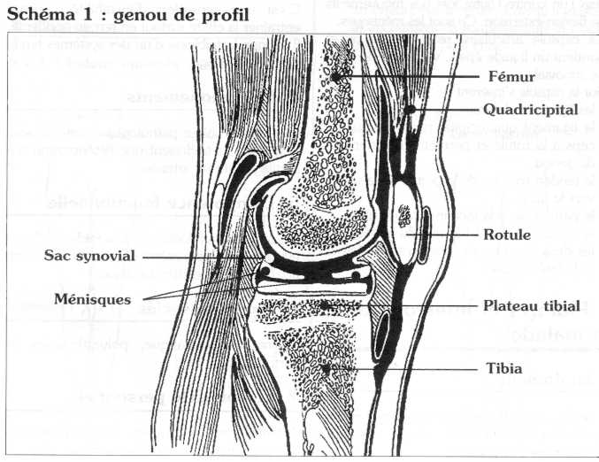
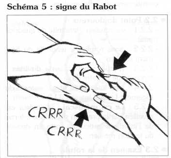
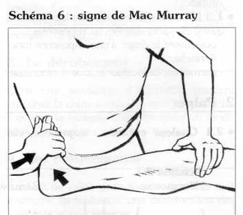
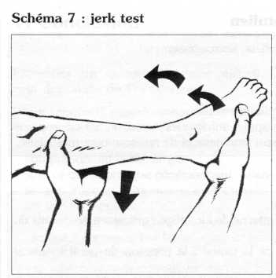

Examiner un genou douloureux est une démarche diagnostique complexe qui implique :

<ul>
<li>un interrogatoire recherchant plusieurs informations : caractéristiques de la douleur, (appelée gonalgie), signes particuliers, signes généraux ou à distance;</li>
<li>un examen orientant vers divers syndromes (entorse, lésion méniscale, arthrose ... ) ;</li>
<li>de tenir compte d'atteintes loco-régionales (sciatique);</li>
<li>de considérer le genou comme l'élément d'un tout (la gonalgie déséquilibre la statique de tout le squelette, à l'inverse, une attitude scoliotique accentue le poids du corps sur un genou). Cette souffrance va agir sur la vie de la personne, son dynamisme, ses activités professionnelles...</li>
</ul>

Nous proposons dans l'article les différents éléments à rechercher puis un rappel clinique de différents tableaux pathologiques.

## I. Rappel anatomique *(voir schémas 1 et 2)*

### Le genou est constitué de quatre os

- la partie inférieure du fémur, avec ses 2 gros condyles;
- la partie supérieure du tibia, avec son plateau tibial s'emboîtant sous le fémur par ses 2 tubérosités et ses 2 épines tibiales;
- la rotule mobile face à la partie inférieure du fémur;
- la tête du péroné fixée contre la tubérosité tibiale externe.

Dans l'interligne articulaire fémoro-tibial se situent deux cartilages fibreux en forme de croissant facilitant le glissement du fémur et du tibia l'un contre l'autre lors des mouvements de flexion-extension. Ce sont les ménisques.

La capsule articulaire recouvre les os et contient un liquide épais, visqueux : le liquide synovial.

Sur la capsule s'insèrent :

- les ligaments latéraux,
- le ligament quadricipital reliant le quadriceps à la rotule et permettant l'extension du genou,
- le tendon rotulien de la pointe de la rotule vers le tibia,
- la patte d'oie à la face interne du tibia,
- le muscle poplité à l'arrière du genou,
- les deux ligaments croisés entre le fémur et la table tibiale.

## Il. Plaintes et interrogatoire du malade

### 1. La douleur

On recherche à travers les mots du patient les caractéristiques habituelles : siège, intensité, circonstances d'apparition.

- **siège :** douleur sur la face interne en cas d'entorse du ligament latéral interne douleur antérieure lors d'un conflit fémoro rotulien.
- **intensité :** dans les gonalgies arthrosiques les douleurs sont fréquentes, le malade "vit avec". A l'inverse, une douleur violente oriente vers un traumatisme.
- **circonstances d'apparition etmécanisme**. un mouvement forcé et contrarié avec rotation externe et abduction de la jambe par rapport à la cuisse évoque une entorse ; lorsque la douleur survient au cours de la montée et de la descente d'escaliers, on s'oriente vers une pathologie fémoro-patellaire.

### 2. Le blocage

C'est l'impossibilité de l'extension, parfois douloureuse, du genou, alors que la flexion est possible. Il cède spontanément ou par quelques mouvements passifs que le patient apprend à connaître. Il évoque une lésion méniscale.

### 3. Le dérobement

C'est une sensation d'instabilité pouvant entraîner la chute surtout en terrain accidenté. Il évoque la faiblesse d'un des systèmes tendineux d'amarrage.

### 4. Les craquements

Ils n'ont de valeur pathologique que s'ils sont fréquents. Ils traduisent une détérioration des cartilages et une arthrose.

### 5. L'impotence fonctionnelle

Secondaire à la douleur et à la raideur, elle est évaluée par le périmètre de marche et contribue à la décision thérapeutique

### 6. Signes associés

Fièvre, lombosciatique, polyarthralgies de l'arthritique...

### 7. Le contexte personnel

Activités professionnelles, sportives, antécédents traumatiques, obésité, scoliose, etc.

## III. Examen du genou

### 1. Regarder le patient

- des déformations des reliefs anatomiques normaux ou bien un gros genou laissant suspecter un épanchement de synovie ou encore un genou rouge inflammatoire avec éventuellement une plaie.
- une déformation axiale avec un genu valgum ou un genu varum (*Voir* *schémas 3 et 4).*

Ces anomalies axiales traduisent l'asymétrie de la charge portée par le genou : en valgum, le poids du corps se porte plus sur la tubérosité tibiale externe, en varum, plus sur le compartiment interne.

- **La station unipodale** (= sur une jambe).
- **L'accroupissement**  
  Ces deux postures quand elles sont difficiles ou impossibles :
  - objectivent le degré d'une impotence fonctionnelle,
  - permettent de localiser la zone douloureuse

### 2. Palper

####  Chaleur cutanée

Augmentée, elle oriente vers une inflammation.

#### Point douloureux

- sus-rotulien : tendinite du quadricipital.
- sous-rotulien : tendinite du ligament rotulien.
- partie supéro-interne du tibia tendinite de la patte d'oie.
- face interne du tibia : entorse du Ligament Latéral interne (LLI).
- **le cri méniscal :** la douleur est réveillée par la pression sur la face interne de l'interligne articulaire juste en dedans du tendon rotulien.

#### Examen de la rotule

- on palpe la rotule à la recherche d'un trait de fracture ou d'une autre anomalie.

- **choc rotulien:** une main empaume le cul de sac du quadricipital (partie inférieure de la cuisse), l'autre main empaume l'extérieur supérieur de la jambe pour refouler le liquide articulaire derrière la rotule. L'index de la main située sur la jambe imprime une pression sur la face antérieure de la rotule. Lorsqu'il existe un épanchement, la rotule percute la trochlée et produit un petit choc.

- signe du rabot : on sent un frottement de la rotule lors de la pression et de sa mobilisation latérale *(voir schéma 5)*

**3. Manipuler**

#### Préalable

Devant un genou douloureux, les manoeuvres seront douces, parfois impossibles à cause de l'intensité douloureuse.

#### La mobilité articulaire

On explore la flexion et l'extension, passivement ou en s'opposant au mouvement. Ces deux manoeuvres peuvent réveiller une douleur du tendon rotulien ou du tendon quadricipital.

#### Les mouvements de tiroir et de latéralité

Normalement, d'autres mouvements que la flexion et l'extension du genou sont impossibles. On les recherchera par une manipulation douce.

- les tiroirs antérieur et postérieur le genou est fléchi à 90°, le pied est immobilisé, on tire et on repousse la jambe empoignée sous le genou. Si le mouvement est possible, c'est anormal et cela évoque fortement une lésion des ligaments croisés : le ligament antérieur pour le tiroir antérieur, le croisé postérieur en cas de recul de la table tibiale.
- les mouvements de latéralité le blessé étant en décubitus dorsal, se placer du côté à examiner, empaumer solidement la cuisse d'une main et de l'autre imprimer à la jambe des mouvements de valgus et de varus forcés. Ces mouvements sont parfois difficiles à mettre en évidence parce que douloureux : on n'insistera pas. Ils indiquent une lésion du ligament latéral interne si on ne les constate qu'en demiflexion ; en revanche, ils indiquent une rupture du LLI et de la coque condylienne si on les constate en extension.

#### Les signes de souffrance

- rotation externe du pied-extension de la jambe *(signe de Mac Murray* - voir *schéma 6)* : on réalise une torsion de la jambe, la jambe est à demi fléchie ; on tourne le pied en rotation externe avec une main ; on pose le pouce de l'autre main sur l'interligne interne en dedans du tendon rotulien; on amène la jambe en extension. Cette manoeuvre peut déclencher un cri méniscal en fin de course.
- rotation de la jambe : hanche et genou fléchis à 90°, une main pousse en dedans le genou, tandis que l'autre main empaume la jambe et lui imprime des mouvements de rotation ou de latéralité.
- le malade est couché sur le ventre, le genou est fléchi : on appuie sur le talon et on tourne la cheville. Cela réalise un mouvement douloureux de cisaillement des ménisques.

#### Le jerk test (voir schéma 7)

La jambe est poussée vers l'extérieur en valgus pendant que l'on tourne le pied en rotation interne : on ressent un ressaut évoquant une rupture du ligament croisé antérieur.

### 4. Vérifier qu'il ne s'agit pas d'une douleur dont la cause est à distance

- **Coxopathie :** on mobilise la hanche dans tous les sens à la recherche d'une limitation de mouvements et d'une douleur provoquée sur le genou.

- **Lombosciatique :** on cherche les signes de sciatique (Lasègue).

## IV. Examen radiologique

On ne décrira pas dans cet article les anomalies observées.  
On peut proposer comme principales indications de l'examen radiologique :

- chaque fois que l'on suspecte une fracture ou que l'on veut éliminer ce diagnostic.

- devant des douleurs répétées et persistantes,

- devant une arthropathie chronique et quand l'on souhaite faire le bilan des lésions.

L'examen radiologique est plutôt utile au chirurgien ou au spécialiste qui le demanderont et l'analyseront, selon le besoin.

## V. Orientations diagnostiques et décisions

### 1. La fracture est évidente ou fortement probable

Par exemple: polytraumatisé, accident de la voie publique, douleurs intenses, impotence fonctionnelle totale, déformation, plaie ouverte, perception d'un trait de fracture rotulien. Le blessé est évacué vers le centre chirurgical le plus proche : on immobilise son genou, on lui administre des antalgiques puissants (morphine si possible) et on veille à son confort pendant le transport.

### 2. Il existe des signes inflammatoires

Il s'agit de : rougeur, augmentation de la chaleur cutanée, gonflement douloureux du genou.

- soit d'une infection articulaire ou osseuse

- soit d'une arthrite non infectieuse.

Dans les deux cas, il est nécessaire d'évacuer vers l'hôpital de référence parce que l'infection relève d'un traitement antibiotique énergique associé à un traitement chirurgical.

#### Cas particulier - la crise douloureuse aiguë du drépanocvtaire

Il faut soulager le patient par des antalgiques puissants (dérivés codeïnés, voire éventuellement de la morphine), réhydrater en attendant de discuter les autres traitements (antibiothérapie préventive, hydroxycarbamide (Hydréa®).

### 3. Une douleur projetée de la hanche et du dos a été écartée

Il n'existe pas de sciatalgie et la hanche est bien mobile dans tous les sens.

### 4. Après ces trois préalables, on s'orientera vers l'un des quatres syndromes suivants

- Le syndrome fémoro-rotulien (voir *encadré* 1).
- Le syndrome méniscal (voir *encadré 2).*
- Les tendinites et entorses (voir *encadré 3).*
- L'arthrose (voir *encadré 4).*

<table>
<caption>Encadré 1 : le syndrome fémoro-rotulien</caption>

<tbody>

<tr>

<td><ul><li>Gonalgie antérieure et gêne fonctionnelle (escaliers, accroupissement)</li><li>Choc rotulien = épanchement liquidien</li><li>Palpation douloureuse de la rotule</li><li>Signe du rabot</li><li>Eventuellement : douleurs des tendons quadricipital ou rotulien</li></ul>

Le traitement est d'abord médical : repos sans appui, antlagiques locaux ou per os, application de glace, puis kinésithérapie d'assouplissement tendineux et de renforcement musculaire.

</td>

</tr>

</tbody>

</table>

<table>
<caption>Encadré 2 : le syndrome méniscal</caption>

<tbody>

<tr>

<td><ul><li>Blocage à l'extension de la jambe sur la cuisse</li><li>Cri méniscal : douleur à la pression de la face interne de l'interligne articulaire en dedans du tendon rotulien</li><li>Rotation externe du pied-mise en extension de la jambe : la pression du point méniscal devient douloureuse</li><li>On pousse le genou fléchi en dedans pendant que l'autre main imprime des mouvements à la jambe</li><li>Sur le ventre, genou fléchi, on appuie sur le talon et on tourne la cheville : douleur si le ménisque est lésé</li></ul>

Après un traitement médical (repos sans marcher et antalgiques), si les épisodes de blocage se répètent, il faudra envisager une méniscectomie

</td>

</tr>

</tbody>

</table>

<table>
<caption>Encadré 3 : tendinites et entorses</caption>

<tbody>

<tr>

<td><ul><li>Douleur et gêne fonctionnelle sur une insertion ou un trajet tendineux. On prendra comme description l'entorse du LLI</li><li>Mécanisme : mouvement forcé avec valgus, rotation externe et abduction de la jambe sur la cuisse : la jambe est tordue vers l'extérieur</li><li>Palpation douloureuse le long du LLI</li><li>Recherche de signes de gravité qui imposent une immobilisation plâtrée</li><li>Mouvements de latéralité</li><li>Tiroirs antérieur et postérieur</li><li>Jerk test</li></ul>

Traitement : en cas d'entorse d'allure bénigne, on insistera sur le repos sans appui complet, la marche n'étant autorisée qu'au moyen de béquilles ; pose de bandages de contention et non compressifs, application de glace, antalgiques en pommade ou per os. Par la suite, la rééducation sera indispensable avec assouplissement de l'articulation et musculation progressive.

</td>

</tr>

</tbody>

</table>

<table>
<caption>Encadré 4 : arthrose</caption>

<tbody>

<tr>

<td><ul><li>Sujet âgé, parfois obèse, avec des antécédents traumatiques</li><li>Douleurs chroniques mécaniques à l'effort</li><li>Déformations osseuses, gros genoux, genu varum, parfois asymétriques</li></ul>

Le traitement sera principalement médical (attention à l'abus d'AINS)

</td>

</tr>

</tbody>

</table>

## VI. Conclusion

**Examiner un genou est donc difficile,** **cela demande de l'expérience.**

**Deux façons d'examiner sont possibles :**

- soit suivre la démarche proposée, lourde et longue ; cela permet d'apprendre et de comprendre au fil du temps,

- soit, ce qui se pratique généralement, orienter son interrogatoire et son examen selon les signes d'appel :

- une forte suspicion de fracture ou des signes inflammatoires feront évacuer vers l'hôpital de référence;

- le syndrome fémoro-rotulien ou l'entorse bénigne du LLI conduiront à insister sur le repos strict pendant quelques jours, en essayant d'adapter le patient à ses nécessités quotidiennes, les béquilles lui seront utiles; on lui expliquera qu'ensuite il devra travailler ses muscles pour prévenir les rechutes souvent prévisibles;

- si l'entorse présente des signes de gravité, la radio s'impose pour vérifier l'absence de fracture et elle précèdera la mise sous plâtre pour trois semaines suivie d'une rééducation obligatoire;

- en cas de blocage à l'extension et de lésion méniscale avérée, tout dépend de l'incidence sur la vie courante du patient : si la gêne est modérée et peu fréquente, on soulagera et rééduquera, sinon l'intervention chirurgicale sera à envisager;

- quant à l'arthrose, le diagnostic est en général aisé, on peut soulager le malade par le traitement médical habituel et surtout lui expliquer qu'il doit maigrir ou pour le moins ne pas grossir, qu'il doit marcher tous les jours, si besoin aidé d'une canne adaptée à son envergure et faire régulièrement des petits exercices de flexion-extension passive ou contrariée.

- enfin, que l'on ne croie pas que la gonalgie se résume à une prescription d'A.I.N.S. car ces médicaments ne sont pas anodins (en particulier dangereux pour l'estomac), et il faut réfléchir avant de les prescrire, quels qu'ils soient.

*Développement et Santé, n° 159, juin 2002*
