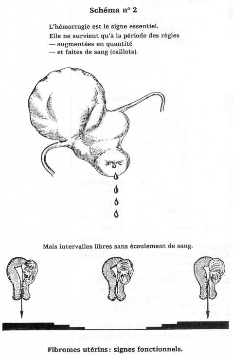
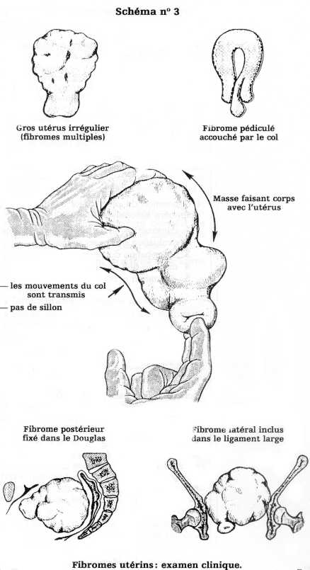

Tumeurs bénignes, très fréquentes, développées aux dépens du muscle utérin pendant la seule période génitale, les fibromyomes n'existent pas avant la puberté et involuent après la ménopause. Leur nombre et leur volume sont très variables.

Les fibromyomes peuvent s'associer à :

*   des polypes muqueux intra-utérins,
*   une endométriose.

## I. Leur siège

### 1. Par rapport à l'utérus

*   fibrome du corps: 96 %,
*   du col: 3 %,
*   de l'isthme: 1 %.

_schéma n° 1_

### 2. Par rapport aux tuniques musculaires

*   **interstitiels :** ils déforment alors la cavité utérine, ce sont les plus fréquents et le diagnostic aisé.

*   **sous-séreux :** ils peuvent être pédiculés, source alors d'erreur de diagnostic (avec le kyste de l'ovaire en particulier) et susceptibles de se compliquer (torsion).

*   **sous-muqueux :** sessiles ou pédiculés, ils réalisent alors un **polype** pouvant s'extérioriser par le col de l'utérus. Les conséquences sont essentiellement :
    *   les hémorragies,
    *   la compression des organes de voisinage (rectum, vessie).

## II. Symptomatologie

### 1. Les circonstances de découverte

#### a. Dans la plupart des cas, ils sont asymptomatiques

C'est lors d'un examen gynécologique systématique que l'on pourra faire le diagnostic.

#### b. Complication

Parfois, c'est lors d'une complication **révélatrice** que l'on est amené à découvrir le fibrome.

*   Soit **hémorragies :** ce peut être tous les types d'hémorragies mais plus volontiers des :
    *   **méno-métrorragies:** c'est-à-dire des règles qui frappent par leur **durée** anormale, de dix à quinze jours. Leur caractère **indolore** au début, leur **abondance** dont la conséquence à long terme est une altération de l'état général avec **anémie** parfois importante.  
*   Soit **signes de compression :**
    *   vésicale en avant, entraînant une dysurie, pollakiurie,
    *   rectale en arrière, entraînant constipation, pesanteur anale,
    *   exceptionnellement: urétérale, gravissime car elle évolue à bas bruit, entraînant une **mort** **lente du rein** si l'obstacle que constitue le fibrome n'est pas levé chirurgicalement.  
*   Soit **torsion :** c'est l'apanage des fibromes **pédiculés,** le diagnostic différentiel se pose avec celui du kyste de l'ovaire qui peut lui aussi se compliquer de torsion. Elle se manifeste par un syndrome douloureux abdominal, volontiers **pseudo-appendiculaire** et la confirmation du diagnostic se fait souvent à ventre ouvert.  
*   Soit **nécrobiose aseptique :** évolution plus volontiers propre à l'utérus gravide car le fibrome se **ramollit.** Elle associe fièvre et douleur pelvienne; le diagnostic n'est fait qu'à l'ouverture de la pièce devant une coloration violette caractéristique.  
*   Soit **infection :** associée à une endométrite, une salpingite, source de difficultés opératoires extrêmes.  
*   Soit enfin, de façon très exceptionnelle, **dégénérescence maligne :** il s'agit alors d'un sarcome.

#### c. Stérilité

En particulier avortement précoce à répétition, accouchement prématuré, peuvent amener les patientes porteuses de fibromes à consulter.

#### d. Une complication obstétricale

**Dystocie dynamique** liée à un **myome utérin** formant obstacle praevia.

### 2. L'examen clinique

Quelles que soient les circonstances de découverte, seul l'examen clinique soigneux peut affirmer le diagnostic.

La technique doit être rigoureuse : sur table gynécologique, vessie et rectum vides.

Tantôt le diagnostic est aisé, par le seul examen de la paroi abdominale qui présente une voussure. A travers cette voussure, on peut palper une masse de consistance variable, indolore.

Le **toucher vaginal combiné au palper abdominal** montre :

1.  Un **utérus** augmenté de volume, bosselé par une ou plusieurs masses arrondies, lisses, fermes, indolores.  
2.  Une masse latéro-utérine déviant le col dans un cul-de-sac et dont le caractère **essentiel** est de faire corps avec l'utérus, sans sillon de séparation, mobilisable avec lui par la main abdominale et les doigts vaginaux.

Dans tous les cas, on n'aura pas oublié :

*   l'examen du cul-de-sac pour l'étalement des annexes,
*   la vérification de l'état du périnée,

*   la recherche d'une notion d'incontinence d'urine à **l'effort.**

Ailleurs, l'examen n'est pas démonstratif, il n'existe qu'une augmentation globale de l'utérus. Il faut alors :

*   bien interroger la patiente,

*   lui faire préciser la date de ses dernières règles, et au moindre doute demander :
    *   réaction biologique de grossesse,
    *   une écho-tomographie n'est pas réalisable partout, mais elle a l'avantage de préciser s'il y a ou s'il n'y a pas grossesse.

Le diagnostic de grossesse éliminé, on peut demander:

*   une **hystéro-salpingographie** en l'absence d'infection, ou d'une hémorragie importante. Elle est réalisée avec des produits hydrosolubles, en remplissage, réplétion et évacuation sous plusieurs incidences. Elle objective :
    *   rarement un **fibrome calcifié** sur le fond,
    *   souvent un utérus de gros volume, avec une cavité irrégulière déformée, agrandie, avec des lacunes.

Cependant, en cas de fibrome pédiculé, l'hystéro-salpingographie a l'avantage de vérifier l'état des trompes, image d'hydro ou pyosalpinx permettant de prévoir des difficultés opératoires supplémentaires.

On complète l'examen par :

*   une numération formule sanguine,

*   un bilan pré-opératoire,

*   un cliché thoracique, un électrocardiogramme.

Et si on redoute une compression urétérale :

*   une urographie intraveineuse.

## III. Le traitement

Il dépend du retentissement du fibrome et surtout de l'importance du saignement.

### 1. Abstention thérapeutique

devant un fibrome asymptomatique, sans risque évolutif lié au siège, isolé et à condition que la surveillance reste régulière. C'est le cas le plus fréquent.

### **2.** Traitement médical

Il n'est que palliatif, il permet :

#### a. En urgence : enrayer une hémorragie

*   **Méthylergométrine ** IM: on peut aller jusqu'à 4 à 5 injections IM/ 24 heures. Le relais est ensuite pris par:
    *   Méthylergométrine gouttes: à la dose de 30 gouttes x 3/24 heures jusqu'à l'arrêt de l'hémorragie. On lui associe les antispasmodiques types:
    *   Spasmavérine (R): suppositoire ou en injection IM : 2 à 3 par 24 heures.

#### b. Traitement de fond

On fait appel à la progestérone ou les progestatifs de synthèse dans la deuxième partie du cycle. Il permet parfois d'atteindre la ménopause après laquelle le fibrome cesse d'évoluer.

*   Lutométrodiol (R): 2 cp du 15e au 25e jour du cycle en prenant la fin de l'hémorragie comme date de début du cycle pendant deux mois, puis: **2 cp** du 10e au 25e jour du cycle quand les hémorragies se sont stabilisées, ou lynestrenol aux mêmes doses.

Les **androgènes sont totalement abandonnés.**

### 3. Curetage hémostatique et exérèse par voie basse des polypes sous-muqueux pédiculés.

### 4. Le traitement chirurgical

Le traitement chirurgical et ses modalités ne sont fonction que:

*   de l'âge,

*   du volume du ou des fibromes.

#### Méthodes

**Myomectomie** réalisée par énucléation du fibrome, hémostase et capitonnage de la loge.

*   _Avantage:_ conserve et même restitue les possibilités de grossesse, de règles normales.  
*   _Inconvénients:_ - récidive possible, impossibilité technique entraînant l'obligation d'une:

**Hystérectomie totale ou subtotale** (c'est-à-dire conservant le col, à la condition qu'il soit sain) avec ou sans conservation des trompes et des ovaires.

## Conclusion

Le fibrome est une maladie bénigne, fréquente, souvent bien supporté. La chirurgie s'adresse aux fibromes compliqués (hémorragie, compression, ou volume trop important).

_Développement et Santé, n°34, août 1981_