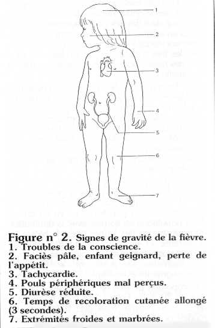
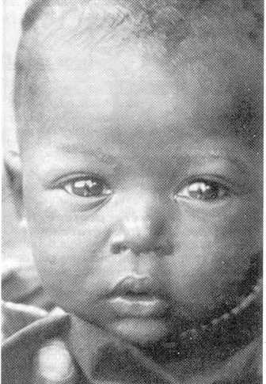
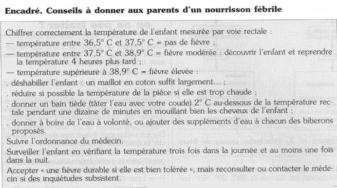

## I. Physiopathologie

La conduite à tenir devant une fièvre aiguë du nourrisson nécessite tout d'abord quelques rappels de physiopathologie.

**L'homéothermie** est le résultat d'un équilibre entre thermogenèse et thermolyse, régulé par un centre thermorégulateur, véritable thermostat (_figure n° 1_).

La **thermogenèse** provient des réactions métaboliques au niveau des graisses brunes, des muscles et de l'activité musculaire.

La **thermolyse** s'effectue au niveau de la peau (transpiration) mais aussi par conduction, convection et radiation.

L'évaporation pulmonaire élimine aussi beaucoup de calories.

Ces mécanismes sont entravés si l'enfant est trop couvert, si le sang circule mal (le sang circule mal en cas de déshydratation par exemple : pour que les échanges s'effectuent bien au niveau de la peau, il faut que les vaisseaux soient correctement remplis), enfin si la température extérieure est trop élevée.

Le **centre thermorégulateur,** situé dans le cerveau, est réglé à 37° : il reçoit des informations venant des récepteurs centraux et périphériques. À son tour, le centre thermorégulateur envoie des influx nerveux permettant la régulation thermique, par exemple : hypersudation, polypnée ou frissons (qui augmentent la température interne).

Il est indispensable de bien distinguer la **fièvre** _(figures n°2 et n°3_) et **l'hyperthermie :** l'hyperthermie est provoquée par une augmentation de la thermogenèse (exemples : température extérieure élevée, exercices musculaires intenses) et surtout par une diminution de la thermolyse (enfant trop couvert, arrêt de la sudation du fait d'une déshydratation).

Ici le thermostat fonctionne normalement à 37°. Au contraire, au cours de la fièvre, le thermostat est déréglé (à 38°, 39°, 40° par exemple) (_figure n°4)._

Ce dérèglement est dû le plus souvent à des **toxines** virales, bactériennes ou parasitaires (paludisme).

Dans ce cas, le thermostat envoie des ordres de **thermogenèse :**

*   frissons,
*   vasoconstriction cutanée pour diminuer les échanges thermiques.

## I. Traiter ou ne pas traiter ?

Chez l'enfant de moins de 5 ans une température supérieure à 38° peut être dangereuse avec trois risques majeurs :

*   une déshydratation aiguë ;
*   des convulsions (le cerveau du petit enfant supporte mal la fièvre) ;
*   des lésions cérébrales définitives, si la température du cerveau dépasse 41° (dans notre jargon de réanimateurs "les plombs sautent" !).

Dans tous les cas, il faut tout de suite apprécier la gravité de la situation.

L'éducation des familles est encore ici d'un grand intérêt pour éviter des retards thérapeutiques parfois catastrophiques.

Pour lutter contre une température supérieure à 38,5°, il faut :

1. **Découvrir** l'enfant.

2. Le **faire boire** souvent pour lutter contre la déshydratation (tout comme pour un moteur qui ne se refroidit bien que s'il ne manque pas d'eau dans ses radiateurs) et favoriser la sudation.

3. Le placer si possible **dans une pièce à 20°** et/ou utiliser un ventilateur, le recouvrir de linges humides.

4. Donner des **antithermiques** :

*   paracétamol : 60 mg/kg/jour en 4 prises

*   ou aspirine : 50 mg/kg/jour en 4 prises
*   ou ibuprofène : 30 mg/kg/jour en 4 prises.

Toujours privilégier la voie orale à la voie rectale qui ne permet pas un dosage assez précis.

La voie IV est justifiée en cas d'urgence (41°): l'aspirine IV 10 à 20 mg/kg 3 fois par jour.

5. Une fois ces mesures urgentes prises, il faudra **rechercher et traiter les causes** _(tableau)._

_Développement et Santé, n° 144, décembre 1999_