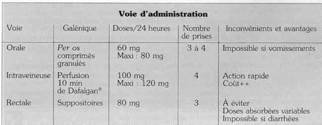

**Fièvre et douleur chez l'enfant : paracétamol d'abord**

**par Philippe Reinert**

Pédiatre, hôpital intercommunal, Créteil, France.

La fièvre est l'un des symptômes les plus fréquents chez l'enfant.

Son traitement améliore le confort de l'enfant et vise à prévenir les convulsions hyperthermiques et la déshydratation.

Trois médicaments sont utiles :

- **l'aspirine,**

- **le paracétamol,**

- **l'ibuprofène.**

Les trois sont efficaces mais agissent différemment et exposent à certaines complications parfois graves.

Aspirine et ibuprofène sont des anti-inflammatoires donc analgésiques et anti-agrégants plaquettaires pouvant provoquer des hémorragies, en particulier digestives (ulcère gastrique, gastrite). Ces hémorragies peuvent être aiguës ou chroniques (perte de fer par voie digestive).

**Aspirine**

Avec l'aspirine, à la dose de 50 à 60mg/kg/jour, la demi-vie* est de 7 heures chez le nouveau-né, de 3 à 6 heures chez le nourrisson et de 2 à 3 heures chez l'enfant plus grand. La réduction de la fièvre est observée après 30 minutes, le pic de défervescence est atteint en 3 heures et l'effet persiste 3 à 4 heures.

* Demi-vie : c'est le temps nécessaire pour que la moitié du médicament administré disparaisse du sang. (Elle peut varier de quelques secondes à plusieurs mois !)

Outre les risques hémorragiques, l'aspirine peut provoquer des **lésions hépatiques** graves au cours de certaines viroses (varicelle).

Enfin, à partir de 100 mg/kg/jour peuvent survenir des **troubles neurologiques** graves, parfois mortels, (convulsions, désorientation, coma).

**Ibuprofène**

Il a une demi-vie de 1 à 2 heures. La décroissance thermique est obtenue en 3 heures. Son effet est plus prolongé que celui de l'aspirine et du paracétamol.

Comme tous les anti-inflammatoires, il peut provoquer des **douleurs gastriques,** des **hémorragies digestives** et diminuer les **défenses immunitaires** en cas de traitement prolongé.

**Paracétamol**

**À prescrire** **en priorité.** Absorbé rapidement par l'estomac, sa demi-vie est de 2 à 3 heures, sa posologie de 60 mg/kg/jour répartis en quatre prises. Sa **tolérance,** en particulier digestive est excellente. De rares manifestations cutanées allergiques et d'exceptionnelles thrombocytopénies ont été observées.

L'intoxication est possible aux doses supérieures à 125 mg/kg/jour (insuffisance hépatique aiguë). Cette intoxication est bien combattue par la N-acétylcystéine si le traitement est précoce.

**Faut-il associer paracétamol + aspirine ?**

L'association a un effet antipyrétique plus prolongé que chaque molécule utilisée seule mais les signes d'intolérance sont multipliés par deux.

**En pratique**

Si les trois médicaments sont efficaces, le paracétamol à la dose de 60 mg/kg/jour semble le moins dangereux pour une efficacité identique.

_Développement et Santé, n°147, juin 2000_