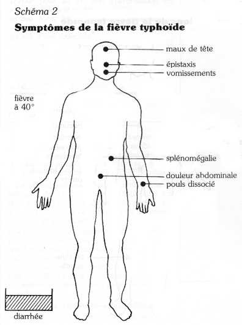
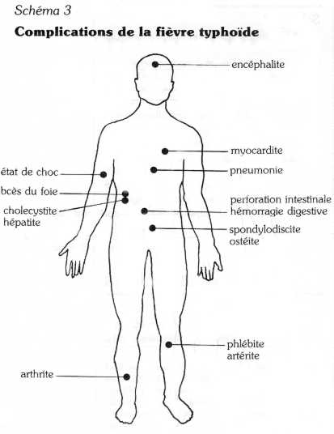
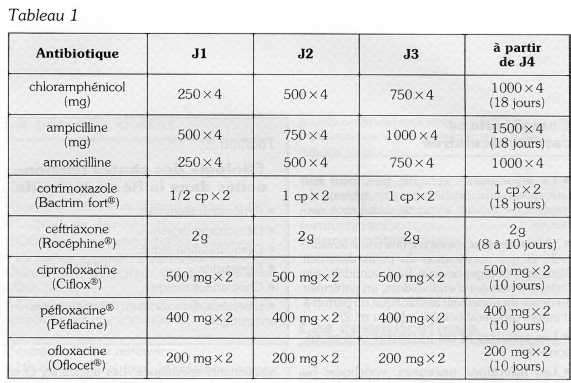

La fièvre typhoïde est une infection fréquente en milieu tropical.

C'est une maladie spécifiquement humaine dont la transmission est orofécale.

Sa fréquence est donc étroitement liée au niveau d'hygiène de l'eau et de l'alimentation.

Elle est parfois grave, en particulier en raison de ses complications et du terrain sur lequel elle survient (malnutrition).

Son diagnostic est souvent difficile d'où l'importance d'évoquer une typhoïde devant toute fièvre qui dure, éventuellement associée à des troubles digestifs ou neurologiques.

## **Définition**

La fièvre typhoïde est une toxi-infection contagieuse.

*   Le germe responsable est un bacille Gram négatif du groupe des **salmonelles :** _Salmonella typhi_ ou bacille d'Eberth est le plus grave.

*   Salmonella paratyphi A, B, C.

En Afrique on rencontre essentiellement **_S. typhi_ et _S. paratyphi A_.**

Ces bactéries possèdent chacune des antigènes différents :

*   antigène 0 somatique,
*   antigène H flagellaire;

mis en évidence par le sérodiagnostic de Widal.

## **Epidémiologie**

**Le réservoir de germes est** **strictement humain**

**Les selles** et accessoirement les urines des sujets infestés (malades ou porteurs sains) **assurent la dissémination.** Même après guérison clinique, 2 à 3 % des sujets deviennent porteurs chroniques et donc potentiellement contaminateurs.

**Le mode de contamination**

Le sujet devient malade le plus souvent en ingérant de l'eau ou des aliments contaminés par les salmonelles, mais parfois directement par l'intermédiaire des mains sales.

**L'amélioration de l'hygiène,** en particulier de l'eau, est la **meilleure prévention.** Elle est plus fréquente lors de la saison des pluies et peut survenir par épidémie.

## **Physiopathologie**

Après ingestion, les germes vont se localiser dans la paroi de l'intestin grêle et les ganglions satellites où ils vont se multiplier. C'est la **phase** **d'incubation** asymptomatique qui dure de une à deux semaines.

Une partie des germes va se disséminer dans la lymphe et le sang du malade et va créer une **septicémie.** L'installation de cette septicémie entraîne la fièvre, la splénomégalie et les localisations secondaires.

L'autre partie des germes va être détruite localement dans les ganglions libérant les **endotoxines** dont l'effet s'exerce à distance expliquant les signes neurologiques, l'atteinte cardiaque mais également les signes digestifs (_schémas 1 et 2)._

## **Les symptômes**

**Mode de début (période** **d'invasion)**

Habituellement la typhoïde débute insidieusement par l'apparition de :

*   **Une fièvre** qui augmente **progressivement** jusqu'à 40 °C alors que le pouls ne s'accélère pas, c'est le **pouls dissocié** (par exemple pouls à 70 pour une fièvre à 40 °C).

*   **Des troubles digestifs :** douleur abdominale, diarrhée ou constipation, nausées.

*   **Des troubles nerveux :** maux de tête, insomnie, douleurs musculaires.

*   Parfois présence **d'épistaxis,** asthénie.

L'examen clinique retrouve une **splénomégalie** modérée, inconstante et une fosse iliaque droite gargouillante et sensible.

Le tableau initial est donc trompeur car proche d'un état grippal ou d'un accès palustre.

L'attention doit être attirée par la persistance ou l'aggravation de la fièvre, le cortège de signes associés en l'absence de paludisme ou la non amélioration sous traitement antipalustre.

**La période d'état**

Elle s'installe après une semaine de phase d'invasion.

*   La _fièvre_ persiste en plateau autour de 40°.
*   Le _pouls_ _est dissocié_ le plus souvent.
*   Céphalées, anorexie, asthénie marquées.
*   Le _tuphos_ apparaît: c'est un comportement anormal avec conscience altérée, parfois un délire.

Une _diarrhée_ est souvent, présente, parfois remplacée par une constipation.

L'examen clinique retrouve :

*   Un ventre douloureux, la présence inconstante d'une **splénomégalie**.
*   Les taches rosées lenticulaires (signe de grande certitude) sont rares. Il s'agit de macules érythémateuses peu nombreuses, difficiles à voir sur peau noire.

Tout malade ayant une fièvre qui se prolonge, qui est fatigué, avec des signes digestifs et/ou neurologiques doit être considéré comme ayant éventuellement une typhoïde et faire débuter un traitement antibiotique adapté.

## **Les complications**

Elles peuvent parfois être révélatrices de la maladie, mais le plus souvent elles surviennent à la troisième semaine de la maladie.

### **Complications digestives**

*   **Hémorragies digestives :** Elles se révèlent par la présence de sang dans les selles. Le plus souvent elles sont peu graves et tardives. Mais elles peuvent parfois être abondantes accompagnées d'un état de choc ou être le signe annonciateur d'une perforation digestive.

*   **Perforations digestives :** Le tableau clinique révélateur peut être aigu avec une douleur abdominale, un ventre contracté et un arrêt des matières et des gaz. L'opération est alors urgente devant ce tableau de péritonite aiguë.

Mais souvent le tableau peut être moins typique, en particulier chez les patients en mauvais état général ou avec tuphos profond. L'attention devra être attirée par une douleur abdominale persistante avec parfois une défense.

*   **Complications hépato-vésiculaires**

Elles ont liées à la prolifération bactérienne. Une hépatite est présente dans 1 0 % des cas, mais souvent peu grave. Les abcès hépatiques sont plus rares et se développent en l'absence d'antibiothérapie. Les cholécystites dans 0,5 à 2% des cas compliquent ou révèlent souvent une lithiase vésiculaire. Elles peuvent être sources de rechute ou de portage chronique.

Complications cardiovasculaires

*   La myocardite typhique, rare, peut être latente ou être révélée par un tableau de troubles de rythme et/ou de défaillance cardiaque.

*   L'état de choc révélé par une chute tensionnelle et une accélération du pouls devenant filant, est une urgence vitale. Il est secondaire à la libération massive d'endotoxines, en particulier au début du traitement antibiotique ou parfois à d'autres complications _(cf. tableau n° 2)._

<table>

<tbody>

<tr>

<td valign="top">

<em>Tableau 2</em>

Etiologie des chutes tensionnelles dans la fièvre typhoïde

<ul><li class="rtejustify">Perforation digestive.</li><li class="rtejustify">Hémorragie digestive.</li><li class="rtejustify">Déshydratation aiguë.</li><li class="rtejustify">Myocardite.</li><li class="rtejustify">Choc endotoxinique.</li><li class="rtejustify">Libération des toxines au début du traitement antibiotique.</li></ul></td>

</tr>

</tbody>

</table>

*   **Les artérites et les phlébites** sont exceptionnelles.

*   **Les infections osseuses,** vertébrales ou articulaires secondaires. Elles sont plus fréquentes chez les sujets drépanocytaires.

*   Les autres complications sont plus rares encéphalites, atteinte rénale, atteintes pleuro-pulmonaires.

## **Le diagnostic**

**La numération-formule** **sanguine**

Elle apporte un argument important d'orientation en montrant une absence d'augmentation des globules blancs **(leuco-neutropénie).**

*   La vitesse de sédimentation est normale ou peu élevée.

**Le diagnostic bactériologique**

Quand il est réalisable, il repose sur :

*   **L'hémoculture** à multiplier si c'est possible: elle est positive précocement dès les premiers jours et constitue l'élément de certitude.

*   **La coproculture** est plus rarement positive.

**Le sérodiagnostic de Widal et Félix**

Il ne se positive qu'à partir du huitième-dixième jour de la maladie. Il recherche les anticorps agglutinants spécifiques. Les agglutines O se positivent à partir du huitième jour et les H à partir du douzième jour.

On considère les réactions comme positives au-delà de 1/100e pour les anticorps O et de 1/200e pour les H. Son interprétation est souvent difficile et sa séroconversion parfois trop tardive. Mais, par sa rapidité de réalisation, il reste un bon examen de routine pour le diagnostic d'une typhoïde.

## **Traitement**

**Curatif**

*   **L'antibiothérapie** est l'élément essentiel de la thérapeutique. Il faut choisir un antibiotique **actif sur les salmonelles,** avec une **concentration lymphatique Importante.** Il faut préférer la voie orale quand elle est possible.

*   **Le chloramphénicol** reste l'antibiotique de référence dans le traitement des typhoïdes. La dose est de 50 mg/ kg, soit pour un adulte: 3 à 4 g par jour. La durée habituelle du traitement est de vingt et un jours.

Les doses doivent progressivement augmenter pour éviter une libération brutale d'endotoxines. On débute au quart de la dose. Son faible coût et son efficacité font qu'il reste un bon antibiotique des traitements des typhoïdes.

Une surveillance de la numération sanguine est nécessaire en raison des cytopénies toxiques possibles.

*   **D'autres antibiotiques sont efficaces:**

- l'amoxicilline à la dose de 50 mg/kg,

- le cotrimaxozole (Bactrim®).

Plus récemment certaines céphalosporines de troisième génération (ceftriaxone = Rocéphine®) et les nouvelles quinolones se sont révélées très efficaces et ont permis de diminuer la durée du traitement et la fréquence des rechutes. Mais leur coût élevé reste un obstacle à une utilisation plus large _(tableau 1)._

**Traitement associé**

*   Il faut réhydrater le patient par perfusion si nécessaire.

*   Dépister les complications par une surveillance régulière et les traiter.

*   La corticothérapie sera réservée aux formes graves ou malignes avec syndrome toxique sévère (troubles de la conscience ou troubles du rythme). On fera appel à la déxaméthasone (4 mg six fois par jour).

Il faudra dépister les rechutes et chercher à éviter que certains sujets deviennent porteurs chroniques et donc disséminateurs de la maladie en contrôlant la négativation de la coproculture quand cela est possible.

## **Prophylaxie**

*   **Au plan individuel :** Le malade sera isolé. Son linge et ses selles seront désinfectés.

*   **Au plan communautaire :** Les mesures générales consistent à surveiller les eaux de boisson et les produits alimentaires qui ne doivent pas être contaminés.

*   **L'éducation sanitaire** pour une amélioration de l'hygiène est **fondamentale.** Cette amélioration repose sur l'usage de latrines, l'évacuation des eaux usées, le lavage des mains. La sensibilisation de chacun est indispensable.

*   **La vaccination :** Le vaccin Typhim Vi® protège efficacement (80%) contre les infections à S. typhi pour une période qui ne dépasse pas 4 ans.

**Conclusion**

La fièvre typhoïde reste une maladie fréquente et grave. Le diagnostic doit être évoqué devant toute fièvre traînante accompagnée de signes digestifs ou neurologiques. Ses complications sont graves.

Sa prévention passe par une amélioration de l'hygiène, le réservoir n'étant qu'humain.

_Développement et Santé, n°91, février 1991_