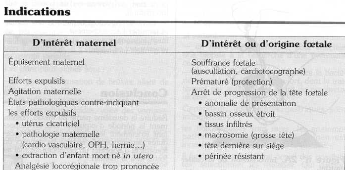
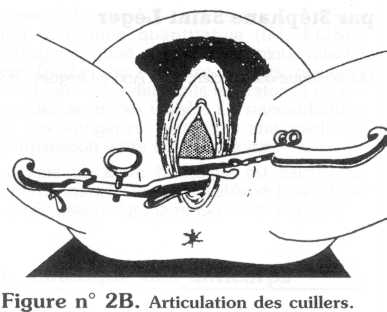

**Forceps : conditions et techniques**

**par Stéphane Saint-Léger**

Gynécologue-obstétricien, CHI André-Grégoire, 93105 Montreuil.

**Définition**

Le forceps est un instrument, prolongation des mains de l'accoucheur, de préhension, de direction et de traction, destiné à saisir la tête du fœtus pendant le travail et à l'extraire des voies génitales maternelles, afin de protéger soit le fœtus soit la mère.

Il est classique de dire que c'est à Peter Chamberlain (1560-1631) que revient l'invention du forceps.

**Description**

Il existe des forceps à branches croisées (exemple : le forceps de Tarnier composé de 3 pièces: deux branches droite et gauche et un tracteur articulé au milieu des branches) (_figure n° 1_) et des forceps à branches non croisées. (exemple : le forceps de Démelin Suzor composé de 4 pièces: deux branches, une barre d'articulation aux extrémités des branches et une vis de pression. Chaque opérateur se sert de l'instrument qui lui convient et dont il a l'habitude.

**Conditions de sécurité** **d'application du forceps**

En sus des indications, des critères stricts doivent être respectés avant toute application de forceps :

**F** Fontanelles (variété de sommets antérieurs et postérieurs)

**O** Occiput (céphalique)

**R** Rompues (membranes)

**C** Complète (dilatation)

**E** Engagée (présentation)

**P** Périnée (épisiotomie)

**S** Sondée (vessie)

Bien des forceps pourraient être évitésavec quelques patientes. Bien des forceps seraient faciles si on laissait le temps à la tête de parfaire sa progression.

**Technique d'application** **du forceps**

L'application de forceps est une opération nécessitant rigueur, attention et respect de la chronologie des gestes :

- informer et rassurer la patiente,

- vérifier le montage et le bon fonctionnement du forceps,

- vérifier les conditions de sécurité d'application,

- respecter les règles d'asepsie,

- exécuter les manœuvres méthodiquement et lentement,

- mettre en place les cuillers _(figure n° 2A),_

- articuler les forceps (tracteur ou basse articulation) (_figure n° 2B),_

- vérifier la prise sur la présentation par le toucher : prise systématique et suffisamment enfoncée,

- tracter sur le tracteur ou les branches, lentement et progressivement après rotation ou non de la tête, en respectant la courbure anatomique de la filière génitale,

- ne pas pratiquer d'expression abdominale soutenue ou exagérée,

- effectuer une épisiotomie si nécessaire protection du périnée ou de la tête fœtale (prématuré),

- extraire physiologiquement la tête fœtale et terminer l'accouchement,

- s'assurer de l'absence de lésions de la filière génitale (col, vagin).

**Conclusion**

Réduire la deuxième partie du travail, notamment la période d'expulsion tout en respectant strictement les conditions et les procédures permettront de réduire les dangers du forceps et d'apporter un bénéfice maximal au fœtus et à la maman.

_Développement et Santé, n° 137, octobre 1998_