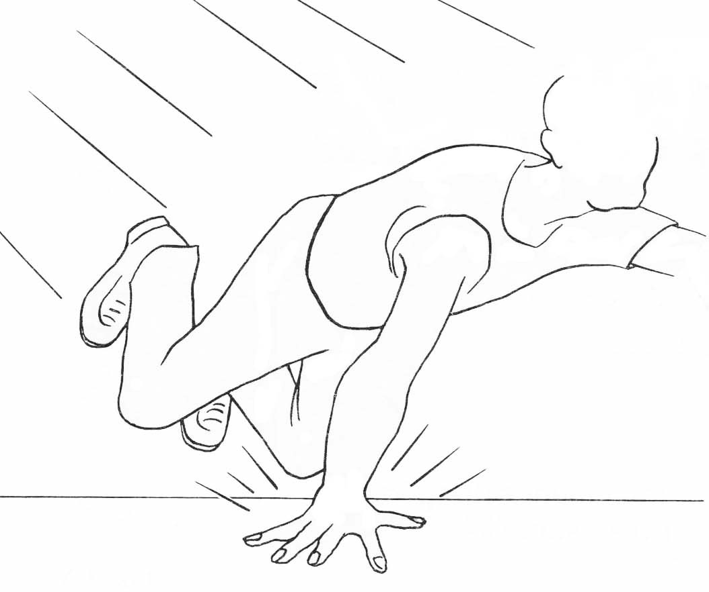
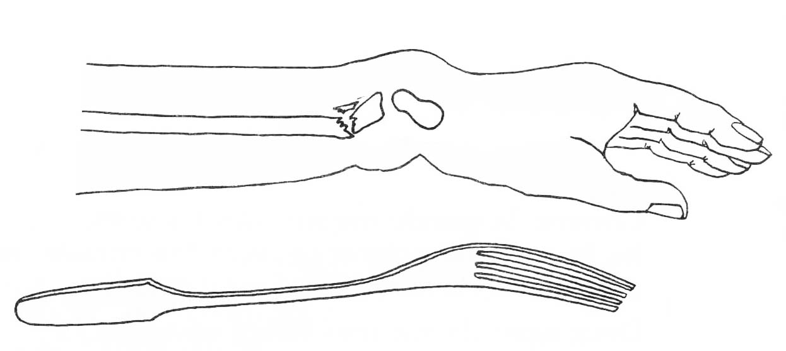
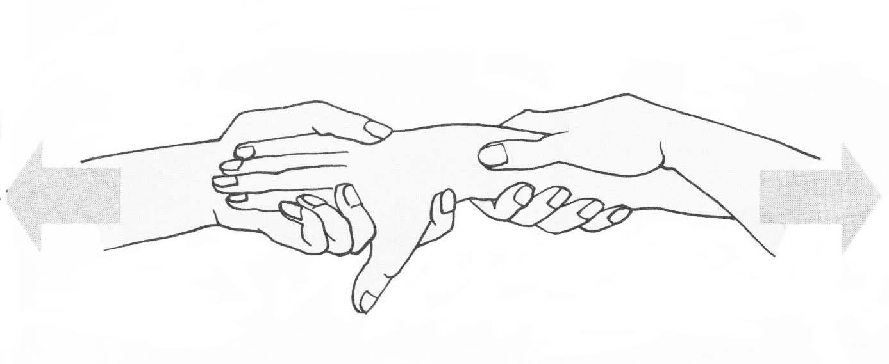
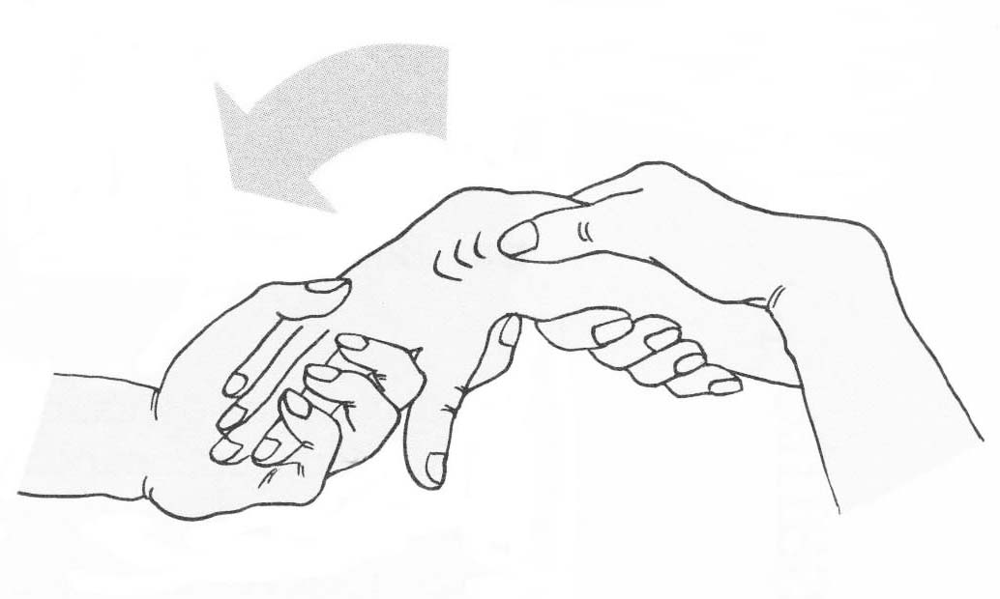
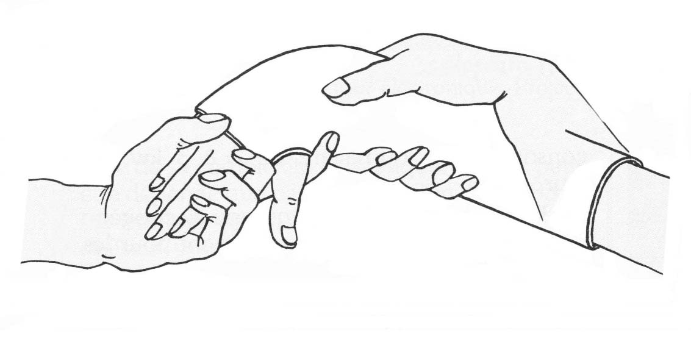
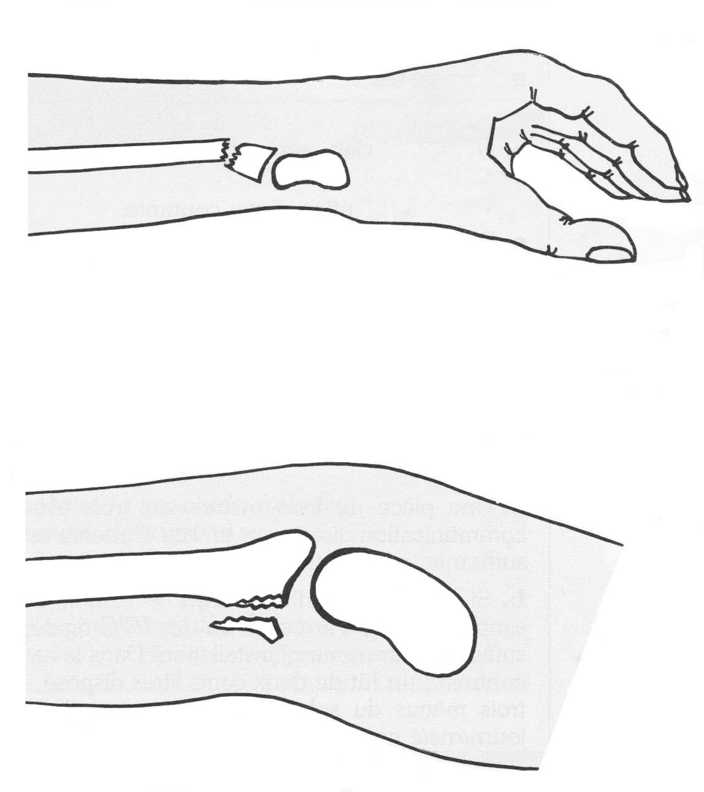

## I. La fracture de Pouteau-Colles

Elle est due à une chute sur le poignet en hyperextension (schéma n° 1). Le déplacement fracturaire doit être bien connu car il conditionne les manœuvres de réduction :

*   Sur une vue de profil, l’extrémité inférieure du radius apparaît basculée en arrière duu fait de la présence habituelle de fragments postérieurs au niveau du foyer de fracture
*   La surface articulaire du radius, qui normalement « regarde » légèrement en avant, regarde ici en arrière (schéma n° 2).. Ainsi se trouve réalisée la déformation dite « en fourchette ».

  

**Schéma 1 : la fracture de Pouteau-Colles résulte d'une chute sur la main en flexion dorsale**

 

**Schéma  2 : la déformation en fourchette est due à une bascule dorsale de l'extrémité inférieure du radius**

Sur une vue de face, l’extrémité inférieure du radius apparaît ascensionnée. Surtout, si on trace une ligne passant par la pointe des styloïdes radiale et cubitale, cette ligne est pratiquement perpendiculaire à l’axe de l’avant-bras alors que, normalement, elle doit être oblique en bas et en dehors (clichés 1 et 2).

<table>

<tbody>

<tr>

<td>

</td>

<td>

</td>

</tr>

<tr>

<td>

Cliché 1 : racture de Pouteau-Colles. Remarquer la bascule postérieure de la surface articulaire sur le cliché de profil, et l'horizontalisation de la ligne bistyloïdienne sur la vue de face

</td>

<td>

Cliché 2 : même fracture après réduction : correction de la bascule postérieure et restauration de l'obliquité de la ligne bistyloïdienne

</td>

</tr>

</tbody>

</table>

### La réduction

Elle est réalisée habituellement sous anesthésie générale. Une anesthésie loco-régionale intraveineuse constitue également un excellent procédé si l’anesthésiste connaît cette technique. L’anesthésie locale par injection directe dans le foyer de fracture doit être déconseillée du fait du risque septique par inoculation de l’hématome fracturaire.

1.  Traction la plus puissant possible, dans l’axe, afin de désengrener la fracture et aligner les fragments. Pour ce faire, l’opérateur saisit la main du blessé dans une main et le poignet dans l’autre et exerce deux tractions opposées (schéma n° 3). Quand la fracture est désimpactée, on peut passer au deuxième temps.  
2.  Flexion palmaire et inclinaison cubitale : l’opérateur fléchit le poignet et l’incline du côté cubital afin d’abaisser au maximum la styloïde radiale. Le pouce de l’opérateur exerce dans le même temps un appui direct pour abaisser encore l’extrémité inférieure du radius (schéma n° 4). Pendant cette manœuvre, le poignet du blessé est appliqué fortement sur la poitrine de l’opérateur comme sur un billot.

<table>

<tbody>

<tr>

<td>

</td>

<td>

</td>

</tr>

<tr>

<td>Schéma 3 : traction bipolaire pour désengrener et aligner la fracture</td>

<td>Schéma 4 : flexion palmaire, inclinaison cubitale et pulsion directe sur l'extrémité inférieure du radius</td>

</tr>

</tbody>

</table>

### La contention

Elle est réalisée par un plâtre peu cotonné maintenant le coude à angle droit, le poignet à 30 ° de flexion et en inclinaison cubitale. Pendant le séchage du plâtre, le manœuvre de réduction doit être maintenue et le pouce de l’opérateur doit réaliser un point d’appui au niveau de la face dorsale de l’extrémité inférieure du radius (schéma n ° 5). L’immobilisation dure cinq semaines, et le blessé est revu aux huitième, quinzième et vingt-et-unième jours pour vérification du plâtre et un cliché radiographique si possible. Celui-ci permet de vérifier l’absence de déplacement secondaire, et notamment que le poignet du blessé garde ses deux caractéristiques morphologiques essentielles : surface articulaire du radius « regardant » en avant et ligne bistyloïdienne oblique en bas et en dehors (traduisant le fait que la styloïde radiale est plus basse que la styloïde cubitale (voir clichés 1 et 2).

 

**Schéma 5 : la manoeuvre de réduction doit être maintenue   
pendant le séchage du plâtre. Le pouce de l'opérateur fait  
contre-appui à la face postérieure de l'épiphyse radiale**

## II. Les fractures en flexion

Il s’agit de fractures beaucoup moins fréquentes, dites en compression-flexion car survenant à la suite d’une chute sur le dos de la main, poignet fléchi. Elles peuvent être extra-articulaires, fractures de Goyrand, ou intra-articulaires emportant la marge antérieure du radius (schémas 6 a et 6b).

<table>

<tbody>

<tr>

<td>

</td>

<td>

Schéma 6a : fracture extra-articulaire, fracture de Goyrand

Schéma 6b : fracture articulaire, fracture marginale antérieure

</td>

</tr>

</tbody>

</table>

En dehors de possibilités chirurgicales, ces fractures doivent être immobilisées en rectitude du poignet. La réduction, par traction puissante dans l’axe du poignet, est suivie d’un plâtre bien moulé, très peu cotonné, confectionné tandis qu’un aide maintient la réduction par traction constante jusqu’à séchage du plâtre. **A aucun moment il ne faut fléchir ou étendre le poignet** : ceci aboutirait à créer une chambre de mobilité autour du foyer de fracture, et aucun traitement orthopédique ne serait plus possible.

Ainsi, si les fractures de l’extrémité inférieure du radius sont des fractures banales, les cals vicieux du poignet sont encore fréquents. Quelques règles strictes doivent donc être respectées :

*   Toute fracture du poignet, même non déplacée et plâtrée telle quelle, doit être radiographiée au huitième jour pour dépister un déplacement secondaire.  
*   Toute fracture de Pouteau-Colles, même « très peu déplacée », doit être réduite sous anesthésie. Aucune bascule postérieure de l’extrémité inférieure du radius ne doit être tolérée. A condition d’un traitement initial rigoureux et d’une surveillance régulière, de graves séquelles peuvent facilement être évitées.