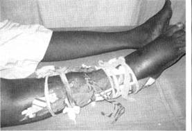
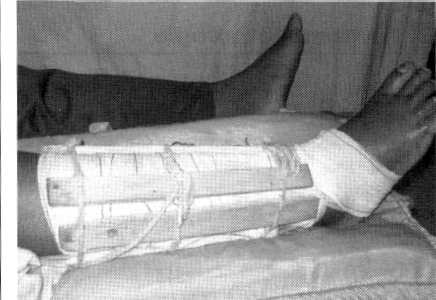
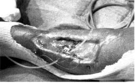

## I. Qu'est-ce que la précarité en chirurgie ?

La lutte contre le choc opératoire et une asepsie stricte sont les préalables indispensables à tout acte opératoire. La précarité survient quand ces conditions ne sont plus remplies.

### En voici quelques exemples

*   manque de personnels qualifiés,
*   plateau technique réduit ou inexistant (radio, biologie, stérilisation),
*   déficit en consommables chirurgicaux ou anesthésiques (compresses, fils de suture, gants stériles, sondes d'intubation),
*   manque de matériel spécifique (moteur chirurgical, broches, vis, fixateur externe),
*   infrastructure allégée (tentes, rationnement de l'électricité ou de l'eau),
*   insécurité (guerres civiles, séismes),
*   afflux massif de blessés.

### Quelles en sont les conséquences sur la pratique chirurgicale ?

*   Réanimation courte (manque de solutés, de sang) donc pas de chirurgie complexe.
*   Asepsie précaire donc geste chirurgical rapide et simple.
*   Notion de triage : en cas d'afflux de blessés, il faut établir des priorités de prise en charge en fonction des lésions et des moyens dont on dispose pour les traiter.
*   Difficulté voire impossibilité de suivi des patients donc privilégier, quand c'est possible, le traitement en un temps.

## II. Les fractures ouvertes de jambe

### 1. Définition

Nous limiterons ce sujet aux fractures diaphysaires ouvertes du tibia et du péroné (fibula) en excluant les fractures épiphysaires et articulaires, qui posent d'autres problèmes.  
Les fractures ouvertes sont des urgences chirurgicales. Leur gravité est liée à l'atteinte des parties molles - notamment du revêtement cutané, très fragile sur la face antéro-interne de la jambe - qui peut aboutir à l'exposition, provisoire ou permanente, du foyer de fracture.

### 2. Mécanisme

Il renseigne sur le degré de lésion et de contamination des parties molles.

*   Il peut s'agir d'un **traumatisme direct** à haute énergie. La fracture siège dans ce cas en regard de l'impact où la lésion cutanée est constante, allant de la plaie punctiforme à la plaie circonférentielle en passant par la contusion appuyée ou le décollement sous-cutané, source de nécrose secondaire. La contamination bactérienne est alors toujours importante. C'est donc au plus tôt que les gestes de lavage et d'asepsie locale devront être débutés.
*   Le **traumatisme indirect** à basse énergie s'exerce, quant à lui, à distance du foyer de fracture par un mécanisme de flexion ou de torsion. Les extrémités fracturaires trans¬percent la peau. La contamination directe est moindre que dans les traumatismes directs.

### 3. Anatomopathologie

L'étude des lésions osseuses et de l'état des parties molles doit déboucher sur un diagnostic synthétique permettant de guider les premiers gestes de la prise en charge, d'assurer le transfert avec le juste degré d'urgence et enfin de poser l'indication chirurgicale la plus judicieuse.  
La question essentielle que tout chirurgien se pose face à une fracture ouverte de jambe reste celle de la **couverture du foyer** de fracture. La classification de Cauchoix et Duparc permet d'appréhender ce problème de couverture. Elle est habituellement destinée à faire le bilan des lésions en fin de parage chirurgical. Cependant, par extension, elle est couramment utilisée en pré-hospitalier pour se faire une idée de la gravité des fractures ouvertes.

**En voici les différents types :**

*   Type I: ouverture punctiforme aisément suturable.
*   Type II : risque élevé de nécrose secondaire après suture (suture sous tension, contusion appuyée, important décollement sous cutané, lambeau de vitalité douteuse).
*   Type III : perte de substance prétibiale non suturable.

### 4. Physiopathologie

#### Localement, trois phénomènes s'associent :

*   **L'infection** liée à une contamination massive par des germes telluriques se développe dès la sixième heure au sein de l'hématome et des tissus musculaires et osseux nécrosés. Elle prend la forme d'un phlegmon diffus à germes banals (staphylocoque..) ou celle d'une gangrène gazeuse à germes spécifiques (Clostridium, notamment perfringens). A terme, l'infection gagne l'os qui se défend mal entrainant une ostéite ou une pseudarthrose septique, de pronostic sévère car empêchant la consolidation.
*   L'**ischémie relative**, consécutive à l'oedème lésionnel ou à des lésions artérielles, est propice au développement du sepsis, notamment par des germes anaérobies. La diffusion des antibiotiques est mauvaise durant cette période, ce qui oblige à en injecter de fortes doses pour rester efficace.
*   La **nécrose secondaire** cutanée et musculaire aggrave la perte de substance initiale.

#### Sur le plan général

Ces fractures peuvent parfois être responsables :

*   D'un choc hémorragique par plaie artérielle associée (phénomène de sommation chez un polytraumatisé) ;
*   D'un choc infectieux ou toxi-infectieux (plaie souillée et vieillie) ;
*   Voire d'un choc métabolique par rhabdomyolyse (gros délabrements musculaires et surtout levée de garrot).

### 5. La prise en charge initiale

Elle découle de ces données anatomiques et physiopathologiques dans le contexte de précarité que nous avons défini.  
Examen général  
Le diagnostic de fracture ouverte de jambe est clinique. S'agissant souvent d'un traumatisme à haute énergie, voire d'un polytraumatisme, il convient d'abord de dresser le bilan des fonc¬tions vitales. L'état de conscience est évalué, une détresse respiratoire ou hémodynamique est recherchée. Le bilan lésionnel qui suit cette première évaluation doit permettre de poser une indication thérapeutique précise.  
L'interrogatoire recherche le mécanisme fracturaire, l'heure et les circonstances du traumatisme, les pathologies associées (paludisme, dénutrition, SIDA, etc.), le statut vaccinal, les mesures déjà prises (antibiothérapie).

#### Examen de la jambe

L'examen évalue :

*   la déformation du membre,
*   la nature et l'importance des lésions cutanées,
*   l'exposition du foyer de fracture,
*   le degré de contamination,
*   la présence des pouls périphériques,
*   l'existence d'un déficit sensitif ou moteur distal.

Un syndrome des loges, même dans le cadre d'une fracture ouverte, doit toujours être recherché, notamment en présence de douleurs très importantes sur une fracture dont le revêtement cutané est peu ouvert et très tendu.  
Le type de fracture et son déplacement peuvent être précisés si l'on dispose de radiographies (soit simple : transversale, oblique ou spiroïde, soit complexe : avec troisième fragment en aile de papillon, bifocale ou comminutive).

### 6. Les principes thérapeutiques

#### Sur le terrain et en phase d'attente préopératoire

La mise en condition initiale comprend cinq temps.

*   Antalgie (paracétamol et/ou morphine intraveineuse titrée).
*   Réaxation du membre sans tarder (après l'administration d'antalgiques de préférence). ce qui d'une part, permet de lever une éventuelle compression vasculaire responsable d'ischémie, d'autre part soulage les douleurs.
*   Lavage de la plaie au sérum physiologique et antisepsie à la polyvidone iodée (BETADINE®), puis emballage dans un pansement stérile qui ne sera ouvert qu'au bloc opératoire.
*   Immobilisation de la jambe dans une attelle rembourrée pour éviter les points de compression, surtout dans le cadre d'attelles de fortune (photos 1 et 2). La règle est d'immobiliser les articulations sus et sous-jacentes à la fracture. Il s'agira donc d'une attelle cruro-pédieuse.
*   Antibiothérapie préventive probabiliste : association intraveineuse de pénicilline G (4 millions d'unités 3 fois par jour) et métro¬nidazole (FLAGYLR 500 mg 3 fois par jour). La vaccination antitétanique et la séroanatoxinothérapie seront réalisées si l'on en dispose chez les blessés non immunisés.

  
**Photo 1 : attelle de fortune ischémiante.**

  
**Photo 2 : attelle plus élaborée mais insuffisamment rembourrée. Attention au point de compression sur la tête du péroné. Une fracture de jambe doit être immobilisée par une attelle cruro¬pédieuse.**

####   
Au bloc opératoire :

Le traitement conservateur comprend plusieurs étapes fondamentales.

**Débridement**  
Le débridement consiste à élargir la plaie par des incisions dans l'axe en levant toutes les brides (cutanées, fascio-musculaires ou périostées) empêchant une exploration complète de la plaie et de la fracture.

**Parage**  
Le parage est le **nettoyage** mécanique de la plaie par l'ablation de tous les tissus nécrosés ou contus propices au développement de l'infection. Il doit permettre l'évacuation des hématomes, le lavage du canal médullaire et la réalisation d'une bonne hémostase. Les fascias sont largement ouverts en prévention du syndrome des loges.  
L'exploration chirurgicale recherche des **lésions associées** vasculaires ou nerveuses. A la jambe en situation précaire, il est illusoire (et le plus souvent inutile) de réparer une artère si la collatéralité est efficiente. Il est utile en revanche de tenter sinon une véritable suture, du moins une mise bout à bout des nerfs lésés car leur rétraction en l'espace de quelques jours rend leur réparation secondaire plus aléatoire.  
D'une façon générale, il faut se garder de refermer une plaie de manière étanche en fin de parage. Une fermeture sans tension après parage d'une plaie peu contaminée vue précocement peut cependant se concevoir, à condition d'y associer un bon drainage.

**Stabilisation osseuse**  
La stabilisation osseuse en ambiance septique et précaire doit proscrire l'utilisation des plaques vissées qui font courir un risque infectieux important. Nous excluons également l'enclouage centromédullaire qui nécessite un environnement technique hors de propos , dans le cadre que nous nous sommes fixé.  
La seule exception que l'on puisse se permettre est un vissage ou un brochage intrafocal répondant au concept d'ostéosynthèse a minima associée à un fixateur externe ou à une immobilisation plâtrée.

*   **Le plâtre fenêtré**  
    Il doit être cruro-pédieux pour immobiliser les articulations sus et sous-jacentes à la fracture en position de fonction (gendu en légère flexion de 10°, cheville à 90°). Il est réalisé après réduction de la fracture. Sa fenestration doit être suffisamment large pour permettre des pansements aisés. C'est une option simple et peu coûteuse mais il faut se méfier des compressions sous plâtre pouvant aboutir au syndrome de Volkman. Par ailleurs la macération peut être préjudiciable à la cicatrisation. Enfin, cals vicieux et pseudarthroses par insuffisance d'immobilisation sont souvent reprochés à ce type de traitement qui, prolongé (90 jours pour une fracture de jambe), est aussi source de raideur.
*   **La traction trans-calcanéenne**  
    Elle est réalisable sous courte anesthésie générale ou sous anesthésie locale. Le principal danger est de léser le paquet vasculonerveux tibial postérieur. Un clou de Stein¬mann de 4 mm de diamètre ou une grosse broche de Kirchner transfixie la grosse tubérosité calcanéenne de dedans en dehors 4 cm en dessous et 4 cm en arrière de la malléole interne. Le clou est ensuite relié à un étrier permettant la traction dans l'axe grâce à un poids équivalent au 1/20ème du poids du patient. Cette technique, rapide et sûre, facilite les pansements mais requiert un décubitus prolongé (entre 2 et 3 mois). Elle est souvent utilisée à titre provisoire.
*   **Le fixateur externe**  
    Il autorise une stabilisation efficace du foyer de fracture grâce à des fiches trans-osseuses implantées de part et d'autre du foyer de fracture et reliées entre elles par une barre d'union. La mise en place de fiches impose la transfixion des parties molles (peau, fascias) mais doit éviter celle des muscles et tendons et ne doit pas léser les structures vasculaires et nerveuses. Au segment jambier, il faut éviter la transfixion de la loge antéro-externe susceptible d'une part d'entraîner un syndrome des loges, d'autre part de limiter la course de la cheville sous-jacente. Les fixateurs monoplans ont notre préférence car leur faible encombrement facilite les pansements et autorise les gestes de couverture éventuels. En l'absence de matériel spécifique, il est possible de remplacer les fiches de fixateur par des clous de Steinmann de 4 ou 5 mm de diamètre, reliés entre eux par des tubes perforés de fabrication locale ou par des broches de Kirchner noyées dans un plâtre.
*   **La couverture du foyer**  
    Elle fait le pronostic de la fracture ouverte. En effet, l'exposition du foyer est responsable de complications importantes (ostéite, pandiaphysite, pseudarthrose septique) retardant ou empêchant la consolidation et compromettant la conservation du membre. La classification de Cauchoix et Duparc guide les indications.
    *   Les types I et II sont accessibles à une cicatrisation dirigée complétée secondairement, si nécessaire, par une greffe cutanée. En urgence, ces plaies sont laissées ouvertes et pansée à plat.
    *   Le type III requiert un geste spécifique de couverture. Plusieurs techniques sont envisageables.

En urgence : la couverture du foyer est réalisée par un pansement gras.

**Les lambeaux locaux** _(photos 3 à 6_)  
L'usage des lambeaux locaux a changé le pronostic. En dehors de circonstances particuliè¬rement favorables, il n'est pas recommandé de les utiliser en urgence, la vitalité des tissus n'étant pas fiable. Le foyer doit cependant être couvert dans un délai optimal de 8 jours. Les lambeaux musculaires locaux faisant appel au gastrocnémien médial ou latéral (jumeau interne ou externe) ou au soléaire procurent une vascularisation locale favorable aux défenses immunitaires et à l'ostéogénèse. Les lambeaux locaux fascio-cutanés (dont notam¬ment le saphène externe) ont une place de choix dans le traitement des pertes de substance distales. Les lambeaux libres n'ont pas leur place dans un environnement précaire.

**Cas clinique n°1**  

  

**Photo 3 : fracture ouverte du tiers supérieur de jambe chez un enfant de 30 mois avec perte de substance importa¬te pré tibiale. Alignement par broches intra médullaires.**

  
**Photo 4 : levée d'un lambeau musculaire de jumeau interne.**

**Photo 5 : lambeau en place.**

**L'apport d'os spongieux**  
L'apport d'os spongieux à ciel ouvert (technique de Papineau) conserve des indications en l'absence de solution plastique locale.

**L'amputation**  
L'amputation primaire peut s'imposer en cas de lésions de plusieurs axes artériels et de délabrement au-delà de toute ressource. Elle peut être le terme ultime du parage ou s'inscrire dans un processus de réanimation en cas de syndrome de revascularisation. Elle reste une solution à ne pas négliger face à des stratégies de conservation trop ambitieuses dans un contexte précaire.

### 7. Indications thérapeutiques

La prise en charge des fractures ouvertes de jambe est un processus long et complexe. Cette complexité est accrue par le contexte de précarité qui oblige à intégrer de nouvelles variables économiques, politiques, sociales ou culturelles. il faut apprendre à transiger entre idéal thérapeutique et pragmatisme conjoncturel.

#### Evaluer les moyens disponibles

La première chose à faire, avant de porter une indication, est de recenser les moyens dont on dispose : nombre et variété de pièces de fixateur, de bandes de plâtre, de doses d'antibiotiques, nombre de personnels pour assurer le suivi post-opératoire.

#### Le problème des suites de soins

Le traitement envisagé pourra-t-il être poursuivi jusqu'à son terme (migration de population, mission ponctuelle ou récurrente etc.) ? Pas de prouesses techniques donc, mais un traitement simple pour un résultat sinon parfait du moins satisfaisant et réel plutôt qu'un échec engendré par une attitude trop ambitieuse et irréaliste.  
On retiendra un préalable incontournable : jamais d'ostéosynthèse interne en ambiance septique, et une règle : le parage chirurgical systématique de toute fracture ouverte. Le parage peut être économique si l'on est sûr de pouvoir y revenir 48 h après. Il doit être plus radical dans le cas contraire.

  
**Photo 6 : couverture acquise à J 30.**

#### Les indications chirurgicales

Concernant les indications chirurgicales, en voici les grands principes à titre indicatif en fonction du type de fracture selon la classification de Cauchoix et Duparc :

*   **Type I** : s'il existe, après réduction, une bonne console de stabilisation, le traitement orthopédique est licite (plâtre cruro-pédieux relayé par un plâtre de marche de type Sarmiento à 3 mois). Sinon, le fixateur externe est indiqué.
*   **Type II** : utilisation du fixateur externe ou, si l'on n'en dispose pas, de broches noyées dans un plâtre ou d'une traction trans-calcanéenne. A défaut, un plâtre fenêtré pourra être réalisé.
*   **Type III** : fixateur externe obligatoire. Il faut savoir discuter une amputation d'emblée si l'atteinte sévère des parties molles fait douter de la réalité d'une couverture du foyer de fracture par quelque lambeau que ce soit. Cette attitude radicale permet de régler en trois semaines le triple problème de l'infection, de la cicatrisation et de la consolidation. Il faut la mettre en balance avec le traitement conservateur fait de greffes osseuses et de gestes de couverture plus ou moins tech¬niques, dont le résultat reste aléatoire au prix d'une hospitalisation de 6 à 12 mois, peu réaliste dans un environnement dégradé.

### Conclusion

Le contexte de précarité donne aux fractures ouvertes un surcroît de gravité obligeant le praticien à modifier son point de vue habituel pour y intégrer de nouvelles données.  
Celles-ci sont d'ordre :

*   éthique : préférer à certains traitements modernes des solutions plus modestes mais garantes de résultats.
*   économique et logistique : adapter les traitements aux moyens disponibles,
*   médical : gravité de l'infection liée aux conditions d'hygiène locales et aux pathologies associées,
*   chirurgical : problème des patients porteurs de fixateur externe perdus de vue : ablation du matériel ?
*   religieux : l'amputation est souvent mal acceptée.

La chirurgie en un temps reste utopique. Notre préférence va à l'utilisation du fixateur externe si l'on en dispose en quantité suffisante. Mais ces conditions sont souvent loin d'être remplies, aussi l'indication reste, dans ce contexte, affaire de cas d'espèce.

**Lexique**  
**Syndrome des loges de jambe et syndrome de Volkmann**  
Les muscles de la jambe sont entourés de fascias (aponévroses) inextensibles, limitant en tout 4 loges musculaires. L'hématome provenant du foyer de fracture ou des lésions musculaires peut provoquer une hyperpression au sein de ces loges. Il en résulte une souffrance du muscle dont la vascularisation est altérée. Cette ischémie, si elle persiste, aboutit en 6 heures à la nécrose musculaire. La conséquence est une sclérose du corps musculaire se traduisant par des rétractions tendineuses (griffes d'orteils par exemple) et la perte des fonctions correspondant au muscle nécrosé. Le syndrome de Volkmann se définit par ces rétractions musculaires ischémiques séquellaires d'un syndrome des loges (et, par extension, d'une compression prolongée sous plâtre). Les séquelles fonctionnelles sont toujours importantes, imposant parfois une amputation. C'est pourquoi toute compression doit être dépistée puis levée en urgence, qu'il s'agisse d'un plâtre trop serré (pas de plâtre circulaire en urgence) ou d'un syndrome des loges (dont le traitement est la fasciotomie).

_Développement et Santé, n°191/192, 2008_