

La drépanocytose, encore appelée anémie falciforme, est une maladie génétique de l'hémoglobine caractérisée par une grande hétérogénéité clinique et qui se manifeste biologiquement par une anémie hémolytique chronique. Un diagnostic précis peut être établi dans la majorité des cas à partir d’une anamnèse rigoureuse et à l’aide de techniques simples.

Formules moléculaires, ontogénie\* et gènes\* des hémoglobines humaines  
Les hémoglobines humaines fœtales et adultes normales sont des doubles dimères faits de :  
2 chaînes α-globine et de 2 chaînes γ (hémoglobine F-α2γ2),  
2 chaînes α-globine et de 2 chaînes β (hémoglobine A-α2β2)  
2 chaînes α-globine et de 2 chaînes δ (hémoglobine A2-α2δ2).  
Les pourcentages respectifs de ces hémoglobines chez l’adulte et le nouveau-né figurent dans le tableau I.  
A noter que l’hémoglobine A2 n’est pas présente à la naissance et que son taux définitif n’est atteint qu’après l’âge de 1 an, comme celui de l’Hb F.  
Les chromosomes 11 portent chacun 1 gène β-globine. Chaque individu possède ainsi 2 gènes β-globine.

*Schéma de l'hémoglobine*

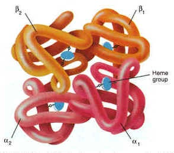  
Tableau I : Formules moléculaires des hémoglobines humaines

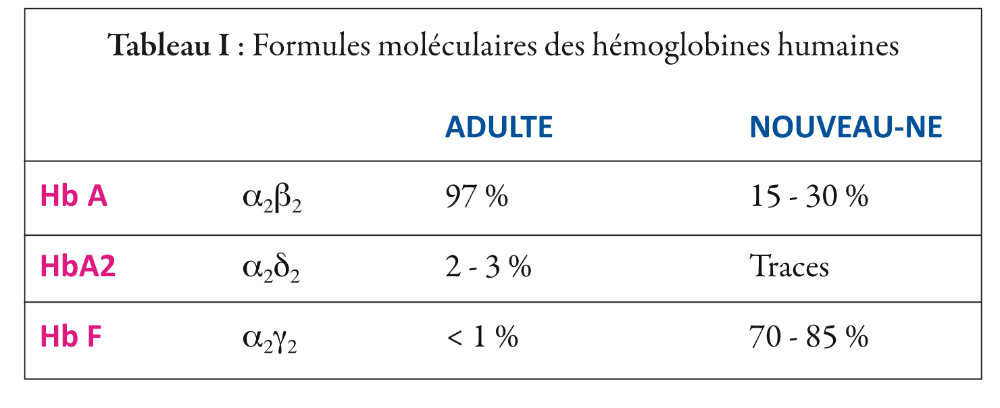

## I. Physiopathologie

L'hémoglobine est une protéine complexe riche en fer contenue dans les globules rouges et chargée du transport de l’oxygène depuis les poumons vers les tissus.  
Les hémoglobinopathies ou hémoglobinoses regroupent l'ensemble des pathologies liées à une anomalie génétique de l'hémoglobine.  
L'anomalie porte sur les chaînes de globine, elle peut être quantitative ou qualitative :

- quantitative : une chaîne peut être absente ou en quantité insuffisante, c'est le cas des thalassémies,
- qualitative : mutation ponctuelle d'un gène codant pour une chaîne.

La drépanocytose est due à une mutation unique et ponctuelle du gène beta-globine situé sur le chromosome 11. Cette mutation est caractérisée par le remplacement d'un acide aminé par un autre (acide glutamique remplacé par une valine).  
Cette hémoglobine anormale est appelée hémoglobine S (HbS).  
Elle présente une diminution de solubilité à l'état désoxygéné et, dans certaines circonstances comme l'hypoxie, l'acidose, la déshydratation, l'HbS se polymérise, entraînant une déformation des hématies en "faucille" d'où le nom de la maladie, encore appelée "anémie falciforme".  
Ces hématies sont alors détruites dans la circulation et cette hémolyse est responsable de l'anémie.  
La drépanocytose est caractérisée par une grande hétérogénéité clinique : formes presque asymptomatiques à formes gravement invalidantes, voire létales.

## II. Génétique

### A. La maladie drépanocytaire SS

Cette maladie héréditaire de l’hémoglobine est transmise de façon autosomale récessive, c'est-à-dire elle atteint les filles et les garçons. Elle s'exprime lorsque les deux chromosomes transmis par les parents aux enfants sont porteurs du gène de la maladie.  
Ainsi, les deux gènes bêta-globine s'expriment à égalité, l'un de provenance paternelle, l'autre d'origine maternelle.  
Lorsqu'un seul chromosome est porteur du gène de l'HbS (transmis par la mère OU par le père), la maladie est dite hétérozygote, le porteur est sain.  
Lorsque les deux chromosomes sont porteurs du gène (transmis par la mère ET par le père), la maladie est dite homozygote, le porteur est malade.  
On distingue ainsi 3 génotypes :  
• AA = homozygote normal,  
• AS = hétérozygote porteur sain,  
• SS = homozygote drépanocytaire malade.  
Il est donc possible de prévoir le risque d'atteinte des enfants en fonction du génotype des parents (cf. tableau II):  
Tableau II : risques de transmission de la drépanocytose

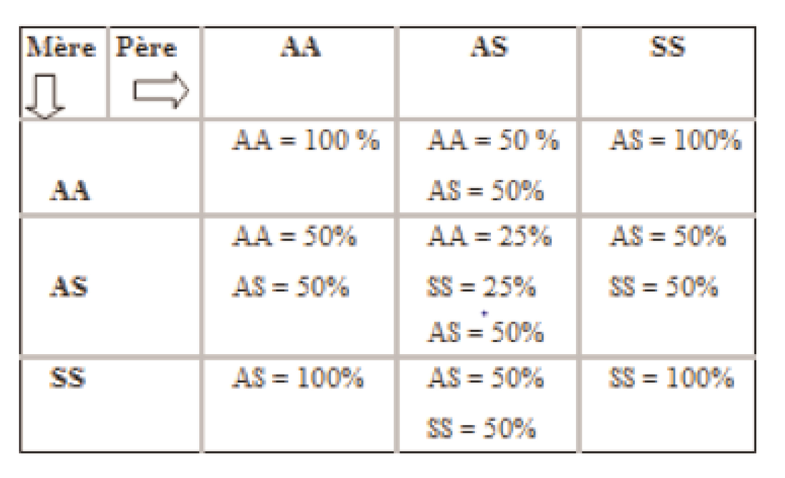

Pour qu'un enfant soit malade, il faut que les deux parents soient transmetteurs, c'est-à-dire porteurs du gène de la drépanocytose.  
• Si les deux parents ne sont porteurs d'aucun gène drépanocytaire (AA/AA), le risque est nul, les enfants seront tous AA.

  
• Si l'un des parents est hétérozygote AS et l'autre parent normal (AS/AA), le risque de transmission du gène est de 50 %, les enfants porteurs étant alors tous hétérozygotes AS.

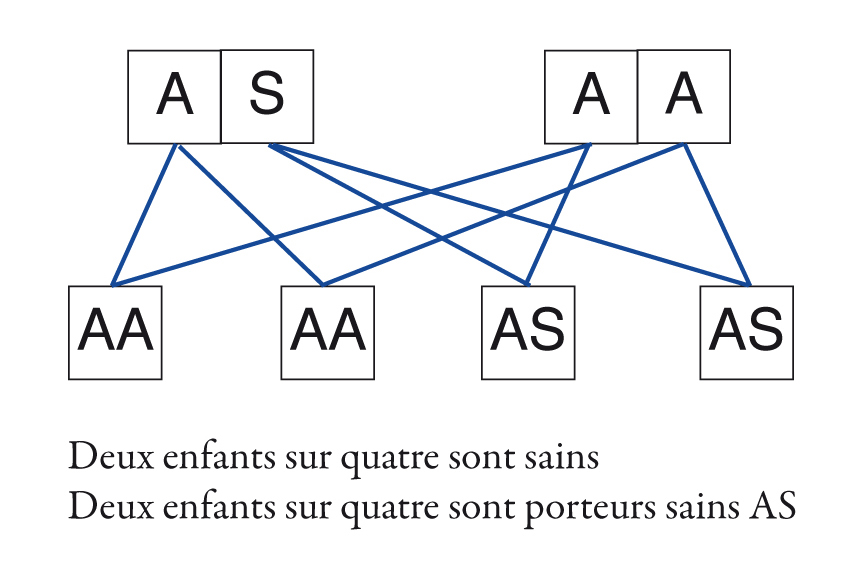  
• Si les deux parents sont hétérozygotes (AS/AS), le risque de transmission du gène est de 75% (risque AS = 50% et risque SS = 25%).

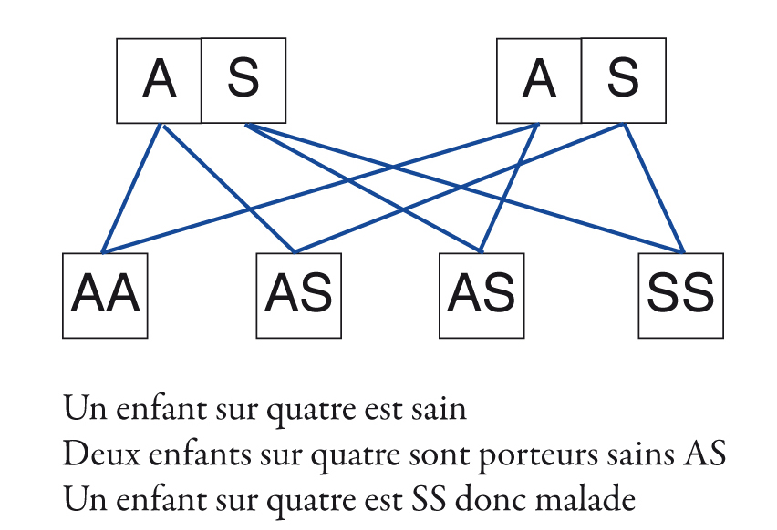  
• Si l'un des parents est normal AA et l'autre homozygote SS (AA/SS), le risque de transmission est de 100 %, tous les enfants seront AS.

  
• Si l'un des parents est hétérozygote et l'autre parent homozygote (AS/SS), le risque de transmission du gène est de 100 % (risque SS = 50% et risque AS = 50%).

  
• Si les deux parents sont homozygotes (SS/SS), le risque de transmission est de 100 %, tous les enfants seront homozygotes SS.

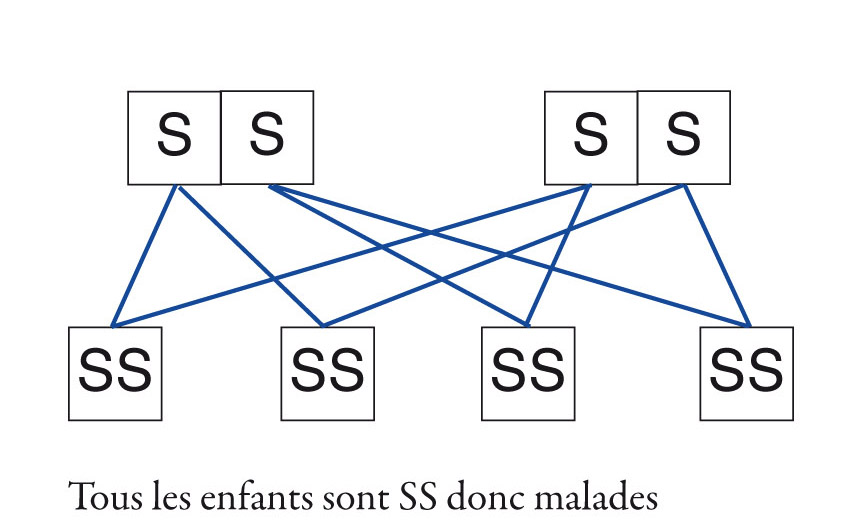  
Important : pour chaque enfant issu de mêmes parents, le risque sera toujours le même. Par exemple, si l'un des parents est hétérozygote et l'autre parent homozygote (AS/SS) et si le premier enfant est SS, le deuxième enfant a toujours le même risque de 50 % d'être aussi SS.

### B. La maladie drépanocytaire SC et S β-thalassémique

**A - L’hémoglobine C** résulte d’une mutation du gène β-globine. Ainsi, les sujets porteurs sains AC sont susceptibles de transmettre le gène C à leur descendance. Si le conjoint d’un porteur sain AC a des enfants avec un porteur sain AS, il existe un risque, une fois sur 4 à chaque grossesse de donner naissance à un enfant SC :

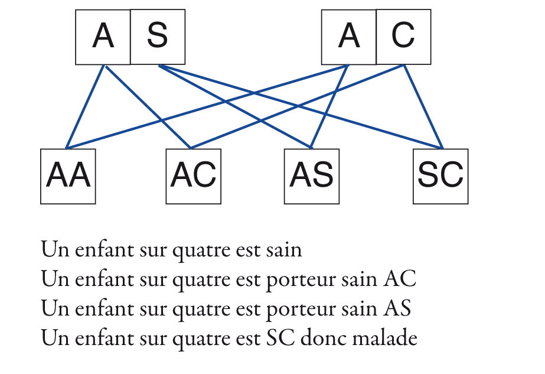  
Les sujets SC sont atteints d’un syndrome drépanocytaire majeur dont l’expression clinique est atténuée par rapport aux malades SS.

**B- La β-thalassémie** résulte de l’absence d’expression d’un gène β-globine (β°thalassémie) ou d’une expression diminuée par rapport à celle d’un gène β-globine normal (β+thalassémie).  
Lorsqu’un sujet porteur sain de la thalassémie (A β-thalassémie) a des enfants avec un porteur sain AS, il existe un risque, une fois sur quatre à chaque grossesse, de donner naissance à un enfant  
S β-thalassémique :

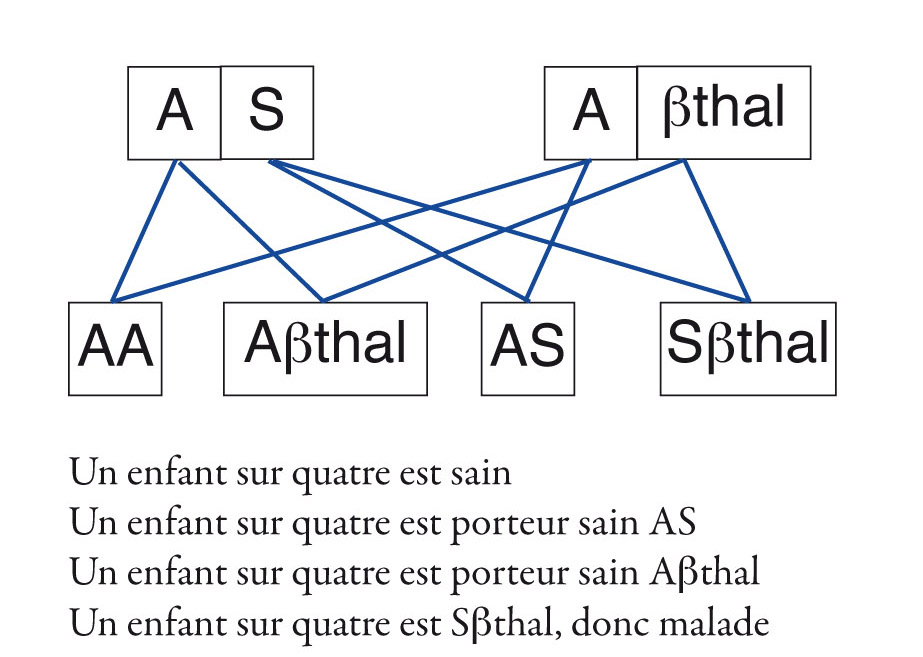

La forme S β°thalassémique a une expression clinique aussi grave que la forme SS, l’expression clinique des formes S β+thalassémiques est atténuée par rapport à celle des malades drépanocytaires SS.

## III. Les étapes du diagnostic

### A. Données anamnestiques

Les données anamnestiques sont essentielles : origine ethnique et/ou géographique, renseignements cliniques, antécédents, circonstances de la demande de diagnostic (enquête familiale, anomalies de l’hémogramme évocatrices d’une maladie de l’hémoglobine, confirmation d’un dépistage néonatal, dépistage systématique, …)

### B. Données biologiques

#### 1 - Prélèvements

Les tests sont réalisés à partir de prélèvements de sang veineux.  
Des prélèvements peuvent être mis sur papier buvard pour être envoyés au centre de référence local ou régional.  
Des tests rapides, pouvant être effectués au lit du malade, à partir de sang capillaire, sont en cours de validation.

#### 2 - Techniques de dépistage

**a. L’hémogramme et le frottis sanguin**

- L’hémogramme précise l'importance de l'anémie qui est variable, le taux d'hémoglobine variant en moyenne de 6 à 10 g/dL.  
  Il est important de connaître le taux d'hémoglobine basal afin d'évaluer les variations par rapport au taux habituel d'un patient. L'anémie est habituellement normochrome normocytaire.  
  La mesure, soit du fer sérique, ou si possible de la ferritine sérique, permet de dépister une éventuelle carence en fer associée.
- L'examen du frottis sanguin révèle la présence d'hématies en forme de "faucille" ou drépanocytes (figure 1), caractéristiques de la maladie. Les hématies ont une forme allongée, aux deux extrémités pointues, elles sont donc différentes des ovalocytes, ou elliptocytes, dont les extrémités sont arrondies (figure 2).

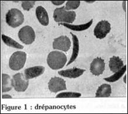

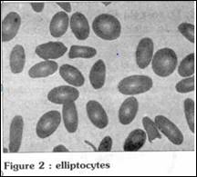

La présence de corps de Jolly accompagne une atrophie splénique, on peut également retrouver une polychromatophilie, des ponctuations basophiles. La présence d‘hématies cibles oriente vers une autre anomalie de l’hémoglobine associée.  
Le nombre d'érythroblastes circulants est variable, pouvant être très élevé au cours des accidents hémolytiques aigus. Il est très important de les compter et de rectifier éventuellement le chiffre des globules blancs (les érythroblastes sont nucléés et comptés avec les leucocytes par les automates).  
Il s'agit essentiellement d'érythroblastes polychromatophiles ou acidophiles (figures 3 et 4).

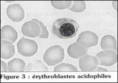

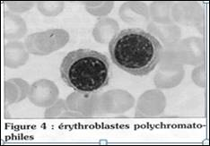

- Le taux de réticulocytes est très élevé, sauf en cas d'érythroblastopénie ;
- l'hémolyse est confirmée par la bilirubine libre qui est augmentée et l'haptoglobine qui est effondrée.

**b. Le test d’EMMEL ou test de falciformation**  
L'examen du frottis sanguin peut être négatif, il est alors possible de déclencher au laboratoire la falciformation des globules rouges en les plaçant dans un milieu désoxygéné, soit en rajoutant du métabisulfite au sang du malade, soit en créant artificiellement une atmosphère pauvre en oxygène.  
On observe alors à l'état frais, entre lame et lamelle, les hématies qui prennent progressivement la forme typique en "faucille".  
Le test d’Emmel révèle la présence de l’hémoglobine drépanocytaire S dans les hématies. Ce test a une haute valeur qualitative mais il ne permet pas de différencier les porteurs sains AS des sujets atteints d’un syndrome drépanocytaire majeur (SS, SC, Sβ°thalassémique, Sβ+thalassémique …).  
Il s’agit d’un test de dépistage de l’hémoglobine S, mais non d’un test diagnostique des différentes formes génétiques de la drépanocytose.  
De ce fait, en pratique courante, il est utilisé le plus souvent comme test d’exclusion.

**c. Le test d'ITANO ou test de solubilité**  
C’est un test de précipitation de l’hémoglobine S d’un hémolysat en présence d’hydrosulfite de sodium.  
Ce test est très utile, mais n'est que semi-quantitatif et n'est pas spécifique à 100 %, car d'autres hémoglobines, plus rares, peuvent également précipiter.  
Il peut être faussement négatif chez le nouveau-né ou chez un porteur avec un taux faible d' HbS.  
Comme pour le test d'EMMEL, un test positif ne permet pas de préciser s'il s'agit d'une drépanocytose homozygote ou hétérozygote.

#### 3 - Les techniques phénotypiques

Les techniques phénotypiques d’étude de l’hémoglobine font appel aux méthodes biochimiques de séparation des protéines. Il s’agit :

1°) d'**électrophorèses à différents pH** utilisant différents supports, électrophorèse à pH alcalin ou acide :

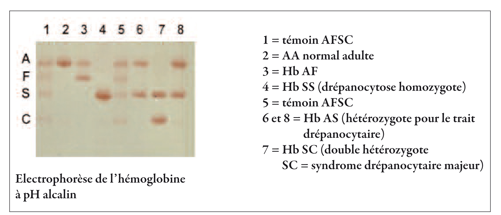  
Elles permettent de poser le diagnostic en mettant en évidence la présence d'une fraction d'hémoglobine de migration différente des hémoglobines normales.  
Elles permettent également de différencier les formes homozygotes des formes hétérozygotes, ainsi que la présence éventuelle d'une autre anomalie de l'hémoglobine associée (autre mutation ou thalassémie).

2°) de l’**isoélectrofocalisation** (IEF) : les hémoglobines migrent à leur point isoélectrique dans un gradient de pH. Cette technique est plus sensible et plus spécifique mais également plus coûteuse. C'est la méthode de choix pour les nouveau-nés. Le prélèvement peut être réalisé sur du papier buvard et être transmis dans un laboratoire de référence utilisant cette technique.

3°) de l’**électrophorèse capillaire** ;

4°) de la **chromatographie liquide à haute pression** (CLHP) avec des temps de rétention différents selon les objectifs définis par le biologiste.  
Ces données phénotypiques sont jointes aux données anamnestiques et à celles de l’hémogramme pour établir un diagnostic.

**L'utilisation de ces techniques appelle les précisions suivantes :**

1.  Un seul test ne permet pas d’établir un diagnostic de certitude, il ne constitue ainsi qu’un test de dépistage ou de première intention. Ce n’est que la réalisation d’au moins 2 tests différents qui permet de porter un diagnostic. Ainsi, selon le contexte un même test peut soit n’avoir qu’une valeur de dépistage ou de 1ère intention soit avoir une valeur diagnostique quand il confirme une analyse précédente.
2.  Les techniques d'électrophorèse à différents pH et l'isoélectrofocalisation donnent des informations qualitatives et semi-quantitatives. Les techniques d'électrophorèse capillaire et de CLHP donnent des informations qualitatives et quantitatives. Ces dernières sont indispensables pour mesurer le pourcentage des différentes fractions d'hémoglobine. En outre, elles ont l'avantage d'être semi-automatisées et de permettre de traiter de nombreux échantillons au cours d'une seule manipulation.
3.  La drépanocytose constitue un cas particulier mais fréquent en pratique courante. En effet, le test d’Emmel et le test d’Itano permettent d’identifier la présence de l’hémoglobine drépanocytaire S et selon le contexte, d’avoir soit une valeur de dépistage, soit une valeur diagnostique comme indiqué ci-dessus. Cependant ces deux tests à haute valeur qualitative ne permettent pas de préciser les différentes formes génétiques de drépanocytose, AS, SS, SC, etc. (voir ci-dessous).

#### 4. Les techniques génotypiques

Les techniques génotypiques sont celles de l’étude des gènes et de l’ADN au laboratoire. Il s’agit de méthodes d’amplification moléculaire suivies d’analyse indirecte (RFLP) ou directe (oligosondes spécifiques - DOTBLOT- PCR en temps réel) ou de séquençage au locus d’intérêt.  
Les indications de ces techniques seront précisées ci-dessous.

#### 5. Interprétation des résultats

**1. La drépanocytose**  
**a. La drépanocytose hétérozygote (trait AS ou porteur sain AS)**  
La concentration d’hémoglobine circulante et la morphologie érythrocytaire sont normales ainsi que le VGM chez les sujets AS. L’étude de l’hémoglobine montre un pourcentage d’Hb A toujours supérieur à celui de l’Hb S drépanocytaire. Le pourcentage d’Hb A2 est normal ou légèrement augmenté.  
**b. Les syndromes drépanocytaires majeurs (SDM)**  
Le tableau III précise les données hématimétriques (Hb et VGM) et celles de l’étude de l’hémoglobine des 4 principaux SDM : drépanocytose homozygote SS, hétérozygotes composites SC, Sβ+ thalassémique, Sβ0 thalassémie. L’analyse du frottis sanguin montre constamment des drépanocytes sur lame et des cellules  
cibles.  
Il existe d’autres SDM, plus rarement rencontrés en pratique courante correspondant aux hétérozygotes composites S-D Punjab, S-Lepore, SE, S-OArab en particulier.

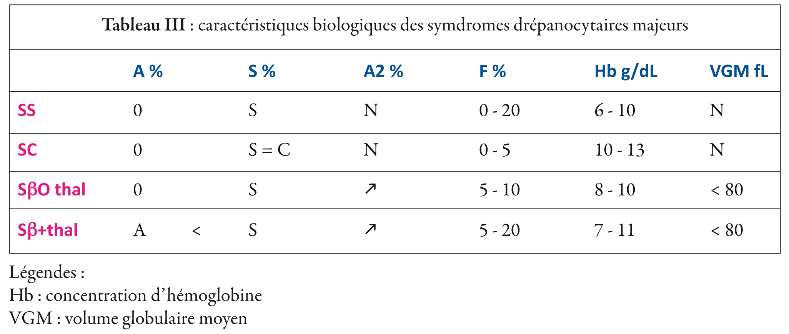

**2. Autres hémoglobinopathies courantes**  
Parmi les autres anomalies des gènes -globine, l’hémoglobine D Punjab est rencontrée chez les Indiens et l’hémoglobine OArab chez les Caucasiens ; associées à l’hémoglobine S, elles donnent des SDM (S-D Punjab, S-OArab)  
Citons l’hémoglobine Hope fréquente chez les Africains de l’Ouest, qui ne constitue pas une hémoglobine générant une pathologie du globule rouge, même quand elle est associée à l’hémoglobine S.

#### 6. Indications du diagnostic génotypique

Les analyses moléculaires ne se conçoivent qu’en complément d’analyses phénotypiques. En pratique, il existe 2 situations qui peuvent nécessiter de recourir à une technique de génétique moléculaire pour confirmer un diagnostic ou éclairer un conseil génétique comportant éventuellement un diagnostic prénatal :

- Analyse d’un SDM, notamment la différenciation d’une drépanocytose SS et d’une S0-thalassémie quand une étude familiale n’a pu être réalisée, mais aussi les formes S+thalassémie, S-D Punjab, S-OArab, SE.
- La confirmation du diagnostic biologique des hétérozygotes AS dans le cadre d‘une demande de prise en charge pour un diagnostic préimplantatoire.

## IV. Facteurs modulant la maladie drépanocytaire

Le taux d'HbF :  
C'est un facteur pronostique important puisque des taux élevés, supérieurs à 10 %, inhibent partiellement la falciformation. L'HbF, visible à l'électrophorèse, est au mieux dosée par HPLC.

## V. Diagnostic prénatal

Il est possible, lorsque les deux parents sont porteurs de la mutation, de proposer un diagnostic prénatal :

- par biopsie de trophoblaste à partir de la 11ème semaine, de grossesse,
- par amniocenthèse à partir de la 17 ème semaine.

### En pratique

Sur le prélèvement de sang veineux :  
→ Numération globulaire (hémoglobine) et frottis (drépanocytes)  
→ Test d’Emmel :

- si le test est négatif => fin des tests
- si le test est positif => selon les possibilités locales :  
  - examens complémentaires (électrophorèse de l’Hb)  
  ou - prélèvement (capillaire) sur papier buvard et envoi au centre de référence.

## VI. Conclusions

Le diagnostic de drépanocytose, évoqué par la clinique ou recherché dans le cadre d'une enquête familiale, est biologique. La présence, spontanée ou provoquée, de drépanocytes sur frottis sanguin est caractéristique de la maladie, mais c'est l'étude de l'hémoglobine qui permet d'affirmer le diagnostic. L'électrophorèse de l'hémoglobine est le plus souvent suffisante pour poser le diagnostic de drépanocytose.  
Le diagnostic biologique des maladies génétiques de l’hémoglobine va du simple (hémoglobines courantes) au compliqué (hémoglobines rares). Des techniques d’analyses phénotypiques faciles à mettre en œuvre peuvent répondre au plus grand nombre des demandes diagnostiques.  
Chaque laboratoire doit définir sa compétence et doit travailler en réseau avec d’autres laboratoires spécialisés dans l’identification des mutants peu fréquents et dans les analyses phénotypiques.  
Les biologistes qui portent les diagnostics de maladies génétiques de l’hémoglobine doivent prendre conscience qu’ils engagent leur responsabilité dans le domaine du conseil génétique, même en validant un résultat apparemment aussi simple que celui du trait AS ou celui de β-thalassémie hétérozygote.

***Glossaire***  
**Ontogénie** : développement progressif d'un organisme depuis sa conception jusqu'à sa forme mûre.  
**Gène** : "morceau" d'ADN, unité d'hérédité contrôlant un caractère particulier, située à un endroit précis (locus) sur un chromosome.Locus = emplacement précis d'un gène sur un chromosome.  
**Allèle** : une des différentes formes que peut prendre un gène sur un chromosome. Les allèles d'un gène occupent la même position (locus) sur un chromosome.
