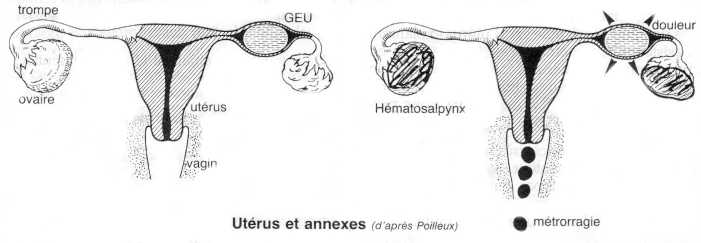
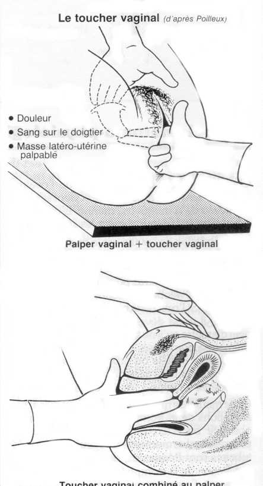
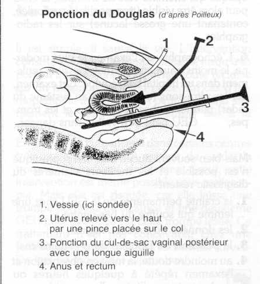
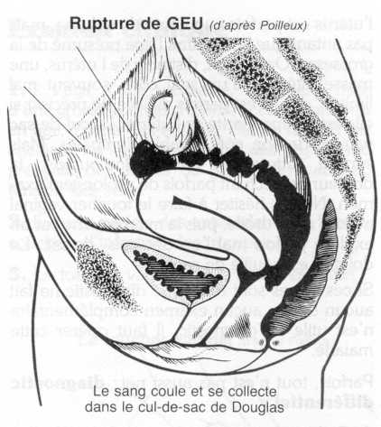

La grossesse extra-utérine est une **urgence chirurgicale** à laquelle il faut toujours penser chez une femme en âge d'être enceinte et présentant des douleurs abdominales, a fortiori un état de choc hémorragique.

## **Rappel anatomo-physiologique**

Chez la femme, l'ovule provient de l'ovaire, chemine dans la trompe utérine et vient se nider au niveau de la muqueuse utérine. L'ovulation a lieu vers le 15e jour suivant les règles.

La fécondation de l'ovule par le spermatozoïde a lieu au niveau de la trompe, l'oeuf ainsi fécondé commence à se développer tout en cheminant vers l'utérus pour y nider définitivement et se développer pendant les neuf mois de grossesse. Si l'oeuf reste bloqué au niveau de la trompe, il va se développer dans un tube de petit diamètre qu'il ne tardera pas à faire saigner (hématosalpynx), puis à rompre entrainant une hémorragie brutale ou progressive suivant les cas aboutissant à la mort de la mère si elle n'est pas opérée à temps. L'oeuf n'est jamais viable.

Cette mauvaise migration de l'oeuf est due à des altérations de la trompe utérine qui se trouve obstruée ou scléreuse et ne permet plus la progression harmonieuse de l'oeuf. Ces lésions tubaires sont fréquentes, dues à des séquelles d'infection de la trompe salpingite à gonocoques ou à d'autres germes) mais aussi séquelles de tuberculose génitale, ou anomalie de la muqueuse tubaire (endométriose). Nous ne parlerons pas ici des exceptionnelles grossesses abdominales (évolution complète de la grossesse en dehors des trompes et de l'utérus au milieu des anses intestinales, aboutissant à la mort de l'enfant et très souvent de la mère).

Plusieurs tableaux cliniques sont possibles selon que la grossesse extra-utérine est vue au début de son évolution, lorsqu'elle n'a encore grossi que dans la trompe sans la rompre (hématosalpynx) ou qu'elle est vue au stade de rupture de la trompe avec hémorragie interne, avec là encore deux aspects différents selon l'importance et surtout la rapidité du saignement. Le diagnostic peut être parfois difficile, mais chez une femme en âge d'être enceinte, il faut toujours penser à la possibilité de GEU et examiner la malade dans ce sens (interrogatoire, toucher vaginal).

**_"Lorsque l'on pense toujours à la GEU,_ on n'y pense pas encore assez. "**

**(Henri Mondor)**

## **Clinique**

**_Première éventualité:_**

**l'hématosalpynx**

L'oeuf à fait saigner la trompe où il forme un hématome parfois volumineux et douloureux, mais il n'a pas encore réellement rompu celle-ci. Cet hématome distend la trompe expliquant les douleurs, il s'écoule vers l'utérus expliquant l'existence de métrorragies (saignement en provenance de l'utérus s'écoulant par le vagin mais survenant en dehors d'une période normale de règles). La malade va donc présenter:

**1.** Des douleurs parfois très banales au niveau du bas ventre: pesanteur, tiraillement, parfois plus vives évoluant par paroxysme. Ne pas examiner cette femme, ne pas lui faire de toucher vaginal serait une lourde faute.

**2. Les métrorragies:** la malade peut s'en plaindre, mais souvent elle n'y prête guère attention et c'est votre interrogatoire qui les recherchera. Ce saignement survient en dehors des règles (et non pas du dernier saignement) la précision des questions est ici fondamentale, trop souvent la malade interprète ces saignements comme des règles irrégulières ou un peu prolongée et si vous vous fiez à sa première réponse spontanée, rien ne vous alarmera. Recherchez avec précision l'anomalie: cette femme n'a-t-elle pas eu en fait trois fois ses " règles " dans le mois ? L'écoulement sanglant n'a pas l'aspect habituel: il est brunâtre, épais poisseux, peu abondant, évoluant par intermittence, ou bien rouge avec des caillots.

Ces pertes peuvent même passer totalement inaperçues et c'est le doigtier du toucher vaginal qui reviendra souillé de vieux sang.

Devant ces deux signes, vous devez penser à la GEU et examiner minutieusement la malade.

## **Examen clinique**

**1.** Il s'agit d'une grossesse, anormale, mais d'une grossesse quand même: cette femme est en âge d'avoir des enfants, elle se sait parfois enceinte car elle a un retard des règles, elle présente des signes de grossesse: nausées, tension des seins.

**2.** Il existe parfois des antécédents de fausse-couches, d'infection des trompes.

**3.** Le toucher vaginal est le temps essentiel:

l'utérus est parfois augmenté de volume, mais pas autant que le voudrait l'âge présumé de la grossesse. On perçoit, distincte de l'utérus, une masse latérale, d'un seul côté, souvent mal limitée, dont il est parfois difficile de préciser si elle est indépendante de l'utérus. Le cul-de-sac vaginal de son côté semble " empâté-. Mais surtout, cette masse est très douloureuse, la douleur empêchant parfois de prolonger l'examen. Ne pas hésiter à faire le toucher vaginal avec la main droite, puis la main gauche car on explore parfois mal l'un des culs-de-sac. Le doigtier est souillé de sang.

Si ces signes sont réunis, le diagnostic ne fait aucun doute, aucun examen complémentaire n'est utile au diagnostic, il faut opérer cette malade.

Parfois, tout n'est pas aussi net:

### **diagnostic** **différentiel :**

**1.** Si les pertes vaginales sont abondantes, rouges avec caillots, chez une femme suspecte d'être enceinte, on peut hésiter avec une **fausse-couche** spontanée ou provoquée, mais même si la notion de manoeuvre abortive est connue, il faut se méfier, la grossesse a pu évoluer en fait au niveau de la trompe.

Deux signes doivent faire penser qu'il s'agit d'une GEU:

*   le toucher vaginal qui retrouve la masse douloureuse latéro-utérine,

*   le curetage ne ramène pas ou peu de débris, on profite de l'anesthésie générale pour refaire un toucher vaginal avec une main appuyant sur l'abdomen, la masse est alors souvent perçue.

**2.** Si les douleurs sont violentes avec des pertes sales, on peut penser à une salpingite, mais dans la GEU la fièvre dépasse rarement 38°, alors que dans la salpingite elle atteint 38°5-40°. Le toucher vaginal est douloureux dans les deux cas.

**3.** Une masse latéro-utérine douloureuse peut faire discuter une torsion de kyste

de l'ovaire, de toute façon il faut opérer rapidement.

Dans ces cas plus difficiles, certains examens complémentaires sont utiles, mais pas toujours possibles à effectuer:

**1.** La réaction de grossesse (biologique ou immunologique) peut montrer que la malade est enceinte. Mais une réaction négative n'élimine pas le diagnostic.

**2.** La ponction du Douglas:

On explore le vagin et le col utérin avec un spéculum, le col utérin est relevé par une pince vers l'avant, et une longue aiguille (type ponction lombaire) est enfoncée dans le cul-de-sac postérieur du vagin pour atteindre le cul-de-sac de Douglas. Si on aspire, peu de sang noirâtre ou du sang lysé (liquide brunâtre), le diagnostic est certain. Cette manoeuvre est simple, sans danger et indolore. Mais la ponction peut rester " blanche " si il n'y a pas de sang épanché dans le Douglas. En général, l'hématosalpynx est rarement pur et un début de fissure ou un suintement sanguin collecté dans le Douglas est toujours présent.

**3.** La numération globulaire peut montrer une anémie.

**4.** La coelioscopie n'est envisageable qu'à l'hôpital. Elle consiste, grâce à un matériel optique introduit sous anesthésie générale par une courte ouverture de l'abdomen sous le nombril, a observer les organes pelviens: la trompe est alors vue, gonflée, hémorragique avec un peu de sang dans le Douglas.

**5.** L'hystéro-salpyngographie, possible seulement dans un service de radiologie bien équipé, consiste à opacifier l'utérus par du produit opaque qui chemine vers les trompes, la GEU peut alors être visible (trompe dilatée, refoulée, contenant une grosse lacune) sur les radiographies.

**6.** L'échographie est l'examen le plus moderne, le moins traumatisant, mais possible seulement dans un hôpital bien équipé. Cet examen, par les ultra-sons (comparable au système du radar) permet d'observer l'utérus et les trompes, et la GEU peut être visible sans danger.

Mais bien souvent aucun examen sophistiqué n'est possible et les meilleurs éléments du diagnostic restent:

**1.** la crainte permanente de la GEU chez une femme qui souffre du bas-ventre,

**2.** les données du toucher vaginal,

**3.** la ponction du Douglas dans certains cas,

**4.** au moindre doute, la mise en observation et l'examen répété à quelques heures ou quelques jours d'intervalles quand on se trouve à l'hôpital. Ou envoyer la malade à l'hôpital si on travaille dans un dispensaire.

### **_Deuxième éventualité_**

**la rupture de GEU avec hémorragie progressive**

La GEU rompt la trompe, la malade saigne de façon permanente mais peu abondante, le sang coule dans l'abdomen (hémopéritoine) et se collecte dans le cul-de-sac de Douglas (hématocèle rétro-utérine). Le tableau clinique est plus alarmant car:

**1.** Cette femme souffre, elle se plaint depuis plusieurs heures ou plusieurs jours du bas-ventre, les douleurs vont en empirant. La palpation réveille cette douleur et dans certains cas on trouve une véritable défense ou une contracture faisant penser à une péritonite (ce signe n'est pas marqué dans les livres, mais il existe, je l'ai constaté plusieurs fois).

**2.** Les métrorragies sont souvent plus évidentes, de sang noirâtre, abondantes.

**3.** L'interrogatoire retrouve la notion de retard de règles, ou de "règles irrégulières", ou la notion de grossesse connue. Les antécédents de salpingite sont parfois retrouvés.

**4.** Le toucher vaginal déclenche une très vive douleur au niveau du cul-de-sac de Douglas, intolérable, réveillant cette femme souvent fatiguée par le saignement. L'analyse des autres signes du toucher vaginal est souvent impossible tant la douleur est vive (cri du Douglas), cul-de-sac empâté, masse latéro-utérine ne sont pas toujours palpés. Le doigtier revient souillé de sang.

**5.** Cette femme saigne abondamment, mais la lenteur de ce saignement l'a rendu supportable de longs jours: la malade est fatiguée, elle a présenté des vertiges ou des pertes de connaissance lorsqu'elle est debout, elle a des nausées.

Elle est pâle, les conjonctives, la langue, la paume des mains, les régions sous-unguéales sont décolorées. Souvent, le sang a tendance à être résorbé par le péritoine et ceci entraîne une petite fièvre à 38°-38°2 et un subictère conjonctival. Le pouls est rapide, la tension artérielle basse, pincée.

**6.** En cas de doute, la ponction du Douglas ramène alors du sang noirâtre.

Le diagnostic est certain, il faut opérer cette malade rapidement. Si vous êtes loin de l'hôpital, placez lui une perfusion pour le transport. Si vous êtes à l'hôpital: perfuser, un seul examen complémentaire est nécessaire: le groupe sanguin de la malade et celui des accompagnants pour qu'ils donnent rapidement du sang pour transfuser la malade pendant l'opération.

### **_Troisième éventualité_**

**la rupture cataclysmique de GEU**

Le GEU fait exploser brutalement la trompe et fait saigner abondamment, ou bien les choses ont tardé et l'hémorragie, bien que lente, a fini par vider la malade de son sang et elle arrive dans un état catastrophique de choc hémorragique. Le tableau est simple:

Il s'agit d'une femme jeune en état de choc hémorragique. Une seule cause est possible (en dehors des traumatismes de l'abdomen): la rupture de GEU. Cette femme est apportée d'urgence, pâle, assoiffée, agitée, en sueurs, son pouls est rapide, filant, imprenable, sa tension est basse, pincée, imprenable (d'ailleurs on ne trouve pas le tensiomètre, qui de toute façon est pourri). Le toucher vaginal réveille une très vive douleur et le doigtier est plein de sang. Le ventre est douloureux, parfois contracture.

Le diagnostic est évident, il faut perfuser rapidement la malade avec si possible des grosses molécules. L'emmener au bloc opératoire où elle sera groupée et opérée le plus vite possible. Dès que le sang sera disponible, on la transfusera. De la rapidité de vos gestes dépend la vie de cette malade:

*   perfusion efficace et transfert rapide à l'hôpital si vous êtes en brousse, ne perdez pas votre temps avec l'hydrocortisone.

*   _ne pas perdre son temps à perfuser adrénoxyl_ _et vitamine K_ et autres produits chers et inutiles.

*   à l'hôpital, perfuser, grouper et envoyer au bloc le plus vite possible.

## **Le traitement**

Il est simple, il sauve la vie. L'intervention consiste à enlever la trompe malade, jusqu'à sa portion intra-utérine pour éviter toute récidive sur un moignon laissé en place. En cas d'hémopéritoine important, on peut récupérer stérilement le sang pour le retransfuser à la malade.

En dehors de l'urgence et dans certains centres très modernes on peut essayer de garder la trompe en enlevant simplement l'oeuf, cette intervention est même possible sous coelioscopie. Mais elle est risquée, car elle laisse une trompe porteuse de cicatrice et une deuxième GEU peut avoir lieu sur cette trompe lésée. Ce traitement n'est pas concevable chez une femme ne pouvant pas être facilement surveillée lors de grossesses ultérieures.

_Développement et Santé, n°47, octobre 1983_