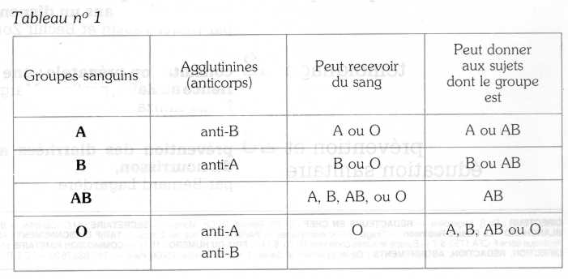
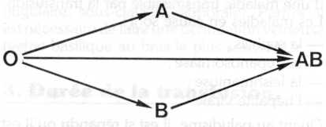
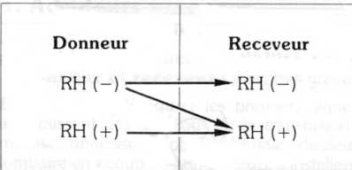

Les règles de la transfusion découlent de la connaissance des groupes sanguins. Elles sont impératives. Leur inobservance risque d'entraîner la mort du malade. 
La transfusion est le transfert de sang d'un sujet donneur vers un sujet receveur. Elle n'est possible que si ces deux sujets ont des sangs compatibles. 
Cette notion de compatibilité repose sur la connaissance des groupes sanguins.

## I. Les groupes sanguins

### 1. Définition

Les groupes sanguins sont déterminés par des substances de nature protidoglucidique appelées antigènes, situés sur la surface des globules rouges. Il existe de nombreux systèmes de groupes sanguins, mais les deux seuls à prendre en compte ici pour la transfusion sont: le système ABO et le système rhésus.

### 2. Le système de groupe ABO

Dans ce système, le sang porte le nom de l'antigène situé à la surface du globule rouge. Il existe deux types d'antigène: A et B, permettant de définir quatre groupes.

**Groupe A :** les globules rouges portent à leur surface l'antigène A.

**Groupe B :** les globules rouges portent à leur surface l'antigène B.

**Groupe AB :** les globules rouges portent à leur surface les antigènes A et B.

**Groupe O :** les globules rouges ne portent aucun antigène, ni A, ni B.

Dans le sang de chacun de ces groupes A, B, AB et O, il existe des substances, antagonistes des antigènes, appelées anticorps (ou agglutinines) qui se répartissent ainsi:

*   Le sang de groupe A possède seulement l'anticorps anti B.

*   Le sang de groupe B possède seulement l'anticorps anti A.

*   Le sang de groupe O possède les anticorps anti A et anti B.

*   Le sang de groupe AB ne possède pas d'anticorps.

Compte tenu de ces données, on peut dresser le tableau de compatibilité dans le système ABO (_tableau n°1_), celui-ci étant basé sur le fait que **l'accident transfusionnel le plus** **dangereux est l'agglutination des hématies du donneur par les agglutinines du** **receveur** (c'est-à-dire une réaction entre les antigènes du donneur et les anticorps du receveur).

Un autre schéma, facile à retenir, est le suivant: la flèche indiquant la transfusion possible.

Le groupe O est appelé " donneur universel " (il peut donner à tous les autres groupes). Le groupe AB, " receveur universel " (il peut recevoir de tous les autres groupes).

### 3. Le système de groupe rhésus

Il est défini par la présence ou l'absence dans le sang, de l'antigène D. Les sujets dont le sang contient l'antigène D sont appelés rhésus (+). Ceux qui n'en contiennent pas sont appelés rhésus (-).

Contrairement au système de groupe ABO, il n'y a pas, à l'état naturel d'anticorps anti D chez les rhésus (-) ni, bien sûr, chez les rhésus (+). Ceux-ci ne peuvent apparaître qu'après transfusion de sang rhésus (+) (= portant l'antigène D) à un rhésus (-), ou bien chez une mère rhésus (-) dont le foetus est rhésus (+).

Le schéma de compatibilité dans le système rhésus est donc en théorie le suivant:

Mais il faut savoir qu'en situation de grande urgence, un individu rhésus (-) non immunisé (= qui n'a pas subi de transfusion) peut être transfusé en sang rhésus (+) sans risque d'accident (il faut éliminer avec certitude toute notion de transfusion antérieure ou de grossesse).

Enfin, il faut savoir qu'en Afrique, les sujets RH (-) sont peu nombreux.

### 4. Détermination des groupes sanguins

#### a. Système ABO (technique de Beth Vincent)

Il faut disposer de sérums-tests d'origine humaine anti A, anti B et anti AB, qui doivent être conservés à + 4° et sont valables dans les limites des dates de péremption.

*   Déposer sur une plaque de verre (ou un carton glacé) :

*   une goutte de sérum test anti-A
*   une goutte de sérum test anti-B
*   une goutte de sérum test anti-AB

*   Déposer, en face de chaque goutte de sérum-test, une goutte du sang à grouper.

*   Mélanger successivement les gouttes face à face, avec par exemple, le fond d'un tube (que l'on essuie entre chaque opération).

*   Donner à la plaque un léger mouvement de balancement.

*   Observer le résultat au bout de une à trois minutes :

*   l'agglutination des hématies donne à la goutte un aspect de " brique pilée ";
*   en l'absence d'agglutination, la goutte garde une teinte homogène (schéma _2)._

#### b. Système rhésus

C'est le même principe, avec un sérum-test anti D. Une agglutination indique un sang rhésus (+); l'absence d'agglutination, un sang de rhésus (-). Mais, il faut chauffer la lame vers 37° (sinon, il y a un risque de fausse négativité de la réaction).

**Choix des donneurs**

En dehors des compatibilités de groupe, il faut encore s'assurer par l'interrogatoire et l'examen clinique que le donneur n'est pas porteur d'une maladie transmissible par la transfusion. Les maladies en cause sont :

*   la syphilis ;
*   la trypanosomiase ;
*   la leishmaniose ;
*   l'hépatite virale.

Quant au paludisme, il est si répandu qu'il est bon d'administrer systématiquement au receveur des antipaludéens.

On évite, bien sûr, de prélever du sang aux drépanocytaires homozygotes.

Dans les grands centres hospitaliers, il existe une " banque du sang " qui organise la collecte du sang, la détermination des groupes, le conditionnement et l'étiquetage des flacons, la conservation et la " gestion " du stock.

En brousse, en cas d'urgence, il est possible de tester le sang des membres de l'entourage du malade ou du blessé, et de prélever les donneurs compatibles. La transfusion pose d'ailleurs souvent des problèmes psychologiques tant aux donneurs qu'aux receveurs.

## II. Réalisation pratique

### 1. Prélèvement du donneur

On ponctionne une grosse veine du donneur à l'avant-bras ou au pli du coude, l'aiguille étant solidaire d'une tubulure reliée à un bocal stérile contenant un milieu spécial évitant la coagulation (ACD: acide citrique - citrate - dextrose) (en général 75 à 100 ml de solution pour 300 à 400 ml de sang.

Une fois la ponction terminée, on homogénéise le sang en remuant doucement le flacon, et on branche le receveur par un système de tubulure munie d'un filtre.

### 2. Voies d'abord

Ce sont les mêmes que pour les simples perfusions. En pratique courante, on utilise une voie périphérique (au bras, dos de la main, saphène au niveau de la malléole interne).

En milieu hospitalier, on est parfois tenu de faire un abord de gros troncs veineux centraux (jugulaire, sous-clavière, fémorale). Parfois, il est nécessaire de faire une dénudation veineuse (veine basilique au bras le plus souvent).

### 3. Durée de la transfusion.

Le débit de la transfusion doit s'adapter aux besoins. En cas d'hémorragie abondante, on veille à maintenir une tension artérielle correcte.

## III. Accidents de la transfusion

Ils font tout le danger de la transfusion. Les uns sont précoces, les autres secondaires.

### 1. Accidents précoces

#### a. Accident par incompatibilité entre donneur et receveur : il est très grave

**Description clinique**

les premiers signes apparaissent dès le début de la transfusion: malaise, angoisse, céphalée brutale, douleur lombaire en " coup de barre ". Puis, s'installent un état de choc et un syndrome hémorragique. Les quelques urines émises sont hémoglobinuriques. L'évolution se fait en quelques heures vers une insuffisance rénale avec ictère (traduisant l'hémolyse). Chez un malade dans le coma, ce syndrome peut être particulièrement trompeur.

#### b. Syndrome frisson-hyperthermie

Il est dû à l'existence de substances pyrogènes. Il se traduit par un long frisson précédant une fièvre à 38-39° durant 12 à 24 heures.

#### c. Réactions allergiques

On peut voir survenir

*   un oedème de Quincke ;

*   un urticaire ;

*   une crise d'asthme.

#### d. Surcharge circulatoire

Liée à un débit de transfusion trop rapide, avec signe d'oedème aigu du poumon.

**Transfusion en urgence**

Dans certains cas (enfant atteint de toxicose par exemple), il faut transfuser avec des moyens de fortune et **rapidement.**

**_Par exemple:_** dans une seringue de 20 cc dans laquelle on a introduit préalablement 1 mg d'héparine (5 mg dans 500 cc de sérum physiologique pour 100 ml de sang) ou du citrate (10 ml pour 100 ml de sang) on prélève le sang du donneur, on réinjecte immédiatement au receveur (10 cc par kg pour corriger un choc).

Bien entendu le groupe sanguin sera immédiatement vérifié !

#### e. Embolies

Par caillot. Le filtre sur la tubulure est indispensable. Celle-ci doit être bien purgée, avant d'unir l'embout à l'aiguille.

#### f. Intoxication par le citrate

Entraînant une hypocalcémie.

### 2. Accidents secondaires

Il s'agit surtout de la transmission de maladies infectieuses ou parasitaires : hépatite virale surtout, mais aussi : syphilis, paludisme, viroses...

Des transfusions répétées, chez des malades chroniques, peuvent entraîner des surcharges en fer.

## IV. Indications

*   Essentiellement, l'hémorragie aiguë, avec grosses pertes sanguines et constitution d'un état de choc.

*   Les anémies chroniques, en dehors de l'hémorragie, ne nécessitent une transfusion que quand elles sont mal tolérées, ce qui est rare.

<table>

<tbody>

<tr>

<td>

Une transfusion non indispensable est une transfusion dangereuse.

Indications

<ul><li>Toutes les anémies aiguës ou chroniques, en particulier la drépanocytose pendant les crises de déglobulisation (douleurs osseuses persistantes, pneumopathies traînantes).</li><li>Les transfusions sont aussi utiles dans les grandes dénutritions (10 à 15 cc/kg).</li></ul></td>

</tr>

</tbody>

</table>

_Développement et Santé, n°44, avril 1983_