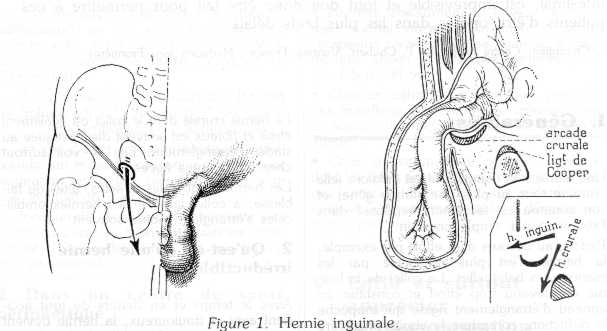
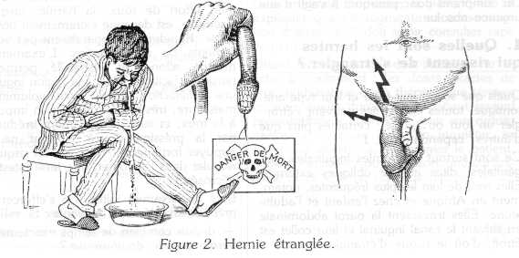
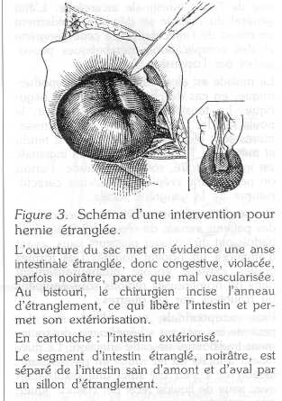

**hernie étranglée**

**par Marc Leclerc du Sablon**\*

. Chirurgien, Centre hospitalier P. Chubert, Vannes, France ; Médecins sans Frontières.

La hernie étranglée est une des urgences les plus fréquentes, dans toutes les régions du monde et à tous les âges de la vie. Le diagnostic en est simple mais le traitement chirurgical ne souffre aucun retard. La gravité potentielle, liée au risque d'occlusion intestinale aiguë et de sphacèle intestinal, est imprévisible et tout doit donc être fait pour permettre à ces patients d'être opérés dans les plus brefs délais.

**I. Généralités**

Une hernie non compliquée est indolore (elle entraîne tout au plus une simple gêne) et son contenu est facilement repoussé dans l'abdomen par simple pression.

Parfois, au décours d'un effort par exemple, la hernie n'est plus réductible par les manoeuvres habituelles. Le collet de la hernie est devenu trop étroit et constitue un anneau d'étranglement rigide qui empêche la réduction, comprime le viscère incarcéré et compromet sa vascularisation (d'abord le retour veineux puis la vascularisation artérielle).

Par définition, une hernie étranglée est donc une hernie devenue douloureuse et irréductible.

Cet étranglement a plusieurs conséquences

- La **douleur,** liée à l'ischémie du viscère étranglé, qui est le plus souvent l'intestin grêle, parfois le côlon, l'appendice, l'épiploon ou l'ovaire.

- La **nécrose** ischémique du viscère ainsi étranglé peut être rapide (quelques heures à un ou deux jours selon les cas).

- L'obstacle causé par l'étranglement d'une anse intestinale provoque une **occlusion** intestinale mécanique d'évolution rapide et grave.

On comprend donc pourquoi il s'agit d'une urgence absolue.

**1.** **Quelles sont les hernies** **qui risquent de s'étrangler ?**

Quels que soient leur taille et leur type anatomique, toutes les hernies peuvent s'étrangler un jour ou l'autre ; certaines plus que d'autres, cependant (*fig*. *1).*

Ce sont surtout les hernies inguinales congénitales, dites encore obliques externes. Elles sont de loin les plus fréquentes, notamment en Afrique et chez l'enfant et l'adulte jeune. Elles traversent la paroi abdominale en suivant le canal inguinal et leur collet est étroit, d'où le risque d'étranglement.

La hernie crurale dont le collet est également étroit et fibreux est souvent diagnostiquée au stade d'étranglement. Elle se voit surtout chez les femmes âgées.

Les hernies inguinales directes, dites de faiblesse, à collet large et les hernies ombilicales s'étranglent moins souvent.

**2. Qu'est-ce qu'une hernie** **irréductible ?**

Avec le temps et en dehors de tout accident aigu et douloureux, la hernie devient progressivement irréductible, du fait de son volume et des adhérences qui se créent au sein d'un sac épaissi et remanié. La hernie reste cependant peu douloureuse et n'est pas étranglée. Le risque d'étranglement et d'occlusion à bas bruit est cependant élevé et l'intervention s'impose dans un délai bref.

**Il.** **Diagnostic**

La hernie inguinale étranglée, la plus fréquente, est prise ici pour exemple *(fig. 2).*

**1.** **La forme aiguë**

La forme aiguë commune est de diagnostic facile. Brutalement, à la suite par exemple d'un effort de toux, la hernie, jusque-là insensible, est devenue extrêmement douloureuse. Rapidement apparaissent des vomissements ou des nausées. L'examen du malade, allongé et déshabillé, permet de retrouver facilement dans la région inguinale une tuméfaction plus ou moins volumineuse mais dure, très douloureuse, non impulsive à la toux, et surtout totalement irréductible par la pression douce (surtout ne pas appuyer fortement+ + +, car on risque de refouler dans l'abdomen une anse intestinale nécrosée.)

Lors de l'examen initial, on s'efforcera de préciser les éléments suivants :

- depuis combien de temps exactement la hernie est-elle douloureuse ?

- date des dernières émissions de selles normales (la diarrhée peut se voir lors d'une hernie étranglée) ou de gaz ;

- existence d'un météorisme abdominal ou d'une défense ;

- prise de la température, du pouls et de la tension;

- recherche de signes de déshydratation (soif, pli cutané, tachycardie, hypotension, oligurie ... ) qui sont des signes de gravité traduisant le retard du diagnostic.

**2. Formes dites " occlusives "**

Parfois la hernie est méconnue et le malade semble souffrir d'une occlusion intestinale aiguë avec douleurs, vomissements, arrêt du transit et météorisme et, seul l'examen minutieux et systématique de tous les orifices herniaires permet de retrouver la hernie étranglée.

On n'oubliera jamais cette recherche très simple si l'on se souvient que la hernie étranglée est la cause la plus fréquente des occlusions mécaniques.

**III. Évolution**

En l'absence de traitement, la striction permanente du contenu herniaire entraîne rapidement le sphacèle et la gangrène par ischémie de l'anse intestinale incarcérée. L'état général du malade se dégrade rapidement en raison de l'infection liée à cette gangrène et des complications métaboliques provoquées par l'occlusion.

Le malade est alors fébrile (parfois hypothermique, en cas de choc), déshydraté, oligurique. La tension est basse et pincée, le pouls rapide, faible et filant. Les vomissements sont fécaloïdes, l'abdomen est tendu et météorisé. Localement la région inguinale est inflammatoire, rouge et chaude. Parfois on perçoit une crépitation gazeuse caractéristique de la gangrène locale.

Ces symptômes sont tardifs et se voient chez des patients venant de régions éloignées qui parfois ont dû voyager plusieurs jours, avant d'atteindre un hôpital équipé. Ces formes graves existent encore malheureusement dans de nombreuses régions sous-équipées ou troublées par les guerres.

Plus exceptionnels, aujourd'hui, sont les patients qui ont pu " bénéficier " du traitement traditionnel de cette affection. Le guérisseur a incisé au fer rouge en pleine tuméfaction et il s'en est suivi une fistulisation avec issue de liquide fécal par l'orifice. Quelques malades jeunes et résistants ont pu survivre à ce traitement et être ensuite opérés de façon plus classique. Inutile de dire que cette antique méthode, dont la mortalité dépasse 90 %, est à condamner...

**IV. Traitement**

La hernie étranglée est une urgence chirurgicale. Le malade doit donc être conduit dans les meilleurs délais à l'hôpital le plus proche. La mortalité est directement dépendante du délai d'admission à l'hôpital et de la mise en oeuvre du traitement.

**1. La mise en condition**

**a.** A son arrivée, une fiche de surveillance sera établie qui permettra de suivre une réanimation entreprise immédiatement.

La réhydratation pré-opératoire est nécessaire chez ces malades dont l'état général peut être très altéré.

Les bilans biologiques (numération globulaire, ionogramme) ne sont pas toujours réalisables et peuvent être remplacés par un bon

examen clinique. Les signes cliniques simples, qui permettent de suivre la correction de la déshydratation sont les suivants :

- la somnolence fait place à un bon état de conscience ;

- le pouls se renforce et sa fréquence diminue ;

- la TA augmente et devient moins pincée, moins labile (en position debout) ;

- les veines périphériques se remplissent (elles bleuissent) ;

- les muqueuses sont moins sèches, le pli cutané disparaît, ainsi que la soif ;

- la diurèse reprend, (elle sera mesurée d'heure en heure, recueillie par une sonde urinaire) ;

- la température remonte (si elle était basse).

**b.** Les gestes à effectuer sont :

- mise en place d'une sonde nasogastrique, en aspiration si possible, sinon déclive (reliée à un sac posé à terre) ; elle permettra d'éviter l'inhalation de liquide gastrique lors de vomissements au moment de l'anesthésie ;

- mise en place d'une bonne voie d'abord veineuse périphérique ;

- antibiothérapie : pénicilline G 2 millions x 3/jour IV et métronidazole 500 mg x 3/jour IV ;

- réhydratation : basée sur la perfusion de solution de Hartmann (ou Ringer lactate), et de sérum glucosé additionné de CINa et CIK, si l'on en dispose, en quantité adaptée à la déshydratation estimée ; on commence par passer deux litres en deux heures, après quoi on complète selon la réponse clinique obtenue (encore un à deux litres pendant les deux heures suivantes ; il s'agit d'un ordre de grandeur) ;

- l'intervention chirurgicale est entreprise dès que les constantes de pouls et de tension le permettent et sans trop attendre ; un délai de deux ou quatre heures peut être nécessaire,

- antalgiques : par exemple 2 amp. de 500 mg de paracétamol injectable IV ;

- prémédication : diazépam, atropine.

**2. L'anesthésie**

L'anesthésie générale, si elle est possible, est sans doute la plus confortable et elle permet de faire face à toutes les situations.

L'anesthésie locale est également possible, lorsqu'il n'y a pas d'anesthésiste. Par contre l'anesthésie loco-régionale par rachianesthésie est contre-indiquée à cause de l'hypo-volémie habituelle.

**3. L'intervention**

Elle a deux objectifs :

- traiter le contenu du sac herniaire,

- réparer et refermer l'orifice herniaire.

<!-- -->

- **La voie d'abord :**

presque toujours une incision inguinale oblique, centrée sur la tuméfaction,

- rarement, en cas de phlegmon gangréneux ou fistulisé, une médiane sousombilicale,

Il faut donc préparer le champ opératoire pour ces deux voies.

- **Matériel**

Prévoir de quoi réaliser une résection intestinale (clamps) et une suture intestinale. e Les différents **temps de l'intervention** ne peuvent qu'être rappelés ici :

- incision successive de la peau, du tissu sous-cutané, de l'aponévrose puis du sac herniaire qui est disséqué jusqu'au collet ;

- ouverture prudente du collet pour permettre la levée de l'étranglement ;

- après examen soigneux du contenu intestinal du sac, trois cas se présentent :

**a.** L'intestin est bleuté mais reprend rapidement une coloration normale, avec des mouvements péristaltiques et des pouls mésentériques présents. Ce grêle est donc viable et peut être réintégré.

**b.** L'intestin est gangrené (noir ou verdâtre, atone mat et flasque, non vascularisé). Il faut réséquer la portion pathologique et rétablir la continuité par une anastomose digestive (cf. manuels de techniques) entre deux tranches saines.

**c.** En cas de doute, (grêle violet foncé) il faut attendre, réchauffer avec des compresses et du sérum tiède pendant 15 minutes, et apprécier ensuite l'amélioration obtenue. Bien souvent, ainsi, le grêle peut être conservé.

- on doit ensuite vérifier un long segment de grêle en amont et en aval pour ne pas méconnaître une autre lésion ;

- le contenu du sac est réintégré, le sac est lié à sa base puis réséqué ;

- il faut enfin réparer les plans pariétaux selon un procédé simple (abaissement du tendon conjoint sur l'arcade crurale).

Ces gestes sont simples et sont parfaitement décrits dans les manuels de techniques à l'usage des médecins exerçant dans des conditions isolées. Il est tout à fait licite de les réaliser en urgence si le transfert du patient n'est pas possible, à condition d'avoir suivi une formation à ces techniques chirurgicales de base. Du reste, nous savons qu'il y a dans de nombreux hôpitaux isolés des infirmiers bien formés et familiarisés à ces techniques et qui rendent de grands services.

Devant un phlegmon pyo-stercoral, fistulisé ou non, ou gangrené, il est préférable de faire dans un premier temps une laparotomie par incision médiane et d'aller rechercher par l'intérieur les deux extrémités du grêle incarcéré pour réaliser une anastomose sur des tranches saines et dans de bonnes conditions d'asepsie. Après avoir refermé l'abdomen, on se porte ensuite sur la région inguino-scrotale en réalisant un large débridement avec excision de tous les tissus nécrosés, dont l'anse infarcie elle-même, toilette à l'eau oxygénée et au sérum bétadiné et large drainage ; sans faire la cure de la hernie proprement dite qui sera faite plus tard et sans refermer la plaie qui sera simplement pansée à plat.

**4. Soins postopératoires**

La réanimation par voie veineuse sera poursuivie 48 ou 72 heures, les antibiotiques pendant 5 jours.

La sonde gastrique est retirée dès la reprise du transit (bruits hydroaériques, gaz). La réalimentation est ensuite commencée, liquide puis solide (vers le 4e ou 5e jours).

Les complications locales peuvent nécessiter un geste complémentaire (évacuation d'abcès, d'hématome).

**5. Cas particulier : la hernie** **du nourrisson**

Il s'agit d'un cas un peu particulier. Si l'on a la certitude que l'étranglement date de moins de 6 à 12 heures, on peut tenter de la réduire en calmant l'enfant avec un bain chaud et/ou par une injection de Diazépam (1/2 mg ou 1 mg/kg IM ou intra-rectal). L'enfant s'endort et la hernie se réduit d'ellemême ou par une pression très douce. Si l'on ne sait pas de quand date l'étranglement, il vaut mieux prévoir une opération en urgence.

Même après l'avoir réduite, il faudra faire opérer cette hernie sans attendre un nouvel épisode d'étranglement.

**V. Conclusions**

Ce petit rappel voulait surtout souligner le caractère de gravité imprévisible de cette urgence si fréquente qu'elle en est presque banale dans certaines régions où elle est la première cause d'hospitalisation en urgence.

Pour le médecin ou l'infirmier exerçant dans des conditions isolées, ces lignes seront peut-être une base et un encouragement pour une prise en charge complète de ces patients, lorsque aucun transfert n'est possible vers un centre équipé.

Il faut souligner qu'il est néanmoins absolument nécessaire d'apprendre les bases anatomiques et techniques dans les manuels spécialisés (édités par l'OMS ou Médecins sans Frontières par exemple), et de se faire enseigner la pratique en allant aider des chirurgiens, lors de stages en hôpital.

*Développement et Santé, n°97, février 1992*
