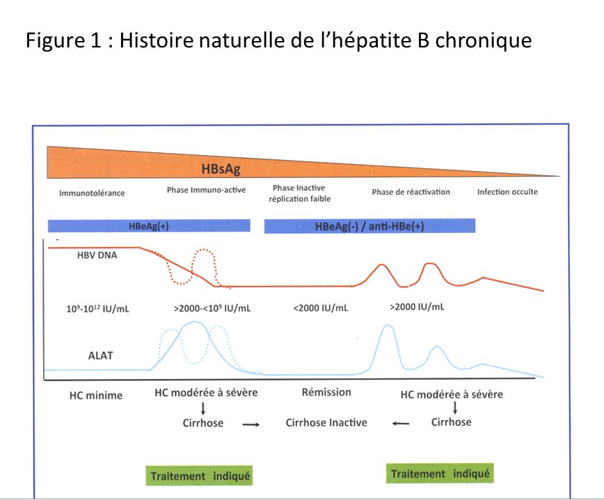
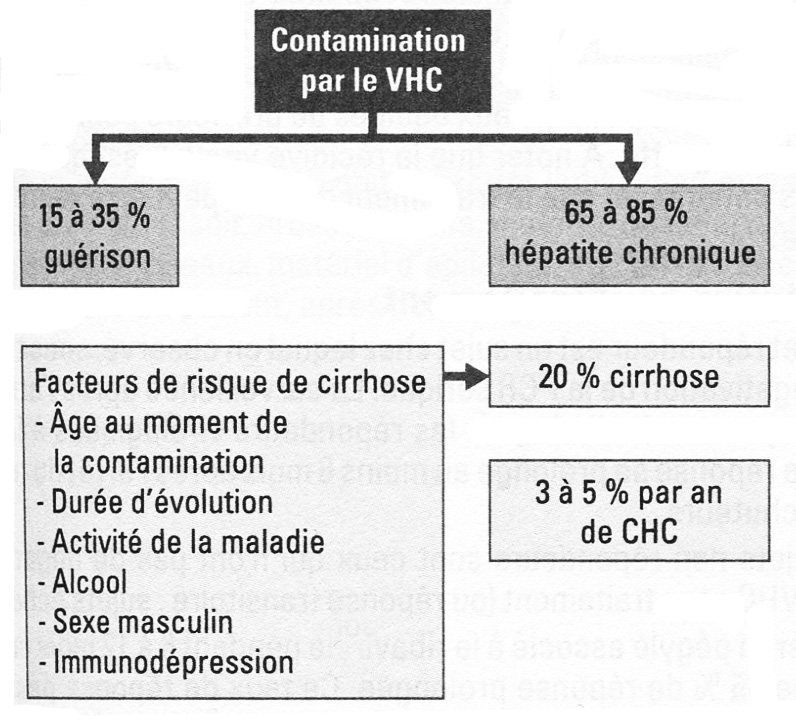

## I. Hépatite A

La contamination se fait essentiellement par voie digestive. Elle est d'autant plus fréquente que les conditions socio-économiques sont mauvaises. Elle concerne surtout les les enfants et les adultes jeunes.

La période d'incubation est en moyenne de 30 jours.  
Il existe des formes asymptomatiques, des formes avec un ictère et des formes limitées à des manifestations extra-hépatiques.  
L'évolution est en général favorable en 10 à 15 jours et toujours sans séquelles.  
On peut cependant observer :

*   des formes prolongées, avec surtout persistance d'une asthénie, mais il n'y a jamais de passage à la chronicité ;
*   des formes avec rechutes, au bon pronostic ;
*   mais surtout des formes fulminantes rares (1/10 000), qui augmentent avec l'âge (risque de 1 % après 40 ans) et qui en font toute la gravité.

## II. Hépatite B 

L'histoire naturelle de l'hépatite B est bien plus complexe car elle est très polymorphe.

On distingue les hépatites aiguës et les formes chroniques.

### 1. Hépatite aiguë

#### Forme habituelle 

La durée d'incubation varie de 1 à 3 mois. Elle est en moyenne de 10 semaines.  
Elle est en général asymptomatique dans la petite enfance et symptomatique chez 30 % à 50 % des adultes. Cela signifie aussi qu'elle reste en général méconnue et qu'elle est souvent découverte au cours d'un examen systématique.  
Quand elle est symptomatique, on peut observer une phase pré-ictérique de 3 à 7 jours (nausées, asthénie, anorexie, parfois fièvre, arthralgies et urticaire), puis apparaît un ictère qui peut durer de 2 à 3 semaines.  
La biologie est très importante pour en suivre l'évolution. En effet, la persistance de l'antigène HBs au bout de 2 mois fait craindre un passage à la chronicité.

#### Autres formes aiguës 

S'il existe aussi des formes cholestatiques prolongées et des formes à rechute, il faut surtout connaître l'existence de formes fulminantes très graves. Elles représentent 1 % des hépatites B. Elles associent une encéphalopathie hépatique et une diminution du taux de prothrombine qui est inférieur à 30 %. En l'absence de transplantation hépatique, l'évolution est très rapidement mortelle dans 80 % des cas.

#### Passage à la chronicité 

Ce passage est défini par la persistance de l'antigène HBs, de l'antigène Hbe, et de titres élevés d'ADN du VHB six mois après l'infection aiguë.  
Il est de coutume de dire qu'il y a un risque de passage à la chronicité de 5 à 10 %. mais ce taux ne concerne que les adultes immunocompétents de moins de 50 ans. Il est beaucoup plus élevé dans les autres tranches de la population : de 70 % à 90% chez les enfants nés de mère infectée,  de 20 % à 30 %  chez les enfants infectés avant 5 ans, de 30 % chez les adultes de plus de 50 ans, et de 30 %  à 100 % chez les sujets immunodéprimés.

### 2. Formes  chroniques

#### Portage chronique asymptomatique de l'Ag HBs

Cette situation concerne un tiers des sujets porteurs chroniques de l'Ag HBs. Elle associe une absence de symptômes et de réplication virale détectable dans le sérum (absence d'Ag Hbe et d'ADN viral) à des transaminases strictement normales.  
La disparition annuelle de l'Ag HBs est évaluée entre 1 %  et 3 %.  
Le pronostic est en général favorable, mais  une surveillance biologique semestrielle est nécessaire.  
Il existe en effet un risque de réactivation spontanée dans 20 % à 30% des cas, favorisée par des situations d'immunodépression (chimiothérapie, corticothérapie, VIH, grossesse).

#### Hépatites chroniques

Une hépatite chronique est définie par la persistance de l'Ag HBs pendant plus de 6 mois associée à une élévation des transaminases. Sur le plan clinique, elle est le plus souvent asymptomatique. On observe parfois une asthénie ou des douleurs de l’hypocondre droit. L'examen clinique est peu contributif.

Seule l'histologie permet de définir le type d'hépatite chronique dont il s'agit. Il existe maintenant des méthodes non invasives permettant d'évaluer la fibrose et l'activité inflammatoire : élastométrie (FibroScan) et marqueurs sériques de fibrose. Le score METAVIR permet d'identifier séparément l'activité inflammatoire (A0 à A4) et la fibrose (F0 àF4).

L'histoire naturelle de cette forme chronique a été schématisée en 4 phases :

1.  Phase d'immunotolérance : forte multiplication virale et faible activité biologique et  histologique, correspondant à une réponse immune faible ou nulle.
2.  Phase de rupture de tolérance après quelques années d'évolution : réponse immunitaire forte favorisant l'apparition de fibrose. Celle-ci peut aboutir à une cirrhose dans 10 % à 20 % des cas.
3.  Elle peut aussi se terminer par un arrêt de la multiplication virale et une séroconversion Hbe, ce qui signifie la disparition de l'activité de l'hépatite.
4.  Phase de de non-réplication virale : contagiosité faible, disparition de l'activité nécro-inflammatoire hépatique. A ce stade, il peut exister une cirrhose ou un cancer du foie. Il est nécessaire de surveiller l'alphafoetoprotéine et l'échographie du foie tous les 6 mois.  
    Cette phase peut aboutir à la guérison de l'hépatite ou à une phase de réactivation virale.

L'évaluation de ces différentes formes n'est pas facile et il faut en général un suivi de plusieurs mois pour différencier une hépatite aiguë, un portage chronique inactif et une hépatite chronique.

#### Cirrhose post-hépatitique

Les facteurs favorisant l'apparition d'une cirrhose sont les suivants :

*   stade de fibrose initiale,
*   survenue d'épisodes de réactivation,
*   réplication virale persistante
*   âge avancé,
*   co-infections (virus delta, VIH, VHC),
*   l'alcool,
*   certains génotypes.

Cette cirrhose a ses complications propres mais peut aussi se compliquer de cancer du foie et d'épisodes de réactivation de l'hépatite.

#### Carcinome hépatocellulaire

L'apparition de ce cancer est liée non seulement à la cirrhose mais aussi à l'action oncogène directe du VHB.  
Les autres facteurs de risque sont le sexe masculin, l'âge élevé, l'alcool et une co-infection VHD, VHC.  
Son incidence est importante dans les pays de forte endémie, notamment en Afrique, où 40 % des sujets contaminés dans l'enfance meurent de cirrhose ou de cancer du foie.

## III. Hépatite C

L'histoire naturelle de l'hépatite C est un peu plus simple mais aussi dramatique.

### 1. Hépatite C aiguë

Elle est asymptomatique dans 90 % des cas et passe donc souvent inaperçue, d'où l'intérêt d'un dépistage systématique.

La durée moyenne d'incubation est de 15 à 90 jours.  
Après cette phase aiguë, 15 à 35 % des cas guérissent.  
Les cas d'hépatite fulminans sont très rares .  
Mais 65 % à 85 % des cas passent à la chronicité, ce qui fait de l'hépatite C la plus fréquente des hépatites chroniques.

### 2. Hépatite C chronique

Dans 15 % à 25 % des cas, elle reste  asymptomatique, avec des transaminases normales et des lésions histologiques limitées.

Les autres cas sont des hépatites chroniques actives qui évoluent en 10 à 30 ans et dans 20 % des cas vers la cirrhose.

Les facteurs favorisant cette évolution sont :

*   l'âge au moment de la contamination : la vitesse de progression de la fibrose est plus basse chez les sujets infectés avant l'âge de 40 ans qu'après ;
*   le sexe masculin  (risque accru de 2,5 par rapport au sexe féminin) ;
*   la consommation d'alcool ;
*   la co-infection par le VIH : elle accélère la progression de la fibrose hépatique, surtout après 45 ans ;
*   une stéatose.

En cas de cirrhose, l'apparition d'un cancer du foie est possible, avec une fréquence de 1 à 4 % par an.

L'hépatite C est donc aussi un problème de santé publique majeur, d'autant plus grave qu'il n'existe pas encore de vaccin.

## IV. Autres hépatites

D'autres virus hépatotropes peuvent être responsables d'hépatite :

*   Le virus de l'**hépatite delta**, ou VHD, utilise l'enveloppe du VHB  pour sa réplication, c'est un virus symbiotique du VHB. L'infection par le VHD survient dans deux circonstances : il s'agit soit d'une infection concomitante avec le VHB avec un risque plus important d'hépatite fulminante, soit de la surinfection d'une hépatite chronique B avec un risque d'évolution plus péjorative (hépatite chronique active et cirrhose).
*   Le **VHE**, à transmission féco-orale, surtout en Asie et en Afrique, donne en général une infection aiguë ictérique dont l'évolution est bénigne sauf chez les femmes enceintes (20 à 40 % de mortalité).
*   Enfin le VHG, qui se transmet comme le VHB, est présent en Afrique de l'Ouest ; il a un pouvoir pathogène mal connu.