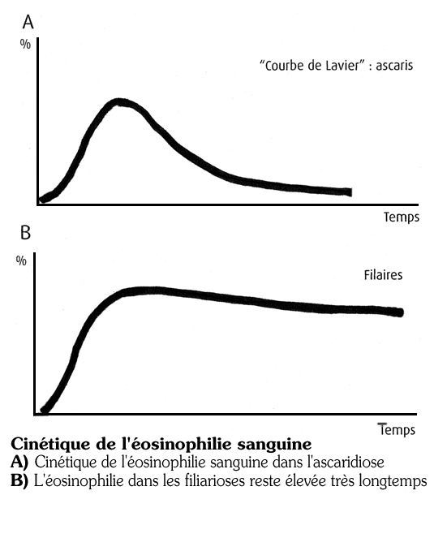
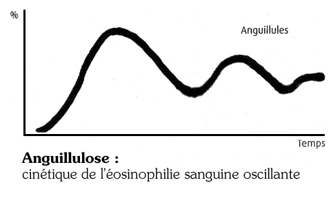

## I. Définition

L’hyperéosinophilie est définie à partir d’un seuil habituellement admis d’une valeur absolue de 500 polynucléaires éosinophiles par millimètre cube, ce qui correspond à un pourcentage variable selon le nombre de leucocytes.  
Cette anomalie de l’hémogramme peut être constatée fortuitement  lors d’un bilan systématique chez un sujet asymptomatique ou à l’occasion de signes digestifs, cutanés ou pulmonaires. Une hyperéosinophilie, isolée et modérée ne justifie aucune investigation complémentaire ; par contre, si elle est élevée et persistante, elle doit entraîner une recherche étiologique en fonction du contexte  épidémiologique et clinique (antécédents, symptômes).   
Cette anomalie peut être due à deux grandes causes : les allergies et les helminthiases. Dans les pays tempérés, la principale cause d’éosinophilie est  l’allergie : asthme, eczéma, maladies de plus en  
plus fréquentes (plus de 20 % des enfants en France).  
Par contre, en Afrique, ce sont les parasitoses qui sont les principales responsables d’hyperéosinophilie. Bien évidemment, on a le droit d’avoir une parasitose et d’être en plus allergique !

## II. Physiopathologie

Le polynucléaire éosinophile a été décrit par Ehrlich en 1879. Il est produit dans la moelle osseuse, puis passe dans la circulation sanguine pendant quelques heures avant d’aller migrer vers les tissus (peau, poumons, tube digestif)         .  
Il a une demi-vie d’une dizaine de jours. Il est détruit par le macrophage et éliminé par les selles sous forme de cristaux de Charcot-Leyden, (aspect en aiguille de boussole).  
Avec la coloration classique de May-Grünwald Giemsa (ou de RAL), le polynucléaire éosinophile apparaît comme une cellule avec un noyau polynucléaire violacé et de multiples granulations “éosinophiles” de couleur rouge-orangée dans le cytoplasme.  
Le polynucléaire éosinophile a un double effet : d’une part néfaste en favorisant la dégranulation des mastocytes et donc un rôle toxique et d’autre part bénéfique, immunomodulateur, en limitant les réactions anaphy- lactiques. Ces interactions atteignent aussi bien les cellules  étrangères (corps étrangers parasites) que les propres cellules de l’organisme (peau, intestin, cœur, rate).

## III. Hyperéosinophilies non parasitaires

L’interrogatoire minutieux permet déjà d’orienter le diagnostic vers une affection connue (allergies : asthme, eczéma, prise médicamenteuse récente, essentiellement les antibiotiques, ampicilline,  amoxicilline  surtout, ou l’exposition à des produits toxiques). L’examen clinique retrouve également quelques étiologies  évi-dentes (dermatose, crise d’asthme) (Tableau I).  
Il ne faut pas oublier d’autres causes plus rares mais plus graves : hémopathies (maladie de Hodgkin) collagénoses et certains cancers.

<table>
<caption>Tableau I : étiologies non parasitaires d'une hyperéosinophilie</caption>

<thead>

<tr>

<th class="rteleft" scope="col" style="">Contexte</th>

<th class="rteleft" scope="col" style="">Etiologies à évoquer</th>

</tr>

</thead>

<tbody>

<tr>

<td style="">Contexte connu</td>

<td style="">Eczéma ? Asthme, prise récente de médicaments : antibiotiques, amoxicilline, extraits hépatiques,  
vitamine B12</td>

</tr>

<tr>

<td style="">Enquête allergologique (tests cutanés)</td>

<td style="">Sujet aux antécédents allergiques</td>

</tr>

<tr>

<td style="">Ambiance de travail</td>

<td style="">Benzolisme (benzène)</td>

</tr>

<tr>

<td style="">Aspect cutané/eczéma, urticaire</td>

<td style="">Dermatoses allergiques</td>

</tr>

<tr>

<td style="">Atteinte de l’état général</td>

<td>Hémopathies, cancers, collagénoses</td>

</tr>

</tbody>

</table>

## IV. Hyperéosinophilies parasitaires

L’hyperéosinophilie sanguine lors des maladies parasitaires est due aux helminthes (ou vers), quelle que soit leur forme (rond, plat, segmenté ou non) ainsi qu’aux ectoparasites (myiase, gale). Les protozoaires (_Plasmodium_,  _Leishmania_,  amibes,  trypanosomes  
etc…) ne provoquent pas ce type de réaction. L’éosinophilie sanguine est d’autant plus élevée que le parasite effectue un cycle complexe       dans l’organisme.  
Par ailleurs, l’éosinophilie varie dans le temps en fonction de l’évolution du parasite (Tableau II). Au début, pendant la phase de migration larvaire, l’éosinophilie suit une courbe ascendante, pour aboutir à un maximum, après un délai variable selon les parasites avant de décroître lentement : courbe de Lavier typique dans l’ascaridiose.  Dans certaines parasitoses  (filarioses,  distomatoses,  _larva migrans_),  l’éosinophilie reste longtemps élevée (figure 1). Enfin, dans le cas de l’anguillulose, l’éosinophilie est oscillante, correspondant aux phases du cycle d’auto-infestation du parasite (Figure 2).

**Figure 1**

**Figure 2**

L’interrogatoire essaie de préciser les éventuels risques d’exposition: aliments (crudités, baies sauvages, viande mal cuite, poisson, cresson, crustacés) marche pieds nus dans la boue, bains en eau douce, piqûres  d’insectes.  L’examen clinique recherche des  
symptômes permettant de s’orienter vers un diagnostic : troubles  digestifs (intestinaux) ou urinaires (bilharziose), foie douloureux fébrile (distomatose), anémie (ankylostome) hépatosplénomégalie (bilharziose), prurit (filariose, distomatose), œdème (trichinellose, filarioses lymphatiques), pneumopathie fugace (ascaridiose), syndrome méningé (angiostrongylose).

<table>
<caption>Tableau II : date de l'hyperéosinophilie sanguine  
et de l'apparition des œufs</caption>

<thead>

<tr>

<th class="rteleft" scope="col" style="">Parasite</th>

<th class="rteleft" scope="col" style="">Pic maximal  
d'éosinophilie</th>

<th class="rteleft" scope="col" style="width: 125px; ">Emission des œufs  
ou des larves </th>

</tr>

</thead>

<tbody>

<tr>

<td style="">

ascaris

trichocéphale

anguillules

bothriocéphale

tænia

ankylostomes

grande douve

bilharzies

<em>larva migrans</em>

</td>

<td style="">

20ème jour

25ème jour

40ème jour

40ème jour

60ème jour

80ème jour

90ème jour

60ème jour

30ème jour

</td>

<td style="width: 129px; ">

60 jours

60 jours

60 jours

15 jours

90 jours

40 jours

90 jours

60 jours

...

</td>

</tr>

</tbody>

</table>

## V. Diagnostic biologique

Après avoir étudié les éléments épidémiologiques et cliniques, le diagnostic est établi par divers examens.  
Des techniques particulières sont parfois nécessaires pour rechercher certains parasites (voir articles "Examen parasitologique des selles).

## VI. Bilan étiologique

En fonction de la région concernée (Tableau III) et des symptômes présentés par le patient (Tableau IV), divers examens complémentaires doivent être effectués pour rechercher les parasites concernés.

<table>
<caption>Tableau III : répartition géographique des principales helminthiases responsables d'hyperéosinoiphilie</caption>

<thead>

<tr>

<th scope="row" style="width: 133px; ">Parasites</th>

<th scope="col" style="width: 36px; ">Europe  
 </th>

<th scope="col" style="width: 60px; ">Amérique  
du sud  
Amérique centrale</th>

<th scope="col">Antilles</th>

<th scope="col">Afrique  
sub-saharienne</th>

<th scope="col">Afrique  
du nord</th>

<th scope="col">Asie</th>

</tr>

</thead>

<tbody>

<tr>

<th class="rteleft" scope="row" style="width: 137px; ">

Ascaris

Oxyures

Ankylostomes

Trichocéphales

Anguillules

Trichines

<em>Larva migrans</em>

</th>

<td style="width: 40px; ">

+

+

+

+

</td>

<td style="width: 64px; ">

+

+

+

+

+

</td>

<td>

+

+

+

+

+

+

</td>

<td>

+

+

+

+

+

+

+

</td>

<td>

+

+

+

+

+

+

</td>

<td>

+

+

+

+

+

+

+

</td>

</tr>

<tr>

<th class="rteleft" scope="row" style="width: 137px; ">

Filaires lymphatiques

Autres filaires

Angiostrongylus

Taenia divers

Kyste hydatique

Echinococcose alvéolaire

</th>

<td style="width: 40px; ">

+

+

+

+

</td>

<td style="width: 64px; ">

+

+

+

+

</td>

<td>

+

+

</td>

<td>

+

+

+

</td>

<td>

+

+

</td>

<td>

+

+

+

</td>

</tr>

<tr>

<th class="rteleft" scope="row" style="width: 137px; ">

Douves

Bilharzies intestinales

Bilharzies urinaires

</th>

<td style="width: 40px; ">+</td>

<td style="width: 64px; ">

+

</td>

<td>

+

</td>

<td>

+

+

+

</td>

<td>

+

</td>

<td>

+

+

</td>

</tr>

<tr>

<th class="rteleft" scope="row" style="width: 137px; ">

Myases

Gale

</th>

<td style="width: 40px; ">

+

+

</td>

<td style="width: 64px; ">

+

+

</td>

<td>

+

</td>

<td>

+

+

</td>

<td>

+

+

</td>

<td>

+

</td>

</tr>

</tbody>

</table>

Les vers intestinaux provoquent des troubles digestifs : nausées,  vomissements,  douleurs abdominales, diarrhées. Quelques symptômes sont plus évocateurs, comme le prurit anal (oxyures), la boulimie (tænia), le dermographisme (douve du foie),  une  hématurie  (bilharziose  urinaire), des œdèmes de la face et des myalgies (trichinellose). Les nématodes tissulaires (ou filaires) provoquent des troubles cutanés (prurit, œdèmes, sillon cutané) et lymphatiques (lymphangite, éléphantiasis).  Des examens complémentaires orientés permettent d’approcher du diagnostic.

### 1. Nématodes

Les nématodes sont des vers ronds, situés soit dans la sphère digestive, soit  intra-tissulaire (filaires). Certains sont cosmopolites alors que d’autres sont plus  
localisés.

#### a) Nématodes intestinaux   
Voir article "Diagnostic des nématodes"

#### b) Nématodes tissulaires

Les  filaires peuvent être associées à des parasitoses digestives. Il conviendra alors d'en tenir compte pour le diagnostic étiologie de l'hyperéosinophilie. Ces  nématodes sont transmis par des arthropodes. L’éosinophilie reste élevée longtemps après l’infestation.

_**Loa  loa**_, en Afrique centrale, est une filaire de 5 à 7 cm, transmise par la piqûre d’un taon (Chrysops). Les symptômes sont assez spécifiques : œdème fugace, sillon cutané prurigineux, passage des filaires sur la conjonctive. Le diagnostic est affirmé par la mise en évidence des microfilaires (de 300 µ de  long) dans le sang vers 12h. Le traitement classique par le diethylcarbamazine, mal toléré, et contre-indiqué en cas de grossesse et allaitement est actuellement remplacé par une cure unique d’ivermectine.

_**Onchocerca volvulus**_,  en Afrique intertropicale et dans le nord de l’Amérique du Sud, mesurant 10 à 20 cm de long, est transmise par la piqûre de moucheron (_Simulium damnosun_) Les symptômes sont le prurit diffus et intense, des nodules sous-cutanés et surtout une cécité progressive. Les recherches des microfilaires s’effectuent par biopsie cutanée exsangue. L’ivermectine en est le traitement actuel  (programme de gratuité).

_**Wuchereria bancrofti**_, filaire de 5 à 10 cm de long, est localisée dans toutes les zones tropicales, et transmise par des moustiques (Culex). Les symptômes sont une lymphangite aiguë rétrograde, une orchite, et puis, au bout de plusieurs années, une orchi-épididymite chronique avec, au maximum, une stase lymphatique responsable d’un éléphantiasis. Le diagnostic est affirmé par la mise en évidence des microfilaires (de  
300 µ de long) dans le sang vers 24h. Le traitement est basé sur l’ivermectine. La prévention de ces filaires est basée sur la prévention des piqûres d’arthropodes.

_**Dracunculus  medinensis**_ est un nématode situé en Afrique intertropicale. L’homme s’infeste par ingestion du stade larvaire avec l’eau de boisson. En plusieurs mois, la filaire adulte (de 40 à 100 cm) migre sous la peau, puis sort spontanément. Le diagnostic est évident sur l’inspection. Le traitement consiste à extraire la filaire et à l’enrouler progressivement sur un bâtonnet. La prévention de la dracunculose se fait par  utilisation d’eaux de boisson filtrées ou extraites par forage.

#### 2. Cestodes  
Voir article "Diagnostic des cestodes"

#### 3. Trématodes  
Voir article "Diagnostic des trématodes"

Certains trématodes n’ont pas d’expression digestive.

_**Larva migrans**_ **viscérale**  
En cas d’ingestion accidentelle d’œufs d’ascaris de chien, le parasite non adapté à l’homme va errer dans l’organisme, en provoquant des troubles divers (hépatalgie fébrile,  pneumopathie, syndrome oculaire) avec une hyperéosinophilie sanguine. La seule méthode diagnostique est le sérodiagnostic.

**Myiase**  
L’infestation par les larves de mouche, dont il existe de nombreuses espèces, provoque des lésions cutanées furonculeuses centrées par la larve et très iritantes. Parfois la larve pénètre dans l’organisme pour provoquer des myiases profondes. L’éosinophilie sanguine est légèrement élevée. Pour prévenir ces myiases il ne faut pas faire sécher le linge en l’étendant sur le sol et il faut, si possible, le repasser.

**Gale**  
L’infestation par un acarien, _Sarcoptes scabiei,_ provoque un prurit  généralisé, à  prédominance nocturne. Les lésions cutanées sont variables, le sillon interdigital étant considéré comme caractéristique. L’hyperéosinophilie est assez fréquente mais peu élevée. Le grattage cutané permet de retrouver les parasites. Le badigeonnage local par le benzoate de benzyle est remplacé par une prise unique d’ivermectine plus efficace et plus simple (200 µg/kg en cure unique). L’hygiène individuelle est le meilleur moyen  
de prévenir la gale.

## En conclusion 

En fonction de l’environnement du patient, les parasites sont recherchés dans les selles, les urines ou le sang. Quand les parasites ne peuvent être mis en évidence directement, il faut avoir recours au sérodiagnostic. Mais  l’interrogatoire  est  irremplaçable  pour  rechercher un témoin allergique ou la prise récente d’un médicament.  
Plusieurs parasitoses digestives peuvent s'accompagner  
d'une hyperéosinophilie sanguine. De nombreuses autres causes d'hyperéosinophilie (autres parasites, allergies d'origines variées...) peuvent éventuellement être associées.

Développement et Santé, N° 185, 2007