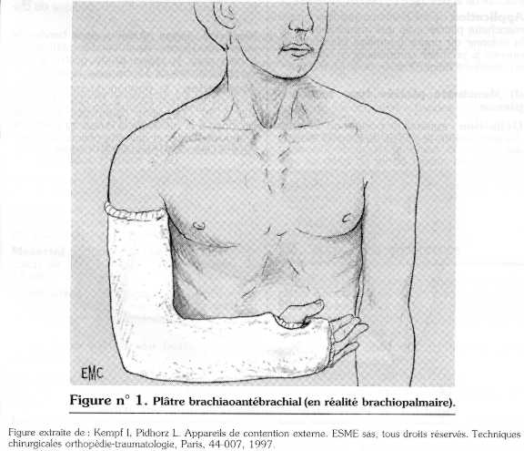
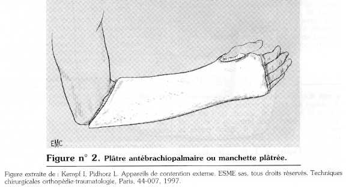
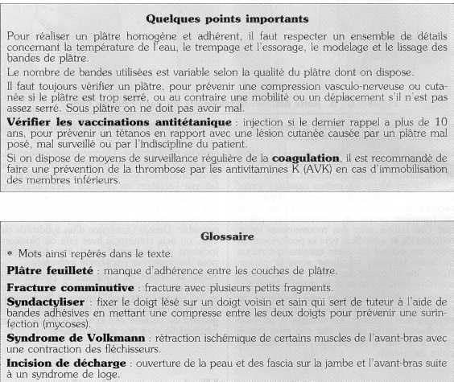

Le plâtre est utilisé depuis très longtemps comme matériel d'immobilisation pour les fractures, luxations et les entorses. L'immobilisation plâtrée est un geste médical très important et nécessite minutie et savoir-faire pour éviter les complications. Le patient doit être informé sur les premiers symptômes qui annoncent ces complications. Une surveillance stricte est indispensable pour vérifier la tolérance et l'efficacité du plâtre.
L'immobilisation plâtrée peut être réalisée par deux types d'appareillage :

**1)** Le plâtre circulaire entourant complètement le membre.

**2)** L'attelle ou gouttière plâtrée qui recouvre une face du membre et qui est maintenue en place par des bandages.

Les attelles sont plus légères et moins dangereuses mais aussi moins efficaces que les plâtres circulaires qui immobilisent mieux le membre mais peuvent entraîner du fait d'un oedème progressif, une compression nerveuse et/ou vasculaire.

La réalisation d'un plâtre peut avoir des objectifs multiples :

- les plâtres de contention et d'immobilisation sont utilisés durant le temps de consolidation d'une fracture ou de mise au repos d'une articulation (entorse, luxation);

- les plâtres de correction visent à maintenir la correction d'une fracture ou luxation après une réduction orthopédique ou une attitude articulaire vicieuse (ex. : plâtre utilisé pour maintenir les hanches en position de correction chez les enfants dans une luxation congénitale de hanche).

**Le plâtre doit toujours être appliqué** **sur une extrémité réduite et bien** **axée.** Pour que l'immobilisation soit effective sur le plan fonctionnel, un axe correct est essentiel.

La durée d'immobilisation des fractures est très variable. En règle générale il faut compter six semaines pour les fractures simples, les entorses et les contusions des parties molles. Cette durée peut être modifiée selon l'importance de la lésion (de 3 à 8 semaines). Pour les entorses simples ou les luxations réduites sans complications la durée est de trois semaines. La période d'immobilisation pour les fractures plus compliquées et comminutives*, est plus longue même lorsqu'elles sont associées à un traitement chirurgical. Pour les fractures diaphysaires du membre inférieur avec un traitement orthopédique (non chirurgical), la durée d'immobilisation, qui peut atteindre 4 à 5 mois, est souvent réduite par la chirurgie.

La formation du cal sur la zone de fracture est un préalable pour l'ablation du plâtre.

## **I. Etapes de la confection du plâtre**

### **1. Préparation du membre**

La position d'immobilisation doit être maintenue par une aide après la réduction durant tout l'acte et jusqu'à la fin du séchage pour éviter la formation des plis qui peuvent causer une compression sous plâtre et une perte de la réduction.

La peau est protégée par du jersey tubulaire et des bandes de coton cardé. Pour les plâtres de correction faits après réduction de fracture, il est préférable d'utiliser trois jersey sans bande de coton pour prévenir tout déplacement secondaire. Pour les plâtres de contention, un jersey et une bande de coton sont suffisants.

### **2. Application**

L'eau préparée pour l'immersion doit être à 20-25 °C pour assurer un séchage rapide. Si l'eau est trop chaude, le plâtre est feuilleté*, (est dans le glossaire) donc moins homogène et moins solide. Il peut même y avoir un risque de brûlure. L'immersion se fait au mieux en tenant la bande avec un angle de 45° plutôt que verticalement ou horizontalement pour faciliter un trempage uniforme. La bande une fois immergée est prête pour l'application dès la disparition des bulles d'air. On applique la bande sans trop d'essorage afin de ne pas perdre de plâtre. Il ne faut pas trop serrer le plâtre sur le membre surtout au niveau des plis de flexion. Avant le séchage complet on réalise un modelage soigneux sur les reliefs osseux et un lissage du plâtre. Bien modelé l'appareil ne bougera plus et, bien lissé, il sera plus résistant.

## **II. Principaux appareils plâtrés circulaires**

### **1. Appareils plâtrés du membre supérieur**

#### a. Le plâtre brachial anté-brachial ou huméro-brachial _(figure n° 1)_

**Définition :** appareil immobilisant les articulations du poignet, du coude et les deux os de l'avant-bras.

**Indication :** fractures du poignet, des deux os de l'avant bras et de la région du coude. Traitement orthopédique ou période postopératoire.

**Matériel :** jersey tubulaire, deux bandes de coton de 10 cm, quatre bandes de plâtre de 10 cm.

**Application :** la position du membre supérieur est : coude à 90°, poignet en légère flexion dorsale (position fonctionnelle), pronosupination neutre et les articulations métacarpophalangiennes libres.

Au niveau proximal, le plâtre commence à trois travers de doigt sous l'aisselle ; au niveau distal, il s'arrête sur les têtes des métacarpiens en dorsal et sur le second pli transversal en palmaire. Si le plâtre s'arrête en proximal des têtes métacarpiennes en dorsal, on risque d'avoir un blocage du retour veineux voir un syndrome de loge et si on dépasse le second pli transversal en palmaire on risque de bloquer J'articulation métacarpophalangienne favorisant une raideur de l'articulation voire une algodystrophie du membre supérieur.

#### b. Manchette plâtrée ou plâtre d'avant-bras _(figure n°2)_

**Définition :** appareil immobilisant les articulations du poignet et les os du carpe.

**Indication :** fracture des métacarpes, plâtre de contention postopératoire, contusion des parties molles.

**Matériel :** jersey tubulaire, une bande de coton de 10 cm, deux bandes de plâtre de 10 cm.

**Application :** au niveau distal on pratique les même gestes que pour le plâtre brachial anté-brachial. Au niveau proximal, le plâtre débute à deux travers de doigt en dessous du coude et doit être oblique d'avant en arrière.

#### c. Manchette plâtrée type scaphoïde **_(figure n° 3)_**

**Définition:** appareil immobilisant les os et les articulations du carpe et la colonne du pouce.

**Indications :** fractures de scaphoïde (traitement orthopédique ou protection du traitement chirurgical), fractures de la première colonne (fracture de la base de P1 : Bennet, Rolando ... ).

**Application :** c'est le même principe que la manchette plâtrée avec une immobilisation de la colonne du pouce (première phalange) en ouvrant la première commissure en opposition au deuxième doigt (position de prise d'objet).

#### d. Manchette plâtrée type métacarpienne

**Définition :** appareil de posture ou de repos des articulations et des os du poignet et de la main.

**Indication:** traitement orthopédique ou chirurgical des fractures de métacarpiens.

**Application:** la position de la main est:

poignet en légère flexion dorsale, articulations métacarpo-phalangiennes à 90° de flexion, articulations interphalangiennes proximales et distales en extension.

Le plâtre doit couvrir les premières phalanges et laisser libres les articulations interphalangiennes proximales (IPP) et interphalangiennes distales (IPD). En cas de fracture isolée d'un métacarpien on syndactylise* le doigt fracturé et un doigt voisin, par exemple le quatrième et le cinquième doigt en cas de fracture du 5e métacarpien

### 2. Appareils plâtrés **du membre inférieur**

#### a. Le plâtre cruro-pédieux _(figure n° 4)_

**Définition :** appareil immobilisant les articulations et les os du genou, de la jambe et du pied.

**Indications :** fractures de cheville, de jambe ou de genou (traitement orthopédique ou chirurgical).

**Matériel :** jersey tubulaire, deux bandes de coton de 15 cm, deux bandes plâtrées de 20 cm pour la cuisse et de quatre à cinq bandes plâtrées de 15 cm pour la jambe.

**Application :** la position du membre inférieur est le genou fléchi à 10°-15° et la cheville à 90°. Le plâtre commence au niveau proximal à la racine de la cuisse au niveau du grand trochanter et doit être oblique de l'extérieur à l'intérieur, parallèle au pli inguinal. Au niveau distal, il se termine sur les articulations métatarso-phalangiennes en laissant libre ces dernières comme pour le membre supérieur.

#### b. La genouillère plâtrée ou plâtre **cruro-jambier _(figure n°_ 5)**

**Définition:** appareil immobilisant l'articulation du genou.

**Indications :** fractures ou luxations de la rotule, ruptures des ligaments rotulien ou quadricipital (période postopératoire).

**Matériel :** jersey tubulaire, deux bandes de coton de 15 cm, quatre bandes plâtrées de 15 cm.

**Application:** la technique est la même que pour le cruro-pédieux mais le plâtre s'arrête au trois travers de doigt au-dessus des malléoles.

#### c. La botte plâtrée ou botte pédieuse **_(figure n° 6)_**

**Définition:** appareil immobilisant, en dessous du genou, articulation, os du pied et de la jambe.

**Indications :** fractures et entorses graves de cheville, fractures médiotarsales et métatarsales.

**Matériel :** jersey tubulaire, une bande de coton de 15 cm, quatre bandes de plâtre de 15 cm.

**Application :** le plâtre commence sur la tubérosité tibiale en antérieur et à deux travers de doigt du pli de flexion du genou en postérieur et se termine sur les articulations métatarso-phalangiennes. La position de la cheville doit être maintenue à 90°.

## **III. Attelles plâtrées**

Les attelles plâtrées sont pratiquées comme le plâtre circulaire dans le but d'immobilisation. Elles sont appliquées en cas d'oedème important au niveau du membre et en cas d'attente de l'acte chirurgical.

On peut faire une attelle plâtrée de deux façons :

1) en bivalvant un plâtre circulaire

2) en appliquant directement les couches des bandes plâtrées.

**Confection :** pour les membres supérieurs, on mesure la longueur de l'attelle sur le membre blessé et on prépare 12 à 14 couches superposées. Pour les membres inférieurs, l'attelle est faite avec 16 à 18 couches. La sous structure est comme le plâtre circulaire avec jersey tubulaire et bandes de coton.

## **IV. La technique de l'ablation**

L'ablation du plâtre circulaire se fait à l'aide d'une scie électrique oscillante. Cette scie fait des gestes avant et arrière mais non circulaires pour ne pas couper la peau. Le plâtre est coupé en évitant toute pression excessive et en suivant longitudinalement le membre. On évite de suivre les saillies osseuses (crête tibiale) où la scie peut couper les téguments recouvrant le squelette. La meilleure façon est de travailler perpendiculairement au plâtre que l'on coupe avec des mouvements intermittents de la superficie vers la profondeur du plâtre en évitant un geste continu qui risque de léser la peau fragilisée sous le plâtre. Après avoir coupé le plâtre on sectionne attentivement le coton et le jersey tubulaire.

Si on ne dispose pas de scie oscillante, la méthode la plus pratique est l'application de vinaigre sur le plâtre. Le vinaigre a un effet amollissant sur le plâtre. Par son effet dissolvant, il facilite la section du plâtre avec une paire de ciseaux.

## V. La surveillance du patient plâtré

Elle est importante pour éviter les complications vasculo-nerveuses et pour détecter les principales complications orthopédiques comme la mobilité sous plâtre en cas de fonte d'oedème et le déplacement secondaire. Le patient doit être revu au 2e, au 8e et au 15e jour puis tous les mois jusqu'à la dépose du plâtre

En cas de complication vasculaire précoce, (douleurs importantes, extrémités gonflées, bleues ou cyanosées), il faut immédiatement fendre le plâtre longitudinalement. Une extrémité normale est chaude (température normale), bien colorée, non douloureuse, sans oedème ni phlyctène. La compression vasculaire a des conséquences très importantes comme le syndrome de Volkmann*. La prévention se fait par l'ablation en urgence d'une languette longitudinale de 1 à 2 cm. de plâtre avec la section du coton et du jersey. En cas de persistance des symptômes, l'ablation du plâtre est indispensable. Devant l'existence d'un syndrome de loge, un acte chirurgical avec une ou plusieurs incisions de décharge* peut être nécessaire pour décomprimer l'extrémité intéressée.

Avant le départ de l'hôpital, le patient doit être informé sur les éléments de surveillance et les signes de complications. L'augmentation de la chaleur et de la douleur, tout changement de couleur et l'existence d'une odeur inhabituelle sont des signes d'alerte.

## VI. Les complications **tardives sous plâtre**

**Le déplacement secondaire** peut-être causé par la fonte de l'oedème, l'amyotrophie par l'absence de contraction musculaire et la fragilisation du plâtre.

**La raideur articulaire** peut être évitée avec une durée d'immobilisation brève et une rééducation post-immobilisation.

**L'algodystrophie** est un syndrome associant une douleur intense, un enraidissement articulaire, des troubles trophiques avec froideur de l'extrémité, oedème, moiteur. Elle peut être prévenue par des contractions musculaire sous plâtre.

**Les complications cutanées** vont de la simple irritation cutanée aux escarres profonds. Une douleur sur les plis avec augmentation de température doit alerter le patient. La confection minutieuse du plâtre, et les contrôles fréquents peuvent éliminer cette complication.

**Les compressions nerveuses** entraînent des troubles de la sensibilité ou de la motricité. Au niveau du membre supérieur, le nerf cubital et radial ; au niveau du membre inférieur, le sciatique poplité externe sont les plus souvent touchés.

_Développement et Santé, n°149, octobre 2000_