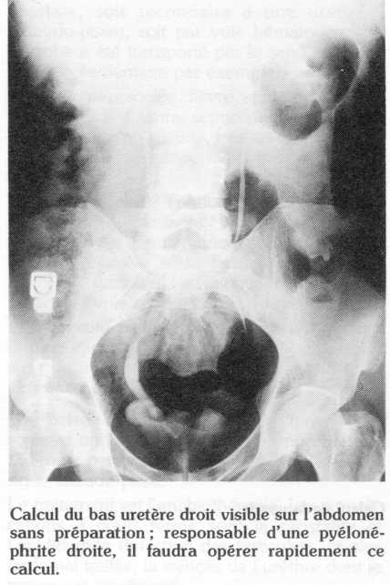
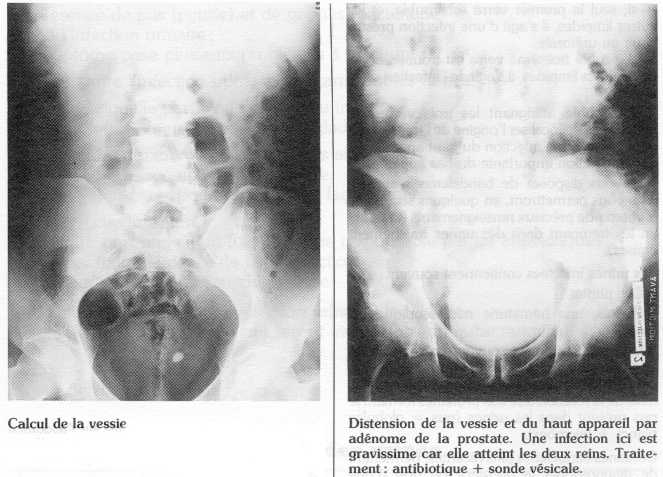
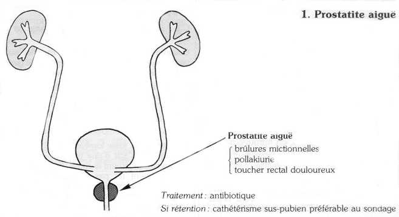
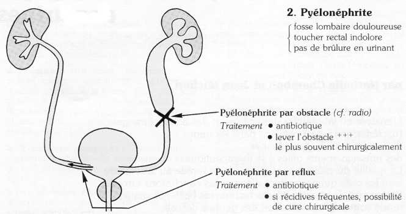

La présence de pus (pyurie) et de germes (bactériurie) définit l'infection urinaire ; ce symptôme pose plusieurs problèmes à résoudre:

<ul>
<li>Reconnaître l'infection urinaire en examinant les urines.</li>
<li>Savoir de quelle partie de l'appareil urinaire provient l'infection en examinant le malade.</li>
<li>Reconnaître rapidement les infections aiguës, le plus souvent accompagnées de fièvre, découvrir leur cause pour les traiter de façon urgente.</li>
<li>Traiter cette infection, c'est-à-dire non seulement tuer le germe responsable par les antibiotiques mais aussi traiter la cause de cette infection, parfois par une intervention chirurgicale.</li>
</ul>

Nous n'aborderons ici que l'infection urinaire de l'adulte,

## **I. Diagnostic de l'infection des urines**

Une infection urinaire, c'est la présence de pus et de germes dans les urines (pyurie et bactériurie) Cette infection est le plus souvent aisément reconnue par l'examen à l'oeil nu des urines. Cet examen fidèle, obéit à certaines règles:

*   Il faut examiner les urines fraîchement émises dans un verre propre et non des urines recueillies depuis plusieurs heures car elles sont alors troubles et les microbes y pullulent sans qu'ils proviennent forcément du malade.

*   Les urines sont regardées à la lumière du jour: des urines infectées sont troubles ou contiennent des filaments. Des urines parfaitement limpides éliminent dès cet examen la possibilité d'infection urinaire_._

Si les urines sont troubles, il faut ajouter alors quelques gouttes d'acide (acide acétique, vinaigre, ... ) qu'il faut avoir à portée de main dans toute salle d'examen. Si elles s'éclaircissent alors parfaitement, ce trouble des urines était dû à la présence de phosphate dans les urines et non à une infection. Si elles deviennent troubles, il s'agit d'une infection (en les réchauffant ensuite à la flamme d'une bougie, seules les urines infectées restent troubles, celles dont le trouble était dû à la présence d'acide urique s'éclaircissent). Ainsi, l'examen à l'oeil nu permettra dans presque tous les cas d'affirmer la présence ou non d'une infection des urines.

Cet examen peut apporter d'autres renseignements sur l'origine de l'infection:

*   La présence de filaments dans les urines témoignant d'une infection de 1'urèthre.

*   Si l'on recueille les urines dans trois verres, le premier jet dans le premier verre, la plus grande partie dans le deuxième, et la fin du jet dans le troisième, on peut, tout comme dans l'épreuve des trois verres lors d'une hématurie, localiser parfois le siège de l'infection:

*   si, seul le premier verre est trouble, et les autres limpides, il s'agit d'une infection prostatique ou uréthrale,
*   si, seul le troisième verre est trouble, et les deux autres limpides, il s'agit de l'infection de la vessie.

*   Un trouble atteignant les trois verres ne permet pas de localiser l'origine de l'infection; il peut s'agir d'une infection du haut appareil ou d'une infection importante du bas appareil.

*   Si vous disposez de bandelettes réactives, elles vous permettront, en quelques secondes, d'obtenir de précieux renseignements (toujours en les trempant dans des urines fraîchement émises).

Les urines infectées contiennent souvent:

*   Des nitrites.

*   Parfois, une hématurie microscopique est associée.

*   Une protéinurie est souvent présente, il ne s'agit pas alors d'une albuminurie comme on peut en voir dans certaines insuffisances rénales, mais de la réaction due aux protéines formant le pus présent dans les urines (pus = globules blancs + microbes).

Certaines bandelettes plus récentes, permettent de diagnostiquer la présence ou non d'une infection en quelques secondes.

Ainsi, le simple examen à l'oeil nu permet-il en quelques secondes d'affirmer dans la plupart des cas, l'existence ou non d'une infection urinaire. Des urines troubles ne s'éclaircissant pas après acide sont infectées et si le laboratoire vient vous dire le contraire deux jours plus tard, c'est souvent lui qui a tord. Des urines parfaitement limpides à l'oeil nu ne sont pas infectées et, si le laboratoire vient vous dire deux jours plus tard que des microbes y poussent, il s'agira le plus souvent d'une souillure et non d'une infection.

## **L'examen cytobactédologique des urines** **(ECBU)**

S'il est possible pour vous de faire examiner ces urines en laboratoire, cet examen est intéressant. Il vous permettra de confirmer l'infection :

*   En montrant la présence de pus et de germes en quantité suffisante, on parlera en effet d'infection que s'il existe:

*   des leucocytes altérés en amas (pus) en quantité supérieure ou égale à 105, leucocytes par ml.  
*   des germes en quantité suffisante sur des urines fraîchement émises et examinées: supérieur ou égal à 10 5

*   Surtout en identifiant le germe en cause et en testant sa sensibilité aux antibiotiques et aux antiseptiques urinaires (antibiogramme).

Les germes les plus souvent retrouvés sont: les colibacilles, les klebsielles, les protéus.

Plusieurs causes d'erreur sont possibles par le laboratoire :

Sur l'ECBU, on ne découvre que des germes sans pus: si les urines étaient limpides, il s'agit alors le plus souvent d'une souillure due à un recueil imparfait des urines (mauvais nettoyage des organes génitaux, récipient non stérile, urines examinées plusieurs heures après le recueil sans avoir été conservées au frais).

*   Sur l'ECBU, on ne découvre que du pus sans germe. L'infection est alors réelle mais il faut toujours penser à la possibilité d'une tuberculose urinaire car le BK ne se développe pas sur les milieux de culture usuels et n'est pas retrouvé à l'examen direct sans coloration spéciale.

**Pyurie sans germe = _attention à la _****_tuberculose urinaire, demander alors_**

**_les examens spécifiques_**

La découverte de protéus doit faire suspecter l'existence d'un calcul urinaire car ces germes ont le pouvoir de provoquer leur formation.

## **II. Reconnaître l'origine de l'infection**

On parle d'infection urinaire mais parle-t-on d'"infection à crachats" ? Non, tout le monde sait bien que si un crachat est infecté, le problème n'est pas de stériliser le crachat, mais de savoir pourquoi il est infecté, et de quelle partie de l'appareil respiratoire provient l'infection.

Il en est de même de l'" infection urinaire ". Il faut savoir quelle est la partie de l'appareil urinaire responsable de l'infection, la présence de microbes dans les urines n'est donc que le reflet de l'infection d'une des parties de l'appareil urinaire. Traiter seulement l'infection urinaire par des antibiotiques pour stériliser les urines sans savoir d'où proviennent ces microbes, ce sera parfois suffisant mais souvent, on laissera évoluer derrière une lésion du rein, des uretères, de la vessie, de la prostate qui continuera jusqu'à la prochaine crise ou à la mort du rein ou du malade.

## **Infection du haut** **ou du bas appareil**

Les signes cliniques et l'examen suffisent souvent à différencier si c'est le haut appareil ou le bas appareil qui est en cause:

**haut appareil:** reins, bassinet, uretères,

**bas appareil:** vessie, urèthres (prostate chez l'homme adulte).

### **a. Infection du bas appareil**

**Cystite:** c'est l'infection de la vessie. Elle se manifeste par des urines troubles associées à des brûlures mictionnelles, des envies très fréquentes d'uriner (pollakiurie), des douleurs hypograstriques. La fièvre est absente ou ne dépasse pas 38°.

_Chez l'homme_, une cystite est rare et doit toujours faire rechercher une cause précise: prostatite (infection de la prostate), le plus souvent, calcul de la vessie, tumeur, obstacle au libre écoulement de l'urine favorisant la stagnation (adénome de la prostate, cancer prostatique, sténose de l'urèthre, ... ).

_Chez la femme_, les cystites sont fréquentes, le plus souvent, on ne retrouve pas de cause très précise. Les germes du périnée (colibacille le plus souvent) viennent infecter l'urèthre, très court chez la femme, puis la vessie, parfois, à la faveur des rapports sexuels (une bonne mesure préventive consiste alors à uriner après les rapports, ce qui chasse les microbes avant qu'ils ne se développent). Mais, on retrouve parfois des causes curables chirurgicalement: sténose du méat uréthral, calcul de la vessie, tumeur,...

**Prostatite aiguë:** Elle ne survient que chez l'homme adulte. Les urines peuvent rester limpides dans ce cas. C'est l'infection aiguë de la prostate, soit secondaire à une uréthrite (chaude-pisse), soit par voie hématogène (le microbe a été transporté par le sang au cours d'un abcès dentaire par exemple).

_La prostatite associée_: fièvre rapidement élevée (39° à 40°) d'allure septicémique, brûlures mictionnelles, pollakiurie, fausses envies d'aller à la selle. Au toucher rectal, la prostate est très douloureuse.

Le traitement est l'antibiothérapie par voie générale. Si la prostatite évolue vers l'abcès, il peut s'évacuer spontanément par l'urèthre (vomique uréthrale: issue brutale de pus vers l'urèthre). Parfois, il faut le drainer chirurgicalement (par voie rectale le plus souvent).

La prostatite peut se compliquer de rétention d'urine, qu'il faut alors drainer par un cathéter sus-pubien et non une sonde qui occasionnera l'infection et la douleur.

**Uréthrite :** c'est l'infection de l'urèthre, le plus souvent, après contact vénérien (rapport sexuel avec une personne contaminée). C'est la classique chaude-pisse.

Le traitement est l'antibiothérapie. Les complications à court terme sont la prostatite et l'épididymite (infection des testicules), et plus tard, mal traitée, la sténose de l'urèthre dont le traitement est difficile.

### **b. Infection du haut appareil:** **pyélonéphrite**

C'est l'infection de l'uretère, du bassinet et surtout du rein.

Ces infections sont dangereuses car elles peuvent être le point de départ de septicémie grave et elles peuvent détruire rapidement le rein.

La pyélonéphrite aiguë se manifeste par: des urines troubles associées à :

- une fièvre rapidement élevée (39° - 40°) d'allure septicémique,

- des douleurs lombaires du côté atteint.

A l'examen, la fosse lombaire est douloureuse au palper. Il s'agit d'une urgence dont il faut retrouver rapidement la cause, car les antibiotiques peuvent ne pas suffire. Deux causes existent à la pyélonéphrite:

- soit un obstacle au libre écoulement de l'urine à un endroit quelconque de l'uretère (calcul, tumeur, sténose bilharzienne ou tuberculeuse, malformation congénitale) et il sera urgent de lever cet obstacle chirurgicalement,

- soit un reflux d'urine infectée de la vessie vers le rein.

La seul façon de faire le diagnostic est de pratiquer une urographie intraveineuse en urgence qui, en cas d'obstacle, montrera un retard de sécrétion du rein atteint avec un uretère dilaté, et en cas de reflux, une urographie quasi-normale ou des signes indirects de reflux (que nous ne décrivons pas) mais sans retard de sécrétion.

Cette urographie n'est pas toujours facile à obtenir si vous êtes éloignés d'un hôpital bien équipé. Dans ce cas, et dans ce cas seulement, vous pouvez commencer le traitement antibiotique mais, si rapidement, en 24 ou 48 heures, la fièvre ne régresse pas et la fosse lombaire reste douloureuse, il faut alors absolument essayer d'obtenir cette radio et diriger le malade vers l'hôpital car un obstacle avec des urines infectées stagnant en amont peut rapidement entraîner la destruction du rein.

Cependant, il faut savoir que chez la femme enceinte, la pyélonéphrite aiguë par reflux est fréquente et la radio dangereuse; on la traitera donc le plus souvent sans radio, mais il faudra la pratiquer après la grossesse, ou prendre le risque de faire deux ou trois clichés si la fièvre ne régresse pas.

**III. Conduite à tenir: quelques exemples**

**1. Urines troubles + fïèvre**

**Le diagnostic entre les deux types de** **pyélonéphrites est fait par l'urographie** **intraveineuse en urgence**

La plus redoutable de ces pyélonéphrites par obstacles est celle qui atteint l'homme dont la vessie et les uretères sont distendus par un obstacle prostatique (adénome) ou uréthral (sténose) de longue date, et dont les urines s'infectent (souvent à l'occasion d'un sondage intempestif) car les deux reins, déjà atteints par la distension, se trouvent infectés en même temps, et l'insuffisance rénale s'aggrave alors brutalement, le traitement consiste alors à drainer la vessie, afin que les uretères se vident bien, grâce à une sonde vésicale et associer l'antibiothérapie.

**2. Urines troubles et gros rein** **palpable ou douloureux**

Il faut là encore penser à la pyélonéphrite par obstacle dont le gros rein témoigne et prendre les mesures chirurgicales.

### **3. Urines troubles et hématurie**

Une banale cystite peut s'accompagner d'hématurie mais il faudra toujours penser cependant qu'une autre cause, responsable de l'infection et de l'hématurie, existe (calcul de la vessie, tumeurs de vessie ou du rein, bilharziose).

_Cas particulier:_ il faut enfin parler de deux maladies fréquentes auxquelles il faudra toujours penser:

*   **La tuberculose urinaire:**

Les urines sont troubles, elles donnent rarement de la fièvre, elle peut donner des signes de cystite ou des douleurs lombaires. Elle peut atteindre tout l'appareil urinaire. Chez l'homme, elle s'associe à des signes de tuberculose génitale (abcès froid de l'épididyme). Sur un ECBU simple, on retrouve une pyurie sans germe, mais parfois des colibacilles peuvent venir souiller la culture et égarer un peu plus le diagnostic. B faut penser à demander la recherche de BK, surtout quand une infection traîne malgré le traitement, une récidive le plus souvent. L'urographie montre souvent des signes spécifiques.

Ce traitement est celui de toute tuberculose en surveillant l'évolution des lésions rénales, car souvent un geste chirurgical sera nécessaire.

*   **La bilharziose:**

C'est une parasitose touchant d'abord la vessie et sténosant parfois le bas uretère.

La présence de ces corps étrangers peut donner des signes de cystite et des hématuries mais l'altération vésicale qu'ils entraînent peut entraîner une infection surajoutée authentique et lorsque cette infection touche le haut appareil par une sténose du bas uretère, ceci peut provoquer une pyélonéphrite grave.

### **Conclusion**

L'infection urinaire n'est donc qu'un symptôme dont il faut retrouver la cause, afin de combattre le germe responsable par les antibiotiques et corriger parfois une éventuelle cause chirurgicale qu'il serait grave d'ignorer.

_Développement et Santé, n°52, août 1984_