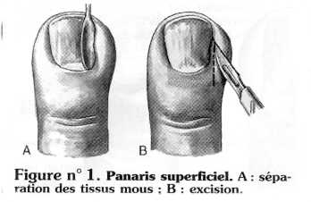
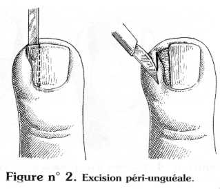
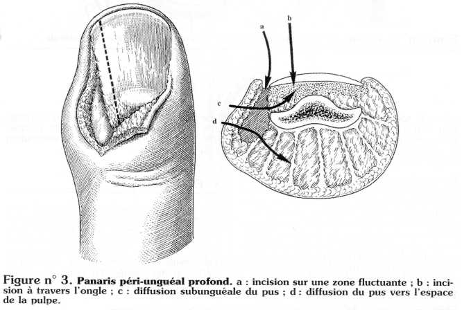
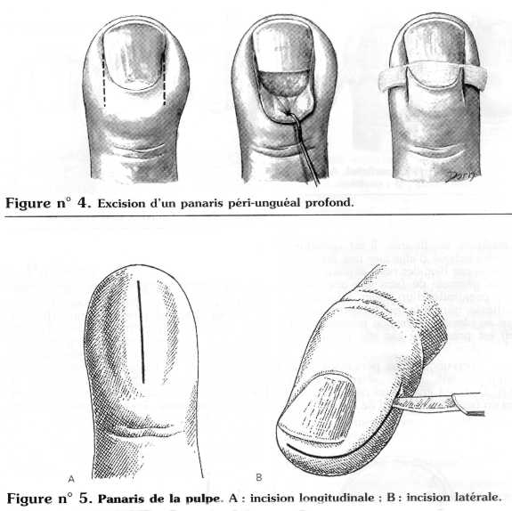
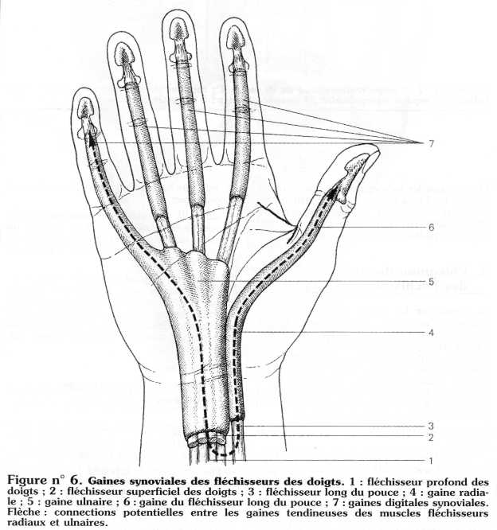
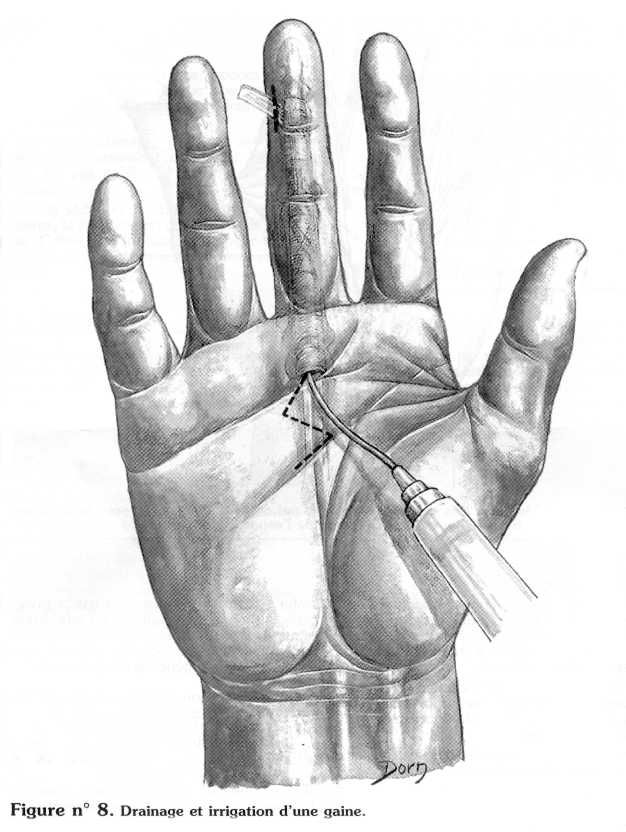

## I. Panaris

Le panaris est défini par l'infection aiguë primitive de n'importe quelle partie constituante d'un doigt. il touche fréquemment le travailleur manuel. Il est souvent consécutif à des micro-traumatismes ou à des piqûres au niveau de zones particulièrement exposées.

Le germe le plus fréquemment mis en cause est le staphylocoque doré. Les autres germes, plus rares, sont les streptocoques et les entérobactéries. Il peut exister un terrain favorisant le développement de panaris comme le diabète, l'éthylisme chronique, un déficit immunitaire ou une toxicomanie.

### 1. Diagnostic

#### a. Diagnostic clinique

Le panaris évolue en trois stades :

*   stade d'inoculation : il est souvent méconnu et est caractérisé par une douleur rapidement calmée;
*   stade phlegmasique : on retrouve des signes inflammatoires locaux avec oedème, rougeur et chaleur, sans signe général d'infection. La douleur est spontanée mais absente la nuit. À ce stade, l'évolution est souvent favorable sous traitement médical ;
*   stade de collection : les signes sont nets avec une tuméfaction locale rouge, chaude et surtout tendue. Il peut y avoir des signes généraux avec une fièvre. On retrouve parfois des adénopathies satellites associées à une traînée de lymphangite. Enfin, la douleur est intense, pulsatile, permanente et insomniante.

Suivant la localisation, le panaris peut être **superficiel ou sous-cutané**.

*   Le panaris **superficiel** siège dans l'épaisseur du revêtement cutané. Il peut être localisé au niveau de la région unguéale ; il s'agit du classique panaris péri-unguéal pouvant s'étendre en sous-unguéal. C'est le panaris le plus fréquemment rencontré. Il peut également se situer a la face palmaire du doigt, c'est le panaris phlycténoïde ou en bouton de chemise s'il communique avec un panaris sous-cutané par un étroit pertuis. Enfin, il peut atteindre la face dorsale du doigt. Il s'agit d'un panaris anthracoïde où le panaris est centré sur un follicule pilo-sébacé réalisant un furoncle de la face dorsale de la première phalange, d'évolution classique.  
*   Le panaris **sous-cutané** peut toucher indifféremment une phalange mais le plus fréquent est le panaris de la pulpe, très douloureux, faisant disparaître la pseudo-fluctuation de cette région qui est augmentée de volume au stade phlegmasique et sous tension au stade de collection.

#### b. Diagnostic paraclinique

Des examens complémentaires peuvent être prescrits en fonction du terrain et des circonstances de survenue. Il est **biologique,** avec une numération de la formule sanguine (hyperleucocytose avec polynucléose) et une glycémie à la recherche d'un diabète. Enfin, un prélèvement bactériologique systématique en per-opératoire du pus devrait être effectué. Il est **radiologique** avec une radiographie de la main à la recherche d'un éventuel corps étranger et surtout des signes d'ostéite (ostéolyse) et/ou d'arthrite (pincement articulaire).

### 2. Traitement

#### a. Au stade d'invasion :

Il faut effectuer des bains antiseptiques pluri-quotidiens. Ils sont parfois associés à une antibiothérapie anti-staphylococcique en fonction du terrain (diabète, immunodépression) La surveillance doit être régulière afin d'éviter la chirurgie .

#### b. Au stade de la collection :

Le traitement est chirurgical, avec excision complète de tous les tissus nécrosés et des zones purulentes, sous anesthésie. Il ne doit pas être minimisé du fait d'une analgésie insuffisante. Il est classiquement contre-indiqué d'effectuer une anesthésie en bague par bloc des nerfs digitaux et de façon plus générale de faire une anesthésie locale à proximité d'un foyer infectieux. L'anesthésie générale ou loco-régionale (plexique au plexus brachial ou tronculaire au poignet) est préconisée car elle permet un geste chirurgical large.

Un panaris péri-unguéal ou penonyxis situé superficiellement doit être excisé _(figure n° 1_). Il faut enlever un petit croissant de peau en respectant le bord de l'ongle, nettoyer et laver la petite zone infectée qui guérira spontanément en quelques jours. lorsque la suppuration est plus profonde (figures n° 2, 3 et 4) et qu'elle est passée sous l'ongle, il faut alors l'évacuer complètement en soulevant l'ongle.

On effectue une incision qui peut être unilatérale ou bilatérale, verticale, et qui permet de soulever le replis unguéal et l'ongle. Il faut faire attention à ne pas abîmer la matrice unguéale. Tout le segment d'ongle qui a été soulevé et décollé du lit par l'infection doit être réséqué, la zone largement lavée avec un antiseptique et laissée ouverte à la cicatrisation spontanée. La repousse de l'ongle recouvrira rapidement cette zone.

En cas de panaris de la pulpe (_figure n° 5_), celui-ci doit être excisé complètement. Il faut cependant éviter les incisions sur la pulpe elle-même dont les cicatrices peuvent être particulièrement gênantes. On effectue une incision sur le pourtour de l'ongle en décollant la face profonde de la pulpe, ce qui va permettre de la soulever et d'exciser, par l'intérieur, le panaris. Après lavage, la zone est simplement reposée, sans suture étanche.

La rééducation est débutée lorsque les phénomènes inflammatoires ont disparu.

Il ne faut pas oublier d'effectuer une prophylaxie antitétanique (sérothérapie et vaccination), de façon systématique si la vaccination n'est pas à jour.

### 3. Évolution

L'évolution est généralement favorable sous traitement bien conduit. La cicatrisation, après bourgeonnement, est obtenue en deux à trois semaines environ. Si le panaris est négligé, l'infection peut diffuser et entraîner une ostéite et/ou une arthrite, ainsi qu'un phlegmon des gaines. La récidive est une complication très fréquente liée à un traite ment insuffisant, avec excision chirurgicale incomplète.

L'antibiothérapie n'est pas nécessaire si le traitement chirurgical a été correctement effectué, avec une excision large et complète.

## Il. Les phlegmons de la main

On distingue, d'une part, les phlegmons des gaines des fléchisseurs, et, d'autre part, les phlegmons des espaces celluleux de la main. L'infection d'une gaine digitale est un accident sévère pouvant évoluer vers la destruction du système fléchisseur voire la perte d'un doigt, si elle n'est pas correctement traitée.

Il existe deux modes de contamination :

*   l'inoculation directe de la gaine par un agent vulnérant permettant l'introduction de germes superficiels ou extérieurs. Cela provoque une infection primitive nette et brutale ;
*   la diffusion des germes à travers une gaine longtemps intacte, à partir d'un foyer infectieux proche, évolutif comme un panaris. Cela provoque une infection secondaire, progressive et floue.

On retrouve les mêmes germes que pour les panaris et, il peut exister le même terrain prédisposant. Les doigts les plus fréquemment atteints sont, par ordre de fréquence décroissante, le médius, l'index puis le pouce,

### 1. Phlegmon des gaines des fléchisseurs

Ils siègent sur les gaines synoviales des fléchisseurs des doigts. Anatomiquement, ces gaines diffèrent d'un doigt à l'autre. On distingue les gaines digitales des 2e, 3e et 4e doigts dont le cul-de-sac supérieur remonte jusqu'au pli de flexion palmaire inférieur et les gaines digito-carpiennes, radiales pour le pouce et ulnaires pour l'auriculaire dont les culs-de-sac supérieurs remontent au dessus du pli de flexion du poignet. (_figure n° 6_)

#### Les lésions synoviales évoluent en trois stades :

*   _stade I_, inflammatoire caractérisé par l'apparition d'une sérosité exsudative, distendant progressivement la gaine. Le liquide est louche, la synoviale hypervascularisée ;
*   _stade II_, purulent caractérisé par une synovite purulente. La synoviale et granuleuse hypertrophiée et hypervascularisée. Si le liquide est franchement purulent, le tendon est encore intact.  
*   _stade III,_ de fistulisation caractérisé par la nécrose infectieuse du tendon, devenu un véritable séquestre infectant la gaine qui est rompue au cul-de-sac supérieur, et laisse diffuser l'infection.

Cliniquement, le doigt est gonflé, rouge, douloureux spontanément, adopte une position fléchie et toute tentative de l'étendre est fort douloureuse. La pression directe sur la gaine est également douloureuse. il peut exister des adénopathies satellites. Enfin, le patient présente de la fièvre .

### 2. Phlegmon des espaces celluleux

Il existe deux espaces celluleux à la main _(figure n° 7_) :

*   l'espace dorsal qui est de faible épaisseur,
*   l'espace palmaire subdivisé par l'aponévrose palmaire superficielle en un espace sus-aponévrotique, siège du phlegmon phlycténutaire et un espace sous-aponévrotique. Celui-ci comprend les loges thénarienne, hypo-thénarienne et palmaire moyenne.

Ces deux espaces communiquent entre eux et avec l'espace dorsal, au niveau de la racine des doigts, siège du phlegmon commissural. Le phlegmon celluleux associe du pus en quantité variable et une nécrose de tissu cellulaire de l'espace. Les risques de diffusion sont grands par les communications anatomiques entre les espaces et par les voies lymphatiques.

#### Sur le plan clinique :

*   en cas de phlegmon de l'espace dorsal, on retrouve un oedème diffus de la main notamment à sa face dorsale ;
*   en cas de phlegmon de l'espace palmaire médian, il existe une tuméfaction inflammatoire et douloureuse de la paume, la mobilisation passive des doigts étant possible ;
*   en cas de phlegmon commissural, il existe un bombement commissural écartant les doigts voisins avec possibilité de fusée purulente vers les doigts, les autres commissures et l'espace rétro-tendineux ;
*   en cas de phlegmon thénarien, il existe une tuméfaction thénarienne importante s'arrêtant au pli d'opposition du pouce et écartant le pouce et l'index.

Le diagnostic para-clinique biologique et radiologique est le même que pour les panaris.

### 3. Traitement

Il s'agit d'une urgence chirurgicale. En cas de phlegmon des gaines, dès qu'il s'agit d'un stade 2, tout délai pour intervenir est un risque pour le pronostic fonctionnel du doigt atteint. S'il s'agit d'un stade 1, un pansement avec une solution antiseptique, associé à une antibiothérapie antistaphylococcique peuvent être prescrits avant de référer le patient vers un centre chirurgical dans un délai qui ne doit pas dépasser quelques jours.

L'intervention est réalisée sous garrot pneumatique mais sans vidange, à l'aide d'une bande velpeau ou d'esmarch, le membre étant simplement surélevé pour le vider de son sang. L'anesthésie générale est préconisée.

#### a. Phlegmon des gaines

En cas de phlegmon des gaines _(figure n° 8),_ une première incision transversale dans la paume permet d'aborder directement la gaine qui est gonflée. Elle est alors ouverte, permettant l'écoulement d'un liquide qui peut être simplement trouble et purulent. Un prélèvement est effectué. Une deuxième incision est effectuée au niveau de la porte d'entrée qui est excisée. Cette contre-incision permet également d'ouvrir la gaine au niveau du doigt. On introduit un cathéter dans la gaine du fléchisseur touché, afin de pratiquer un lavage abondant au sérum physiologique. L'incision digitale peut être alors fermée. Au niveau de la paume, les tendons fléchisseurs sont explorés à la recherche d'une atteinte directe. Lorsque l'infection date, on retrouve parfois des nécroses partielles voire totales du tendon fléchisseur superficiel nécessitant une excision. L'incision de la paume est fermée par un ou deux points, et la main est mobilisée en légère flexion des doigts, poignet en rectitude par une attelle plâtrée.

#### b. Phlegmon des espaces celluleux

En cas de phlegmon des espaces celluleux _(figure n°_ 9), on pratique une excision de tous les tissus infectés et un drainage sur le même principe.  

  
Une antibiothérapie générale est mise en route ou poursuivie. Enfin, il faut, bien entendu, ne pas oublier la prophylaxie antitétanique.

Dès la sédation des phénomènes inflammatoires, la rééducation des doigts est entreprise. Celle-ci est fondamentale pour tenter de diminuer les séquelles fonctionnelles (raideur).

### 4. Évolution

Elle est souvent favorable au stade de ténosynovite simple, inflammatoire si le phlegmon est correctement traité.

Une immobilisation doit être maintenue jusqu'à ce que le doigt puisse être étendu sans douleur.

Les complications sont représentées par la nécrose tendineuse, la nécrose cutanée, l'ostéite et/ou arthrite, et surtout les séquelles fonctionnelles pouvant retentir sur la fonction de la main avec des raideurs notamment au niveau de la pince pouce-index et des troubles trophiques avec, éventuellement syndrome algodystrophique.

## III. Conclusion

Les infections de la main sont des urgences chirurgicales et celles-ci ne doivent pas être négligées afin de ne pas risquer d'avoir des séquelles fonctionnelles et esthétiques importantes sur cet organe social majeur qu'est la main.

_Développement et Santé, n° 146, avril 2000_