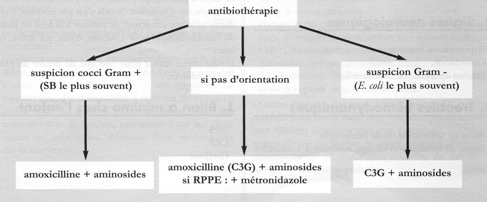
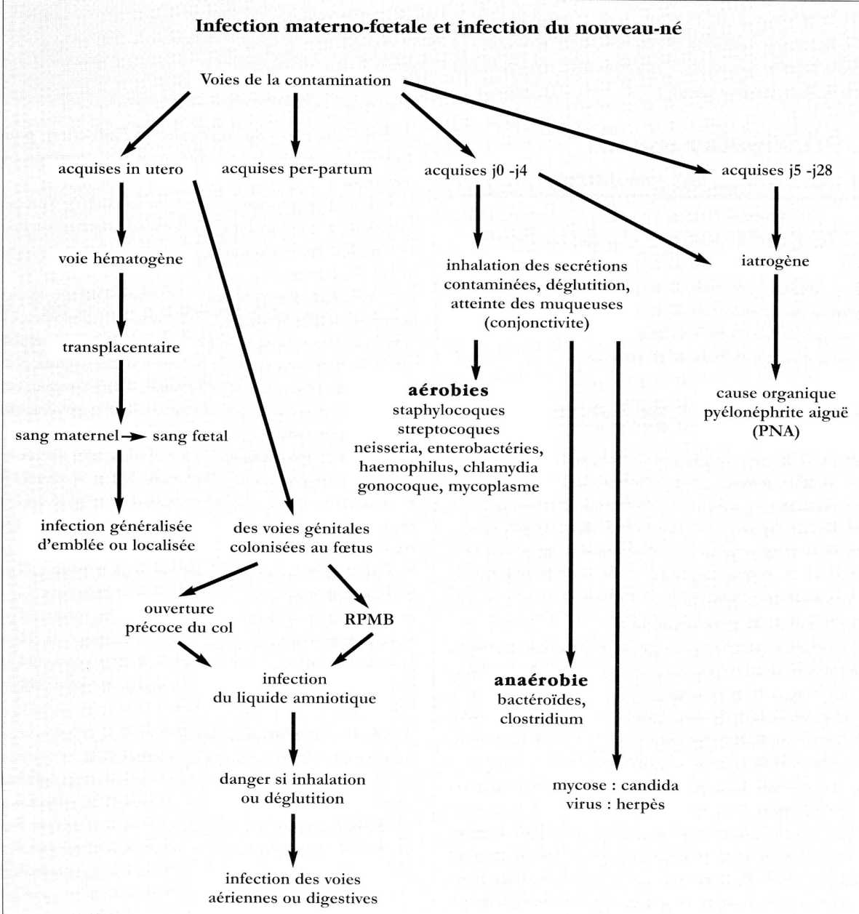

## I. Définition

Une infection est dite néonatale si sa date de survenue se situe entre la naissance et le 28ème jour, quel que soit le germe responsable :

*   elle est dite précoce si elle survient entre JO et J4,
*   elle est dite retardée si elle survient entre J5 et J28. Nous verrons que la physiopathologie de cette infection est totalement différente selon la date de survenue.

En raison de la gravité de ces infections, tout doit être mis en ceuvre pour les prévenir. Nous nous attacherons surtout à mettre en évidence les attitudes préventives fondamentales qui doivent être appliquées en tout lieu et tout particulièrement lorsque l'accouchement se déroule loin d'une structure hospitalière pédiatrique.  
**En effet, lorsque survient une telle infection, la seule prise en charge thérapeutique possible est une antibiothérapie par voie IV Cela nécessite donc un transfert de toute urgence dans une structure adaptée. En effet, chaque minute est précieuse en raison de la fragilité hémodynamique, respiratoire et neurologique du nouveau-né et de son immaturité immunitaire.**

Nous insisterons donc, dans ce chapitre, sur tout ce qui peut être mis en place en amont pour éviter cette infection. Bien que le traitement de celle-ci soit le fait du médecin et non de l'infirmier, nous en donnerons les modalités afin de permettre à l'infirmier ou à la sage-femme d'informer correctement les parents en cas de décision du transfert de l'enfant dans une unité adaptée.  

**Points particuliers**

*   Les infections suivantes ne sont pas abordées dans ce chapitre :Infections **virales**, notamment par le VIH : se référer au chapitre concernant la PTME et la prise en charge post-natale.  
*   Infections **parasitaires**, plus particulièrement le paludisme. Néanmoins, il est important de rappeler que, dès la naissance, il convient de mettre en ceuvre tous les moyens physiques pour éviter une contamination de l'enfant, gravissime à cet âge (lutte contre les moustiques, utilisation d'une moustiquaire dès la naissance).

## II. Savoir identifier les situations à risque

L'officier de santé (infirmier, sage-femme), dont le champ de travail est à distance d'une structure hospitalière équipée, n'a le plus souvent que peu de moyens diagnostiques. Il faut donc impérativement, lors de l'accouchement et avant si possible, savoir repérer les situations à risque. Cela nécessite d'interroger régulièrement la future mère à la recherche de petits signes pouvant faire évoquer la possibilité d'une infection néonatale. Il faut également pratiquer, à chaque consultation, un examen clinique soigneux. Au moindre doute, il conviendra d'orienter la mère vers un centre équipé, avant l'accouchement si possible. En effet, passée la naissance, en cas d'infection néonatale, chaque minute est précieuse pour prévenir de conséquences en général gravissimes en l'absence de traitement approprié.  
Les situations qu'il faudra savoir repérer pour anticiper l'infection néonatale sont les suivantes :

*   Chorio-amniotite.  
*   Fièvre maternelle > 38°C avant le travail.  
*   Risque de prématurité spontanée.  
*   Rupture prématurée de la poche des eaux (RPPE) surtout si elle a **plus de 12 heures**, en l'absence d'antibiothérapie maternelle.  
*   Rupture prématurée des membranes (fissuration) avant 37 SA.  
*   Antécédent d'infection à streptocoque B (SB) chez la mère, en l'absence d'antibioprophylaxie par de l'amoxycilline (s'assurer que celle-ci a été correctement suivie, sinon le risque persiste).  
*   Portage de SB connu, sans aucune mesure prise (notamment antécédent d'accouchement en contexte d'infection à SB et absence de traitement de la mère).  
*   Anomalies du rythme cardiaque foetal.  
*   A l'amnioscopie : liquide amniotique teinté ou méconial avant la rupture de la poche des eaux.

D'autres éléments des **antécédents maternels** peuvent conduire à orienter la mère, cette liste n'est pas exhaustive : tout élément orientant vers une pathologie gravidique maternelle est un facteur de risque potentiel d'infection materno-foetale ou d'infection retardée, du fait de la iatrogénie liée à cette pathologie.

## III. Quels élements de l’examen clinique peuvent orienter ?

Le nouveau-né doit être pris en charge à la moindre suspicion d’infection néonatales, il s’agit d’une urgence extrème.

La prise en charge du nouveau-né doit être instituée dans une structure adaptée pouvant mettre en place un traitement par voie intraveineuse (pas de voie intramusculaire chez le nouveau-né).

### 1.Signes généraux

Instabilité thermique : hypothermie ou hyperthermie : il est important de garder en mémoire que, contrairement à une pensée établie - seul le bébé qui "chauffe" est infecté -, nombre d'infections néonatales sont marquées, entre autres, par une difficulté du nouveau-né à se réchauffer.  
Teint gris, impression d'enfant en souffrance, geignard, hypotonique, avec des difficultés alimentaires.

### 2.Signes respiratoires

*   Apnée.  
*   Accès de cyanose, parfois fugaces et discrets (cyanose péribuccale, il faut penser à surveiller la paume des mains et la plante des pieds de ces enfants suspects).  
*   Détresse respiratoire aiguë, qui peut être décalée par rapport à la naissance et oriente dans ce cas vers une infection à streptocoque B ou une pneumopathie (souvent dans le cadre d'un syndrome d'inhalation).

### 3. Signes neurologiques

*   Hypotonie ou hypertonie.  
*   Convulsions.  
*   Tension anormale de la fontanelle.

### 4. Troubles hémodynamiques

*   Accès de tachycardie ou de bradycardie.  
*   Temps de recoloration allongé, supérieur à 3 secondes.

### 5. Signes digestifs

*   Difficultés de mise au sein.  
*   Régurgitations, ballonnement abdominal.  
*   Diarrhées, parfois sérosanglantes.

### 6. Signes cutanéo-muqueux évocateurs d’infection néonatale

*   Omphalite dans les jours suivant la naissance.  
*   Conjonctivite purulente (lorsqu'elle est précoce, elle peut être le témoin d'une infection à _chlamydiae_; son apparition retardée de quelques semaines est plutôt en faveur d'une infection à mycoplasme, en l'absence de surinfection liée à l'étroitesse d'un canal lacrymal).  
*   Purpura, pétéchies (à différencier des pétéchies faciales post-accouchement, témoins de traumatisme lors du passage de la filière vaginale).

### 7. Autres signes

*   Hépato-splénomégalie.  
*   Ictère précoce (attention, d'autres étiologies sont possibles en particulier les incompatibilités ABO-Rhésus), prolongé ou qui rechute secondairement.

**Attention** : ces signes ne sont pas spécifiques et c'est leur conjonction qui doit conduire à l'évocation rapide de ce diagnostic et à mettre en place le plus rapidement possible une prise en charge adaptée.

##   
IV. Examens complémentaires à pratiquer si possible

Si le nouveau-né est déjà dans une structure adaptée, il est important de pratiquer un bilan initial (si son état de santé le permet) qui permettra de poser avec certitude un diagnostic d'infection. Si cela n'est pas possible, il est inutile et même dangereux de surseoir à la mise en place de l'antibiothérapie pour effectuer, coûte que coûte, ce bilan.  
Il vaut mieux traiter pour rien que de perdre de précieuses minutes.

### 1. Bilan a minima chez l'enfant

*   NFS
*   CRP
*   Glycémie
*   Calcémie

### 2. Si possible

*   Chez la mère :
    *   ECBU
    *   Frottis et culture du placenta
    *   Mise en culture de liquide amniotique
    *   Hémocultures si la mère est fébrile
*   Chez l'enfant :
    *   Prélèvement gastrique
    *   ECBU
    *   Hémocultures systématiques (même en l'absence de fièvre)
    *   Prélèvements localisés en cas de signes évocateurs
    *   Ponction lombaire

**Immédiatement au décours de ce bilan et sans en attendre les résultats, le traitement antibiotique de présomption doit être mis en route. Ses modalités pourront être modifiées secondairement en fonction de l'évolution clinique et des résultats biologiques.**

## V. Modalités du traitement antibiotique

*   En l'absence d'éléments d'orientation, on institue une antibiothérapie probabiliste couvrant les germes les plus fréquemment en cause dans ce type d'infection :
    *   Streptocoque B
    *   _Escherichia coli_
*   L'antibiothérapie est double au départ pour éviter une pression de sélection de germe ainsi que l'apparition d'un mutant résistant.  
*   Cette antibiothérapie doit satisfaire aux règles suivantes :
    *   L'antibiotique choisi doit être le plus ancien possible et le plus utilisé (application de consensus thérapeutique) pour garder en réserve l'utilisation d'antibiotiques plus récents et plus efficaces si besoin (ceci évite l'apparition rapide de germes résistants pouvant poser secondairement des problèmes thérapeutiques gravissimes en cas d'infection nosocomiale).  
    *   L'antibiothérapie doit être la moins toxique pour l'enfant : attention à l'immaturité rénale du prématuré, au risque d'ototoxicité lié à l'utilisation exagérée d'aminosides.  
    *   Elle doit être la plus diffusible, d'où l'importance de l'utilisation impérative de la voie N, afin d'avoir la distribution la plus rapide dans tout l'organisme.  
    *   L'antibiotique prescrit doit, dans la mesure du possible, être le plus facile à administrer car, dès que la phase aiguë est passée et l'état de l'enfant stabilisé, il peut être discuté le choix d'une voie orale.  
    *   La moins coûteuse : les médicaments génériques ont la même efficacité (à condition d'avoir une traçabilité sûre du produit utilisé).

**Consensus thérapeutique**  
(voir tableau ci-dessous)

*   Amoxicilline : 100 mg/kg/24 h (si meningite : 200 mg/kg/24 h),
    *   avant J7 : en 2 injections voie IV lente,
    *   après J7 : en 3 injections voie IV lente,
*   Gentamycine ou netilmicine,
    *   avant J7 : 4 mg/kg/24 h en perfusion d'une heure en 2 administrations à 12 heures d'intervalle,
    *   après J7 : 6 mg/kg/24 h en 3 prises à 8 heures d'intervalle, en perfusion IV d'une heure,
*   C3G : céfotaxime 100 mg/kg/24h en 2 administrations IV lentes à 12 heures d'intervalle.

**Durée du traitement :**

*   Pour une infection systémique : 8 à 10 jours.  
*   Pour une méningite à SB : 15 jours.  
*   Pour une méningite à _E. coli_ : 21 jours.  
*   En cas de non confirmation d'une infection néonatale (clinique et résultats biologiques), l'antibiothérapie peut être arrêtée au bout de 48 heures.  
*   L'association d'aminosidcs n'est indiquée que dans le cas d'IIiF a\,érée ; dans les autres cas, il est possible d'administrer une monothérapie, à choisir en fonction de l'orientation clinique.

<table>

<tbody>

<tr>

<td>En cas d'IMF à SB, il est fondamental de s'assurer que la mère a reçu un traitement adapté par amoxycilline non seulement pour prévenir une complication puerpérale maternelle, mais également pour éviter le portage ultérieur et prévenir une récidive lors d'un accouchement futur.</td>

</tr>

</tbody>

</table>

  

Developpement et Santé, n° 197/198, 2010