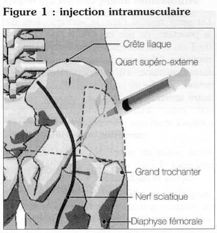

## **I. Matériel**

### **1. Pour le soin**

*   Aiguille en acier inoxydable ou en nickel à biseau long (moins douloureux) :
    *   aiguille longue de 7 cm de longueur (couleur verte), son biseau est long ;
    *   aiguille courte de 4 cm (de couleur noire)pour des personnes de faible poids et pour la pédiatrie) ;
    *   le diamètre varie de 0,7 à 0,9 mm (les dia­mètres plus importants sont réservés à des produits visqueux).
*   Seringue adaptée à la quantité à injecter.
*   Diluant de reconstitution si le produit est lyophilisé (préférer le diluant fourni avec le produit à l'eau pour préparation injectable, ce diluant est plus efficace et contient éven­tuellement un anesthésique local, diminuant la douleur lors de l'injection du produit).

### **2. Pour l'asepsie**

*   Gants non stériles à usage unique.
*   Compresse ou coton.
*   Désinfectant (alcool modifié à 70°).
*   Boîte à aiguilles souillées.
*   Sac poubelle.

## **II. Préparation du patient**

Le patient est allongé en décubitus ventral, il peut rester debout, s'il le souhaite, mais cette position est à éviter. En pédiatrie, il n'est pas rare que l'enfant se sente mal. Si c'est le cas, patienter, surveiller l'enfant et lui lever les jambes si nécessaire (afin de faciliter le retour veineux) pour qu'il reprenne conscience.

## **III. ****Réalisation technique du geste**

*   Pratiquer un lavage des mains antiseptique (ou lavage simple plus friction avec un solu­té hydro-alcoolique).
*   Reconstituer le produit si nécessaire en injectant la quantité de diluant dans le flacon de manière aseptique (désinfecter le bou­chon), mélanger le produit sans le secouer. Réchauffer le produit entre les mains si nécessaire.
*   Choisir la zone de ponction, habituellement le quart supéro-exteme de la fesse _(voir Figure 1)_, (le deltoïde peut être utilisé pour des injections de petites quantités, mais cette voie est souvent plus douloureuse).
*   Mettre les gants.
*   Désinfecter la zone de ponction choisie en un seul passage de compresse imbibée d'alcool.
*   Piquer perpendiculairement au plan de ponc­tion. Introduire rapidement l'aiguille jusqu'à la garde, vérifier l'absence de retour veineux en aspirant légèrement puis commencer à injec­ter lentement et régulièrement.
*   Observer les réactions du patient dès le premier millilitre injecté, ralentir le débit si le produit est douloureux.
*   Attendre quelques secondes dans le cas d'un diluant contenant un anesthésique local pour poursuivre l'injection, afin que celui-ci fasse effet.
*   Retirer rapidement l'aiguille et la seringue à la fin de l'injection, désinfecter le point de ponction en massant légèrement.
*   Eliminer l'aiguille dans le collecteur à aiguilles souillées.

## **IV. Surveillance après le soin**

Surveiller l'absence d'une douleur vive après l'injection.

Une douleur locale après l'injection est fréquen­te et variable selon les produits utilisés, deman­der au patient de consulter si elle persiste au-delà de 48 heures.

## V. Complications et risques

Il est important de vérifier auprès du patient, avant l'injection, qu'il ne soit pas allergique au produit qui va être administré.

*   Malaise vagal.
*   **_Respecter scrupuleusement les précautions d'accidents à l'exposi­tion au sang, le port de gants, le non recapuchonnage de l'aiguille, l'élimination de l'aiguille dans la boîte à aiguilles souillées._**
*   Apparition d'un hématome.
*   Douleur au point d'injection.
*   **_Douleur extrêmement vive en cas de ponction du nerf sciatique._**
*   Abcès autour du point d'injection, qui peut provoquer des troubles nerveux, (en particu­lier chez l'enfant).

*   Du sang revient dans la seringue lors de la ponction, ne pas injecter, retirer l'aiguille de 1 ou 2 cm et repiquer en variant l'angle, revérifier l'absence de sang, puis injecter. Éventuellement, s'il y a un retour franc, retirer l'aiguille et comprimer. Préparer une autre seringue.

## VI. Evaluation

### 1. De la procédure de soin

*   Absence d'allergie au médicament.
*   Absence de réaction inattendue après l'ad­ministration du produit.
*   Le port des gants a été respecté.

### 2. Du résultat ou des objectifs à atteindre

*   L'injection du produit est correctement réalisée, dans sa totalité, sans apparition de complications et contribue au traitement du patient.
*   Les effets secondaires indésirables du traite­ment sont évalués, surveillés, transmis et pris en charge.

_Développement et santé, n°184, 2006_