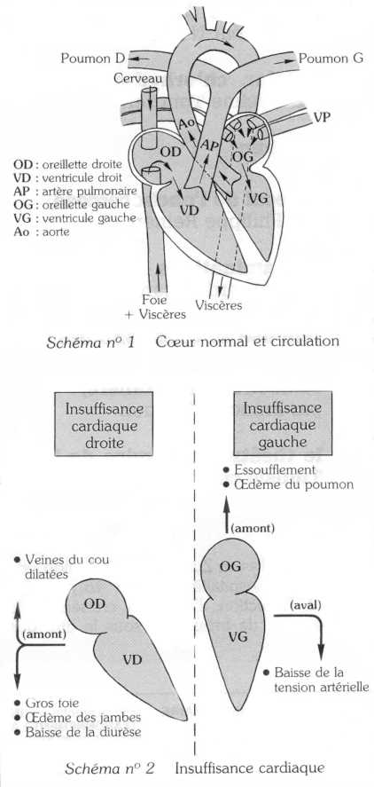
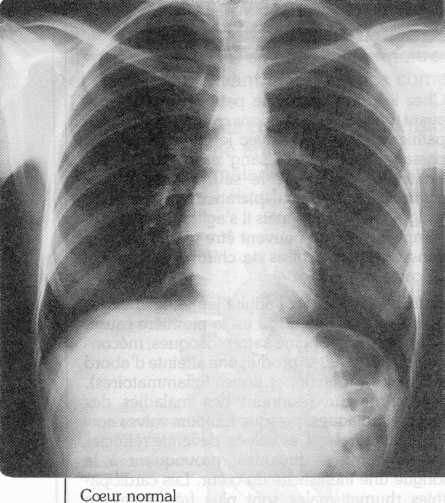
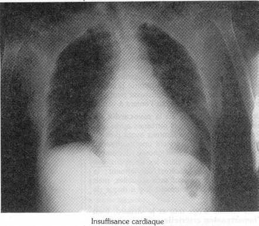

L'insuffisance cardiaque est l'incapacité du coeur à assurer la circulation du sang et l'oxygénation des tissus. Il est important de savoir la reconnaître dès les premiers symptômes et de la traiter avant la défaillance complète du coeur. De plus,certaines maladies comme l'hypertension artérielle ou le rhumatisme articulaire aigu entraînent des maladies cardiaques et peuvent être prévenues par des moyens simples qu'il faut connaître.

**Les mécanismes de l'insuffisance cardiaque**

Le coeur est un muscle (myocarde), contenu dans un sac (péricarde) et qui comporte quatre valves (endocarde). Il reçoit le **sang veineux** en provenance des viscères et du cerveau au niveau des **cavités droites.** Le ventricule droit éjecte ce sang veineux, par l'artère pulmonaire, dans les poumons où se fait l'échange du gaz carbonique (qui est soufflé à l'expiration) contre de l'oxygène (qui provient de l'air inspiré). Le sang ainsi **oxygéné** va dans les cavités **gauches ;** il est éjecté par le ventricule gauche dans l'aorte et les artères périphériques, pour alimenter les membres, les viscères, le cerveau _(cf. schéma n° 1)._

Lorsque le muscle cardiaque devient **défaillant,** le retentissement se fait d'abord en amont:

*   ainsi, quand le ventricule **gauche** n'éjecte plus suffisamment de sang, il se produit un engorgement dans les **poumons,** qui se traduit d'abord par un essoufflement (dyspnée), puis par un passage d'eau dans les alvéoles (oedème pulmonaire) ;

*   de même, quand le ventricule **droit** àson tour ne fonctionne plus correctement, le sang veineux stagne dans les **tissus,** d'où un gros foie douloureux et des oedèmes des jambes.

Un coeur insuffisant ne parvient plus à éliminer **l'eau** et **le sel:** la diurèse baisse et il y a une surcharge hydrosodée.

Ce n'est que quand le débit de sang éjecté par le ventricule gauche est très diminué que la **tension artérielle** commence à baisser, avec même apparition de signes de **choc,** lorsque les tissus ne reçoivent plus de sang oxygéné _(cf. schéma n° 2)._

**Les principales causes de** **maladies cardiaques**

Chez le nourrisson et le petit enfant, ce sont avant tout les malformations cardiaques (cardiopathies congénitales, avec le plus souvent un passage anormal de sang entre les cavités droites et gauches); le seul traitement est chirurgical lorsque la tolérance est mauvaise malgré la Digitaline mais il s'agit de techniques complexes qui ne peuvent être pratiquées que dans quelques centres de chirurgie cardiaque africains.

Chez l'adolescent et l'adulte jeune, le **rhumatisme articulaire aigu** est la première cause. A la suite d'une angine à streptocoques, méconnue ou négligée, se produit une atteinte d'abord articulaire (douleurs et signes inflammatoires), puis cardiaque (donnant des maladies des valves cardiaques, presque toujours valves aortique ou mitrale). Ces valves, devenue rétrécies ou au contraire fuyantes, provoquent à la longue une inefficacité du coeur. Les cardiopathies rhumatismales sont plus fréquentes en Afrique du Nord qu'en Afrique Noire et dans les villes que dans les zones rurales.

Plus rarement, à cet âge, on trouve des **cardiopathies tropicales** (fibrose endomyocardique, endocardite fibroplastique, maladie du sommeil, paludisme, etc.).

Chez la femme, la grossesse vient souvent aggraver et décompensé une maladie cardiaque jusque-là inconnue ou peu gênante. Il faut donc expliquer à une jeune femme porteuse d'une cardiopathie que la grossesse peut être dangereuse pour elle et pour l'enfant à venir.

Un tableau particulier est la **myocardite du** **post-partum:** quelques semaines après l'accouchement (chez des femmes ayant déjà eu plusieurs grossesses, survient une insuffisance cardiaque dont la cause est ignorée; des embolies (caillots de sang dans les vaisseaux des poumons ou des viscères) surviennent; la guérison se fait souvent sans séquelles, mais après chaque accouchement, il y a risque de récidive.

Chez l'adulte d'âge mûr et le vieillard, c'est **l'hypertension artérielle** qui est le plus souvent en cause. Elle s'associe parfois à une maladie coronarienne (rétrécissement des artères qui nourrissent le coeur), qui est beaucoup plus rare qu'en Europe.

Enfin, à tous les âges, on rencontre des **myocardites anémiques:** l'anémie profonde (par manque de fer, hémorragie, drépanocytose, etc.) entraîne une mauvaise oxygénation du myocarde et une insuffisance cardiaque. Nous n'étudierons ici que l'insuffisance cardiaque de l'adulte.

**Les premiers signes**

Quelle que soit la cause, il existe certains symptômes qui doivent faire évoquer une insuffisance cardiaque débutante:

**1.** Surtout **l'essoufflement** (dyspnée): c'est habituellement le premier signe; d'abord uniquement dans les efforts importants (course, marche), il devient ensuite permanent (même au repos); ce qui est caractéristique alors est le soulagement relatif en position assise (le malade suffoque lorsqu'il est allongé).

**2.** Dans les cas plus graves, il existe des **poussées** réalisant des crises d'étouffement: ou bien, crise d'asthme, ou bien oedème du poumon, avec une angoisse, une toux, des crachats mousseux et intarissables; il faut traiter d'urgence avec des diurétiques. La radio, lorsqu'elle est possible, montre un gros coeur avec des images floconneuses des deux poumons.

**3.** Dans certains cas, c'est un **gros foie** **douloureux** soit à l'effort (point de côté droit), soit en permanence, qui attire l'attention. Il s'associe à une dilatation des veines du cou. Il existe également des **oedèmes** des membres inférieurs: gonflement des pieds, des chevilles et des jambes qui prennent le godet (lorsqu'on appuie avec le doigt, l'empreinte reste marquée par un creux pendant plusieurs secondes).

Quel que soit le tableau, un signe doit être recherché; la **tachycardie** ou accélération de la fréquence du coeur (le pouls est fréquemment entre 100 et 150 par minute). Habituellement un coeur insuffisant ne donne **pas de douleurs.** Les sujets jeunes qui se plaignent de douleurs comme des pointes dans la poitrine, mais qui n'ont pas d'essoufflement, peuvent le plus souvent être rassurés après avoir été examinés attentivement; ces symptômes très fréquents sont liés à une anxiété ou à une contrariété; ils cèdent sous de petites doses de tranquillisants.

Par contre, chez l'insuffisant cardiaque vrai (essoufflement), la survenue de douleurs doit faire rechercher deux causes:

**1.** **Une embolie pulmonaire** (caillot dans une artère pulmonaire) surtout chez la femme qui vient d'accoucher, chez un sujet qui vient d'être opéré, ou chez une personne âgée qui reste au lit; il faut alors donner des anticoagulants (à l'hôpital).

**2. Une angine de poitrine** (les artères coronaires qui alimentent le coeur sont bouchées), surtout chez l'homme de plus de quarante ans; la douleur n'est pas comme une piqûre mais comme un serrement de la poitrine; il faut faire un électrocardiogramme quand on le peut et donner de la Trinitrine à croquer et à faire fondre sous la langue.

**Les signes tardifs**

Si l'on ne traite pas dès l'apparition des premiers symptômes, et même parfois malgré le traitement, on peut aboutir au tableau de défaillance cardiaque globale:

**1.** **Essoufflement permanent,** empêchant la position allongée et le moindre effort; parfois des crises d'étouffement aggravent encore l'état respiratoire.

**2. Gros foie douloureux** qui s'accompagne de veines dilatées du cou, d'oedèmes des membres inférieurs et d'une réduction du volume des urines qui deviennent foncées.

**3. État de choc** enfin, qui survient lorsque le coeur ne parvient plus à éjecter suffisamment de sang dans les tissus: le pouls est très rapide, la tension artérielle s'abaisse au- dessous de 10, les extrémités (mains et pieds) sont froides, il n'y a plus d'urines et le sujet fait des malaises. Le coeur est très rapide (tachycardie). Si l'on dispose d'un stéthoscope, on entend des crépitants (comme un feu de bois) à la base des deux poumons; au niveau du coeur on entend un rythme rapide, souvent irrégulier, avec parfois des souffles.

Dans tous ces cas, où il y a risque vital, le transfert à l'hôpital est nécessaire pour faire un électrocardiogramme, une radio pulmonaire, et une échographie cardiaque pour donner un traitement approprié (en particulier de l'oxygène) et pour avoir une meilleure surveillance.

**Le traitement**

**A. Dans les formes chroniques,** lorsqu'il existe un essoufflement isolé ou un gros foie douloureux ou des jambes gonflées, le meilleur traitement est **le régime sans sel et le repos** **allongé.** Ce traitement amène toujours une amélioration.

Parfois, il est insuffisant, et on doit alors associer **des digitaliques et des diurétiques:**

*   **Digitaline:** 1/2 ou 1 comprimé tous les deux jours; si on a des gouttes : 5 gouttes = 1 comprimé; si on a de la Digoxine, même nombre de comprimés (l'avantage de la Digoxine est d'agir plus vite).

*   **Lasilix:** 1 à 2 comprimés tous les deux jours (1 comprimé = 40 mg) ; on lui associe en général du potassium (2 cuillerées à soupe ou 2 comprimés de chlorure de potassium par comprimé de Lasilix).

**B.** Dans les poussées aiguës d'insuffisance cardiaque, avec en particulier crise d'étouffement (oedème pulmonaire), il faut:

*   asseoir le malade et le calmer,
*   lui donner de l'oxygène (4 à 8 litres par minute),

*   lui injecter 1 ou 2 ampoules de Lasilix intraveineux sauf si la tension artérielle est au-dessous de 8,
*   lui injecter 1 ampoule de Cédilanide ou de Digoxine intraveineuse lente,
*   lui faire fondre 1 comprimé (à renouveler après quinze minutes) de Trinitrine sous la langue,
*   la Théophylline n'est généralement pas efficace.

Si ce traitement ne suffit pas, si l'état s'aggrave et si la tension n'est pas inférieure à 8:

*   refaire deux à quatre ampoules de Lasilix intraveineux,
*   ou faire une saignée veineuse en retirant en quelques minutes 1/2 litre de sang par une grosse veine du bras.

De toutes façons, le traitement doit être poursuivi, après transfert, en milieu hospitalier, car il est souvent difficile.

**C. Quelques cas particuliers:**

*   **Rhumatisme articulaire aigu :** il faut associer au traitement des injections intramusculaires de Pénicilline-retard (Benzathine-Pénicilline ou Extencilline: 1,2 million d'unités par mois).

*   **Hypertension artérielle:** il faut traiter l'hypertension qui a de toutes façons tendance à diminuer lorsqu'il y a insuffisance cardiaque.

*   **Myocardie anémique :** il faut corriger l'anémie en apportant du sang et du fer, et traiter la cause de l'anémie.

*   La chirurgie cardiaque est pratiquée dans peu de centres africains; pour un rétrécissement mitral, une opération à coeur fermé, relativement peu risquée, suffit souvent; pour les autres maladies des valves cardiaques, il faut une chirurgie à coeur ouvert qui est difficile et nécessite un équipement coûteux.

**La prévention**

La survenue des maladies cardiaques n'est pas toujours inéluctable: certaines d'entre-elles peuvent être prévenues:

*   **Le rhumatisme articulaire aigu** peut être évité, au moins en partie par le traitement des angines par la Pénicilline ; une injection de 1,2 million d'unités d'Extencilline suffit pour guérir une angine et prévenir la maladie cardiaque. Si celle-ci existe déjà, on peut encore en prévenir l'aggravation en donnant une injection mensuelle d'Extencilline (même dose).

*   **L'hypertension artérielle** aussi doit être dépistée et traitée avant queue ne donne une insuffisance cardiaque. La prise de la tension fait partie du travail de l'infirmier; une tension supérieure ou égale à 16 nécessite un traitement adapté et une surveillance.

**En conclusion**

L'insuffisance cardiaque doit être diagnostiquée par l'infirmier dès les premiers symptômes: l'essoufflement à l'effort, puis permanent, est le meilleur signe précoce. Il faut alors traiter par le régime sans sel et le repos, auquel on ajoute souvent de la Digitaline et des diurétiques. Dans les formes graves, il y a un risque vital et il faut commencer un traitement d'urgence, avant d'envoyer à l'hôpital.

La sévérité des maladies cardiaques doit inciter à intégrer, dans les programmes de soins de santé primaires, la prévention du rhumatisme articulaire aigu et de l'hypertension artérielle.

_Développement et Santé, n°49, février 1984_