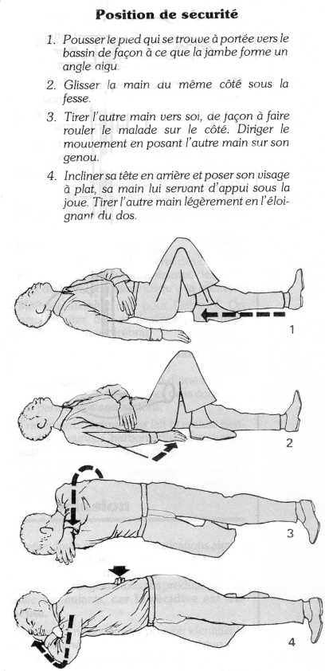
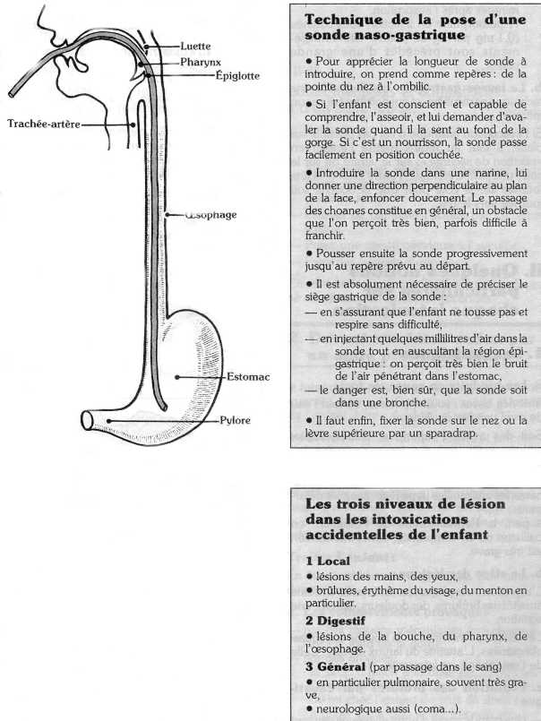

## **I. Que faire devant une** **intoxication par produits** **ménagers ou domestiques?**

L'interrogatoire de l'entourage permet de connaître rapidement le produit en cause. Il faut d'emblée distinguer deux cas: les intoxications par caustiques et les autres.

### **1. Devant une intoxication par caustiques**

(_liste donnée plus loin_), **il faut:**

*   Laver aussitôt les zones atteintes avec de l'eau ou du sérum physiologique.

*   En cas d'ingestion d'eau de javel seulement, administrer par la bouche 50 à 60 ml d'une solution à 1 % d'hyposulfite de sodium (Hyposylfène®).

*   En cas d'ingestion de comprimés de permanganate de potassium (MnO4K) et si l'on est sûr qu'ils sont dans l'estomac grâce à une radiographie de l'abdomen sans préparation (ces comprimés sont radio-opaques), s'il n'y a ni choc ni perforation (ventre souple, absence de pneumopéritoine sur la radio de l'abdomen), faire une injection de 0, 1 mg/kg d'Apomorphine® en sous-cutané.

*   S'il y a une dyspnée laryngée, on donne des corticoïdes en injection IM ou IV (Soludécadron® : une ampoule de 4 mg renouvelable).

**Ce qu'il ne faut surtout pas faire,** **c'est:**

- Faire absorber des liquides, quels qu'il soient

(une perfusion peut être nécessaire pour maintenir un apport hydrique pendant les premiers jours).

- Essayer de diminuer l'acidité par un autre liquide.

- Poser une sonde gastrique à l'aveugle.

- Faire des lavages d'estomac.

En effet, les lésions sont d'emblée maximales et se constituent en quelques secondes.

### **2. Devant une intoxication par** **un autre produit, il faut:**

*   Interroger l'entourage: nature du produit, quantité, heure de l'intoxication, âge et poids de l'enfant, heure du dernier repas.

*   Faire un examen clinique rapide et complet, rechercher une contre-indication à l'évacuation du contenu gastrique (troubles de la déglutition, coma, dérivés du pétrole), apprécier l'état de conscience, la respiration, la circulation (pouls, tension artérielle), rechercher un signe anormal, regarder les yeux, la bouche, la peau, les urines, sentir l'odeur de l'haleine.

**Traiter l'enfant:**

En évacuant le contenu gastrique. Les méthodes en sont:

### **a. Les vomissements provoqués:**

*   par des moyens mécaniques en " chatouillant " le fond de la gorge,
*   par des drogues:
*   le sirop d'Ipeca à la dose de 15 ml chez l'enfant de moins de deux ans, 30 ml chez l'enfant de plus de deux ans, à diluer dans cinq à dix fois son volume d'eau, provoquant les vomissements vingt minutes après l'absorption,

- l'Apomorphine en injection sous-cutanée (0, 1 mg par kg de poids). Les vomissements sont précédés d'une grande pâleur.

### **b. Le lavage gastrique:**

qui demande une technique particulière, et qui doit être fait par un infirmier.

Si l'évacuation gastrique n'est pas possible sur place, il faut au moins mettre l'enfant en " position de sécurité ": sur le ventre ou sur le côté, une jambe étendue, l'autre fléchie, la tête tournée sur le côté pour que la bouche soit tournée vers le bas.

## **II.** **Quelques notions particulières sur chaque intoxication**

### **1. Les caustiques**

**a. Les produits en cause,** ce sont:

**Soit des bases:** soude, potasse, surtout l'eau de Javel vendue en Afrique.

**Soit des acides:** sulfurique, chlorhydrique, nitrique, acétique.

**Soit des produits domestiques,** tels: les produits de lessive (Teepol ou autres), les décapants, les antirouilles (type Rubigine), les détartrants ;

à part, le Permanganate de Potassium en paillettes ou en comprimés, dont l'intoxication est très grave.

**b. Le siège des lésions:**

L'ingestion ou la projection sur la peau entraîne aussitôt des brûlures, des douleurs, des cris, une agitation.

Les lésions à l'intérieur de la bouche sont quasi obligatoires. L'atteinte du larynx est rare. Celle de l'oesophage est fréquente.

**c. Evolution des brûlures par caustique:**

- Une grande partie d'entre elles évoluent tout de même de façon favorable car elles restent superficielles.

- Les autres évoluent vers le rétrécissement ou " sténose " oesophagienne, qui ne peut être traitée que dans un grand centre hospitalier.

### **2. Les produits domestiques**

**a. Le pétrole ou ses dérivés** (white spirit, essence de térébenthine, essence ordinaire, fuel, gaz-oil, détachants, cires ... ) :

- La quantité ingérée est en général faible. Le diagnostic est facile à cause de l'odeur de l'haleine.

- On définit trois groupes de manifestations:

(1) - Digestives par intoxication locale:

*   érythème du menton, de la partie supérieure du thorax,
*   vomissements très précoces,
*   diarrhées, parfois sanglantes.

(2) - Générales liées à l'absorption du produit :

*   obnubilation, parfois coma,
*   accélération de la fréquence cardiaque, pâleur, chute de la tension,
*   fièvre.

(3) Respiratoires par inhalation ou absorption:

elles peuvent être graves et précoces.

Comme pour les intoxications par caustiques, il faut débarrasser l'enfant de ses vêtements imbibés, ne rien lui donner à boire, ne pas le faire vomir, ne pas faire de lavage gastrique. Mettre seulement l'enfant en position de sécurité.

### **b. Le Trichloréthylène:**

- Ce produit est utilisé comme solvant des graisses ou des huiles, ou comme détachant.

- Le tableau clinique est dominé par le coma, des signes respiratoires (oedème aigu du poumon), des vomissements, une odeur particulière.

- Le traitement consiste en une élimination du toxique par voie digestive (lavage gastrique). On peut donner du charbon. Surtout pas de lait ce jour là, ni les jours suivants.

**c. Ethanol** (boissons alcoolisées):

- Le tableau clinique est dominé par:

- les troubles du comportement (ébriété),

- les convulsions,

- la perte de la vue, un strabisme;

- Des vomissements (odeur caractéristique, alors que l'haleine ne sent pas l'alcool).

- Hypothermie, parfois.

**Traitement :**

- évacuation gastrique, ingestion de charbon,

- correction de l'hypoglycémie: injection rapide de une ou plusieurs ampoules de glucosé à 30 % intraveineux.

**d. Méthanol** (alcool de bois, alcool à brûler) :

- Le tableau clinique comprend des douleurs abdominales avec vomissements, des troubles de la vision (allant jusqu'à la cécité).

- Même traitement que pour l'éthanol. On peut ajouter des corticoïdes pour lutter contre l'oedème cérébral.

**e. Antimites, blocs déodorisants** (Paradichlorobenzène ou naphtaline):

- Le tableau clinique est celui d'une irritation des muqueuses, des troubles de la conscience, parfois des convulsions.

- Traitement: régime sans lait ni graisse pendant 48 heures. Charbon activé. Évacuation gastrique si intoxication grave.

### **En conclusion**

On retiendra la gravité des intoxications aiguës accidentelles par les caustiques. Le meilleur traitement est évidemment la prévention de tels accidents, en rangeant tous ces produits hors de portée des enfants, **car la récidive est fréquente.**

Il est toujours nécessaire de pouvoir identifier le contenu d'une bouteille par une marque distinctive.

_Développement et Santé, n°43, février 1983_