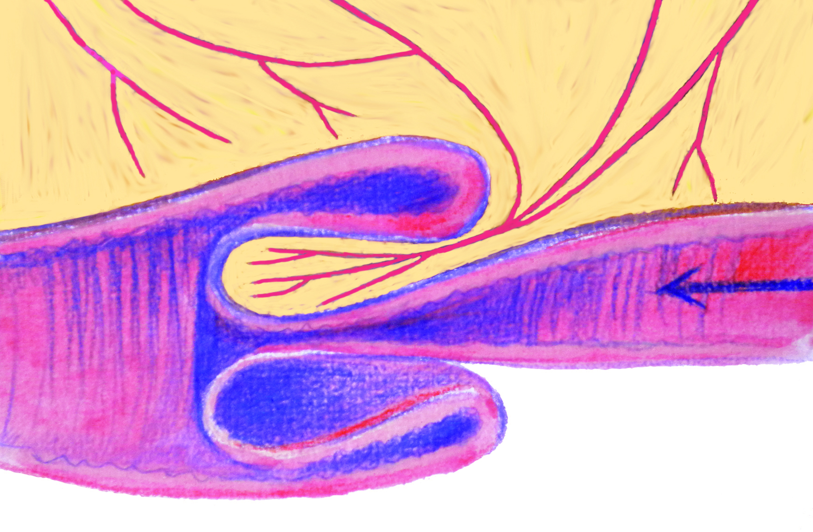
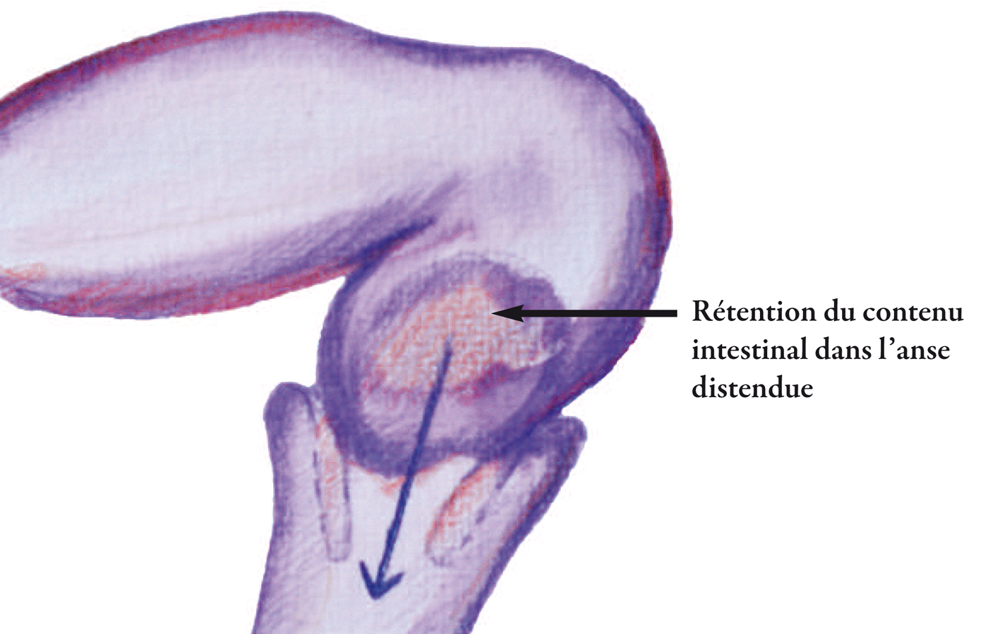
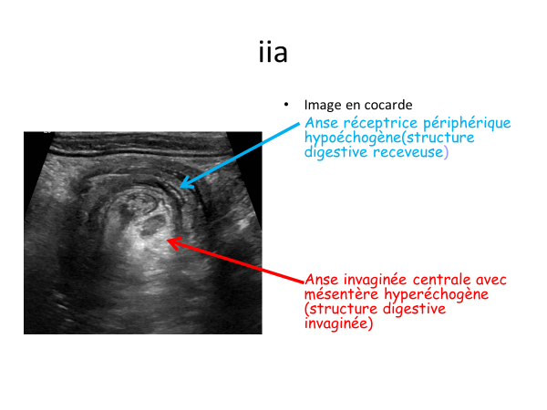

Une affection trop souvent méconnue qui nécessite un diagnostic rapide afin de ne pas mettre en jeu le pronostic vital.

L’invagination intestinale aiguë (IIA) est une affection qui touche principalement le nourrisson, plus rarement l’enfant, dont les signes cliniques peuvent être trompeurs et entraîner un retard diagnostique aux conséquences gravissimes.  
Peu d’études concernant cette pathologie ont été conduites dans les pays en développement, ce qui explique leur méconnaissance et leur pronostic effroyable dans les séries rapportées. Ainsi, l’IIA a entraîné une résection intestinale dans 36 à 66 % des cas en Afrique en fonction du délai du diagnostic, mais également une mortalité importante et sous-évaluée, puisqu’il s’agit de séries hospitalières alors que ceux-ci surviennent bien souvent avant une hospitalisation, en l’absence d’une évocation diagnostique (52 % en Haïti, 55 % au Niger, 58 % en Inde).  
Seule l’amélioration des conditions sanitaires et la connaissance clinique de l’IIA par les premiers acteurs de santé consultés permettront de réduire la gravité de cette affection.

## I. La physiopathologie de l’IIA en explique les redoutables complications

De façon imagée, comme le montrent les schémas ci-dessous, lors de la constitution de l’IIA, la paroi intestinale se replie "en doigt de gant", parfois sur plusieurs cm, entraînant une compression des vaisseaux irriguant la paroi intestinale. Il en résulte la constitution progressive d’un œdème et d’une ischémie de cette paroi en raison de la compression d’un morceau du mésentère comme le montre le schéma, il y a arrêt du péristaltisme avec constitution d’un syndrome occlusif. Si aucune désinvagination ne se produit, progressivement, la paroi intestinale va se nécroser avec le risque d’une perforation intestinale et d’un sepsis gravissime.

## II. Quels sont les enfants les plus à risque et quels facteurs peuvent orienter vers ce diagnostic ?

L’IIA est l'une des urgences abdominales pédiatriques les plus fréquentes, son incidence est estimée à 2 %.  
Dans 90% des cas, elle survient chez le nourrisson entre 2 mois et 2 ans avec un pic de fréquence entre 4 et 6-9 mois selon les séries, rarement en période néo-natale (0,4 %)  
Elle survient chez 3 garçons pour 2 filles.  
Elle est le plus souvent iléo-colique.

En Afrique, l’incidence varie d’une région à l’autre et dans une zone géographique donnée, elle est variable d’une année sur l’autre (variation de 4 % à 22 % de toutes les causes d’occlusions intestinales selon les années). Il a été noté un pic d’IIA saisonnier, au moment de la saison sèche, période d’épidémies virales (gastro-entérites aiguës, infections respiratoires).  
Dans 10 % des cas, elle survient après 2 ans, elle est alors le plus souvent secondaire à une pathologie initiale (locale ou générale).  
Elle est le plus souvent iléo-iléale.

## III. Etiologies en fonction de l’âge

### Avant 2-3 ans

Idiopathique, par stimulation des plaques de Peyer dans la région iléo-caecale.

### Après 3-4 ans

- Dans 20-30 % des cas, adénolymphite mésentérique.
- Polype du grêle
- Diverticule de Meckel
- Duplication intestinale
- Tumeur
- Lésions vasculaires
- Dans le cadre d’une pathologie associée, comme un purpura rhumatoïde, un syndrome hémolytique et urémique, une mucoviscidose ou en post-opératoire

## IV. Devant quel tableau clinique évoquer le diagnostic en l’absence d’examens complémentaires et quelle conduite à tenir ?

Dans des zones où il n’est pas possible de consulter des urgences hospitalières, de plus souvent éloignées, il faudra savoir évoquer ce diagnostic très rapidement et mettre tout en œuvre pour l’objectiver le plus rapidement possible, seule garantie d’une éventuelle évolution bénigne.  
Comme le plus souvent dans la prise en charge pédiatrique, c’est **l’interrogatoire** qui sera capital pour évoquer le diagnostic. Cet interrogatoire devra être précis, à la recherche de signes caractéristiques orientant d’emblée vers l’IIA. Il faut demander à la mère de décrire ce qui arrive à son enfant : le bébé est calme, normal (tout au moins les premières heures) et subitement, il se met à hurler comme elle ne l’a jamais entendu, un court instant, de 1 à quelques minutes, puis il s’arrête d’hurler tout aussi brutalement et reprend une activité normale.

Ces crises surviennent à plusieurs reprises, au fil des heures, elles sont de plus en plus rapprochées et durent plus longtemps. En fin de crise, l’enfant est de plus en plus fatigué, avec une pâleur péribuccale (si l’enfant est de couleur), sinon, il est très pâle un bref instant. L’enfant n’est pas fébrile, n’est pas déshydraté au début, puis l’état général de l’enfant se dégrade, il ne joue plus, est pâle.

Sur le plan alimentaire, très rapidement, il va refuser le sein, le biberon et ne plus s’alimenter, avec la survenue plus ou moins rapide de **vomissements** qui deviennent bilieux, traduisant le **syndrome occlusif**. L’intolérance alimentaire subsistera alors de façon complète.  
Il est également important de rechercher par l’interrogatoire des **rectorragies**, traduisant le caractère déjà évolué de l’IIA (stade d’ischémie, voire de nécrose) : ce sont soit des selles glairo-sanglantes, soit une sorte de "gelée de framboises", il faut toujours examiner attentivement la couche de l’enfant à la recherche de quelques filets de glaires rosés.

Parfois, les douleurs sont si violentes que l’enfant peut ne pas présenter de crises de pleurs paroxystiques mais il peut en revanche être dans un état de prostration profonde, totalement aréactif, le regard vide, pouvant faire évoquer une atteinte de la conscience et orienter vers une pathologie neurologique : l’enfant est "absent", le regard vide, très pâle, trop calme.

**A la palpation de l’abdomen**

- Si l’enfant est examiné entre deux crises, il est possible d’avoir un examen abdominal normal. Il faut savoir attendre la prochaine crise douloureuse et réexaminer l’enfant à l’acmé de la douleur, il sera alors possible de palper un boudin d’invagination, traduisant la lutte des anses intestinales, ce boudin siège le plus souvent au niveau de la fosse iliaque droite, il signe le diagnostic et impose une prise en charge d’extrême urgence.
- Si l’enfant est vu tardivement, il peut également présenter des signes de déshydratation aiguë, le tableau pouvant alors donner le change avec une gastro-entérite aiguë, surtout en période épidémique.  
  **Mais devant la description du tableau initial recherché par l'interrogatoire, on est d'emblée amené à éliminer en premier lieu l'IIA en raison de sa gravité potentielle.**  
  Il faudra donc le plus rapidement possible orienter l’enfant vers un service hospitalier médico-chirurgical disposant d’un échographe pour pratiquer une échographie abdominale qui signera le diagnostic.

## V. Comment faire le diagnostic au centre hospitalier le plus proche?

- Dans les hôpitaux de région, il est toujours possible de pratiquer une radio d'abdomen sans préparation (ASP) qui peut confirmer l’orientation diagnostique et permettre une prise en charge chirurgicale en urgence si nécessaire.  
  **Un ASP normal n’élimine pas le diagnostic.**  
  Dans certains cas, l’ASP montrera un abdomen faiblement aéré, avec un contenu fécal pauvre, parfois l’empreinte d’un boudin d’invagination caractéristique en "pince de homard".  
  Sur l’ASP, il sera retrouvé des signes indirects d’occlusion intestinale, anses grêles dilatées avec présence de niveaux hydro-aériques en amont de l’invagination.

- Mais l’examen de choix facilement réalisable et n’entraînant pas d’irradiation est **l’échographie abdominale** qui mettra en évidence l’image caractéristique signant le diagnostic : l’image "en cocarde".

  
*Service de radiologie périatrique, CHU Lille*

## VI. Quelles indications thérapeutiques peuvent être proposées ?

### Les possibilités thérapeutiques

**La réduction hydro/pneumatique** soit par un lavement sous ampli de brillance (mais forte irradiation) ou, actuellement le plus souvent, sous **échographie**, en l’absence de complications (signes de perforation, péritonite, forme iléo-iléale, altération de l’état général importante), par une équipe avertie, en présence du chirurgien et de l’anesthésiste.  
Cette réduction se fait par l’introduction d’une petite canule dans le rectum de l’enfant avec injection soit d’un liquide de contraste, soit d’air à faible pression pour remplir la cavité intestinale en aval de l’invagination, jusqu’à la zone invaginée, la faible pression réduira progressivement l’invagination pour revenir à une lumière intestinale normale, confirmée alors par un remplissage massif de l’intestin en amont de cette zone. Parfois, la désinvagination n’est pas possible ou est incomplète, il faut alors intervenir chirurgicalement en urgence.

**En cas d’échec de la réduction en imagerie ou devant un tableau compliqué**, on procédera à une **réduction chirurgicale** en urgence avec une réduction "hors du ventre" pour ne pas ensemencer la cavité abdominale en cas de difficulté de réduction ou d’obligation de résection d’un segment intestinal ; il sera alors recherché de principe une cause locale (le plus souvent des adénopathies mésentériques) et on procèdera à une appendicectomie pour éviter le risque de récidives (qui passe de 10 % à 1 % si elle est pratiquée).

**Si l’IIA a pu être réduite par imagerie**, l’enfant est surveillé en milieu chirurgical pédiatrique avec une intervention différée au lendemain pour éventuelle appendicectomie.  
Les suites seront fonction de l’attitude thérapeutique adoptée avec reprise de l’alimentation progressive.

## Conclusion

Une IIA peut être une pathologie bénigne à la condition d’une prise en charge rapide. En revanche, en l’absence de diagnostic rapide, son pronostic est effroyable donc un seul principe à retenir :  
**Devant tout épisode de pleurs paroxystiques violents *a fortiori* avec refus d’alimentation et rectorragies, il faut de principe poser le diagnostic d’IIA potentielle à l’exclusion de tout autre diagnostic et tout mettre en œuvre pour une prise en charge médico-chirurgicale pédiatrique si possible en urgence.**
