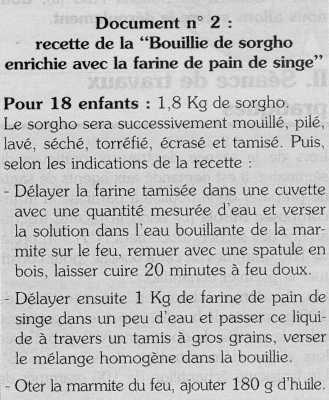
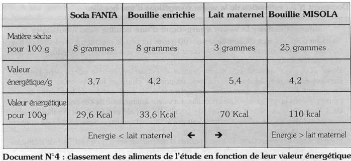
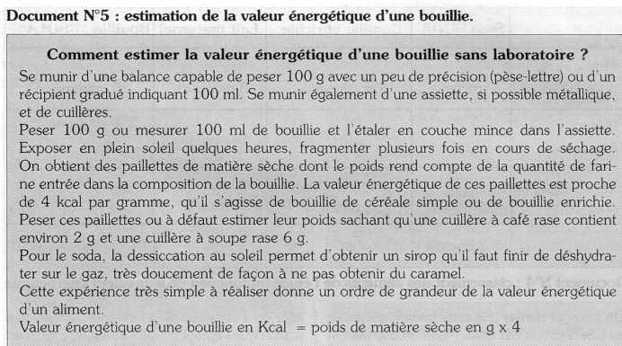
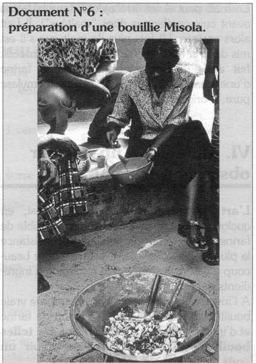
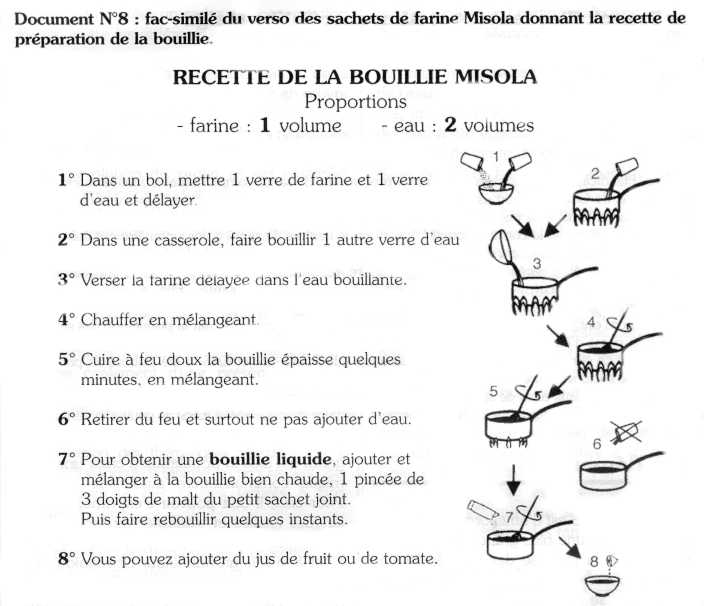

## I. Introduction

Les bouillies ont une place importante dans la nutrition infantile africaine. C'est le mode alimentaire habituellement utilisé pour compléter l'allaitement maternel avant l'introduction du plat familial. La préparation de bouillies de céréales par les mères ainsi que l'achat de bouillies sur le marché local répondent à cette habitude alimentaire. L'éducation nutritionnelle encourage ce mode d'alimentation à partir de six mois et le recommande aux mères, à condition de ne pas en faire une alternative à l'allaitement.

Depuis quelques dizaines d'années, les campagnes de lutte contre la malnutrition infantile ont mis au point et enseigné des recettes de bouillies enrichies dont la qualité nutritionnelle est améliorée par un meilleur équilibre entre sucres, protéines, lipides, vitamines et minéraux. La mise à disposition de farines infantiles composées a le même objectif. Les résultats de ces campagnes n'ont pas toujours été à la hauteur des espérances.

De nombreuses publications montrent que la plupart de ces bouillies, enrichies ou non, ont une très faible **valeur énergétique** et ne satisfont pas aux besoins énergétiques des jeunes enfants. Il faut, en effet, bien faire la distinction entre **aliment équilibré** dans sa composition et aliment de valeur énergétique élevée. L'enfant, à plus forte raison s'il est très jeune et/ou malnutri, a besoin d'un aliment à la fois équilibré et énergétique.

En modifiant les proportions entre l'eau et la farine, les mères adaptent la consistance des bouillies à l'âge de leurs enfants, bouillies épaisses quand ils sont grands, bouillies légères, c'est-à-dire diluées quand ils sont petits ou malades. Ces pratiques de dilution vont à l'encontre des besoins de l'enfant et aggravent encore le risque de malnutrition. On peut même se demander si la faible valeur énergétique des bouillies n'est pas facteur de malnutrition... et si la bouillie n'est pas parfois un aliment permettant de tromper la faim de l'enfant sans vraiment le nourrir.

Si la consistance d'une bouillie doit être adaptée aux possibilités de consommation de l'enfant, sa qualité nutritionnelle doit également satisfaire aux besoins nutritionnels qualitatifs et quantitatifs très élevés à cet âge. Mais peut-on avoir à la fois des aliments de consistance adaptée et de haute qualité nutritionnelle permettant d'assurer santé et croissance ?

Cet article montre que la consistance d'un aliment ne renseigne pas toujours sur sa valeur nutritionnelle, et qu'un aliment épais, peut parfois être moins "nourrissant" qu'un aliment liquide. Puis il est proposé un procédé permettant d'obtenir, à partir de recettes de bouillies enrichies ou de farines composées, une bouillie fluide de valeur énergétique élevée. Ces thèmes ont été développés lors du séminaire de formation des agents de santé du district sanitaire de Fada N'Gourma au Burkina Faso (a), **dont** **nous allons suivre le déroulement.**

## II. Séance de travaux pratiques

Lors de la séance de travaux pratiques du séminaire, il est demandé aux agents de santé de préparer de la bouillie à partir de la farine composée Misola (b) selon la recette inscrite au dos des sachets (document N°7). On prélève 100 grammes de cette bouillie pour constituer le premier échantillon.

Un deuxième échantillon est constitué de 100 grammes de bouillie enrichie (c) préparée selon la recette du document N°2 et prélevée lors d'une démonstration dans un CSPS (Centre de Santé et de Promotion Sociale). Un troisième échantillon de 100 grammes de soda (d) est également mesuré. Ces trois échantillons sont déshydratés par exposition au soleil jusqu'à obtention de paillettes ou de sucre de façon à évaluer leur valeur énergétique (documents N°3 et N°5).

Les aliments sont constitués de matière sèche et d'eau, en proportions variables. La matière sèche seule apporte les calories, les protéines, les minéraux et les vitamines. Pour estimer la valeur énergétique d'un aliment, il faut connaître sa quantité de matière sèche. Les paillettes des bouillies desséchées et le sucre du soda objectivent la quantité de matière sèche de ces aliments. D'autre part, soda et bouillies étant essentiellement constitués de glucides, on estime que 1 gramme de matière sèche de ces aliments apporte 3,7 à 4,2 calories. Leur poids renseigne donc sur leur valeur énergétique.

Les paillettes des bouillies et le sucre du soda provenant de la dessiccation de 100 grammes de chacun de ces aliments sont alors pesées : le premier échantillon fournit 25 grammes de paillettes (bouillie Misola), le second échantillon fournit 8 grammes de paillettes (bouillie enrichie) et l'échantillon de soda fournit 8 grammes de sucre.

Le calcul des valeurs énergétiques en Kcalories pour 100 g d'échantillon indique les valeurs suivantes :

- bouillie Misola 110 Kcal (4,2 X 25),
- bouillie enrichie 33,6 Kcal (4,2 X 8),
- soda : 29,6 Kcal (3,7 X 8).

Ces valeurs sont à comparer à celle du lait maternel qui a une valeur énergétique proche de 70 Kcal (document N°4).

En fonction de leur valeur énergétique, on peut classer les aliments étudiés à ce séminaire en deux catégories : ceux qui sont moins énergétiques que le lait maternel : soda et bouillie enrichie, et ceux qui sont plus énergétiques que le lait maternel: bouillie Misola. On remarquera que l'aliment le plus épais, la bouillie enrichie, est loin d'être celui qui a la meilleure valeur énergétique.

On pourrait penser que cette bouillie préparée au CSPS est un cas isolé. Malheureusement, il semble que la plupart des bouillies enrichies présentent ce même défaut. Par ailleurs, les bouillies traditionnelles proposées aux enfants ont également une quantité de matière sèche de 8 grammes (e). S'il est rajouté du sucre à ces bouillies enrichies ou traditionnelles, comme c'est souvent le cas, leur valeur énergétique peut atteindre 40 à 45 Kcal/100g.

**Tout aliment de valeur énergétique plus** **basse que le lait maternel ne peut convenir à la croissance d'un enfant.** Alors, comment expliquer qu'une bouillie enrichie, préparée selon une recette conçue pour prévenir la malnutrition (c) ne dépasse pas en valeur énergétique celle d'une bouillie du marché et même d'un soda ? Comment admettre qu'un enfant malnutri ou à risque de le devenir soit alimenté avec un aliment comparable énergétiquement à une "sucrerie"? Que penser des conseils donnés aux mères recommandant l'usage de ces bouillies pour améliorer la nutrition de leurs enfants ? Et surtout, comment donner aux enfants des aliments de valeur énergétique suffisante ? C'est à cette dernière question que cet article voudrait répondre.

## III. L'art de préparer une bouillie

L'art de préparer une bouillie consiste à confectionner un aliment dont la consistance et le goût conviennent à l'enfant, d'autant plus liquide que l'enfant est plus jeune. C'est cet art que développent mères et petits commerces de rue. Cet art ignore la notion de valeur énergétique.

Il n'est pas nécessaire d'avoir un laboratoire pour évaluer la valeur énergétique d'une bouillie. La méthode donnée dans le document N°5 permet d'évaluer cette valeur énergétique et de classer les bouillies dans l'une des deux catégories énergétiques décrites précédemment.

Si les recettes données lors des séances d'éducation nutritionnelle répondent à la nécessité d'améliorer l'équilibre nutritionnel en ajoutant des ingrédients protéiques, lipidiques et vitaminiques, elles ne se préoccupent pas de la valeur énergétique de ces bouillies. Il faudrait pour cela augmenter la quantité de matière sèche. Et cela ne semble pas possible car la bouillie devient vite trop épaisse et non consommable par le jeune enfant.

Comme l'illustre la recette citée dans le document N°2, la plupart des recettes de bouillies enrichies **n'indiquent pas la quantité** **d'eau** entrant dans la composition de ces bouillies. L'animatrice respecte les proportions entre les différents ingrédients indiquées sur la recette, mais n'ayant pas d'indication sur la quantité d'eau, elle ajuste celle-ci jusqu'à obtenir la consistance souhaitée. Si l'enfant est jeune ou prend mal la bouillie, celle-ci sera diluée pour la rendre plus "légère", et si l'enfant est nourri à la sonde naso-gastrique cette bouillie risque là encore d'être diluée. Il peut alors lui être administré des bouillies à 25 ou 20 Kcal pour 100 grammes, de valeur énergétique à peine plus élevée qu'un soluté de réhydratation Orale ! (Les SRO ont une valeur énergétique de 16 kcal/100ml) ! Comment espérer le faire grossir dans ces conditions !

Ces bouillies de faible valeur énergétique devraient être considérées comme des "sucreries" épaissies. Elles sont capables de calmer momentanément la faim de l'enfant en remplissant son estomac d'eau et d'amidon, amidon qu'il a souvent du mal à digérer. Mais elles sont incapables de le nourrir réellement et de lui apporter les nutriments et l'énergie nécessaires à sa croissance. Les prises de poids extrêmement lentes observées dans les CREN (Centre de Réhabilitation et d'Education Nutritionnelle) qui basent encore leur thérapeutique sur ce type de bouillies enrichies le confirment. On peut peut-être même penser que toute bouillie de ce type contribue à la malnutrition.

## IV. Et la manière de préparer la bouillie : l'utilisation de malt (riche en amylase)

La manière de préparer la bouillie est illustrée par la recette de préparation de la bouillie Misola. Celle-ci a deux particularités. La première est de mentionner **la proportion de farine par rapport à la proportion d'eau,** soit un volume de farine pour deux volumes d'eau. (30 grammes de farine pour 100 ml d'eau). On obtient ainsi une bouillie très épaisse, une pâte, puisqu'on met 3 à 4 fois plus de farine que dans les bouillies habituelles. La seconde particularité, c'est de mélanger, après cuisson, une toute petite quantité de malt, c'est-à-dire **d'amylaser** cette bouillie.

L'amidon est le constituant essentiel des farines. C'est la cuisson de l'amidon dans l'eau qui donne à la bouillie un aspect consistant, épais, de gel visqueux, (c'est l'empois d'amidon). Cinq grammes de farine mis à cuire dans 95 grammes d'eau suffisent à donner une bouillie qui, du fait de sa consistance, peut donner l'illusion d'être nourrissante. Au delà de 10 grammes, la bouillie devient trop épaisse, pour être consommable par un jeune enfant.

Le malt est riche en amylase, enzyme qui transforme l'amidon, insoluble dans l'eau, en sucres solubles. La préparation du malt est donnée par le document N°7. Il suffit de 0,5 grammes (une pincée de trois doigts) de malt pour liquéfier, en quelques instants, une bouillie de 200 g.

Lors des travaux pratiques, les agents de santé ont appliqué la recette de préparation de la bouillie Misola, reproduite dans le document N°8. A leur grand étonnement il ont constaté la liquéfaction quasi instantanée de la pâte qu'ils avaient préparée. Il leur était possible de préparer une bouillie de valeur énergétique élevée suffisamment liquide pour être bue par des jeunes enfants et même être passée à la sonde sans être diluée. Plutôt que de donner une "sucrerie épaissie" aux enfants, il leur était possible de leur faire boire la "boule de mil" sans la diluer.

De plus, les jeunes enfants, surtout s'ils sont malnutris, n'ont pas suffisamment d'amylase salivaire et pancréatique pour digérer l'amidon. L'action de l'amylase du malt aura aussi pour effet bénéfique de faciliter la digestion de la bouillie. Enfin, mettre trois fois plus de farine dans une bouillie, c'est aussi mettre trois fois plus de fer, de zinc et d'autres micro-nutriments que dans une bouillie préparée de façon "ordinaire".

L'art et la manière de préparer une bouillie c'est donc obtenir une bouillie de consistance et de goût adapté à l'enfant tout en étant de valeur énergétique élevée, de l'ordre de 100 à 120 Kcal pour 100 grammes, comme le recommande l'OMS. L'adjonction de malt permet ainsi de préparer des bouillies qui ne trompent pas la faim de l'enfant.

## V. La généralisation de l'usage du malt est-elle possible ?

Lors du séminaire, la découverte de la possibilité de préparer des bouillies trois fois plus nutritives que les bouillies enrichies a suscité débats et questions. L'un des agents a proposé que toute bouillie enrichie soit préparée selon le même principe que Misola.

Idée géniale ! C'est ainsi une recommandation que chacun peut mettre en pratique : **utiliser** **les recettes de bouillies enrichies de** **façon à obtenir une pâte épaisse, c'est-à-dire les préparer avec peu d'eau** **comme si on préparait la boule de mil et** **liquéfier cette pâte avec du malt.**

Le malt peut aussi être ajouté dans la farine avant cuisson (farines dites "maltées"). Il faut alors environ 10 fois plus de malt que s'il est mis dans la bouillie chaude. Un autre procédé fait appel à l'incorporation dans la farine d'une quantité infime (1/10 000) d'amylase pure, d'origine industrielle.

## VI. Mais il y a un dernier obstacle à franchir

**L'art** de préparer une bouillie, c'est, en quelque sorte, de mettre le moins possible de farine et d'obtenir une bouillie de consistance la plus épaisse possible. C'est de mettre beaucoup d'eau, pas chère, et le minimum d'ingrédients qui eux sont chers.

A l'inverse, **la manière** de préparer une vraie bouillie consiste à mettre beaucoup de farine et d'ingrédients variés et peu d'eau. **De telles** **bouillies vont inévitablement avoir un** **coût deux à trois fois plus élevé.**

On retrouve l'obstacle économique, source de malnutrition.

## VII. Le rôle d'éducation nutritionnelle des agents de santé

Le rôle des agents de santé est essentiel dans l'éducation nutritionnelle. Leur compréhension des notions de groupes d'aliments, de micro-nutriments et vitamines, mais aussi de la notion de valeur énergétique les rend compétents pour vulgariser les messages sur les bonnes pratiques nutritionnelles.

Ils ont pour tâche de faire comprendre aux mères que ce n'est pas l'eau de la bouillie qui va nourrir l'enfant mais ce qui est mis dans l'eau. Ils expliqueront aux mères que **la dilution d'un aliment est l'ennemi sournois** **de la santé de leurs enfants.** Ils leur expliqueront comment préparer des bouillies épaisses et utiliser le malt (ou à défaut comment liquéfier la bouillie avec leur lait maternel ou leur salive, l'un et l'autre très riches en amylase), ce qui leur permettra de nourrir convenablement leurs enfants et d'éviter que n'apparaisse la malnutrition.

Il faudra aux agents de santé beaucoup de persuasion pour faire admettre aux parents que le premier facteur de bonne santé c'est une vraie nourriture et que leurs enfants ont besoin d'autre chose que d'une "sucrerie" épaissie. Si leur apprendre la manière de préparer correctement une bouillie est "facile", il sera plus difficile de les convaincre qu'une bouillie capable de véritablement nourrir leur enfant est inévitablement plus chère qu'une bouillie qui ne fera que tromper momentanément leur faim. Il leur faudra encore encourager les mères à bien conduire l'alimentation de leurs enfants : les allaiter exclusivement jusqu'à 6 mois et à partir de 6 mois, continuer à les allaiter en complétant l'alimentation par des bouillies amylasées en attendant qu'ils consomment le plat familial.

***Quelques définitions :***

**Valeur énergétique** ou densité énergétique quantité de calories apportée par une quantité définie d'un aliment. Par exemple, la valeur énergétique du lait maternel est de 70 Kcalories pour 100 grammes de lait.  
**Aliment équilibré :** composition d'un aliment en glucides, protéines, lipides, vitamines et micro-nutriments de façon à ce qu'il soit proche de l'aliment idéal. L'adjonction d'aliments variés à une bouillie de céréale (bouillie enrichie) a pour but d'atteindre cet objectif.  
Equilibre nutritionnel et valeur énergétique sont deux indicateurs distincts et complémentaires de la qualité d'un aliment.  
**Besoins énergétiques :** 120 à 100 Kcalories par kilo de poids corporel et par jour (nourrisson et jeune enfant).  
**Dessication :** action d'enlever aux corps l'humidité qu'ils contiennent.

**Notes :**

**a)** La prise en charge de la malnutrition. Séminaire de formation des Agents de Santé, Novembre 2001, Fada N'Gourma, Burkina Faso. Séminaire organisé par l'Association Burkinabé des Unités Misola, l'association Misola et la Direction Provinciale de la Santé de Fada.

**b)** Farine MISOLA : Petit mil 60 %, Soja 20 %, Arachide 10 %, Sucre 9 %.

**c)** Cette bouillie a été préparée à partir d'une des recettes du document "Projet BFK 6129, Assistance aux groupes vulnérables. Bien nourrir les enfants avec les bouillies enrichies des vivres PAM", juillet 2000, proposant une dizaine de recettes. Ces recettes faites à partir d'ingrédients locaux sont intéressantes par leur variété. Aucune n'indique clairement la quantité d'eau nécessaire à leur préparation.

**d)** Soda FANTA

**e)** "Témoignage sur deux bouillies traditionnelles au Burkina Faso" E. Counil, Développement et Santé, n°150, décembre 2000. Article rédigé à partir du Poster présenté à l'atelier international : "Les petites industries agro-alimentaires pour une nutrition saine en Afrique de l'Ouest", 22-24 novembre 1999, Ouagadougou. "Les bouillies de petit mil fermenté à Ouagadougou", Djossou V.A., Mouquet C, Trèche S, de l'Université de Ouagadougou et de l'IRD. Ce travail décrit les modes de production, de commercialisation et de consommation des bouillies fermentées Benkida et Bensaalga, préparées dans les unités de fabrication familiale de Ouagadougou.

**f)** Le sorgho germé est facile à trouver dans toutes les régions où l'on trouve de la bière de mil et peut être utilisé après broyage et tamisage. Le malt ne contient absolument pas d'alcool mais est très riche en sucres. C'est la fermentation ultérieure de ces sucres en solution qui feront apparaître l'alcool.

Association Misola, 12 rue des Soupirants 62100 CALAIS, France.  
Association Burkinabé des Unités Misola, BP7178 OUAGADOUGOU, Burkina Faso.

*Développement et Santé, n°160, août 2002*
