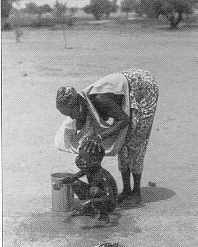
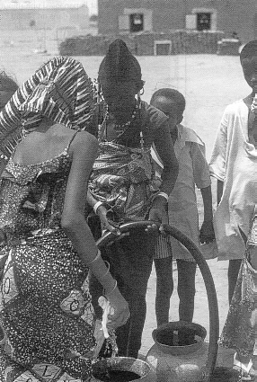

## I. Le traitement de l'eau de boisson

Il est avant tout d'ordre **qualitatif.** On estime que la mauvaise qualité microbiologique de l'eau alimentaire est à l'origine de la moitié des pathologies infectieuses qui sont enregistrées ; les seules maladies diarrhéiques tuent, chaque année, dix millions d'individus, dont quatre millions d'enfants de moins de cinq ans. Les ressources traditionnelles (marigots, rivières et puits) fournissent une eau contaminée par des matières fécales d'origine humaine et animale. Cette pollution est due, au sein de sociétés qui ignorent les fondements de l'hygiène, à la dissémination des excreta dans le milieu extérieur et à l'absence de protection sanitaire des sites d'exhaure (sites d'extraction).

Par endroits, en particulier en Afrique sahélienne, la préoccupation est aussi d'ordre **quantitatif.** La sécheresse répétitive depuis 1969 et l'accroissement démographique très rapide en sont les principales causes.

Ces faits conjugés ont de sévères conséquences socio-économiques : autosuffisance alimentaire sans cesse menacée et exode rural croissant, taux de mortalité et de morbidité très élevés.

## II. La décennie de l'eau

Afin d'enrayer une situation véritablement dramatique, qui concerne le tiers de l'humanité, d'énormes efforts ont été entrepris au cours des années vers l'assainissement de l'eau.

### 1. Les moyens

D'importants moyens techniques et financiers ont été mis en jeu dans l'objectif d'assainir l'environnement et de fournir à tous vingt litres d'eau potable par jour. Malheureusement, les efforts ont privilégié, d'une part, les populations urbaines et, d'autre part, la distribution d'eau au détriment des populations rurales, pourtant majoritaires, et de l'assainissement. En milieu rural, les programmes d'hydraulique villageoise se sont contentés de construire des points d'eau modernes, les forages ; il s'agit de puits étroits, équipés de pompes à motricité humaine, qui captent l'eau des nappes profondes.

**L'eau nécessaire à l'hygiène individuelle**

#### Le poste d'eau potable

Conçu par EAST au Burkina Faso, cette poterie traditionnelle a été transformée de manière à protéger l'eau alimentaire au cours d'un stockage prolongé et à simplifier sa désinfection chimique.

La jarre en terre cuite (80 à 100 litres), montée sur un trépied métallique, est munie d'un tuyau et d'un robinet qui permettent de vider complètement son contenu par un orifice déclive. Après l'avoir rempli et ajouté le chlore, le poste d'eau potable (PEP) délivre une eau fraîche et saine en évitant tout contact avec elle. Si l'eau est trouble, le dispositif facilite la floculation en autorisant l'élimination du produit boueux de la décantation, par simple ouverture du robinet, jusqu'à obtention d'une eau claire ; il ne reste plus qu'à mettre en oeuvre la javellisation pour se désaltérer sans risque 30 mn après.

Dans le cadre de ses programmes de développement en milieu rural, l'Association EAST a distribué plus de 600 PEP dans les écoles primaires de deux provinces du Burkina Faso. Cette action, entourée d'une vaste campagne d'éducation sanitaire, permet d'approvisionner 20 000 enfants qui ont maintenant l'habitude de réaliser le traitement chimique de leur eau potable.

### 2. Les limites

En réalité, les résultats obtenus sont limités. La plupart des villageois continuent à utiliser les points d'eau traditionnels car le nombre de forages est encore insuffisant pour couvrir les besoins et les pannes de pompes, fréquentes, rendent les ouvrages inexploitables. De plus, l'eau, potable à la pompe, est systématiquement souillée par des germes fécaux au cours du transport et du stockage à domicile ; ceux qui bénéficient des sources modernes consomment, en fait, une eau ne répondant plus aux normes de potabilité.

## III. Une éducation pour la santé intégrée

L'impact sanitaire des vastes programmes internationaux d'assainissement de l'eau est considérablement réduit, notamment parce qu'une confusion a été faite entre fourniture d'eau potable et consommation d'eau potable. Le "péril hydrique" s'infléchit peu si l'environnement reste pollué et, surtout, si les comportements individuels et collectifs ne sont pas modifiés par une éducation sanitaire adéquate.

Cependant, toutes les études montrent que la sensibilisation à l'hygiène, la construction de latrines ou encore l'utilisation de récipients de distribution appropriés ne parviennent pas à protéger efficacement les consommateurs des maladies infectieuses véhiculées par l'eau alimentaire ; les contaminations fécales persistent, en aval de la source, compte tenu de la nécessité de transporter et de stocker une eau vulnérable aux pollutions.

### 1. L'éducation pour la santé

Face à ce constat, les médecins de EAST (Eau Agriculture Santé en milieu Tropical) ont concentré leurs recherches sur les moyens de désinfecter l'eau de boisson en zone rurale, quelle que soit la source disponible. Après avoir évalué plusieurs techniques, souvent conseillées mais pas toujours efficaces ou réalisables, le choix s'est porté sur la **chloration** par l'hypochlorite de sodium (eau de Javel), précédées, pour les eaux turbides, d'une filtration grossière et d'une _floculation-décantation_ à l'alun. Outre son efficacité et la simplicité de sa mise en oeuvre, le procédé présente l'avantage d'utiliser des produits courants et bon marché. L'application de ce traitement permet de détruire la plupart des micro-organismes et d'obtenir un taux de chlore résiduel élevé capable d'inactiver les germes introduits dans l'eau pendant toute la durée du stockage (plusieurs heures).

#### **Comment chlorer l'eau de boisson à domicile ?**

La quantité utile de produit générateur de chlore à introduire est fonction de la qualité de l'eau brute ; elle est d'autant plus faible que l'eau est limpide et son pH inférieur à 8. Elle dépend aussi de la concentration en chlore actif du produit disponible, du volume d'eau à désinfecter et du taux de chlore résiduel libre (CRI-) que l'on désire obtenir après traitement. Dans tous les cas, il faut préférer, pour la boisson, l'eau la plus pure possible (forages, sources, puits cimentés) ; l'utilisation d'une eau trouble (puits traditionnels, eaux de surface), si elle ne peut être évitée, nécessite un prétraitement et rend la désinfection souvent moins efficace.

#### Protocole de traitement

**_1. Pour une eau limpide :_**

*   ajouter 5 mg de chlore actif par litre d'eau à traiter ;
*   mélanger, couvrir et attendre 30 minutes avant de boire.

**_2. Pour une eau turbide :_**

*   filtrer à travers un linge à mailles serrées ;
*   éliminer la plupart des matières en suspension, ce qui est réalisable par :

*   une floculation-décantation de 2 heures (alun, graines Moringa oleifera) ;
*   une filtration rapide sur sable (couche de sable, charbon et gravier) ;

*   ajouter 20 mg de chlore actif par litre d'eau à traiter ;
*   mélanger, couvrir et attendre 30 minutes avant de boire.

Le produit chloré le plus simple à manipuler est **l'eau de Javel** ; les solutions d'hypochlorite de sodium, peu coûteuse, sont habituellement disponibles sur les marchés locaux. Leur concentration s'exprime en degré chlorométrique, 1° chl. correspondant à 3,17 grammes de chlore actif par litre de solution chlorée. Par exemple, une eau de Javel à 8° chl. contient environ 25 g de chlore actif par litre, soit 25 mg par ml ou 5 mg par goutte (1 gtte = 0,2 ml). D'autres générateurs de chlore peuvent être choisis, comme l'hypochlorite de calcium et le chlorure de chaux, en fonction de leur accessibilité commerciale.

L'application du protocole permet d'obtenir, une demi-heure après l'introduction du désinfectant, un taux de CRL compris entre 1 et 2 mg/l; par effet rémanent, cette réserve de chlore va protéger l'eau des contaminations fécales pouvant survenir au cours d'un stockage domestique de 12 à 24 heures.

La désinfection chimique de l'eau alimentaire est une méthode simple, efficace et bon marché qui mérite d'être généralisée dans les pays en voie de développement. Cependant, sa vulgarisation doit être prudente et accompagnée d'une surveillance régulière des conditions de mise en oeuvre et de la qualité de l'eau traitée. Ce protocole, capable de rendre une eau potable quelle que soit son origine, doit être adapté aux conditions locales (qualité de l'eau brute, type de générateur de chlore) avant d'être diffusé dans la population générale.

La méthode est actuellement enseignée dans toutes les écoles rurales de deux provinces du Burkina Faso, dans le cadre du projet de "développement intersectoriel en milieu scolaire". Ces actions associent éducation sanitaire, approvisionnement en eau saine, assainissement, médecine de base et maraîchage.

Des résultats favorables, en termes de fiabilité, d'acceptabilité et de viabilité économique, encouragent à vulgariser le traitement chimique de l'eau alimentaire à l'ensemble des populations rurales.

### 2. L'assainissement

Si les programmes d'approvisionnement en eau potable doivent multiplier le nombre d'ouvrages modernes et rechercher les moyens d'améliorer la maintenance, ils doivent aussi intégrer dans leurs actions, de manière systématique, les deux volets complémentaires et indispensables que sont l'assainissement du milieu et l'éducation sanitaire des ruraux, conclus par l'apprentissage d'un procédé de désinfection de l'eau de boisson. Deux orientations peuvent être alors prises : la chloration est réalisée au niveau de chaque famille (traitement `individuel") ou dans une citerne proche du point d'eau, voire directement dans l'ouvrage "Traitement collectif".

La deuxième option semble, _a priori_, la plus satisfaisante, d'autant que les progrès en matière d'exhaure et d'hydrogéologie laissent prévoir dans un proche avenir, l'implantation de mini-réseaux d'adduction. Placé sous la responsabilité d'un volontaire villageois, formé à l'hygiène et à la désinfection de l'eau, le traitement sera effectué, chaque jour, pour l'ensemble de la communauté. D'ores et déjà, les petites installations motorisées, équipées de systèmes chlorateurs manuels ou automatiques, ne sont pas techniquement et économiquement hors de portée.

### 3. L'organisation

Le mythe de l'eau potable gratuite est définitivement révolu. Les promoteurs de l'hydraulique villageoise l'ont d'ailleurs bien compris et requièrent une participation des bénéficiaires pour la construction et l'entretien des ouvrages qu'ils réalisent. L'organisation des communautés autour de leur ressource en eau doit aussi, dès maintenant, inclure la mise en place de structures locales de traitement et de surveillance de la qualité de l'eau. L'autonomie financière, meilleure garante de leur longévité, soulève le problème du recouvrement des coûts par les usagers.

**Forage en zone sahélienne****Eau : réduire l'inégalité**

**L'ancien président du FMI a exposé les enjeux**  
**du millénaire de l'accès à l'eau.**

Il suffit parfois de traverser une frontière pour percevoir les différences de comportement par rapport à l'eau : les Argentins consomment en moyenne 300 litres d'eau par habitant par jour, les Boliviens n'en consomment qu'une trentaine. Pourtant, si tourner un robinet semble anodin, c'est l'apanage d'une minorité sur notre panète comme l'explique magistralement Michel Camdessus dans un récent ouvrage''". Un monde sépare en effet le cadre new-yorkais qui utilise 1 000 litres quotidiennement et l'habitant d'une mégalopole subsaharienne qui n'a que quelques dizaines de litres à sa disposition. Reste que si la demande explose partout, c'est surtout dans les pays où l'eau manque déjà que la croissance démographique est la plus forte.

Ce sont surtout les femmes qui souffrent du manque d'accès à l'eau : en Afrique subsaharienne par exemple, elles transportent en moyenne chaque année l'équivalent de 10 à 40 tonnes d'eau et de bois de chauffage, soit trois à sept fois plus que la charge de transport dévolue aux hommes. Le point d'eau est en fait l'endroit où s'opère l'exclusion des femmes et des filles de l'instruction et de la participation aux instances locales et, partant de là, du développement. Leur faciliter l'accès à l'eau n'est donc pas qu'une question de santé, c'est un enjeu majeur du développement.

* Eau, édition Robert Laffont, 290 pages, Paris 2004.