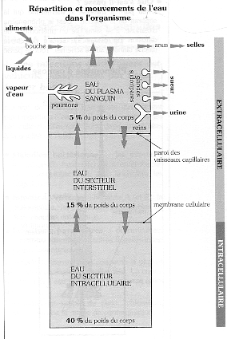
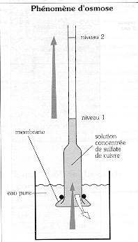

## I. Introduction

L'eau est **indispensable à la vie**.

On **meurt** plus vite de **soif** que de faim, 10 fois plus vite dans des expériences menées chez la souris.

L'eau est le principal constituant de l'homme: un adulte de 70 kg contient en moyenne 42 kg d'eau, soit **60 % du poids du corps**. Un embryon de quelques jours contient 97 % d'eau.

*   **Quatre-vingts pour cent de toutes les maladies du globe** sont associées à l'eau.
*   **Soixante quinze pour cent de la surface du globe** est recouverte d'eau.

L'eau est le "**solvant biologique universel**": aucun autre liquide ne dissout un aussi grand nombre de corps [On appelle solvant le milieu de dispersion d'un ou plusieurs corps dissous (solutés), l'ensemble formant une solution].

L'eau est le **réactif chimique** le plus employé par l'organisme. La digestion des aliments, par exemple, est une série d'hydrolyses (lyse par l'eau).

L'eau résiste mieux que tout autre corps connu aux variations de température. C'est ainsi que la quantité de chaleur nécessaire pour élever de 1°C la température d'une quantité d'eau est très élevée. Il faut deux fois moins de chaleur pour faire la même chose avec la même quantité d'alcool. C'est grâce à cette propriété que l'eau contribue pour une grande part à maintenir **constante la température du corps (37°)**.

## II. L'eau représente 60 % du poids du corps

Ce pourcentage varie suivant l'individu avec :

*   **l'âge** : il est plus élevé chez l'enfant et atteint 75% du poids chez le nourrisson.
*   **l'adiposité** : il est plus élevé chez un sujet maigre car la graisse est pauvre en eau.

Mais chez un même individu ce pourcentage est stable et doit rester stable. La perte excessive d'eau est fréquente et grave, c'est la déshydratation.

## III. Les besoins

L'eau **entre** **dans l'organisme** sous la forme :

*   d'eau de boisson surtout,
*   et d'aliments. Nous ne mangeons que des végétaux ou des animaux dont la teneur en eau est respectivement de 75 et 60 %.

Il existe une petite quantité d'eau qui est produite par l'organisme, c'est l'eau dite endogène.

L'eau **sort** **de l'organism**e sous la forme

*   de sueur,
*   d'urines,
*   de matière fécales,
*   de vapeur d'eau : exhalée par la respiration. Si vous mettez une glace devant votre nez et votre bouche, vous verrez y apparaître de fines goutelettes d'eau : la buée (c'était un moyen de faire le diagnostic de mort : pas de buée sur la vitre = pas de respiration = mort).

Pour maintenir **constante** la teneur en eau de l'organisme, la quantité d'eau qui entre doit toujours être égale à la quantité d'eau qui sort. Il n'y a pas de chiffre en valeur absolue qui soit représentatif de nos **besoins** : dans des conditions de repos, en climat tempéré, on estime les besoins en eau d'un adulte à un peu plus de 2 litres par 24 heures, mais ce chiffre peut être multiplié par 10 avec une température ambiante élevée et un travail de force.

C'est d'abord la **sensation de soif** qui, lorsqu'elle est normalement ressentie et satisfaite, suffit pour préserver l'hydratation de l'organisme.

## IV. La répartition

L'eau que l'on absorbe diffuse dans tout l'organisme.

On sait, par ailleurs, que la teneur en eau des os (25 % d'eau) est très différente de celle du sang (80 % d'eau), ou que la teneur en eau du foie (70% d'eau) est très différente de celle du liquide céphalorachidien (99% d'eau) etc...

**L'eau diffuse donc dans tout l'organisme mais n'est pas répartie uniformément.**

Cette différence de répartition de l'eau peut en première approximation s'expliquer ainsi.

De même que nous avons divisé l'organisme en appareils, organes, etc... on peut, du point de vue de l'eau, diviser tout l'organisme en deux grandes parties ou deux grands compartiments : le compartiment cellulaire et le compartiment extracellulaire.

*   L'eau du **compartiment cellulaire** est facilement imaginable, c'est l'eau constitutive de chacune de nos cellules. Vu le nombre de celles-ci, il n'est pas étonnant que cette eau intra-cellulaire représente à elle seule près de la moitié du poids du corps : **40 %.**
*   L'eau du **compartiment extra-cellulaire** forme le reste : **20 %** du poids du corps. Ce compartiment est plus difficile à imaginer et plus disparate :
    *   Il comprend l'eau du **plasma**. En effet, le sang est composé de cellules et de liquide. Les cellules sont les globules rouges, les globules blancs et les plaquettes. Le liquide, est le plasma constitué de 80 % d'eau. Cette eau plasmatique représente **5%** du poids du corps.
    *   Il comprend aussi l'eau qui existe entre les cellules, nos cellules ne sont pas cimentées les unes aux autres, il existe de petits espaces entre chacune d'elles. Cette eau inter-cellulaire ou **interstitielle** représente **15 %** du poids du corps.

## V. Les échanges : deux exemples

### 1. Exemple 1

Les deux grands compartiments extra et intra cellulairessont séparés, par définition, par la membrane cellulaire. Cette membrane n'est pas imperméable; ces deux compartiments ne sont pas étanches : des mouvements d'eau ont lieu de part et d'autre de cette membrane. Ils sont commandés par ce que l'on appelle la pression osmotique.

#### Notion de pression osmotique

**Expérience :**

*   un récipient contenant de l'eau pure ;
*   un tube creux fermé à l'une de ses extrémités par une membrane. Cette membrane est sensée représenter la membrane cellulaire et avoir ses caractéristiques. Ce tube est rempli jusqu'à un certain niveau (_niveau 1 sur le schéma_) d'une solution très concentrée de sulfate de cuivre ;
*   on plonge la partie du tube avec la membrane dans le récipient d'eau.

On constate alors, au bout de quelques temps, que le niveau de la solution dans le tube est monté de plusieurs _centimètres (niveau 2 sur le schéma_).

**Que s'est-il passé ?**

*   L'eau pure a traversé la membrane qui la séparait de la solution : c'est le phénomène d'osmose. Il se surajoute un phénomène de diffusion ou dialyse du sulfate de cuivre (flèche blanche sur le schéma).

Tout se passe comme si l'eau était attirée vers la solution concentrée. Cette ascension de l'eau dans, le tube permet de saisir en action la force qui fait passer l'eau à travers la membrane.

Cette force est appelée la pression osmotique de la solution.

**Autrement dit, si de part et d'autre de la membrane on place deux solutions de concentrations différentes, l'eau traverse la membrane en allant de la solution la moins concentrée vers la solution la plus concentrée.**

*   La solution la plus concentrée est dite **hypertonique** par rapport à la solution la moins concentrée qui, elle, est **hypotonique**. Les solutions de même concentration ont la même pression osmotique : elles sont **isotoniques**.
*   Cette expérience peut être refaite en utilisant d'autres solutions qu'une solution de sulfate de cuivre.

**Dans l'organisme, c'est le chlorure de sodium (le sel) qui a une influence prépondérante sur cette pression. C'est ce qui explique que les mouvements de l'eau et ceux du sel soient intimement liés.**

### 2. Exemple 2

Dans la lumière du tube digestif et **par 24 heures**, environ **10 litres d'eau** sont réabsorbés chaque jour par le gros intestin. Ces 10 litres proviennent de l'eau ingérée (un peu plus de 2 litres) et de l'eau constitutive des secrétions digestives (environ 8 litres), (salive, bile, suc pancréatique, sécrétions des glandes de la paroi intestinale). 100 cm3 seulement de toute cette eau ne seront pas absorbés mais éliminés dans les selles.

## VI. Cas du nourisson

Sa surface corporelle est relativement plus grande que chez l'adulte par rapport au poids, ce qui détermine une perte, par la sueur, plus grande. On estime ainsi que les pertes normales journalières d'un nourrisson représentent la moitié de son eau extracellulaire (le 1/6 chez l'adulte). **Ceci rend compte de la rapidité avec laquelle peut s'installer chez lui une déshydratation.**

_Développement et Santé, n°177, juin 2005_