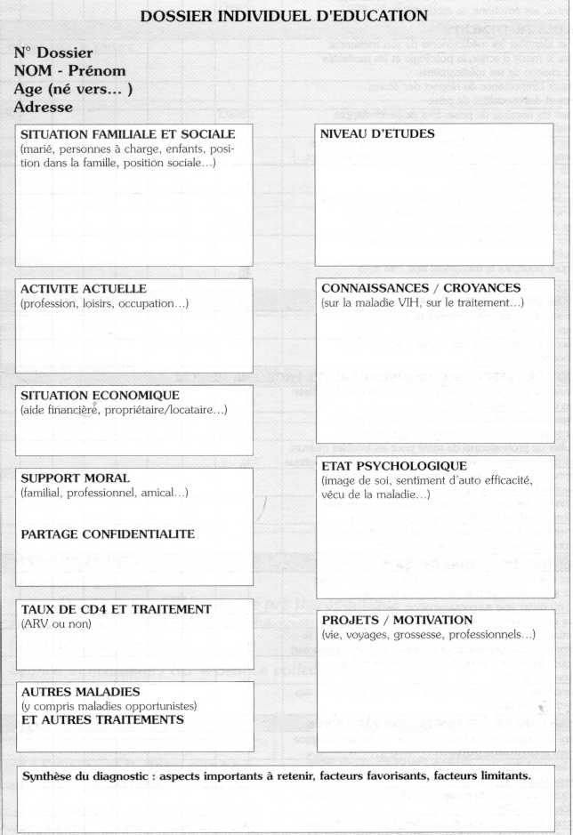
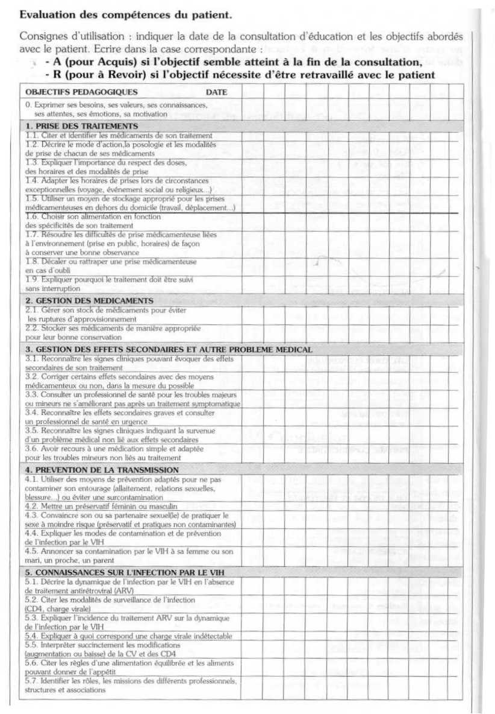
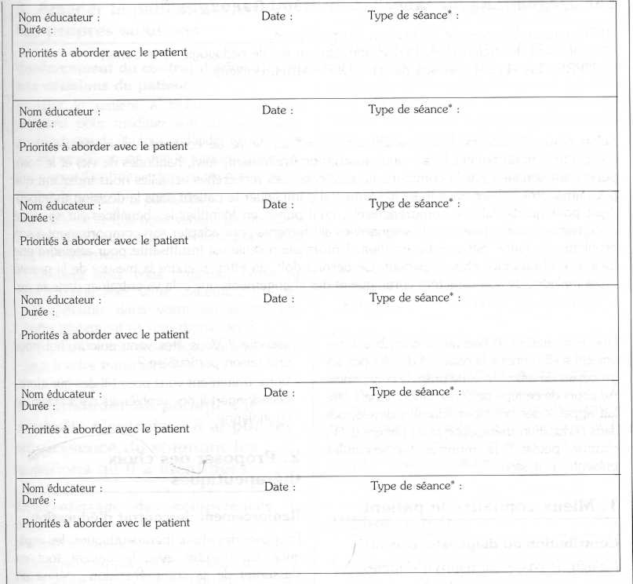

## I. Le diagnostic éducatif

Ce temps de rencontre entre le patient et le soignant donne au patient l'occasion de faire connaître ses besoins, ses préoccupations, son projet, d'expliquer ce qu'il sait sur sa maladie, comment il vit avec, ce qu'il souhaiterait améliorer, ce qui lui pose problème et comment il pense pouvoir agir sur sa maladie. L'ensemble des informations recueillies feront l'objet d'une synthèse qui permet à l'équipe d'être au plus près des besoins du patient et d'identifier les compétences d'auto soins et d'adaptation (psychosociales) qui lui seront utiles pour mieux vivre avec sa maladie(2).

<table>

<tbody>

<tr>

<td>

Questions de synthèse du diagnostic éducatif

<ul><li>Quels sont les facteurs dans la vie du patient (motivation, vie sociale, entourage, perception de l'image de soi, économiques) qui vont agir favorablement sur son désir de prendre en charge ses soins ?</li><li>Quel est le projet du patient sur lequel le soignant peu prendre appui pour renforcer sa motivation à agir sur sa santé, (reprendre mon commerce...).</li><li>Qu'est-ce que le patient doit apprendre ou réapprendre pour prendre des décisions favorables à sa santé (éviter la sur contamination, protéger son épouse...).</li></ul></td>

</tr>

</tbody>

</table>

## II. Le contrat d'éducation

C'est une étape du processus d'éducation au cours de laquelle le soignant s'accorde avec le patient sur les compétences et objectifs spécifiques qui feront l'objet de son apprentissage

_(cf. tableau 1),_ sur les temps et modalités d'évaluation de ses acquis (évaluation pédagogique) ainsi que sur la fréquence des rencontres éducatives. Ces dernières étant le plus souvent, dans l'infection par le VIH, liées au suivi médical du patient.

**Tableau 1 : Exemple de compétences et d'objectifs (3).**

<table>

<tbody>

<tr>

<td valign="top">Compétences</td>

<td class="rtecenter" valign="top">Objectifs correspondants qui feront  
l'objet d'un apprentissage par le patient.</td>

</tr>

<tr>

<td valign="top">Comprendre, s'expliquer</td>

<td valign="top"><ul><li>Décrire la dynamique de l'infection par le VIH en l'absence de traitement.</li><li>Expliquer l'incidence du traitement sur la dynamique de l'infection par le VIH.</li><li>Citer les modalités de surveillance de l'infection (CD4, Charge virale-CV).</li></ul></td>

</tr>

<tr>

<td valign="top">Faire connaître ses besoins Informer son entourage</td>

<td valign="top"><ul><li>Exprimer les raisons qui interfèrent sur ses prises de traitement.</li><li>S'exprimer sur le vécu qu'il a de sa maladie (annonce du diagnostic, incompréhensions, fatalité).</li><li>Exprimer comment il explique sa maladie.</li><li>Annoncer sa contamination par le VIH à sa femme ou à son mari.</li></ul></td>

</tr>

<tr>

<td valign="top">Faire face - Décider</td>

<td valign="top"><ul><li>Résoudre les difficultés de prises médicamenteuses liées à son contexte social.</li><li>Décaler ou rattraper une prise médicamenteuse en cas d'oubli.</li><li>Avoir recours à une automédication simple et adaptée pour les troubles mineurs.</li><li>Utiliser des moyens de prévention adaptés pour éviter de contaminer son entourage ou une surcontamination.</li></ul></td>

</tr>

</tbody>

</table>

## III. La mise en oeuvre de l'éducation thérapeutique du patient

Il s'agit d'organiser des activités permettant au patient de confirmer et stabiliser les compétences qu'il possède, d'en acquérir d'autres pour fonctionner au mieux dans sa vie quotidienne avec sa maladie. Pour construire les programmes d'éducation, le soignant va devoir prendre appui sur :

*   les informations identifiées lors du diagnostic éducatif : quel est son niveau de motivation pour apprendre, ses souhaits, ses difficultés, ses croyances concernant l'utilité de son traitement, la perception qu'il a de son efficacité etc ;
*   les compétences d'auto soins à travailler avec le patient.

Les activités d'éducation proposées seront fondées sur les principes de l'apprentissage, par exemple : explorer les connaissances du patient, solliciter son expérience, partir de situations concrètes, proposer des activités permettant au patient de s'entraîner à résoudre des problèmes.

## IV. L'évaluation

L'évaluation comporte deux aspects : l'évaluation de programme et l'évaluation pédagogique du patient.

*   L'évaluation de programme s'intéresse à l'ensemble du programme d'éducation thérapeutique, elle peut être par exemple : clinique (diminution des maladies opportunistes), psychosociale (amélioration de la qualité de vie des patients), pédagogique par l'appréciation des acquis du patient, et s'intéresser au programme dans son ensemble par le moyen des critères de qualité.  
*   L'évaluation pédagogique du patient va se planifier dès que les compétences du patient seront identifiées et négociées avec lui. Seront évalués les changements opérés chez le patient à l'issue d'une période d'apprentissage donnée. Cette évaluation portera autant sur les compétences d'auto soins (faire face - décider : utiliser des moyens de prévention adaptés pour éviter de contaminer son entourage ou une surcontamination), que sur des compétences à dominante affective (exprimer ses valeurs, ses projets, ses attentes, ses émotions, le sentiment de confiance en soi, etc.).  
    Ce temps est important car il va permettre d'organiser le suivi du patient en fonction des compétences qu'il doit améliorer ou acquérir pour gérer au mieux sa maladie dans sa vie quotidienne.

<table>

<tbody>

<tr>

<td>

Le dossier d'éducation

<ul><li>Propre à chaque patient, le dossier d'éducation permet d'organiser le suivi du patient et de coordonner les activités éducatives entre soignants (3).</li><li>Dans ce dossier peuvent être consignées les informations qui relèvent du diagnostic éducatif : la maladie, les activités quotidiennes du patient, l'état de ses connaissances, son rapport à la maladie, etc., et des informations concernant les séances d'éducation : objectifs abordés, compétences maîtrisées par le patient, difficultés rencontrées, etc. (cf. tableau 2).</li></ul></td>

</tr>

</tbody>

</table>

## Conclusion

La démarche éducative que nous proposons relève d'une approche systémique '4' dans la mesure où les étapes sont interdépendantes et n'ont de sens que dans les interactions qu'elles entretiennent. Par exemple, l'évaluation, en nous renseignant sur les compétences du patient, nous indique si l'apprentissage proposé à été performant et par conséquent adapté aux potentialités et caractéristiques du patient déterminées lors du diagnostic éducatif. Ainsi cette approche en permettant de structurer l'éducation thérapeutique du patient, pose un cadre (des repères) suffisamment rassurant pour que le patient accepte d'opérer des changements pour mieux gérer sa santé et suffisamment précis (sécurisant) pour amener les soignants à questionner, individuellement et collectivement leurs compétences d'éducateur.

**Tableau 1 : dossier d'éducation réalisé par les éducateurs du CESAC à Bamako, au cours d'une formation à l'éducation thérapeutique animée par Format Santé dans le cadre d'un programme financé par la fondation GSK.**

### **Suivi et planification de l'ETP**

**Différents types de séances :**

*   DG = Diagnostic éducatif
*   PT = Avant la mise sous ARV : séance pré thérapeutique
*   ST = Après la mise sous ARV : suivi thérapeutique
*   BC = Bilan de compétences
*   S1= Séance individuelle/ SC = Séance collective

**Bibliographie :**

1- Ivernois (d) J.F, Gagnayre R. Apprendre à éduquer le patient, 2ème éd., Maloine, Paris, 2004.  
2- Iguenane J, Gagnayre R. L'éducation thérapeutique du patient : le diagnostic éducatif, Kinésithérapie, les cahiers, N° 29-30, Paris, pp.58-64, mai-juin 2004.  
3- Marchand C., Gagnayre R., Recommandations pour la mise en ceuure de programmes d'éducation thérapeutique pour les patients atteints d'infection par le VIH dans les pays à ressources limitées, Format santé, Fondation GlaxoSmithKline, 2003.  
4- Le Moigne J.L., La théorie du système général Théorie de la modélisation, Presses Universitaires de France, Paris, 1977. Voir aussi : Iguenane J. Les principes généraux de l'éducation thérapeutique,

_Développement et santé, n° 187, 2007._