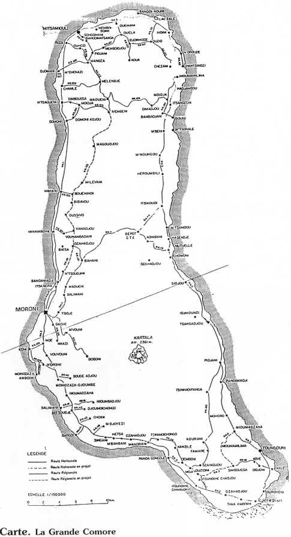
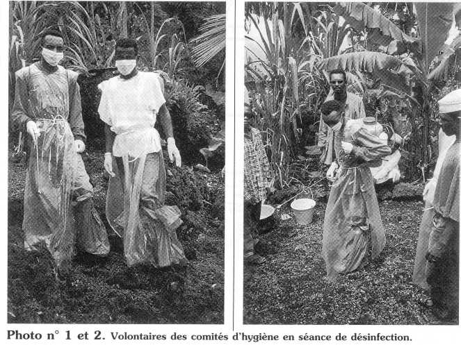
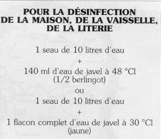
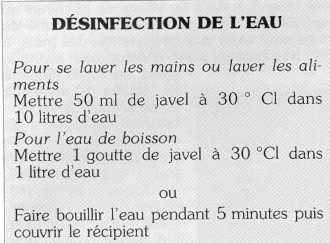
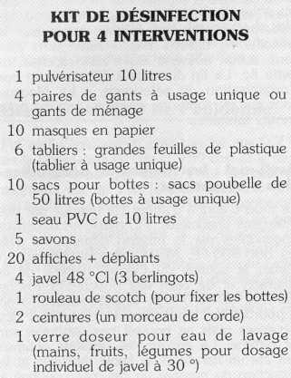
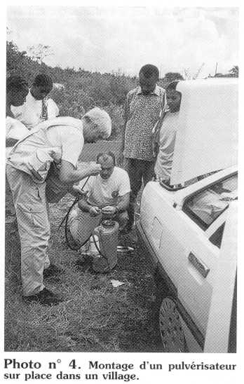

**Epidémie de choléra aux Comores : dynamique de la transmission, mise en place d'une stratégie de lutte communautaire**

\* Responsable de Mission de Médecins du Monde aux Comores.  
\*\* Coordinateur de la Mission Choléra aux Comores, Médecins du Monde.

En janvier 1998, le choléra, qui sévissait depuis plusieurs mois dans l'est de l'Afrique, a atteint la Grande Comore. Médecins du Monde (MDM), qui, depuis deux ans, a mis en oeuvre un programme de développement sanitaire dans le sud de l'île, a envoyé, début février, une équipe sur le terrain, pour appuyer les trois hôpitaux du sud de l'île et ralentir la progression de l'épidémie par la prévention. L'expérience que nous relatons ici n'est ni un succès ni un échec et il est d'ailleurs trop tôt pour tirer des conclusions. Nous souhaitons toutefois la présenter car elle nous paraît bien mettre en évidence les facteurs qui mènent à la diffusion d'une épidémie ainsi que les obstacles que l'on peut rencontrer dans la mise en oeuvre d'un programme de prévention.

**Les Comores et la société comorienne**

La Grande Comore est une île volcanique appartenant à l'archipel des Comores. Cet archipel, situé dans l'océan Indien au large des côtes du Mozambique, compte environ 600 000 habitants, dont 300 000 en Grande Comore. Le fonctionnement de la société comorienne est complexe. Il est cependant nécessaire, sans toutefois entrer dans les détails, de mettre en exergue quelques particularités économiques et sociologiques de la Grande Comore pour mieux comprendre l'évolution de l'épidémie et l'approche adoptée dans le programme de lutte mis en oeuvre.

Les Comores font partie des pays les plus pauvres du Monde, la production agricole très limitée ne suffit pas à assurer l'autosuffisance alimentaire de l'archipel, la production industrielle et manufacturière est quasiment inexistante et le secteur tertiaire subit une crise grave.

Les mêmes difficultés se retrouvent dans la fonction publique, et en particulier au niveau de la santé. Le personnel fonctionnaire cumule les retards de salaires (15 mois d'impayés en seulement trois ans), et les structures de soins ne disposent plus de crédits de fonctionnement depuis fin 1995. Cette situation chronique a entraîné une dégradation de la qualité des soins, mais a aussi favorisé l'émergence d'associations villageoises qui se sont mobilisées, çà et là, derrière des projets de réhabilitation ou de création d'hôpitaux, de dispensaires ou de maternités. Ces associations sont maintenant représentées dans les conseils d'administration des hôpitaux et dispensaires, dans les structures de soins où ils ont été mis en place.

L'absence de production locale de biens et de services est partiellement compensée par l'apport de la diaspora comorienne. Ainsi, plus de 100 000 Grands Comoriens vivent actuellement en France métropolitaine, dont la moitié à Marseille et dans les Bouches-du-Rhône. Les Comoriens de France ont, eux aussi, constitué une myriade d'associations regroupant les sujets originaires de tel village ou tel quartier. Ces associations interviennent dans des micro-projets de développement au sein de leur communauté d'origine et organisent plus ou moins régulièrement des collectes et des fêtes au profit de leur village. Les associations sont en partie contrôlées par les notables, représentants d'un pouvoir coutumier encore très puissant en Grande Comore.

**Dynamique de l'épidémie, évolution de la stratégie de lutte**

**Janvier : la maladie de la peur**

*"Le choléra, affection pestilentielle, maladie de la peur, compagnon des séismes, des inondations, des famines et des* *guerres, paraissait appartenir à l'histoire."* (Gentilini et Duflo, *Médecine tropicale,* Flammarion eds).  
L'épidémie a débuté au début du mois de janvier, dans la ville de M'beni, située au nord-est de l'île. Les premiers patients ont probablement contracté la maladie au cours de voyages en Afrique de l'Est. M'beni est en effet la ville du président de la République Fédérale Islamique des Comores et de nombreux notables accompagnent les autorités politiques au cours des voyages officiels. Quelques patients, présentant des formes plus graves, ont été référés à l'hôpital de la capitale, Moroni. C'est ainsi que, fin janvier, la maladie se transmettait à partir de deux sites distincts : la ville de M'beni et l'hôpital de Moroni, où aucune mesure  
d'hygiène sérieuse n'était mise en place à l'époque. C'est à cette période que le diagnostic de choléra a été confirmé, l'agent pathogène était le vibrion el Tor, sérotype 1 ; la souche était sensible aux cyclines mais résistante aux sulfamides.  
L'annonce du choléra a rapidement provoqué une très forte inquiétude dans toute l'île. Cette maladie avait en effet déjà sévi dans les années 1970 où une épidémie avait été à l'origine de milliers de cas et de centaines de décès en particulier dans les villages côtiers du sud de l'île. L'impact de l'épidémie n'a pas seulement été ressenti au Comores : la peur a gagné la communauté comorienne en France. Médecins du Monde, qui depuis deux ans travaillait en partenariat avec des associations de la diaspora comorienne, a proposé d'accueillir dans ses locaux, des réunions d'information sur le choléra. Ces rencontres, organisées en moins de 48 heures, ont drainé plusieurs centaines de Comoriens à Paris, Marseille, Le Havre et la Réunion (dont plus de 300 pour celle qui s'est tenue à Paris le 31 janvier). A la suite de ces réunions, une équipe partait pour les Comores avec, pour double mission, de renforcer les structures sanitaires du sud de l'île, particulièrement délabrées et désertées par les médecins, et de mettre en place une campagne d'information et de sensibilisation à l'hygiène destinée à ralentir tant que possible la progression de l'épidémie. Simultanément, Médecins Sans Frontière-Belgique détachait une équipe chargée d'appuyer les hôpitaux du nord de l'île et de la capitale.

**Février : naissance des comités d'hygiène, mise en place d'une stratégie** **originale de lutte**

Pour mener à bien le volet préventif du programme, l'équipe de MDM s'est appuyée sur des comités d'hygiène villageois qui se sont constitués à partir de la fin du mois de janvier. Ces comités de bénévoles ont facilité le contact entre les équipes de Médecins du Monde et la population des villages, relayé les actions de sensibilisation à l'hygiène, organisé le nettoyage et la désinfection des locaux et des points d'eau ayant pu être contaminés par le choléra. Ils ont aussi participé au dépistage des nouveaux cas et encouragé leur transfert vers les structures de soins. A Moroni, une action comparable a été menée avec les membres du Croissant rouge comorien, bien implantés dans les quartiers défavorisés. MDM a formé les bénévoles et les a équipés en matériel de désinfection (eau de javel, matériel de nettoyage, pulvérisateurs). En tout, 187 villages et quartiers ont été visités et plus de 300 kits de désinfection ont été distribués. En quelques semaines, les comités d'hygiène sont devenus le fer de lance dans la prévention du choléra et des maladies diarrhéiques et l'impact positif de leur action a été notée par tous, aux Comores, comme au niveau de la diaspora. Ainsi, dès la fin du mois de février, l'on pouvait noter une différence très nette dans la diffusion de l'épidémie entre le sud et le nord de l'île. Dans le sud, où les comités d'hygiène se sont mis en place précocement, le nombre de cas est resté très limité pendant plusieurs semaines. Dans le nord et la région de Moroni, pourtant mieux pourvus en structures sanitaires et en médecins, le nombre de cas a rapidement augmenté, plusieurs villages comptabilisant chacun des dizaines de cas. Les principaux foyers de transmission se sont alors localisés dans les villages côtiers, où la présence de points d'eau collectifs (marigots, puits) a facilité la diffusion de l'épidémie.

<table>

<tbody>

<tr>

<td>

</td>

<td>

</td>

</tr>

</tbody>

</table>

<table>

<tbody>

<tr>

<td>

</td>

</tr>

</tbody>

</table>

**Mars : les difficultés s'amoncèlent**

Le maximum de l'épidémie a été atteint au mois de mars. C'est aussi à cette époque que de nombreux obstacles ont été identifiés, gênant la mise en oeuvre du programme de prévention. Dès le début du mois, une grève générale et totale des soins a été déclenchée par les fonctionnaires de la santé. Ceux-ci n'avaient, en effet, pas perçu de salaire depuis des mois alors que leurs homologues de l'éducation nationale venaient de percevoir deux mois de traitement d'un coup. La grève, qui a duré quelques semaines, n'a pas entraîné de surmortalité chez les patients atteints de choléra car les principaux centres curatifs étaient pris en charge par MSF au nord et MDM au sud. Cela a toutefois surchargé le travail des volontaires qui ont été moins disponibles pour les actions de prévention. C'est à cette même période que les équipes de MDM, du Croissant rouge et des comités d'hygiène ont noté un laxisme excessif dans l'application des mesures de prévention. Les messages sur les précautions à prendre contre le choléra, pourtant simples, étaient difficilement compris, et surtout, la motivation des populations à les appliquer diminuait de semaine en semaine. Paradoxalement, ce sont les bons résultats en terme de prise en charge de la maladie, qui semblent être à l'origine de cette démobilisation. En effet, contrairement à l'épidémie précédente, le nombre de décès restait très limité (19 décès pour un millier de cas à la mi-mars), et la peur de la maladie s'est progressivement estompée. Cette faible mortalité a facilité la diffusion d'une contre-information, véhiculée par des notables et des médecins, qui soutenaient qu'il ne s'agissait pas de choléra mais de " cholérine ", une maladie qui serait transmise par les mouches. L'absence de démenti officiel, peut-être motivée par le risque d'une annulation du pèlerinage annuel à La Mecque si l'épidémie de choléra était reconnue, a bien sûr conforté l'action des détracteurs du programme de lutte. Enfin, conséquence de la désinformation et de la démobilisation, les cérémonies rituelles, au cours desquelles des repas regroupant des centaines d'invités, ont été maintenues malgré les appels à la vigilance des équipes de lutte contre l'épidémie. L'une de ces cérémonies a été à l'origine de la diffusion de l'épidémie dans le sud, jusqu'ici épargné. Fin février, un repas coutumier a eu lieu dans un village de pêcheurs du sud de l'île. Une des cuisinières, venue du nord pour aider à la préparation des mets, a été hospitalisée pour choléra peu avant le début du repas. Malgré la tenue d'urgence d'une séance de sensibilisation, le repas s'est déroulé comme si de rien n'était. Dans les jours qui ont suivi, quelques cas sporadiques ont été diagnostiqués, avant qu'un puit, qui servait d'alimentation à tout le village, ne soit souillé. Alors, en quelques heures, plus de cent personnes ont été contaminées dont cinq sont décédées. Les mesures énergiques prises pour décontaminer le village ont permis de stopper la transmission, mais dans les jours suivants, l'épidémie s'est développée dans les localités voisines gagnant progressivement tous les villages côtiers du sud. À la même période, des cas de choléra se déclaraient à Mohéli, une autre île de l'archipel située à une cinquantaine de kilomètres de la Grande Comore. Une intervention conjointe de MDM, MSF et de la coopération française a été décidée et réalisée très rapidement. Elle s'est soldée par un succès puisque les patients ont pu être soignés avant que la maladie ne diffuse. Ainsi, deux mois plus tard, aucun nouveau cas n'était recensé sur cette île. La fin du mois a été marquée par l'organisation du pèlerinage à La Mecque sans que personne ne songe à l'annuler pour motifs sanitaires.

**Avril-mai : les risques de démobilisation s'accentuent**

Le mois d'avril a d'abord été marqué par des difficultés financières. Fin mars, les dépenses engendrées par la mission dépassaient déjà les 500 000 FF. MDM qui avait obtenu en février le soutien du Conseil général de la Réunion et de celui des Bouches-du-Rhône (50 000 et 80 000 F, respectivement) avait supporté, sur fonds propres, l'essentiel des dépenses mais ne pouvait pas continuer sur ce rythme. Là encore, les résultats obtenus ont été un handicap, la faible mortalité et la réduction du nombre de cas, ont contribué à démobiliser les bailleurs de fonds potentiels.

Ceux-ci ont considéré qu'il ne s'agissait plus d'une mission d'urgence. Ainsi, le programme n'a pu être maintenu, qu'en diminuant les effectifs sur place (de huit à trois, puis à deux personnes). Pour financer la poursuite de la mission, nous avons fait appel à la diaspora comorienne en France, seule à disposer de quelques fonds et à rester motivée par le problème. Les Comoriens de France ont conçu et diffusé des affiches et des cassettes d'information sur le choléra, collecté des fonds, recherché des subventions pour appuyer l'action de MDM, et organisé des soirées de soutien. L'une d'elle s'est tenue à Nanterre le 4 avril. À cette occasion, des groupes traditionnels comoriens, malgaches et africains sont venus présenter un excellent spectacle et témoigner de leur solidarité avec le peuple comorien. Plus exceptionnel encore : cette journée de sensibilisation contre le choléra a pu être organisée conjointement par des associations grand-comoriennes, mohélienne et anjouanaises, alors même que ces trois îles, qui composent la République Fédérale Islamique des Comores, entretiennent des rapports conflictuels depuis la sécession d'Anjouan en juillet dernier. D'autres soirées sont prévues. De leur succès dépend la poursuite de la mission. Aux Comores, les actions se sont recentrées sur la prise en charge des patients et sur la formation des membres des comités d'hygiène qui sont de plus en plus amenés à gérer seuls les actions de sensibilisation. L'hypothèse d'un départ prochain de l'équipe est souvent évoquée et certains Comoriens s'inquiètent du risque d'arrêt prématuré de la lutte, ainsi, l'un d'eux, un notable, disait à un membre de l'équipe qui évoquait la possibilité d'un départ de la mission : "maintenant que nous ne serons plus soignés, il nous faudra faire attention ".

**Bilan provisoire de l'épidémie**

Fin avril l'épidémie n'avait touché que 0,7 % de la population de l'île (1 750 cas) et le taux de létalité n'est que de 1,77 %. Ce taux de mortalité est de loin le plus faible de ceux enregistrés dans les pays d'Afrique concernés par l'épidémie actuelle. Les actions de prévention, en ralentissant la progression de l'épidémie, ont évité que les hôpitaux ne soient saturés par une flambée violente ; elles ont souvent permis, grâce au dépistage des nouveaux cas, la mise en route du traitement avant que l'état des patients ne devienne critique. Enfin, le temps gagné sur l'épidémie a pu être mis à profit pour équiper les hôpitaux du sud (absence de latrines et d'eau courante). Actuellement, l'épidémie diminue dans le centre et le nord de l'île mais persiste dans le sud. Partout, ce sont les villages de pêcheurs qui sont les plus touchés. Ces villages sont caractérisés par l'utilisation collective de l'eau (puits collectifs, bassins d'eau saumâtre pour la baignade, la vaisselle ou la lessive). Leurs habitants, très pauvres et peu instruits, sont particulièrement démunis pour lutter contre ce fléau. Un problème comparable, quoique moins grave, existe dans les quartiers précaires de la capitale. Ainsi, malgré les premiers succès enregistrés, le risque d'une installation du choléra sur un mode endémique avec des foyers persistants dans les zones défavorisées de l'île est réel. De plus, à l'approche de l'été, l'hypothèse d'une nouvelle flambée doit être envisagée. En effet, à l'occasion du retour des Comoriens de France se dérouleront des fêtes et repas traditionnels regroupant jusqu'à plusieurs centaines d'invités.

**Conclusion**

Nous voudrions insister sur le fait que chaque épidémie est particulière et qu'aucune mesure ne peut être présentée comme une panacée universelle. Si, aux Comores, nous avons été amenés à privilégier la prise en charge communautaire du problème, c'est d'abord en réponse à la défaillance du système sanitaire comorien. Jamais, les autorités sanitaires n'ont paru en mesure de prendre en charge les volets curatifs et préventifs de la lutte. Dans d'autres circonstances, la collaboration avec une administration structurée aurait été souhaitable et même indispensable. Au contraire, la vie associative et la tradition communautaire constituent aux Comores un potentiel qui peut aider à la résolution de problèmes de santé publique. Enfin, nous voudrions rendre hommage au dévouement exemplaire des volontaires : médecins, infirmiers, administrateurs et pompiers-logisticiens détachés par le CODIS des Bouches-du-Rhône et de leurs alliés sur place, bénévoles des comités d'hygiène et du Croissant rouge, ainsi qu'à tous ceux qui, en France, se battent pour leur donner les moyens de poursuivre leur action.

*Développement et Santé, n° 136, août 1998*
