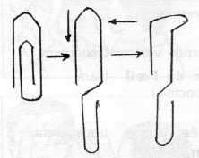
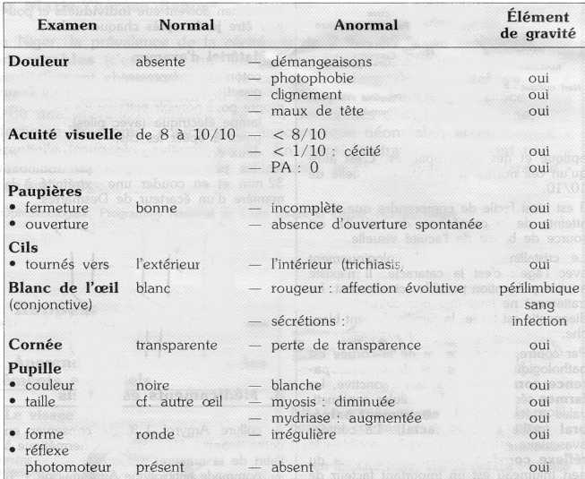
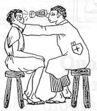
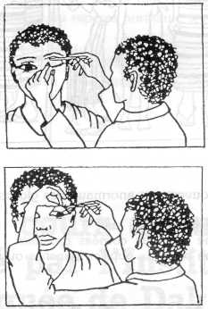
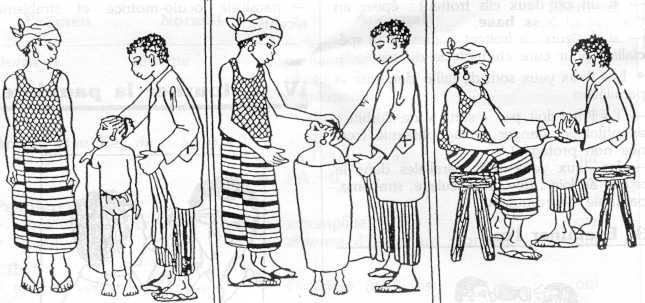
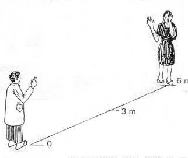

Au Niger, la prévalence de la cécité est de 2 % ; 80 % de ces cécités sont curables (c'est-à-dire qu'elles peuvent bénéficier d'un traitement essentiellement chirurgical : c'est le cas de la cataracte), ou évitables (c'est-à-dire qu'elles auraient pu être évitées par un traitement précoce et/ou une prévention efficace : ce sont des cécités d'origine cornéenne, infectieuse (trachome, conjonctivite gonoccocique néonatale), et/ou carentielle (rougeole, avitaminose A). En outre, les traumatismes sont une cause très importante de cécités unilatérales, le plus souvent par retard de prise en charge.

## I. Rappels

### 1. Apprendre à reconnaître les éléments essentiels

#### Le visage

Les deux yeux sont de taille identique et leurs axes sont parallèles.

Les paupières, organes de protection s'ouvrent et se ferment spontanément, régulièrement (clignement), et complètement. Elles permettent l'étalement des larmes, facteur très important de la transparence cornéenne. Les cils sont toujours dirigés vers l'extérieur de l'œil.

- **Le segment antérieur de l'œil :** c'est la partie visible de l'œil.

- Au centre, la **cornée** est une lentille transparente qui permet d'apercevoir l'iris, de couleur sombre, et percé en son centre d'un trou rond et noir : la **pupille.**

NB. La cornée est mieux visible de profil, bombant comme un verre de montre.

Le diamètre de la pupille varie avec l'intensité lumineuse :

- en lumière forte, elle se rétrécit pupille en myosis,
- en lumière faible, elle s'élargit pupille en mydriase.

La pupille est normalement noire (le cristallin situé en arrière de l'iris est normalement transparent donc invisible).

Autour de la cornée, l'œil apparaît blanc, la sclère est recouverte de la **conjonctive** **bulbaire,** muqueuse très fine, qui tapisse aussi la face interne des deux paupières (conjonctive palpébrale). La conjonctive palpébrale inférieure vous est familière : c'est elle que vous regardez pour dépister une anémie. Vous apprendrez à retourner la paupière supérieure.

NB. La zone de jonction cornée-conjonctive s'appelle le limbe.

### 2. A quoi sert l'œil : la vision

Le rayon lumineux issu de l'infini pénètre dans l'œil au centre de la cornée, traverse la pupille, le cristallin et le vitré avant d'" impressionner " les cellules rétiniennes de la macula. L'influx nerveux sera alors transmis au cerveau par l'intermédiaire du nerf optique et des voies optiques. C'est ainsi qu'un œil normal a une acuité visuelle de 10/10.

Il est ainsi facile de comprendre que toute atteinte de la cornée ou du cristallin est source de baisse de l'acuité visuelle.

Le cristallin s'opacifie physiologiquement avec l'âge : c'est la cataracte. Il n'existe aucune prévention possible actuellement. Le traitement ne peut être que chirurgical. Le diagnostic est facile, la pupille devient blanche.

Par contre, toute atteinte de la cornée est pathologique, les garants de la **transparence cornéenne** sont la conjonctive, les **larmes** sécrétées par les cellules conjonctivales et étalées par le **clignement palpébral** (grâce au **nerf facial).** La cornée, avasculaire est par contre très sensible : le **réflexe cornéen** sous la dépendance du nerf trijumeau est un important facteur de protection.

## II. Local et matériel

### 1. Local

On peut faire un très bon examen ophtalmique partout. Le local sera propre et bien éclairé. On peut aussi consulter dehors mais à l'ombre.

### 2. Matériel

#### Source d'eau propre indispensable

Les larmes sont très contagieuses. Il est donc indispensable de pouvoir **se laver les** **mains après chaque malade.** Prévoir : eau propre (filtrée ou bouillie), eau de javel, savon.

#### Poubelle

Les cotons ou compresses qui auront servi à l'examen doivent être **individuels** et pouvoir être **jetés** après chaque malade.

#### Matériel d'examen

- coton ou compresses,
- pissette (ou flacon) contenant de l'eau propre pour pouvoir nettoyer les sécrétions,
- lampe électrique (avec piles),
- pince à épiler les cils,
- deux écarteurs "trombone" pour écarter les paupières : déplier un trombone 32 mm et en couder une extrémité à la manière d'un écarteur de Desmarres.

### 3. Médicaments essentiels

- collyre Argyrol 1 % (à conserver en petite quantité dans un flacon hermétique à l'abri de la lumière),
- pommade antibiotique Auréomycine 1% (cycline active sur le trachome et la moins chère),
- vitamine A 200 000 UI (capsules)

Attention ! ne jamais utiliser de corticoïdes locaux, toujours vérifier la formule d'un collyre ou d'une pommade OPH avant utilisation.

## III. Examiner le malade

- Toujours examiner le comportement du malade avant de le faire asseoir (orienté sur l'acuité visuelle),
- Avoir les mains propres,
- L'examen doit toujours être **complet et** **bilatéral.**

### 1. L'interroger

Pour préciser les signes fonctionnels :

- sécrétions ("œil qui pleure, coule, colle"),
- douleurs,
- baisse d'acuité visuelle.

Faire préciser :

- s'il s'agit d'un ou des deux yeux, depuis quand,
- s'il existe un traumatisme (nature de l'agent traumatisant),
- les traitements faits.

#### Éléments de gravité

- sécrétions purulentes : infection (danger de contagion),
- douleur : à la lumière (photophobie), au clignement, céphalées,
- baisse d'acuité visuelle de loin récente,
- trouble visuel récent : voile noir ou rouge, mouches volantes, éclairs lumineux,
- diplopie : vision double,
- notion de traumatisme récent,
- notion de chirurgie oculaire récente.

### 2. Examiner le visage

#### En cas de sécrétions

Toujours commencer par nettoyer les sécrétions en décollant les cils à l'eau propre.  
Attention : risque septique, se laver les mains.

#### Les paupières : elles doivent s'ouvrir spontanément

Attention :

- occlusion volontaire et douleur : lésion cornéenne probable,
- occlusion involontaire : ptosis (paralysie du nerf III).

Elles doivent se fermer spontanément et totalement.

Attention : inocclusion palpébrale (lagophtalmie) : danger si la cornée de l'œil malade reste visible quand on demande au malade de fermer les yeux.

#### Les cils : bien regarder les bords ciliaires

- danger si les cils frottent sur la cornée, on parle alors de **trichiasis :** recherche de **trachome** (cf. ci-après),
- si un ou deux cils frottent : épiler en tirant le cil à **sa base,**
- si plusieurs cils frottent : adresser au spécialiste pour cure chirurgicale du trichiasis.

Les deux yeux sont de taille identique et parallèle

- l'œil ne doit pas "sortir" de l'orbite exophtalmie, danger de lagophtalmie (cornée non protégée),
- les deux yeux sont parallèles dans le regard au loin : déviation oculaire, strabisme, paralysie neuromotrice.

### 3. Examiner l'œil

#### Règles

- prévenir le malade,
- lui demander d'ouvrir les deux yeux,
- ne jamais ouvrir un œil de force : pour écarter les paupières, prendre appui sur les rebords osseux comme indiqué sur le dessin,
- éclairer l'œil latéralement,
- ne jamais toucher la cornée.

#### Vérifier que

- la conjonctive bulbaire (blanc de l'œil) est blanche,
- la cornée est transparente (l'Iris et la pupille sont parfaitement visibles),
- la pupille est ronde et noire, elle réagit à la lumière (c'est l'étude du réflexe photomoteur).

#### Éléments de gravité

- lagophtalmie : cornée non protégée,
- trichiasis,
- rougeur de la conjonctive : souffrance oculaire évolutive,
- cornée opaque,
- iris et/ou pupille non visible,
- iris de couleur anormale,
- pupille blanche,
- pupille non réactive à la lumière,
- paralysie oculo-motrice et strabisme récents.

## IV. Retourner la paupière

Indispensable à la recherche de :

- signes de trachome,
- corps étranger sous-palpébral.

NB. C'est plus facile si vous demandez au patient de regarder vers le bas.

## V. Cas particulier du jeune enfant

L'enrouler dans un pagne comme le dessin page suivante.

NB. Retourner la paupière supérieure est souvent impossible chez l'enfant de moins de deux ans.

Toujours vérifier les cornées et la pupille en s'aidant au besoin des écarteurs (anesthésique local inutile, glisser les écarteurs, l'un après l'autre entre les paupières sans appuyer sur le globe oculaire).

### Signes de gravité

- absence d'ouverture spontanée d'un ou de deux yeux,
- mouvements anormaux des globes oculaires,
- déviation d'un œil,
- une ou deux cornées opaques,
- une ou deux pupilles blanches ou roses.

## VI. Mesure de l'acuité visuelle (AV)

Elle est indispensable pour :

- apprécier la valeur fonctionnelle de l'œil,
- surveiller l'évolution.

Elle se fait toujours **œil par œil : l'œil non** **examiné étant fermé par la main posée** **à plat.**

### 1. Cas le plus fréquent : vous n'avez pas d'échelle dAV

Placez-vous à six mètres du patient :

- demander lui de compter vos doigts,
- changer d'œil.

NB. Un patient qui compte les doigts à six mètres a au moins 1/10.

### 2. Vous avez une échelle d'AV

- accrocher l'échelle sur un mur éclairé mais à l'abri des reflets,
- placer le malade à la distance indiquée sur l'échelle,
- expliquer le test au malade avant de commencer,
- utiliser un bâton pour montrer les tests,
- placer toujours le bâton sous le test,
- vérifier les réponses du malade,
- procéder œil par œil en commençant par l'œil droit,
- toujours commencer par les tests les plus gros,
- noter les réponses œil par œil AV OD, OG:

<table>

<tbody>

<tr>

<td valign="top"><ul><li>Un œil sain doit lire entre 8 et 10/10.</li></ul><ul><li>Un œil qui ne lit pas 3/10 est dit malvoyant.</li></ul><ul><li>Un œil qui ne lit pas 1/10 est dit aveugle.</li></ul></td>

</tr>

</tbody>

</table>

### 3. Le patient n'a pas une AV = 1/10 

ou ne compte pas les doigts à six mètres

Placez-vous à trois mètres du malade et procédez comme au paragraphe 1.

NB. Un malade qui compte les doigts à trois mètres seulement est aveugle de cet œil.

### 4. Le malade ne peut compter les doigts à trois mètres

- approchez-vous de lui et demandez-lui s'il voit la lumière de votre torche,
- en cas d'affirmative, vérifiez que la pupille réagit à la lumière.

NB. L'absence de vision de la lumière est un signe de très mauvais pronostic : cet œil est aveugle et incurable.

Un œil qui voit la lumière pourra peut-être être guéri par le spécialiste.

## VII. Conclusion

Pour examiner un œil, il faut :

- connaître les repères normaux, les critères de gravité,
- avoir de l'eau,
- procéder avec méthode.

Avec un peu d'habitude, c'est facile et rapide.

*Développement et Santé, n° 105, juin 1993*
