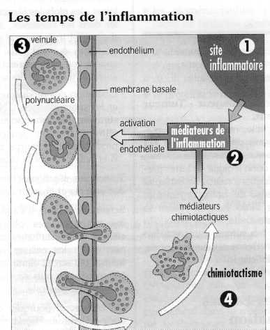

Les médicaments anti-inflammatoires (cortisone et dérivés, anti-inflammatoires non stéroïdiens) sont de plus en plus utilisés en médecine et en chirurgie.

Il est utile de comprendre, tout d'abord, ce qu'est l'inflammation.

## I. Définition

L'inflammation est une réponse immédiate à toute agression menaçant l'organisme.

Cliniquement, elle a été définie, il y a 2000 ans, par un médecin romain nommé Celse, en quatre mots : **Rougeur - Tumeur** **- Chaleur - Douleur.**

L'inflammation est utile, mais peut être exagérée, et alors devenir dangereuse. Elle fait souvent souffrir (entorse, brûlure, rhumatisme, par exemple). Il est donc logique de lutter parfois contre l'inflammation, mais elle est aussi un moyen de défense de notre organisme, aidant à combattre l'infection, favorisant la cicatrisation d'une plaie, etc.

Nous devons donc trouver un juste équilibre dans la prescription des anti-inflammatoires, ce qui est souvent difficile !

## **Il.** Principales causes de l'inflammation

*   Infection (bactéries, virus, parasites, champignons).  
*   Traumatismes (fracture, entorse, plaie).  
*   Chaleur ou froid.  
*   Agents chimiques, électrocutions.  
*   Obstruction artérielle (drépanocytose) ou veineuse (phlébite).  
*   Allergène (asthme).  
*   Maladies auto-immunes (rhumatisme).

## III. Etapes de l'inflammation

_(voir schéma)_

*   Appel de sang dans la région (infection ou plaie, par exemple), les capillaires sanguins se dilatent, expliquant la rougeur au niveau de la peau.  
*   Augmentation de la perméabilité des capillaires : les globules blancs s'arrêtent de circuler dans les vaisseaux, se fixent sur l'endothélium et traversent la paroi capillaire. Des protéines quittent aussi les vaisseaux pour gagner le tissu interstitiel d'où oedème, ce qui entraîne tumeur et douleur.  
*   Libération des médiateurs par les leucocytes et les macrophages, TNF, interleukines qui stimulent la phagocytose des bactéries, attirent d'autres leucocytes, activent la production d'anticorps par les lymphocytes B et enfin, hâtent la cicatrisation.

Toutes ces réactions chimiques consomment de l'énergie et libèrent donc de la chaleur.

Schématiquement, il s'agit d'un véritable combat entre cellules phagocytaires (polynucléaires et macrophages) et bactéries ou tissus nécrosés : les cellules mortes libèrent des toxines qui seront éliminées localement (abcès qui se collecte puis se " vide ", par exemple) ou par voie générale.

On comprend pourquoi certaines inflammations généralisées (syndromes inflammatoires) entraînent fièvre, fatigue, amaigrissement.

## IV. Quelques exemples de réactions inflammatoires

### 1. Plaie surinfectée

Une plaie dont la prise en charge n'est pas rapide se surinfecte souvent.  
Le blessé se plaint d'une douleur locale et l'on observe l'apparition d'un oedème et d'une augmentation de la chaleur locale : les microbes libèrent des toxines qui entraînent une dilatation des capillaires, un afflux de polynucléaires qui vont traverser les vaisseaux et s'efforcer de phagocyter et de détruire les bactéries. Le " pus " va apparaître, fait de débris de germes et de polynucléaires.

La guérison surviendra alors, accélérée par une éventuelle antibiothérapie.

### 2. Crise vaso-occlusive de la drépanocytose

Au cours de la crise drépanocytaire, les globules rouges subissent une modification morphologique (rigidification, aspect en croissant) : ils obstruent alors de nombreux capillaires (articulations, mésentère, poumons, cerveau etc.).  
Cette obstruction entraîne une anoxie locale (manque d'oxygénation des tissus), puis une destruction des cellules.

Cette lyse cellulaire libère des toxines qui déclenchent une inflammation locale : ainsi une articulation deviendra chaude, douloureuse, non mobile.  
Une grande question se pose alors : simple inflammation à traiter par les antalgiques ou début d'infection (ostéite ou arthrite) à traiter par antibiotiques ?

_Développement et Santé, n° 161, octobre 2002_