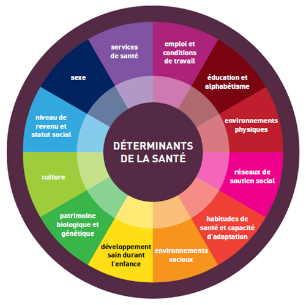
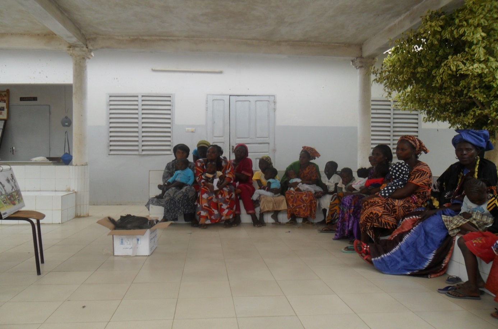
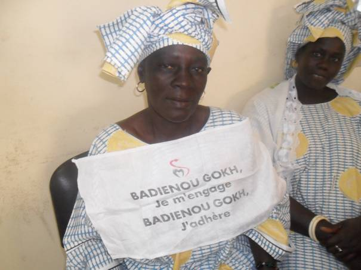

## I. Introduction

La promotion de la santé représente un processus social et politique global, qui comprend non seulement des actions visant à renforcer les aptitudes et les capacités des individus mais également des mesures visant à changer la situation sociale, environnementale et économique, de façon à réduire ses effets négatifs sur la santé publique et sur la santé des personnes. La promotion de la santé est le processus qui consiste à permettre aux individus de mieux maîtriser les déterminants de la santé et d’améliorer ainsi leur santé. La participation de la population est essentielle dans toute action de promotion de la santé. » (OMS 1999).

L’initiative Badiène Gox (BG) est un projet qui fait partie intégrante de la promotion de la santé car elle assure l’engagement de la communauté envers la santé de la mère, du nouveau-né, de l'enfant et de l'adolescent. Pour cela, elle s’adapte aux valeurs socioculturelles sénégalaises, favorise le leadership féminin,  s’associe au dispositif communautaire au niveau des cases de santé, quartiers et villages et s’appuie sur les leaders communautaires dans la sensibilisation à tous les niveaux pour relever les indicateurs de santé. En effet la BG, sœur du chef de famille ou marraine des enfants, a un rôle d’encadrement et de soutien des femmes en âge de reproduction (FAR). Ses actions permettent aux membres des communautés de développer des aptitudes individuelles en faveur de la santé du couple mère-enfant, se traduisant notamment par une augmentation du nombre de consultations pré et postnatales et en planification familiale, par l’adoption du test du VIH pendant la grossesse et surtout par la réduction des accouchements à domicile.

Le texte qui suit est un exemple concret d'application des principes de promotions de la santé. Il contribue à déterminer les éléments à améliorer dans un programme national de renforcement des capacités chez des actrices clefs au sein de communautés rurales du Sénégal : les Badiènes Gox.

## II. La problématique

Chaque année, un demi-million de femmes meurt à travers le monde. La mortalité et la morbidité maternelles et infantiles  restent un fléau qui frappe durement les pays en développement et plus particulièrement ceux d'Afrique qui comptent à eux seuls 56% des décès mondiaux de mères à l'accouchement (OMS, 2013). Toujours sur le continent africain, on note en moyenne un taux de mortalité maternelle atteignant 429 cas pour 100 000 naissances vivantes (OMS 2013). La mortalité des nouveau-nés reste très préoccupante, de même que la prévalence des maladies infectieuses et la malnutrition (OMS/UNICEF, 2012).  Au Sénégal,  l’objectif de la réduction de la morbidité et de la mortalité maternelles et infantiles est un objectif prioritaire pour l’atteinte des OMD 4 et 5 d’ici 2015, soit: baisser de 2/3 le taux de mortalité des enfants de moins de 5 ans et diminuer de ¾ la mortalité maternelle. En 2011, la mortalité maternelle s’élevait à 392/100 000 naissances vivantes (EDSV). Cette situation demeure préoccupante malgré des acquis notoires. La santé de la mère et de l’enfant demeure le problème de santé publique le plus important au Sénégal. Malgré les efforts consentis, plusieurs sources mentionnent la stagnation des indicateurs de mortalité maternelle et néonatale (MSP, 2010). Des soins appropriés de la santé de la reproduction existent mais, paradoxalement, il y a une insuffisance de l’utilisation des services par cette cible. Le manque d’information et d’assistance aux FAR en est la raison principale.

Pour apporter des solutions à ce problème, le gouvernement du Sénégal a créé « l’initiative Badiène Gox (B.G.) », une approche typiquement sénégalaise qui s’inscrit dans un cadre global, continu et intégré des expériences communautaires de lutte contre la mortalité maternelle et néonatale à travers le soutien aux activités de communication et de mobilisation des ressources de la communauté. Le district sanitaire de Tivaouane, sous l’appui du ministère de la santé et du partenaire _Child Fund, _a intégré les BG dans le dispositif communautaire au niveau des cases de santé, en plus du dispositif des quartiers et des villages.

Malgré ces stratégies déployées aux échelles tant internationale, nationale que locale et communautaire, force est de constater que parmi les actions que mènent les BG, il n'a été relevé qu’une faible amélioration des indicateurs de santé de la reproduction au niveau du district sanitaire de Tivaouane. C’est pourquoi les infirmiers (ère)s se sont posé la question de recherche suivante : « Quels sont les défis à relever pour assurer la réussite des interventions des BG dans le district sanitaire de Tivaouane ? »

<table>

<tbody>

<tr>

<td>

Quelques concepts clefs

Badiène Gox (BG)

<ul><li>Badiène : sœur du chef de famille</li><li>Gox : quartier ou localité, zone d’habitation où les populations entretiennent des relations de vie commune</li></ul>

Les interventions des BG

Ensemble des tâches, basées sur les valeurs traditionnelles, dévolues à ces dernières dans leur quartier ou village en vue de promouvoir la santé de la mère, du nouveau-né, de l’enfant et de l’adolescent.

Retard  d’utilisation des services maternels

Il s’agit d’un retard  de recours aux soins d’urgence par les FAR,  qui est souvent imputable à la famille, à la communauté et aux problèmes d’accès aux structures de soins.

Leader communautaire

Individu qui, de par son statut social et les valeurs incarnées, exerce une influence sur les autres. En s’appuyant sur ces personnes, il serait très probable que les actions en faveur de la santé des populations au niveau communautaire seraient suivies.

Rôle de l'infirmier(ère) auprès des BG

Les types d’interventions effectuées par les infirmier(ère)s auprès des BG sont notamment:

<ul><li>L'appui à la planification des activités BG;</li><li>Le plaidoyer auprès des comités de santé et des comités de gestion pour le financement des activités BG;</li><li>L’implication des BG dans les activités promotionnelles au niveau  du poste de santé et de la zone de responsabilité;</li><li>L’implication des BG par les infirmiers dans la sensibilisation et les recherches de « perdues de vue » pour les activités de vaccination, de consultation prénatale (CPN), de consultation post-natale (CPON), de planification familiale (PF), de suivi de croissance et d’enfant malade.</li></ul></td>

</tr>

</tbody>

</table>

## III. Une démarche infirmière pour l'amélioration  
des interventions des Badiène Gox 

L'objectif général de l'étude était de déterminer les contraintes à la réussite des interventions des BG dans le district sanitaire de Tivaouane. Plus spécifiquement, il s'agissait d’identifier les obstacles liés aux BG, à la communauté ainsi que ceux liés aux services de santé.

<table>

<tbody>

<tr>

<td>Cadre d'études</td>

<td>Champ d'étude</td>

</tr>

<tr>

<td><em>Région médicale de THIÈS</em>:  
Superficie: 6601 km²  
population total: 1743701 habitants  
Hôpitaux: 05  
District: 09</td>

<td>

<em>District Sanitaire de TIVAOUANE</em>:  
Superficie: 1174 Km²  
population totale: 316237 habitants  
Hôpitaux: 01  
Postes de santé: 24

</td>

</tr>

</tbody>

</table>

### Les résultats

L'enquête a révélé que les défis du programme BG sont :

*   de capitaliser sur les expériences communautaires diverses ; 
*   d’enrichir les instances locales ; 
*   de promouvoir une communication adaptée à la spécificité locale ; 
*   d’impliquer les instances décisionnelles de la communauté aux différentes phases que sont: l’identification des BG, leur sélection, leur orientation, leur formation sur la sensibilisation de la communauté, le plaidoyer des leaders, la mobilisation des ressources, la référence, le suivi et l’évaluation de l’initiative  au niveau du district

À l'instar de cette enquête, les infirmier(ère)s savent maintenant qu'intervenir sur ces éléments permettrait de contribuer :

*   au leadership féminin au service de la santé de la reproduction ;
*   à l’amélioration de la fréquentation des services de santé par les bénéficiaires ;
*   à l’augmentation du taux de prévalence contraceptive ;
*   à l’augmentation du nombre de tests VIH/SIDA durant  la grossesse ;
*   à l’augmentation du taux de consultation prénatale (CPN) et la complétude de celle-ci ;
*   à l’augmentation des accouchements dans la structure ;
*   à l’augmentation du taux de consultation post-natale (CPON).

### Les recommandations

La reconnaissance des BG favorise l’appropriation du programme des BG par les communautés et toutes les parties prenantes. Les autorités administratives et locales ainsi que les prestataires et les leaders communautaires doivent s’évertuer à mettre en place des mécanismes aptes à renforcer cette reconnaissance, à travers par exemple :

*   l'organisation de cérémonies publiques de reconnaissance ;
*   la proposition et l'application effective de systèmes de motivation intrinsèques (la valorisation du travail des BG, l'instauration d’un système d’émulation pour les BG et les familles qui se sont particulièrement distinguées) ;
*   la dotation de moyens de déplacement ;
*   le renforcement de la dotation initiale de téléphone mobile pour les urgences et la référence ;
*   L'implication dans la gestion des moyens d’évacuation ;
*   l'appui dans la prise en charge des cas sociaux orientés ou accompagnés par les BG.

De plus, l'organisation « en réseaux » étant une nécessité, il faut donc :

*   Susciter  la création de réseaux  BG pour favoriser des échanges entre elles et consolider les liens de collaboration avec les autres acteurs communautaires ;
*   Favoriser la création de groupes de pression aptes à négocier avec les autorités et les partenaires pour la mobilisation de ressources.

## IV. Conclusion

En somme, les infirmier(ère)s doivent être au cœur de la pratique en promotion de la santé et être les accompagnatrices des personnes, des familles et des communautés. Il importe d'intégrer une perspective de promotion de la santé dans leurs interventions quotidiennes, c'est-à-dire: reconnaître que la personne est un coproducteur de sa santé et que notre rôle est de favoriser l’empowerment  afin de diminuer les inégalités en matière de santé. Malgré l’insuffisance des ressources, les résultats observés de la stratégie BG à l’échelle du district sanitaire de Tivaouane peuvent être en effet améliorés grâce notamment à une mobilisation des acteurs à tous les niveaux.

De par leur proximité avec les communautés, les infirmières et les infirmiers sont des intervenants de premier plan et doivent affirmer leur rôle pivot entre tous les acteurs, favorisant ainsi le décloisonnement et le travail de collaboration des différents secteurs. L'optimisation des stratégies de promotion de la santé a été désignée comme une condition _sine qua non_ à une meilleure santé des populations. Ses interventions ont pour but de réduire les écarts actuels caractérisant l'état de santé des populations, notamment celui de la mère et de l’enfant, et d'offrir à tous les individus les mêmes ressources et possibilités pour réaliser pleinement leur potentiel de santé (SIDIIEF, 2014).

