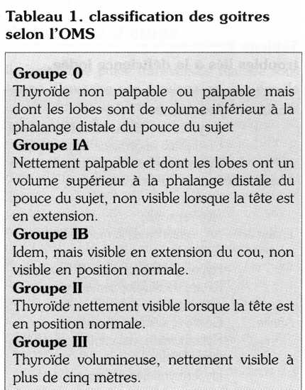

## I. Cycle de l'iode dans la nature et source de l'iode pour l'homme

L'eau de mer est le réservoir terrestre de l'iode à la surface du globe. La teneur en iode de l'atmosphère et de l'eau de pluie diminue en s'éloignant des côtes. L'iode présent dans le sol est entraîné vers les rivières par les eaux de ruissellement et les fontes glacières. Les régions les plus pauvres en iode sont donc les zones montagneuses et les régions éloignées des océans.

La principale source en iode est représentée par les aliments. Les plus riches sont les fruits de mer, les poissons de mer, les oeufs, alors que les viandes, les fruits et les légumes en sont relativement pauvres.

## Il. Besoins en iode chez l'homme

Pour étudier le statut en l'iode d'une population, on peut évaluer la fréquence du goitre : une région géographique est considérée comme zone de goitre endémique lorsque plus de 10 % des enfants de 6 à 1 2 ans en sont porteurs. Le goitre constitue le stade ultime de la carence en iode _(voir_ _tableau 1)._

Les dosages sanguins d'hormones thyroïdiennes ainsi que la mesure d'iode dans les urines précisent le diagnostic. Les apports quotidiens recommandés ont été établis avec précision : 40 microgrammes/jour pour le nourrisson, 70 à 90 pour l'enfant, 150 pour l'adolescent et l'adulte, 175 pendant la grossesse et 200 pendant l'allaitement.

##   
III. Troubles liés à la **déficience iodée**

Lorsque l'apport en iode est insuffisant dans une population, apparaissent des anomalies de la fonction thyroïdienne, puis un goitre, une diminution de la fertilité, une augmentation du taux d'avortement et de la mortalité périnatale _(voir tableau 2)._

Le goitre endémique constitue l'aspect le plus spectaculaire de la carence en iode, atteignant environ 300 millions d'individus dans le monde. Cette hypertrophie thyroïdienne est due à une sécrétion accrue de TSH par l'hypophyse qui stimule les cellules thyroïdiennes malheureusement incapables de sécréter correctement des hormones thyroïdiennes en l'absence d'iode.

Le crétinisme endémique toucherait plus de 3 millions de personnes sur terre. Il s'agit de sujets nés et vivant dans une zone de goitre endémique atteints d'un retard mental irréversible avec hypothyroïdie sévère, petite taille, trouble de la marche et quelquefois surdité et strabisme. Cette hypothyroïdie permanente ayant débuté pendant la vie foetale ou la période néonatale.

Plus récemment ont été mis en évidence les déficits en iode modérés se caractérisant sur le plan clinique par une fatigabilité, une frilosité, une diminution du taux des hormones thyroïdiennes dans le sang.  

## IV. Traitement préventif de la carence en iode

L'enrichissement en iode des sels destinés à la consommation humaine est la méthode la plus simple pour prévenir les désordres liés à la carence iodée. L'iode est le plus souvent apportée sous forme d'iodure de potassium, mais l'iodate de potassium lui est préféré dans les régions humides en raison d'une plus grande stabilité.

L'efficacité et le coût modeste de cette prévention sont bien connus.

Une supplémentation orale de iodure ou iodate de potassium périodique (bimensuelle ou mensuelle) s'est également avérée efficace au Zimbabwé, par exemple, pour la correction du déficit en iode chez les enfants d'âge scolaire. S'il n'est pas possible d'enrichir en iode le sel, le pain ou les eaux de boisson, on a recours à une supplémentation sous forme d'huile enrichie en iode lentement résorbable, administrée par voie orale ou intramusculaire. Ce traitement préventif comporte néanmoins des effets indésirables : allergie à l'iode, intoxication par dose massive d'huile iodée pouvant entraîner des complications cardiaques.

Le travail de S. Diallo effectué en Guinée prouve à quel point la distribution gratuite de capsules d'iode et l'utilisation de sels iodés n'ont pas encore d'effet spectaculaire. L'utilisation de diffuseurs d'iode dans les puits apparaît pour certains la meilleure solution.

_Développement et Santé, n°152, avril 2001_