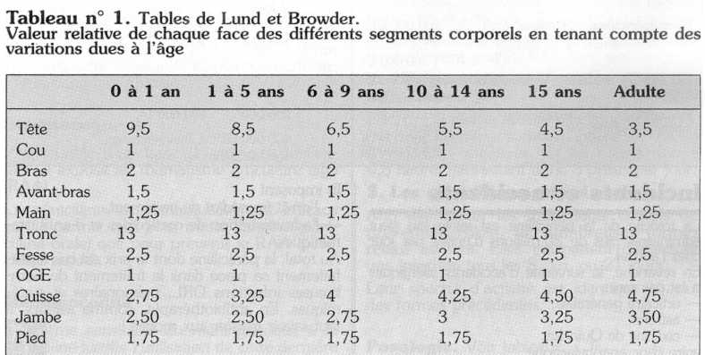
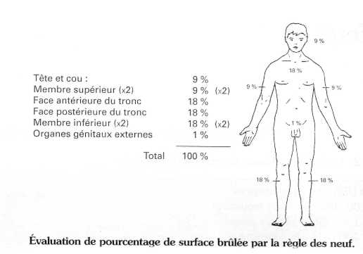

**La brûlure**

**par Jean-Paul Tanniou*, Marie-Noëlle Durand****

* Instructeur de secourisme, SMUR de Saint-Denis.

** Infirmière anesthésiste, SAMU, Hôpital Avicenne, Bobigny.

La brûlure est une atteinte de la peau et/ou des voies aériennes ou digestives.

Elle est causée par :

**La brûlure**

**par Jean-Paul Tanniou*, Marie-Noëlle Durand****

* Instructeur de secourisme, SMUR de Saint-Denis.

** Infirmière anesthésiste, SAMU, Hôpital Avicenne, Bobigny.

La brûlure est une atteinte de la peau et/ou des voies aériennes ou digestives.

Elle est causée par :

*   les rayonnements sous leurs diverses formes : soleil, radiation, etc. ;
*   la chaleur : contact avec une flamme, un corps solide chaud, des vapeurs chaudes, du liquide chaud ;
*   le frottement d'un objet sur la peau
*   l'électricité : les courants, la foudre
*   les produits chimiques : acide ou base.

Comme pour les plaies, on distinguera la brûlure simple et la brûlure grave :

*   La brûlure _simple_ se caractérise par une rougeur peu étendue, par une cloque (ampoule) d'une **surface inférieure à la moitié** **de la paume de la main de la victime.**

*   Au contraire la _brûlure grave_ se caractérise par :

- son **étendue:** rougeur importante type coup de soleil généralisé, ou cloque unique ou multiple d'une surface totale supérieure à la moitié de la paume de la main de la victime;

Si l'étendue est importante, il faudra craindre l'installation d'une détresse circulatoire :

- sa **profondeur :** aspect noirâtre, cartonné ;

- sa **localisation:** au niveau des yeux, danger de perte de la vue ; au niveau des articulations, des mains, handicap fonctionnel ; au niveau des narines et de la bouche, bien souvent atteintes des voies aériennes qui entraînent une détresse ventilatoire ;

- comme pour les plaies, l'âge, l'état de santé antérieur de la victime seront toujours des facteurs de gravité ;

- la brûlure peut également être souillée et/ou contenir des morceaux de vêtements synthétiques ;

- la brûlure s'infecte rapidement

- en outre, les brûlures d'origine chimique ou d'origine électrique doivent toujours être considérées comme des brûlures graves _(tableaux n° 1 et 2)._

**I.** **Conduite à tenir**

Toute brûlure devra bénéficier d'un refroidissement le plus précoce possible (sauf les brûlures électriques bien souvent peu étendues mais profondes).

En effet, le refroidissement précoce entraînera :

- une diminution de la douleur,

- une diminution de l'étendue et de la profondeur de la brûlure,

- une diminution de l'oedème réactionnel.

En conséquence, toute brûlure survenue dans le quart d'heure doit être refroidie avec de l'eau froide à 10-15 °C (équivaut à la température de l'eau " du robinet "), pendant cinq minutes au moins, en faisant ruisseler cette eau à une distance de 10 à 15 centimètres de la peau (jet sans pression).

Si la surface brûlée est importante, il est nécessaire d'installer la victime sur un plan incliné à 10-15°, afin que l'eau d'arrosage puisse s'évacuer et ainsi éviter " l'effet baignoire " générateur d'hypothermie.

La durée d'aspersion (cinq minutes au moins) est fixe pour les secouristes non médecins, elle sera prolongée sur décision médicale.

Cet arrosage peut être réalisé à l'aide de :

- l'eau froide : verser le contenu d'un récipient plein d'eau froide,

- la douche de salle de bains,

- la petite lance de l'engin sapeur-pompier sur place.

Dans tous les cas, il s'agira de réaliser un ruissellement d'eau **sans pression** par des mouvements de va-et-vient au-dessus des parties atteintes.

**1. Conduite à tenir devant une brûlure simple**

*   mettre des gants stériles,
*   arrosage à l'eau pendant cinq minutes,
*   penser à ôter bracelet, montre, bague, etc., se situant sur la surface brûlée **avant** la naissance de **l'oedème**
*   protéger la brûlure avec un pansement stérile,
*   vérifier la vaccination contre le tétanos,
*   informer la victime de consulter un médecin si apparition de douleur, gonflement, rougeur, fièvre.

**2. Conduite à tenir** **face à une brûlure grave**

- commencer immédiatement le refroidissement,

*   mettre des gants stériles,
*   installer la victime le plus confortablement possible,

*   puis la déshabiller sous l'eau **sans enlever les vêtements qui collent à la** **peau.**

_Point important_ : ne pas oublier de retirer bagues, bracelets, rnontres, ceintures, etc., se trouvant au niveau des surfaces brûlées, **avant la survenue de l'oedème.** Les parties non touchées par la brûlure devront être isolées par un système imperméable.

En cas de brûlures :

- aux _jambes_ : installer la victime en position assise,

- aux _membres supérieurs_ : installer la victime en position assise, protéger les jambes avec un dispositif imperméable,

- du _dos et du thorax_ : position assise également, à l'aide d'un tabouret par exemple. Le dispositif imperméable protégeant alors la partie inférieure du corps,

_- étendues,_ la victime sera allongée sur un matelas immobilisateur ou d'un brancard, ou à défaut un plan dur sur lesquels on aura disposé un dispositif imperméable.

Autant que possible, il conviendra que la victime soit en **appui sur les pailles non** **brûlées.** On surélèvera l'ensemble du côté tête de 10-15° de façon à faciliter l'écoulement de l'eau d'arrosage.

L'arrosage terminé, on **séchera** la victime au moyen de draps stériles, **par tamponnements et non par friction.** Les zones brûlées seront protégées par emballage stérile, la victime sera couverte (couverture isotherme) et oxygénée. On complétera le bilan et la victime sera surveillée jusqu'à l'arrivée du médecin.

- **Les brûlures chimiques**

Le secouriste doit se protéger (lunettes, gants) et sans perdre de temps, avec les précautions d'usage, enlever les vêtements.

_Eaux de ruissellement_

En cas de brûlure de la _cavité buccale,_ il conviendra de rincer abondamment, la victime ne devant naturellement pas absorber les eaux de rinçage.

En ce qui concerne _les narines, les yeux, les_ _lèvres, les organes génitaux_ : lavage à grande eau (oeil : paupière ouverte, rinçage dix minutes minimum).

- **Les brûlures électriques**

*   couper le courant,

*   préparer le matériel de réanimation et surveiller les constantes vitales,

*   repérer les points d'entrée et de sortie du courant dans son trajet au travers du corps de la victime,

*   évaluer en conséquence les brûlures internes non visibles,

*   se faire préciser d'éventuels facteurs de bonne conduction comme l'humidité,

*   se renseigner sur l'ampérage et le voltage du courant.

- **Les brûlures internes par inhalation**

*   mettre en oeuvre les manoeuvres de réanimation si nécessaire,

*   placer la victime sous oxygène,
*   faire un dosage de CO si possible,
*   position demi-assise.

**- Brûlure interne par ingestion**

**_ne pas donner à boire, ne pas_** **_faire vomir,_**

*   oxygénation si problèmes ventilatoires,
*   position assise.

*   **victime** ayant le **_feu à ses vêtements_** : l'empêcher de courir, procéder à l'extinction

en le roulant par terre et en étouffant les flammes avec une couverture ou un vêtement.

En _règle générale_ : l'arrosage précoce des brûlures ne doit pas retarder la mise en oeuvre des autres gestes d'urgence : maintenir les fonctions vitales (schéma).

_Développement et Santé, n°134, avril 1998_