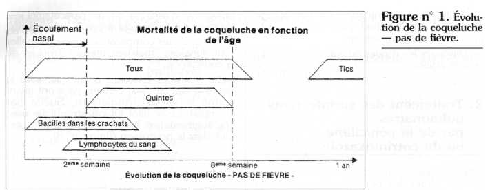
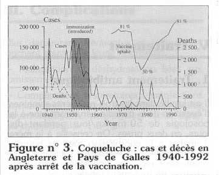
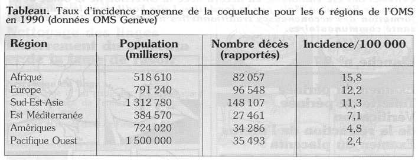

La coqueluche, malgré la vaccination, reste une pathologie cosmopolite. Sa fréquence est particulièrement élevée dans les pays en développement. Il s'agit d'une pathologie extrêmement contagieuse. Il est important de renforcer l'effort vaccinai auprès des jeunes nourrissons et d'effectuer les rappels vaccinaux chez les grands enfants.

## I. Épidémiologie

La transmission de la maladie est strictement interhumaine, par voie aérienne au contact d'un sujet qui tousse, par l'intermédiaire de gouttelettes de Pflügge.

La contagiosité est possible pendant les 30 premiers jours d'évolution. Ce délai peut être raccourci si le sujet est traité par un macrolide (érythromycine à la posologie de 50 mg/kg/jour).

En Afrique, les enfants jeunes sont touchés pour plusieurs raisons :

*   Le programme vaccinal est mal suivi.  
*   Il existe de grandes familles avec de nombreux jeunes enfants vivant sous le même toit.  
*   Les mères emmènent leur bébé partout avec elles (risque plus élevé de contamination).

Dans les pays en voie de développement, la coqueluche survient souvent sur un terrain de malnutrition, lui-même aggravé par la maladie, et s'associe fréquemment à des surinfections pulmonaires.

La mortalité est plus élevée chez les enfants africains au cours des six premiers mois de vie.

Il existe des épidémies de coqueluche sur un fond continu.

Selon une estimation de l'OMS, soixante millions de cas de coqueluche surviennent dans le monde chaque année, et celle-ci serait responsable de 300 000 décès annuels.

## II. Clinique

### Périodes de la maladie

Période d'**incubation** : elle dure de 6 à 12 jours et elle est asymptomatique.

Période **catarrhale** : elle dure de 7 à 14 jours. Il existe un écoulement nasal et une toux.

Période des **quintes** : plusieurs semaines.

Les quintes de toux peuvent provoquer une cyanose, des crises de suffocation et des vomissements. Elle se termine par un " chant du coq ", qui est une reprise inspiratoire bruyante. Durant cette phase l'enfant est épuisé par la succession des quintes. Il produit d'épaisses sécrétions.

**Convalescence** : elle commence vers la 9e ou la 10e semaine.

### Tableau clinique chez le nourrisson de moins de 6 mois :

*   L'écoulement rhinopharyngé et la toux sont moins marqués.  
*   Les quintes sont peu nombreuses.  
*   Les apnées et les accès de cyanose sont au premier plan, nécessitant une surveillance de tous les instants _(voir figure n° 1)._

## III. Complications

Elles demeurent fréquentes et redoutables touchant souvent le jeune nourrisson.

- Malnutrition et déshydratation liées aux vomissements sévères.

*   Complications respiratoires : surinfections broncho-pulmonaires, atélectasies, otites moyennes aiguës, hémoptysies, forme suraiguë dyspnéisante.  
*   Complications neurologiques : convulsions, encéphalopathies en rapport avec des hémorragies cérébro-méningées ou des anoxies prolongées _(voir figure n°2)._

## IV. Examens complémentaires

### 1. Bactériologie

_Bordetella pertussis_ est un cocobacille à gram négatif, difficile à cultiver.

L'isolement du germe par prélèvement pernasal tôt au cours de la maladie, avec culture immédiate, sur boite de Pétri, sur milieu de Bordet Gengou (préparé à base d'infusion de pomme de terre), enrichi de sang frais, peut être pratiqué. Cependant c'est l'examen clinique qui demeure essentiel (il ne faut surtout pas attendre les résultats biologiques pour porter le diagnostic).

### 2. Hématologie

Hyperlymphocytose sur la numération formule sanguine.

## V. Traitement

### 1. Traitement antibiotique

Il est justifié dans les trois premières semaines d'évolution de la maladie : érythromycine à la posologie de 50 mg/kg/jour pendant dix jours, en deux prises. On conseille à la mère d'amener à la consultation tous les nourrissons vivant sous le même toit, et qui ont un écoulement nasal ou une légère toux pour démarrer un traitement rapide.

L'**objectif de l'antibiothérapie est multiple** : dès le début de la maladie, la toxine pertussique détruit l'épithélium bronchique, ce qui veut dire que, une fois les symptômes installés, l'antibiothérapie ne modifiera pratiquement pas la symptomatologie chez l'enfant atteint. Ce message est très important à faire passer auprès des familles car il ne sert à rien de chercher l'antitussif miracle ; il faut être patient et attendre la guérison.

Les sirops antitussifs sont très peu utiles, ceux contenant de la codéine ne doivent pas être utilisés chez l'enfant de moins de 30 mois ni en phase sécrétoire.

En revanche, l'antibiothérapie présente un double intérêt :

*   Éviter la contamination de l'entourage (l'expectoration n'étant plus contaminante après 6 jours de traitement).  
*   Diminuer les risques de surinfections chez le sujet atteint.

### 2. Traitement des surinfections pulmonaires  
par la pénicilline ou le cotrimoxazole

Il faut éloigner les nourrissons et les nouveau-nés de toutes les personnes suspectes de coqueluche.

Aspect essentiel du traitement : le **nursing.**

Il est nécessaire de poursuivre l'alimentation coûte que coûte malgré les vomissements. Il faut fractionner les repas, rajouter des compléments nutritifs, lutter à tout prix contre la dénutrition et la déshydratation.

L'oxygénothérapie en cas de cyanose et l'humidification de l'air sont d'une grande utilité pendant les périodes de quintes.

Il faut effectuer des aspirations buccales régulières pour dégager les mucosités glaireuses.

Il faut pratiquer le bouche-à-bouche en cas d'arrêt respiratoire lors d'un accès d'asphyxie.

Toutes ces mesures ne sont que symptomatiques. Elles n'ont pas transformé l'évolution de la maladie.

Le seul mode de prévention de la coqueluche est la vaccination.

## VI. Prévention de la coqueluche : la vaccination

### 1. Tolérance du vaccin

Le vaccin provoque dans 30 à 50 % des cas une réaction inflammatoire douloureuse avec rougeur locale et induration qui peuvent durer plusieurs jours et qui s'accompagne parfois d'agitation et de pleurs.

Au maximum surviennent des " cris résistants " dans 1 à 3 % des cas dont la durée peut aller jusqu'à 3 jours.  
La réaction fébrile inférieure à 39° est observée dans 30 à 40 % des cas et dure 48 heures.  
Si elle atteint 40°, elle peut provoquer des convulsions hyperthermiques. L'administration préventive d'aspirine ou de paracétamol est vivement conseillée pour prévenir ces accidents.

Enfin, quelques complications exceptionnelles sont signalées : malaises intenses, troubles de la conscience.

Cette mauvaise tolérance a fait que, sous la pression des familles, certains pays ont abandonné le vaccin (Angleterre, Suède par exemple). Le résultat fut catastrophique avec une augmentation brutale de la mortalité surtout chez le nourrisson.

_(figure n° 3)._

### 2. Une solution : les vaccins purifiés (dits acellulaires)

Les vaccins classiques contiennent un grand nombre d'antigènes inutiles pour la protection de l'enfant et sont responsables de la mauvaise tolérance du vaccin.

On a donc préparé de nouveaux vaccins contenant la toxine pertussique (PT) qui détoxique les agglutinines (FHA) responsables de l'adhérence du germe sur la muqueuse bronchique.

De tels vaccins sont efficaces, entraînent peu de réaction fébrile, seulement une rougeur au point d'injection.

Aussi, certains pays (USA) ont définitivement abandonné le vaccin classique pour le , tout acellulaire,,. Un problème majeur : leur prix, actuellement il est globalement le double du prix du vaccin classique.

**En pratique :**

Dans le cadre du PEV, l'OMS conseille la vaccination DTC + polio oral à 6 semaines, 10 semaines, 14 semaines.

Mais dans la mesure du possible un rappel vers 2 ans est souhaitable.

## VII. Conclusion

La coqueluche reste une pathologie responsable d'une mortalité élevée chez le nourrisson en Afrique. Cette évolution peut changer grâce à des campagnes de vaccination massive.

_Développement et Santé, n° 141, juin 1999_