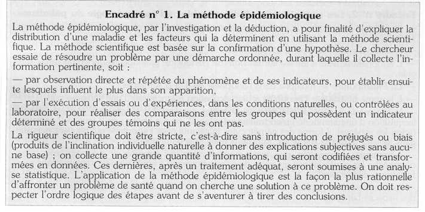
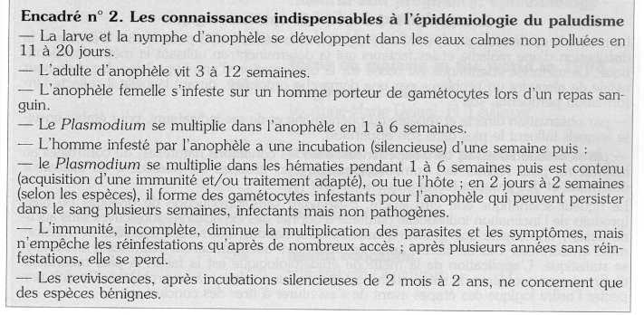
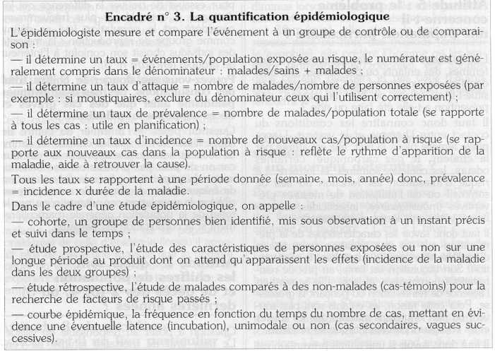
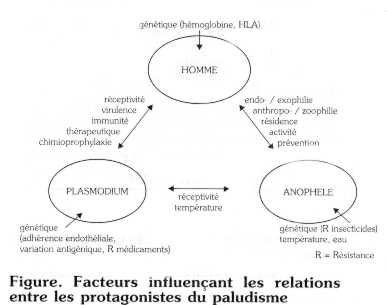

**La démarche épidémiologique appliquée au paludisme**

**par Jacques Le Bras**

Service de parasitologie, Université René-Descartes et Hôpital Bichat-Claude-Bernard, Paris.

L'épidémiologie est une science d'investigation et de déduction qui a pour finalité d'expliquer la distribution d'une maladie et les facteurs qui la déterminent en comparant des groupes de sujets malades et de sujets sains (encadré n° 1).

L'épidémiologie du paludisme nécessite l'étude des interrelations de populations de parasites et celles d'hôtes (moustiques et hommes) et l'étude de leurs écosystèmes. L'étude de l'interaction entre des populations d'êtres vivants dont l'une vit aux dépens des autres est l'objet principal de la parasitologie.

Nous vous proposons d'illustrer cette démarche en situation et de confronter votre attitude à celle suggérée.

Vous avez accepté la charge de technicien sanitaire dans une équipe médicale humanitaire intervenant en Afrique rurale. À votre arrivée (vous êtes le premier arrivé), un responsable du village vous dit que beaucoup d'enfants meurent avec la fièvre et que les gens pensent que c'est le paludisme.

**Première démarche**

Qu'allez-vous rechercher en interrogeant ce responsable et quelques habitants parmi les plus anciens ?

**Attitude 1 : de quoi s'agit-il ? qu'appelez-vous paludisme ?**

La réponse à votre question pourrait être :

- Fièvre (corps chaud) ± intermittente ou périodique ± associée à l'eau (marais, saison des pluies). Ceci est la définition antérieure au XVIlle siècle, uniquement clinique.

- Fièvre cessant quelques jours après l'administration de drogues particulières (définition clinique et thérapeutique) : la poudre d'écorce de quinquina (utilisée du XVIle siècle à 1820), la quinine (sans vrai concurrent de 1820 à 1945), la chloroquine (Nivaquine®) (sans vrai concurrent de 1945 à 1980).

La réponse pourrait être également

- Fièvre avec des parasites dans le sang (depuis la découverte du _Plasmodium_ en 1880 par Laveran).

- Fièvre à la suite de piqûres de moustiques (depuis la découverte du rôle hôte et vecteur de l'anophèle (cycle sexué) en 1898 par Ross).

La réponse pourrait être encore :

- Fièvre avec un ou plusieurs signes de gravité : perte de connaissance, urines rares, anémie sévère (conjonctive blanche), ictère (conjonctive jaune), saignements, respiration difficile, convulsions (l'un de ces signes, quand il est associé à la présence de _P. falciparum_ dans le sang, indique l'accès palustre pernicieux).

**Attitude 2 : le problème** **est-il inhabituel ?**

Cette question est difficile et peut entraîner des confusions ; il faut la recouper pour séparer, dans l'esprit de la personne interrogée, la notion de cas index (première fois) et la notion de présentation inhabituelle des cas : des cas similaires sont connus mais il y a une variation saisonnière, ou encore une variation exceptionnelle dans sa nature ou sa quantité.

Le but est de séparer la notion d'endémie (maladie existant au sein de la population considérée) de celle d'épidémie (lorsqu'il apparaît plus de cas d'une maladie que le nombre auquel on aurait pu s'attendre sur la base de l'expérience passée et compte tenu du lieu, du temps et de la population concernée).

**Attitude 3 : le problème** **concerne-t-il un lieu particulier ?**

Par exemple, ceux qui dorment près ou loin de l'eau, en haut ou en bas du village, dans ou hors des maisons, en forêt ou au village, près ou loin du bétail.

Le but est de considérer l'écologie vectorielle : un repas sanguin est nécessaire à l'anophèle femelle pour assurer la maturation de ses oeufs (comme pour tous les moustiques), elle vit 3 à 12 semaines (espérance de vie), sa longévité (et sa capacité vectorielle)

diminue lorsqu'elle abonde, elle s'éloigne difficilement de son lieu de naissance (vitesse de vol 30 m/min), elle pique la nuit puis se repose dans ou hors des maisons (endophile/exophile), elle préfère l'homme ou les animaux (anthropophile/zoophile), elle abonde dans certains quartiers et pas dans d'autres (ses larves n'apprécient pas l'eau polluée) _(encadré n° 2)._

**Attitude 4 : le problème** **survient-il à un moment déterminé ?**

Par exemple, à la saison des pluies, à l'intersaison, à la saison sèche (mares résiduelles des fleuves asséchés). La périodicité est-elle annuelle ou moindre ? L'été ? L'hiver ?

Le but est de considérer le climat : il faut de l'eau pour les larves d'anophèles, ses gîtes sont des collections d'eaux calmes, pouvant être boueuses, minuscules (trace de pas), herbeuses, souvent mi-soleil/mi-ombre, pouvant être temporaires (plus de 8 jours) ou permanentes.

Il faut considérer le rôle de l'irrigation (canaux, rizières et drains sont souvent peu propices à la transmission quand pullulent des anophèles immatures).

Le but est aussi de considérer la chaleur, qui permet d'accélérer le cycle aquatique, qui dure de 1 à 4 semaines, d'accélérer le cycle gonotrophique (intervalle entre deux repas sanguins), et d'accélérer le cycle sporogonique (ou extrinsèque) qui est l'intervalle entre le moment où l'anophèle est infesté et celui où il est infestant (1 à 5 semaines). Souvent, le froid ou l'altitude (plus de 1 500 m) interrompent la transmission.

**Attitude 5 : le problème concerne-t-il une population particulière.?**

Les malades sont-ils des hommes ou des femmes, des enfants ou des adultes, des résidents ou des voyageurs, leur lieu de travail se situe-t-il au village ou bien au champ, une prévention a-t-elle été faite ou non ?

Il faut donc connaître les conditions du contact entre l'homme et le vecteur. L'anophèle femelle pique la nuit, elle est attirée par la chaleur, le gaz carbonique, certaines odeurs, les couleurs sombres, la lumière. Le risque d'infestation est fonction du lieu de sommeil ou de l'utilisation de mesures préventives (moustiquaires, insecticides, insectifuges, vêtements longs et couvrante).

Il faut donc savoir les caractéristiques de la prémunition qui est une situation immunitaire d'équilibre hôte-parasite empêchant la réinfestation. Son acquisition est lente, au prix de réinfestations nombreuses, et labile. Elle se perd en l'absence de réinfestation ou pendant la grossesse. Pour cette raison, les enfants sont plus souvent ou plus longtemps malades que les adultes et les voyageurs plus atteints que les résidents.

Il faut donc savoir si une chimioprévention est utilisée. Certains médicaments, qui empêchent l'infestation (primaquine) ou la multiplication du parasite (chloroquine) sont parfois pris chaque jour (ou semaine) pour maintenir en permanence une concentration protectrice de médicament dans le sang.

**Seconde démarche**

Personne ne se souvient d'une épidémie et vous réalisez que vous ne savez rien de la situation du paludisme dans la région. Personne ne dit avoir connaissance des rapports officiels sur le paludisme dans la région. Quelles sources pouvez-vous consulter pour recueillir des données sur le paludisme dans la zone ?

**Attitude 1 : pouvez-vous me décrire des cas traités ?**

Cette question est posée à l'infirmier (ou au médecin, à l'agent de santé communautaire, ou bien au tradipraticien). Elle est sans intérêt : les épidémiologistes étudient des groupes de personnes (et des groupes d'agents pathogènes d'une même espèce) et non des individus et font porter leur analyse sur les individus en bonne santé comme sur les malades,

pour essayer de trouver la différence qui les distingue. L'ensemble le plus fréquemment considéré est la population (qui se définit comme groupe de reproduction : la majorité des individus choisit son conjoint à l'intérieur du groupe) (encadré _n° 3)._

**Pouvez-vous me donner le chiffre total** **des consultations, des cas diagnostiqués** **paludisme ainsi que des cas graves et** **décès supposés du paludisme ?**

Question posée à l'infirmier du centre de soins. Il faut savoir que les chiffres du centre de soins ne sont qu'une approche de ces taux car on ne peut pas prendre comme dénominateur la population générale (une variation de fréquentation du centre de soins est possible) et la population consultante n'est pas le reflet de la population générale (particulièrement si la consultation est payante).

**Attitude 2 : quels sont** **les chiffres de population** **et de décès des 2 (3, 4, ou 5)** **dernières années ?**

Question à poser au responsable du village. Le taux brut de mortalité (chiffre de l'ensemble des décès durant l'année x 1 000, divisé par la population au milieu de l'année) est le point de départ nécessaire pour calculer des taux spécifiques de diverses maladies. Le taux brut est composite car spécifique à l'âge, au sexe, aux groupes sociaux. On peut ensuite déterminer le taux spécifique (décès attribuable au paludisme sur un an, divisé par le chiffre de population au milieu de l'année) et le taux de létalité (décès attribuable au paludisme/cas de paludisme durant la même période). Il est précieux de mesurer le taux de létalité pour les maladies infectieuses, qui différencie une augmentation de mortalité spécifique d'une augmentation de morbidité. Le taux de létalité est fonction de l'équilibre entre le parasite (souche, virulence, résistance), l'hôte (état nutritionnel, autres pathologies) et l'environnement (économique).

**Quels sont les chiffres** **de splénomégalies ?**

(question posée à l'infirmier)

**Quels sont les chiffres de lames** **positives et négatives ?**

(question posée au microscopiste)

Ces indicateurs ne sont souvent recueillis que de façon transversale. Ils constituent un instantané d'une population, à un moment donné, mais ne renseignent pas sur les variations (_encadré n° 4_).

Les indicateurs du paludisme sont nombreux. La présence de parasites sur le frottis mince ou épais de sang est le seul critère de certitude de paludisme : on détermine l'espèce, les formes asexuées, la densité. L'indice plasmodique est noté de 1 à 5 (goutte épaisse). On utilise le plus souvent le taux de sujets porteurs de Plasmodium. La présence d'une fièvre est l'indicateur clinique le plus fréquemment utilisé. Il faut savoir qu'il peut y avoir paludisme avec fièvre et sans parasites décelables (rarement) ou parasites avec fièvre (virale par exemple) sans paludisme clinique (sujets prémunis). L'organisme se défend contre le paludisme en phagocytant les hématies parasitées dans la rate qui augmente de volume, puis, après 3 à 10 ans d'infestations répétées, la variété et la performance des anticorps sont suffisamment grandes pour prendre le relais et la taille de la rate diminue. Dans la première phase (enfants 2 à 9 ans par exemple), la taille de la rate peut refléter les infestations palustres de l'année écoulée. L'indice splénique peut considérer la taille de la rate (5 classes selon Hackett). On utilise le plus souvent le taux de sujets de 2 à 9 ans, porteurs de rates décelables. Cet indice est en défaut de spécificité, d'autres affections pouvant entraîner une splénomégalie (drépanocytose, bilharziose). A tout âge, la présence d'anticorps spécifiques signe une impaludation présente ou passée depuis 1 semaine à 10 ans, et le taux d'anticorps reflète la proximité ou la répétition des accès. L'indice immunologique est noté de 1 à 5 ou par la moyenne géométrique des titres d'anticorps. On utilise souvent le taux de sujets porteurs d'anticorps à un titre spécifique. L'indice plasmodique (plus rarement splénique) permet de déterminer le niveau d'endémie. Lorsque la maladie est connue dans la région et que le nombre de cas est attendu compte tenu du lieu, du temps et de la population considérée, on distingue 4 niveaux (pourcentage de la population) : moins de 25 % : hypo-endémie ; de 25 à 50 % : méso-endémie ; de 50 à 75 % : hyper-endémie ; plus de 75 % : holo-endémie. La notion de stabilité tend à supplanter la notion de niveau d'endémie, pour le paludisme. Le paludisme est stable si la transmission est prolongée, si l'anophèle est anthropophile et à espérance de vie longue, s'il y a beaucoup de cas humains : dans ce cas la prémunition est rapide et la mortalité surtout infantile. Le paludisme est instable si la transmission et la vie de l'anophèle sont brèves, s'il y a peu de cas chez l'homme : dans ce cas il y a peu de prémunition et une forte mortalité à tout âge.

**Attitude 3 : rechercher les rapports, les publications d'enquête sur le paludisme faites dans la région, dans le passé**

Toutes les études sur le paludisme soulignent l'importance de la micro-épidémiologie. On notera par exemple les espèces d'anophèles vectrices, leur comportement, les zones où il y a le plus de paludisme, les médicaments ou insecticides utilisés, les mesures préventives enseignées et éventuellement adoptées. Le choix des indicateurs : cliniques (indices spléniques, de gravité) ; biologiques chez l'homme (indices plasmodiques, gamétocytaires) ; biologiques chez l'anophèle (indice oocytique qui mesure les anophèles infectés, indice sporozditique qui mesure les anophèles infectants) dépendra du contexte local.

**Attitude 4 : rechercher copie du programme national de développement sanitaire**

Celui-ci permettra de savoir si un programme spécifique du paludisme est proposé et budgétisé.

**Troisième démarche**

Vous n'avez rien trouvé lors de votre recherche d'enquêtes antérieures et vous n'avez identifié aucune source de financement spécifique au paludisme car la prise en charge de cette maladie est comprise dans les tâches du système sanitaire général. Cependant, vos enquêtes et interrogatoires ont révélé qu'il y a apparemment plus de paludisme en un endroit que dans les autres places de votre zone. Comment essayez-vous d'identifier les facteurs géographiques et environnementaux qui peuvent expliquer la distribution du paludisme ?

**Attitude 1 : procurez-vous une carte de la commune, du canton ou du district**

Notez-y les gîtes potentiellement importants pour les moustiques : rivières, marais. Notez les sites d'altitude peu propices aux anophèles, les forêts pouvant héberger des vecteurs très efficaces _(Anopheles dirus_ en Asie). Faites compléter la carte sur le terrain par un agent sanitaire recherchant les collections d'eau autour des habitations, les mares et eaux courantes saisonnières ou permanentes, les cultures (rizières).

**Quatrième démarche**

Votre équipe a visité la zone que vous avez identifiée à risque plus élevé et vous rapporte l'absence de marais ou étangs mais signale qu'autour des maisons sont creusées des fosses dont la profondeur a augmenté régulièrement à mesure qu'y était prélevée la terre pour la réparation ou la construction des maisons. Ils ont trouvé beaucoup de larves de moustiques dans l'eau des fosses. Cependant, les habitants ne déclarent pas être gênés par les moustiques. Quel problème évoque cette information ? Que proposez-vous pour diminuer l'exposition aux moustiques ?

**Attitude 1 : le problème n'est pas perçu (ou considéré)** **par les habitants**

Une raison est que l'anophèle a un vol silencieux et que sa piqûre est indolore. Les habitants n'établissent pas de liaison entre les moustiques et la fièvre (il s'écoule 1 à 2 mois entre le pic de pluviométrie et celui des accès palustres). Le caractère transmissible d'une maladie, même quand il est connu, n'est pas toujours accepté et le fatalisme et la résignation prédominent : " le paludisme fait partie de l'existence ". Ceci rend l'action difficile, or la prise en charge communautaire des actions est essentielle. Il est indispensable d'évaluer les actions : mesure des indicateurs avant et après une intervention (par exemple : capture nocturne, identification et dissection des anophèles, mesure du nombre de piqûres infectantes par homme et par nuit). Faut-il diminuer la transmission ? L'effet de l'éducation sanitaire est limité (difficile car l'anophèle n'est pas une nuisance). Par exemple, boucher les fosses d'emprunt de terre et en exploiter une seule, plus loin du village, en y éliminant les larves.

**Attitude 2 : conseiller une prévention antivectorielle**

Il est généralement utile de conseiller cette prévention par des moustiquaires ou rideaux imprégnés de permethrine ou de deltamethrine (plus efficace que la pulvérisation d'insecticides).

**Attitude 3 : conseiller** **une lutte antilarvaire**

Il peut être utile de conseiller une lutte antilarvaire : gambusies, guppies larvivores ; pétrole à la surface des mares ; insecticide (abate).

**Cinquième démarche**

En visitant la zone, vous notez des habitations de style inhabituel et en y entrant vous notez une température plus élevée que dans les autres maisons. Quelle relation y a-t-il entre le type de construction et la transmission du paludisme ? Quelle solution s'il y a un problème ?

**Attitude 1 : les maisons** **peuvent attirer** **les moustiques endophiles** **accumulation de chaleur,** **de C02)**

La chaleur peut faciliter la maturation parasitaire dans le moustique. Il est utile de séparer le risque relatif (taux d'incidence chez les sujets exposés/taux d'incidence chez les sujets non exposés, ici : nombre de maisons inhabituelles par rapport au nombre de maisons standard) du risque attribuable (taux d'incidence chez les sujets exposés moins le taux d'incidence chez les sujets non exposés). Ce dernier mesure l'impact que l'élimination d'un facteur pourrait avoir sur l'incidence d'une maladie. Le risque absolu est l'incidence.

**Attitude 2 : pulvérisation d'insecticides** **rémanents (DDT)**

Il est préférable de pulvériser des insecticides rémanents, plutôt que changer les maisons ou le mode de vie.

**Conclusion**

Une multitude d'exemples empruntés au paludisme peuvent illustrer la démarche épidémiologique et son intérêt en santé publique. La situation présentée, inspirée d'un enseignement de Molyneux et Beales, illustre la complexité de la lutte antipaludique qui n'est réellement efficace que si elle est basée sur une bonne connaissance du parasite, de l'anophèle, de l'homme et de leurs interactions. C'est la définition de la lutte intégrée, qui reste hélas souvent à l'état d'intention.

_Développement et Santé, n° 138, décembre 1998_