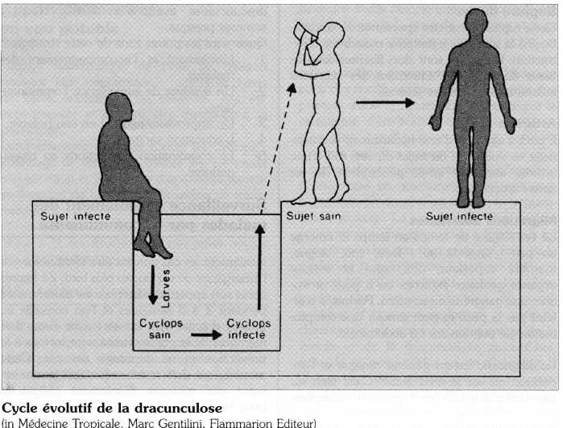
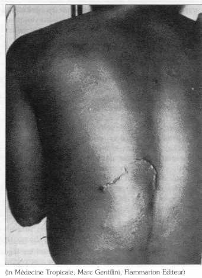

La disparition de la dracunculose est un formidable enjeu de santé publique, non pas tant à cause de sa mortalité que par les handicaps souvent lourds et les souffrances qu'elle entraîne dans la population la plus active. Elle est enjeu de santé publique aussi par la stratégie d'éradication mondiale mise en oeuvre par l'OMS en 1988 et confiée aux communautés villageoises. Le succès de cette démarche permettra de montrer qu'une action de santé publique ne peut être efficace sans la participation effective de ceux qui en sont les bénéficiaires.

Les résultats de cette campagne d'éradication paraissent d'ores et déjà très positifs. L'incidence de la dracunculose serait passée de 10 à 15 millions de cas au début des années 80 à moins de 90 000 cas en 1999. Mais cette maladie persiste encore dans 13 pays d'Afrique sub-saharienne. Un dernier effort est nécessaire !

Après avoir rappelé brièvement les caractéristiques cliniques de cette parasitose, nous verrons la stratégie mise en oeuvre pour la rayer de la carte.

## I. Répartition géographique

La dracunculose sévissait, il y à peine vingt ans, dans une vaste zone subtropicale comprenant l'Asie centrale, l'Iran, le Moyen-Orient, le sous continent indien et prenait en écharpe l'Afrique sub-saharienne.

La dracunculose ne touche plus actuellement que treize pays africains (Bénin, Burkina-Faso, Côte d'Ivoire, Ethiopie, Ghana, Mali, Mauritanie, Niger, Nigeria, Ouganda, République centrafricaine, Soudan et Togo) dont les plus touchés sont le Soudan, le Ghana et le Nigeria (voir tableau).

## II. Cycle parasitaire

La dracunculose est une maladie provoquée par un ver Nématode (ver rond) appelé _Dracunculus medinensis_ ou ver de Guinée. C'est le plus grand ver rond pouvant parasiter le corps humain. En effet, le ver femelle peut mesurer à l'âge adulte plus d'un mètre de long, 2 millimètres de diamètre et peut porter 1 à 3 millions d'embryons. Après avoir migré dans l'organisme, le ver fore un orifice à travers la peau, le plus souvent au niveau des pieds et, lorsqu'il est en contact avec de l'eau, il expulse ses embryons. En pratique, c'est en pénétrant dans la mare pour remplir leur récipient d'eau que les utilisateurs contaminent le point d'eau. Les embryons sont alors avalés par un prédateur vorace, le cyclops. Ce crustacé à l'allure de crevette de 0,5 à 2 millimètres de long a été ainsi baptisé car il porte un oeil frontal rouge du meilleur effet.

Le cyclops est un hôte intermédiaire où l'embryon se transforme en larve infectieuse en 4 à 6 semaines. L'homme se contamine en buvant de l'eau contenant des cyclops infectés. Les cyclops sont détruits quand ils arrivent dans l'estomac, les larves sont alors libérées et traversent la paroi intestinale pour migrer dans les tissus. Au bout d'un an, la femelle adulte commence à voyager à travers le corps du malade provoquant les symptômes de la maladie, bouclant ainsi le cycle.

Il existe d'importantes variations saisonnières dans la transmission de la dracunculose. En Afrique, la transmission s'effectue en saison des pluies (juillet à septembre) en zone de savane sahélo-soudanienne et en saison sèche (octobre à avril) en savane guinéenne humide. Il n'y a pas de réservoir animal.

Il n'existe pas de médicament disponible efficace. L'éradication de cette maladie repose donc essentiellement sur la prévention.

## III. Les signes cliniques

Les phases d'incubation et d'invasion sont le plus souvent silencieuses, si ce n'est la présence de troubles allergiques sans spécificité.

C'est au moment de l'émergence du ver que les symptômes apparaissent. Un oedème, très douloureux, précède l'apparition d'une phlyctène (une bulle) qui survient quelques jours avant que le ver n'apparaisse. Au contact de l'eau cette phlyctène éclate et les embryons sont libérés. Un malade peut être porteur de plusieurs vers, parfois plus de vingt, ayant chacun sa propre évolution.

Le site d'émergence est situé dans 90% des cas aux membres inférieurs, surtout au niveau des jambes, avec une prédilection pour les malléoles externes. Ce sont les migrations dites habituelles.  
Une fois sur deux l'évolution est bénigne et l'ulcère cicatrise en 1 à 2 semaines avec ou sans extraction du ver. Mais dans l'autre moitié des cas, surviennent des complications qui font la gravité de la maladie.

### 1. Infection du trajet du ver

A travers l'orifice cutané, le trajet vermineux peut s'infecter en provoquant une destruction cutanéo-dermique importante avec une fièvre élevée et une adénopathie inguinale: L'aspect clinique le plus souvent rencontré est celui d'un phlegmon de la jambe ou du pied, décollant la galerie de forage du ver. Ces formes nécessitent souvent une intervention chirurgicale et favorisent de plus l'apparition du tétanos.

### 2. Rupture du ver

Cette rupture peut être spontanée ou traumatique à la suite d'une tentative maladroite d'extraction. Les larves sont alors libérées dans les tissus de voisinage entraînant des réactions inflammatoires locales sévères.

### 3. Arthrites

Il peut s'agir soit d'une hydarthrose réactionnelle au voisinage du trajet du ver, soit d'une arthrite aseptique après pénétration du ver dans l'articulation.

### 4. Migrations aberrantes

Le ver s'égare de temps en temps et émerge un peu n'importe où : face, cou, langue, membre supérieur, dos, sein et surtout organes génitaux externes où il peut provoquer une gangrène du scrotum. Parfois, il n'atteint pas la peau et peut simuler une symptomatologie pulmonaire ou abdominale.

Le diagnostic est en général clinique et l'apparition du ver le rend facile. C'est bien sûr plus compliqué lors des migrations manquées.

## IV. Traitement

Aucun médicament ne s'est montré vraiment efficace.

L'extraction traditionnelle du ver (enroulement du ver autour d'un bâtonnet en 1 à 4 semaines) y est toujours utilisée mais expose à certaines complications (rupture ou surinfection).

Il est par contre très important de prévenir les complications bactériennes par des soins infirmiers adaptés, une désinfection cutanée, la pose de pansements humides renouvelés fréquemment et, bien sûr, une sérovaccination antitétanique efficace.

## V. Prophylaxie et éradication

La disparition de cette maladie ne peut donc reposer que sur une politique de prévention énergique et concertée. L'OMS a ainsi pris, au cours de sa 44ème Assemblée mondiale, en 1988, une résolution visant à éradiquer la dracunculose avant l'an 2000. Nous y sommes presque.

Quels sont les points forts de cette stratégie ?

1.  L'isolement et l'accompagnement des malades.  
2.  Un système de surveillance communautaire.  
3.  Un approvisionnement en eau potable.  
4.  L'éducation sanitaire.  
5.  La coordination des actions au niveau national.

### 1. Surveillance et isolement des malades par la communauté

Idéalement les cas doivent être identifiés avant l'émergence du ver ou, au plus tard, 24 heures après son apparition. La plaie est alors bandée pendant 2 à 3 semaines et l'on conseille au patient d'éviter tout contact avec l'eau. Les membres de la communauté sont formés à la prévention et au dépistage des cas. Cette mesure, qui doit rester volontaire (contrairement aux mesures d'isolement obligatoire pour les malades atteints du virus Ebola, par exemple), n'est pas toujours bien acceptée et exige une prise de conscience claire des enjeux par les malades et leurs familles.

### 2. Système de surveillance intégrée communautaire

Des agents communautaires de santé sont formés de façon rigoureuse par différentes organisations non gouvernementales participant à cette campagne.

Les objectifs de cette surveillance sont les suivants :

*   déterminer dans quelles communautés la dracunculose est endémique et quelle est l'importance de la prévalence
*   contrôler les effets des stratégies d'intervention
*   documenter l'élimination de la maladie.

Pour cela, des outils épidémiologiques simples ont été mis au point : questionnaires pour recueillir les données, présentation de ces données sous forme de tableaux et de graphiques, rapport type mensuel.

### 3. Approvisionnement en eau potable

Filtrage systématique de l'eau de boisson pouvant être contaminée : différents types de filtres, individuels ou collectifs, ont été expérimentés et doivent être distribués à la population.

Lutte chimique sélective contre les cyclops épandage de temephos (Abate®). Le mode d'application et la période d'épandage varient en fonction de la durée de la saison de transmission.

Et bien sûr, quand cela est possible, il faut procéder à la construction de margelles autour des puits et des forages.

### 4. Education à la santé

Toutes ces démarches n'auraient aucune efficacité si la population n'était pas directement partie prenante, d'autant plus qu'elle va devoir rester vigilante pendant encore quelques années.

### 5. Coordination

La mise en oeuvre et le suivi de ce programme associent l'OMS, l'UNICEF, Global 2000, des agences de coopération bilatérales, plusieurs ONG et les pays eux-mêmes. La complexité de leurs relations a exigé la mise en place d'une collaboration inter organisations et d'un système d'informations c'ouvrant toutes les régions.

## Conclusion

Au terme de cet article, je pense que tout ce que vous avez appris sur la dracunculose ne vous servira à rien car elle aura disparu (comme vous ne voyez plus de variole et comme bientôt, vous ne verrez plus de poliomyélite ou d'hépatite B). Cependant vous n'aurez pas perdu votre temps si vous vous souvenez:

*   que seule la **connaissance** parfaite d'une maladie permet de mettre au point une stratégie de prévention efficace
*   que cette **prévention** ne sera opérationnelle que si elle associe une communauté qui aura participé à la prise de décisions et dont les références culturelles auront été prises en compte.

*   qu'une **action apparemment limitée** peut avoir des conséquences plus importantes que prévues. Ainsi la dynamique impulsée par la campagne d'éradication de la dracunculose aura des conséquences sur le contrôle d'autres maladies transmises par l'eau. Elle a surtout des conséquences sur le plan socio économique en améliorant, dans certaines régions, la production agricole et la fréquentation scolaire. La santé coûte cher mais il coûte encore plus cher de la négliger. Il est donc important que tous ceux qui font de la médecine la calculatrice à la main puissent évaluer les- effets indirects et les bénéfices induits par certaines actions de santé publique et non pas seulement le coût de chacune de ces actions. L'éradication de la variole et de la dracunculose aujourd'hui, celle de la poliomyélite et de l'hépatite B demain ne doit cependant pas masquer les difficultés que présentent des maladies plus complexes comme le paludisme ou des maladies émergentes comme l'infection à HIV, les nouvelles fièvres hémorragiques ou les maladies à prions.

  

_Développement et Santé, n°150, décembre 2000_